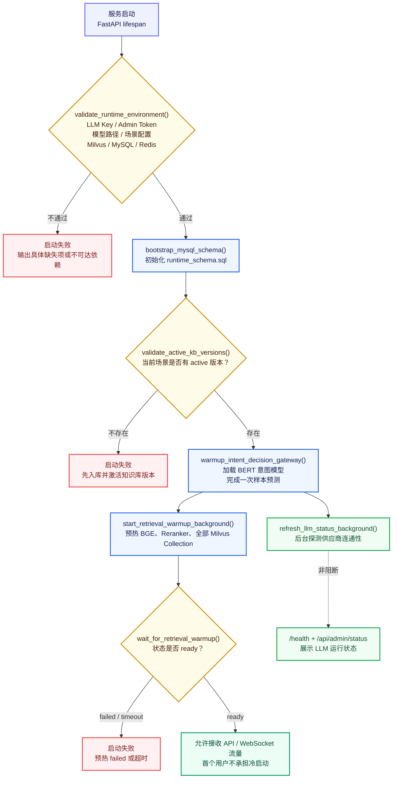
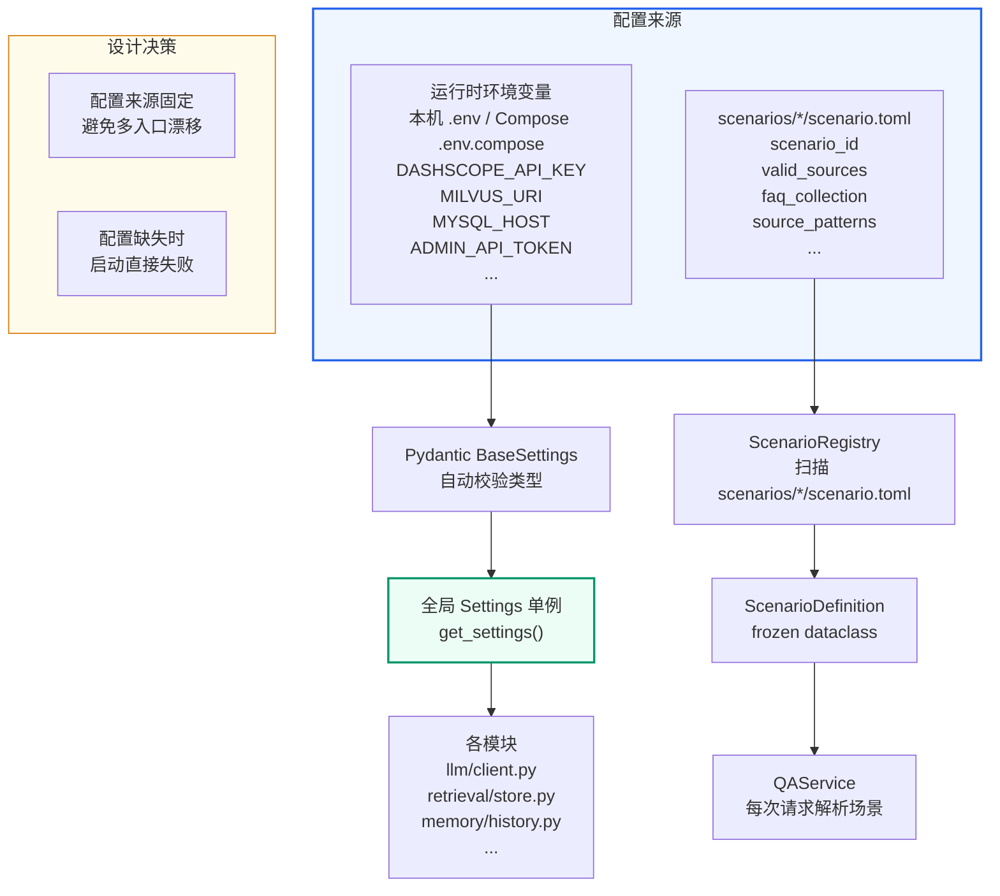

## 第一部分：软件的"启动校验"模式

### 1.1 什么是 Preflight Check

**Preflight Check（前置校验）** 来源于航空术语，指飞机起飞前的地面检查清单。在软件工程中，它指的是**在服务正式接受请求之前，验证所有关键依赖是否可用**。

类似地，当你开车前会检查油量、轮胎、灯光——你不会开到高速公路上才发现没油了。

### 1.2 为什么 Web 服务需要启动校验

考虑一个没有启动校验的服务：

```text
服务启动 → 页面正常打开 → 用户提问"入职流程" → Milvus 连不上 → 报错
                                    ↑
                            用户体验极差：页面看起来正常，实际不可用
```

这种"假启动"是生产环境中最危险的情况之一：

- 健康检查端点可能返回 200 OK
- 但核心业务链路根本没通电
- 等发现问题时已经影响了真实用户

**正确的做法**：在服务启动时，把核心依赖都检查一遍。缺了就**立即失败**，而不是假装一切正常。

### 1.3 启动校验 vs 运行时容错旁路

| 方案 | 行为 | 优缺点 |
| --- | --- | --- |
| 启动校验（示例实现采用） | 缺基础依赖→启动失败 | 问题暴露早，但要求环境完整 |
| 运行时容错旁路（常见反模式） | 缺依赖→用到时才报错 | 看起来能启动，但不可靠 |
| 运行态探测 | 服务先启动→状态页暴露依赖可用性 | 适合供应商额度、网络抖动这类外部状态 |

示例实现采用组合策略：Milvus、MySQL、Redis、本地模型、场景配置和 active 版本是硬前置；LLM Key 必须配置，但真实调用是否可用由后台探测写入 `/health` 和 `/api/admin/status`。这样既避免核心本地依赖缺失时“假启动”，也避免供应商欠费或临时网络问题把治理页一起打挂。

---

## 第二部分：app.py 逐行详解

### 2.1 完整代码

```python
# app.py — KnowForge RAG Platform 的 FastAPI 应用入口
#
# 本文件现在只负责四件事：
# 1. 创建 FastAPI 应用
# 2. 配置 CORS 和静态资源
# 3. 启动时执行必需环境校验、MySQL schema bootstrap、active 版本校验和模型预热
# 4. 注册 qa_core.api 下拆分后的路由
#
# 为什么要保持入口文件很薄：
# - app.py 是服务启动点，不应该继续堆 HTTP、WebSocket、管理接口和 RAG 细节
# - 接口按页面、聊天、管理、知识库版本拆分后，入口不会被业务细节污染
# - 入口越薄，越容易确认当前实现没有旧链路、没有技术简化路径、
#   没有隐藏旁路

from __future__ import annotations

import asyncio
import os

from fastapi import FastAPI
from fastapi.middleware.cors import CORSMiddleware
from fastapi.staticfiles import StaticFiles
import uvicorn

from qa_core.api import admin, chat, kb_versions, pages
from qa_core.config.logging_config import get_logger
from qa_core.config.preflight import validate_active_kb_versions, validate_runtime_environment
from qa_core.config.settings import get_settings
from qa_core.intent.decision import warmup_intent_decision_gateway
from qa_core.retrieval.factory import start_retrieval_warmup_background, wait_for_retrieval_warmup
from qa_core.storage.bootstrap import bootstrap_mysql_schema
```

### 2.2 应用实例创建

```python
from contextlib import asynccontextmanager

settings = get_settings()
logger = get_logger(__name__)

app = FastAPI(
    title="多场景知识问答平台 API",
    description="LangChain + Milvus Hybrid 多场景智能问答系统",
    lifespan=lifespan,
)
```

**`get_settings()`** 是一个全局配置单例，返回一个 `Settings` 对象。它使用 Pydantic 的 `BaseSettings`，优先读取进程环境变量；本机 API 调试时，再读取系统根目录下的 `.env` 作为本地配置文件。Docker Compose 模式下，`.env.compose` 由 Compose 注入到 API 容器的进程环境变量里，`Settings` 本身不直接读取 `.env.compose`：


```python
# qa_core/config/settings.py — Settings 部分字段示例
class Settings(BaseSettings):
    llm_api_key: str = ""
    milvus_uri: str = "http://localhost:19530"
    mysql_host: str = "localhost"
    mysql_port: int = 3306
    cache_enabled: bool = False
    redis_host: str = "localhost"
    redis_port: int = 6379
    embedding_model_path: str = "./models/bge-m3"
    reranker_model_path: str = "./models/bge-reranker-large"
    admin_api_token: str = ""
    active_kb_version: str = ""
    active_scenario_id: str = "enterprise_knowledge"
    api_rate_limit_per_minute: int = 120
    # ... 还有更多字段

    model_config = SettingsConfigDict(
        env_file=str(PROJECT_ROOT / ".env"),
        env_file_encoding="utf-8",
        extra="ignore",
    )
```

### 2.3 CORS 中间件配置

```text
# 当前前端和 API 默认同源部署，但保留 CORS 配置是为了方便本地调试：
# 例如单独启动 Vite/React 页面时，只需要在本机 .env 中追加允许来源即可。
app.add_middleware(
    CORSMiddleware,
    allow_origins=settings.cors_allow_origins,
    allow_credentials=True,
    allow_methods=["GET", "POST", "DELETE", "OPTIONS"],
    allow_headers=["*"],
)
```

理解重点：

- `allow_origins`：生产环境应该设置为具体的域名列表，而非 `["*"]`
- `allow_credentials=True`：允许前端携带 Cookie/Authorization Header
- 示例实现前后端同源部署在 8000 端口，CORS 主要是为本地开发场景保留

### 2.4 静态资源挂载

```text
os.makedirs("static", exist_ok=True)
app.mount("/static", StaticFiles(directory="static"), name="static")
```

`app.mount()` 将一个完整的子应用挂载到路由前缀。这里把 `static/` 目录挂载到 `/static` 路径，所以：

- `static/index.html` → `http://127.0.0.1:8000/static/index.html`
- `static/css/base.css` → `http://127.0.0.1:8000/static/css/base.css`

### 2.5 应用生命周期

```python
from contextlib import asynccontextmanager

@asynccontextmanager
async def lifespan(_: FastAPI):
    """服务启动前完成校验、预热；yield 后开始接收流量。"""
    await warmup_runtime()
    yield

app = FastAPI(lifespan=lifespan)

async def warmup_runtime() -> None:
    """服务启动时执行前置校验、schema bootstrap，并等待检索栈预热完成。

    当前实现的基础环境是必需前置条件：LLM Key、Milvus、MySQL、Redis、本地模型、场景配置、
    MySQL 控制面表结构和 active 知识库版本缺一不可。BERT、BGE、Reranker 和 Milvus
    Collection 未就绪前不接受问答流量；LLM 供应商真实连通性仍在后台探测。
    """
    summary = validate_runtime_environment()
    logger.info("Runtime preflight passed: %s", summary)
    schema_summary = await asyncio.to_thread(bootstrap_mysql_schema)
    logger.info("Runtime MySQL schema bootstrap passed: %s", schema_summary)
    active_summary = validate_active_kb_versions(settings.active_scenario_id)
    logger.info("Runtime active KB version check passed: %s", active_summary)
    intent_summary = warmup_intent_decision_gateway()
    logger.info("Runtime BERT intent model warmup passed: %s", intent_summary)
    retrieval_state = start_retrieval_warmup_background()
    logger.info("Runtime retrieval warmup started: %s", retrieval_state)
    retrieval_summary = await asyncio.to_thread(wait_for_retrieval_warmup)
    logger.info("Runtime retrieval warmup passed: %s", retrieval_summary)
```

缓存开启时，`validate_runtime_environment()` 会同时校验：

| 检查项 | 配置 | 失败影响 |
| --- | --- | --- |
| Redis Python 依赖 | `redis==5.2.1` | API 进程启动失败 |
| Redis TCP 连通性 | `REDIS_HOST` / `REDIS_PORT` | API 进程启动失败 |
| MySQL cache namespace 表 | `bootstrap_mysql_schema()` | 表缺失会在启动期补齐 |

这和 Milvus/MySQL 的处理原则一致：V1 Docker 交付环境中缓存是企业级能力，不在运行中静默降级。

启动时做了六件事：

1. **`validate_runtime_environment()`**：检查 API Key、模型路径、场景配置、Milvus/MySQL/Redis TCP，基础条件不满足就抛 `RuntimeError`。
2. **`bootstrap_mysql_schema()`**：执行 `qa_core/storage/runtime_schema.sql`，一次性初始化运行期 MySQL 表结构。
3. **`validate_active_kb_versions()`**：schema 就绪后再校验当前场景是否存在 active 知识库版本。
4. **`warmup_intent_decision_gateway()`**：同步加载 BERT 意图模型，避免第一个用户请求承担意图模型冷启动。
5. **`refresh_llm_status_background()`**：后台探测 LLM 真实连通性，把可用、欠费、网络失败等状态写入 `/health` 和状态页。
6. **`start_retrieval_warmup_background()` + `wait_for_retrieval_warmup()`**：在线程中预热 BGE、Reranker 和全部场景 Milvus Collection，但 `lifespan` 的启动阶段会等待 `ready`。预热失败或超时会让服务启动失败，不能把冷启动成本留给第一个用户。

### 2.6 路由注册

```text
app.include_router(pages.router)       # 页面渲染、健康检查、会话创建、场景列表
app.include_router(chat.router)        # 问答、历史、反馈、检索诊断
app.include_router(admin.router)       # 管理接口（trace、报告、bad case）
app.include_router(kb_versions.router) # 知识库版本查看、回滚、归档
```

### 2.7 启动入口

```bash
if __name__ == "__main__":
    uvicorn.run("app:app", host="0.0.0.0", port=8000, reload=False)
```

`reload=False` 是因为生产环境不需要热重载。本地调试时可以加 `--reload` 参数。

---

## 第三部分：环境前置校验详解

### 3.1 校验清单

`validate_runtime_environment()` 在 `qa_core/config/preflight.py` 中实现，只检查基础运行环境，不读取业务表结构。active 知识库版本属于 schema bootstrap 之后的业务状态校验，由 `validate_active_kb_versions()` 单独完成。


```text
1.  LLM API Key 是否配置（非占位符）
2.  Admin Token 是否配置（非占位符）
3.  Embedding 模型目录是否存在
4.  Reranker 模型目录是否存在
5.  场景配置目录是否存在
6.  活跃场景文档目录是否存在
7.  活跃场景 FAQ 文件是否存在
8.  Milvus TCP 可达性
9.  MySQL TCP 可达性
10. Redis TCP 可达性（CACHE_ENABLED=true 时）
```

#### 启动前置校验工作机制

下面这张图把 `app.py::warmup_runtime()` 的实际执行顺序画出来。要注意：基础配置、路径和 TCP 检查由 `validate_runtime_environment()` 统一完成；LLM 连通性探测只是后台更新状态，不会替代检索栈的 `ready` 等待，也不会把未完成的检索预热暴露给第一个用户。



读图时按两条原则理解：基础依赖和 active 版本不满足时直接阻断启动；LLM 供应商的临时连通性只进入健康状态，真正决定服务能否接收问答流量的是检索预热是否进入 `ready`。

### 3.2 占位符检测

```python
PLACEHOLDER_VALUES = {"", "replace-with-real-key", "replace-with-random-token",
                      "changeme", "change-me"}

def _is_placeholder(value: str | None) -> bool:
    """判断配置值是否为空或仍是示例占位符。"""
    normalized = str(value or "").strip()
    return normalized.lower() in PLACEHOLDER_VALUES
```

这是为了防止忘记修改环境模板中的示例值。Docker Compose 模式检查 `.env.compose` 注入到容器里的值，本机 API 调试模式检查 `.env` 中的值。如果 API Key 还是 `replace-with-real-key`，系统会直接拒绝启动并给出明确的错误信息。

### 3.3 TCP 连接校验

```python
def _require_tcp(name: str, host: str, port: int, timeout: float = 3.0) -> None:
    """校验 TCP 端口可连接。

    这里只做连接性检查，不做业务读写。真实集合、表结构和模型预热会在后续
    warmup 中完成。把端口检查放在这里，是为了让"服务没启动"这类基础问题
    在最早阶段暴露。
    """
    try:
        with socket.create_connection((host, port), timeout=timeout):
            return
    except OSError as exc:
        raise RuntimeError(
            f"{name} 不可连接：{host}:{port}。请先启动必需环境。"
        ) from exc
```

只检查 TCP 端口是否可以建立连接（相当于 `telnet host port`），不进行业务读写。这是最快速的检查方式：

- 如果 Milvus 没启动，不用等到查询时才报错
- 如果 MySQL 没启动，不用等到写入历史时才报错

### 3.4 路径校验

```python
def _require_path(name: str, raw_path: str) -> None:
    """校验本地目录或文件存在。"""
    path = Path(raw_path)
    if not path.exists():
        raise RuntimeError(f"{name} 不存在：{path}")
```

用于检查模型目录（默认 `./models/bge-m3`、`./models/bge-reranker-large`，Docker 容器内为 `/app/models/...`）、场景文档目录、FAQ CSV 文件等本地资源。

### 3.5 Milvus URI 校验

```python
def _require_milvus_uri() -> None:
    """校验 Milvus URI 格式和 TCP 可达性。"""
    settings = get_settings()
    parsed = urlparse(settings.milvus_uri)  # 解析 http://127.0.0.1:19530
    host = parsed.hostname
    port = parsed.port or 19530  # 默认端口
    if not host:
        raise RuntimeError(f"MILVUS_URI 无效：{settings.milvus_uri}")
    _require_tcp("Milvus", host, port)
```

先检查 URI 格式是否合法，再检查主机和端口是否可达。

### 3.6 LLM 运行态探测

```python
# qa_core/llm/client.py
def refresh_llm_runtime_status() -> dict[str, Any]:
    """主动探测 LLM 连通性并缓存结果，但不抛出异常阻断应用启动。

    LLM API 是外部 HTTP 服务，真实可用性受 API Key、额度、供应商状态和网络影响。
    当前实现把这些状态写入健康检查和管理后台，便于排障。
    """
    try:
        validate_llm_connectivity()
        _LLM_RUNTIME_STATUS.update({"status": "available", "ok": True})
    except RuntimeError as exc:
        _LLM_RUNTIME_STATUS.update({"status": "unavailable", "ok": False, "error": str(exc)})
    return llm_runtime_status()
```

这里有一个关键边界：`DASHSCOPE_API_KEY` 是否配置仍然由 preflight 硬校验；但 Key 是否欠费、供应商是否短时不可用，不再阻断 `/`、`/admin` 和治理接口启动。实际问答链路仍然会调用 LLM，模型服务不可用时由业务接口返回明确错误。

### 3.7 Active 知识库版本校验（schema bootstrap 之后）

```python
def validate_active_kb_versions(scenario_id: str | None = None) -> dict[str, object]:
    scenario = resolve_scenario(scenario_id)
    version_store = get_kb_version_store(scenario.scenario_id)
    try:
        active_version = version_store.resolve_active_version()
    except ValueError as exc:
        raise RuntimeError(
            f"{exc}。请先执行入库并激活版本，例如 "
            "scripts/rebuild_kb_version.py --new-version --force --quality-gate --activate。"
        ) from exc
    return {"scenario_id": scenario.scenario_id, "active_kb_version": active_version}
```

如果没有任何版本被激活，给出明确的命令行建议。这一步必须发生在 `bootstrap_mysql_schema()` 之后，因为它会读取版本控制面表。

### 3.8 校验结果

校验通过后返回一个摘要字典，既有场景信息、也有环境配置信息：

```text
return {
    "scenario_id": "enterprise_knowledge",
    "scenario_name": "企业内部知识助手",
    "milvus_uri": "http://127.0.0.1:19530",
    "mysql": "127.0.0.1:3306/subjects_kg",
    "embedding_model_path": "./models/bge-m3",
    "reranker_model_path": "./models/bge-reranker-large",
    "available_scenarios": ["compliance_qa", "cross_border_risk", ...]
}
```

---

## 第四部分：检索栈预热

### 4.1 为什么需要预热

BGE-M3 Embedding 模型和 Milvus 的连接初始化都有首次访问延迟：

- **模型加载**：BGE-M3 模型文件约 2GB，首次加载需要 5-15 秒
- **Milvus 连接**：首次创建 Collection 对象需要获取 schema 信息

如果不预热，**第一个提问的用户将承受所有这些延迟**。当前实现把预热线程和服务就绪分开：线程负责兼容 `langchain-milvus` 的初始化方式，`lifespan` 的启动阶段负责等待线程进入 `ready`；因此页面和 WebSocket 在检索栈完成前不会对外提供问答服务。

### 4.2 warmup_retrieval_stack() 实现

```python
# qa_core/retrieval/factory.py
def warmup_retrieval_stack():
    """预热全部已冻结场景的 BGE、Reranker 和 FAQ/Doc Collection。"""
    embeddings = get_embeddings()
    # 绕过 query Redis 缓存，确保首次真实编码和设备初始化已完成。
    getattr(embeddings, "base_embeddings", embeddings).embed_query(sample_query)

    for scenario in get_scenario_registry().list_scenarios():
        resolve_active_kb_version(None, scenario.scenario_id)
        get_hybrid_store(scenario.faq_collection).store
        get_hybrid_store(scenario.doc_collection).store

    get_reranker().predict([(sample_query, "业务资料包含处理流程。")])
```

### 4.3 为什么在线程中预热、但启动必须等待

```text
# app.py
retrieval_state = start_retrieval_warmup_background()
retrieval_summary = await asyncio.to_thread(wait_for_retrieval_warmup)
logger.info("Runtime retrieval warmup passed: %s", retrieval_summary)
```

`warmup_retrieval_stack()` 内部有：

1. 磁盘 I/O（读取模型文件）
2. CPU 密集操作（加载模型到内存）
3. 网络 I/O（连接 Milvus）

这些都是阻塞操作。后台线程会为 `langchain-milvus` 初始化独立 event loop，避免在线程里创建异步 Milvus 客户端时报 “no current event loop”。但当前版本不会在 `running` 时宣布服务可用：启动协程把等待动作放到 `asyncio.to_thread()`，只有状态变成 `ready` 才结束 startup；`failed` 或等待超时都会阻断启动。

---

## 第五部分：配置管理体系

### 5.1 配置来源



**配置来源的架构解读**：这张图展示了系统的两条配置通道，它们在职责上有明确的分工：

**左路：运行时环境变量通道（`环境变量 / .env → Settings → 各模块`）**

运行时环境变量存放的是"这个服务怎么跑"的基础设施配置——LLM API Key、Milvus 地址、MySQL 连接串、Admin Token、模型路径。本机 API 调试时，这些值来自 `.env`；Docker Compose 运行时，这些值来自 `.env.compose` 注入到容器的环境变量。这些值的特点是：

- **全局唯一**：不管切换到哪个业务场景，Milvus 地址和 LLM Key 都不会变
- **启动即加载**：通过 Pydantic BaseSettings 在应用启动时一次性读取并校验类型（端口号必须是 int、API Key 不能是占位符）
- **全局单例访问**：任何模块需要基础设施配置时，调用 `get_settings()` 就能拿到同一个 Settings 实例，避免多处解析环境变量导致不一致

**右路：场景配置通道（`scenario.toml → ScenarioRegistry → QAService`）**

`scenarios/*/scenario.toml` 存放的是"这个场景的业务是什么"的领域配置——scenario_id、valid_sources、FAQ collection 名称、source_patterns。这些值的特点是：

- **按场景变化**：`enterprise_knowledge` 的 sources 是 `["hr_process", "it_policy"]`，`compliance_qa` 的 sources 是 `["privacy", "audit", "contract"]`
- **启动时扫描**：ScenarioRegistry 在启动时遍历 `scenarios/` 目录，把所有 `scenario.toml` 解析成 `ScenarioDefinition`（frozen dataclass，创建后不可变）
- **每次请求时解析**：QAService 根据用户请求中的 `scenario_id`，从 Registry 中取出对应的 ScenarioDefinition，注入到后续的检索过滤和 Prompt 选择中

**为什么分成两条通道？**

环境变量和场景配置的变更节奏完全不同——API Key 一旦配好可能几个月不动，但场景配置（新增 source、调整 source_patterns）是日常运营工作。如果把业务配置也塞进运行时环境变量，每次加一个 source 就要改环境变量、重启服务，运维成本极高。分成两条通道后，改场景配置只需要编辑 TOML 文件然后重启（不需要接触敏感的环境变量）。

**设计决策框的落实**：图中右下角标注了"配置来源固定"和"配置缺失时启动直接失败"。前者把配置入口收敛到“运行时环境变量”和 `scenario.toml` 两条通道，后者由 preflight check 在启动时强制执行——详见本文第四部分。

### 5.2 运行时环境变量中的必需配置项

运行时环境变量有两个模板，不再提供通用 `.env.example`：

| 运行模式 | 模板 | 实际配置 | 地址视角 |
| --- | --- | --- | --- |
| Docker Compose | `.env.compose.example` | `.env.compose` | API 在容器内，使用 `mysql`、`milvus`、`/app/models/...` |
| 本机 API 调试 | `.env.local.example` | `.env` | API 在宿主机，使用 `localhost`、`models/...` |

| 配置项 | 用途 | 缺失后果 |
| --- | --- | --- |
| `DASHSCOPE_API_KEY` | LLM API Key | 缺失或占位时启动失败；真实连通性进入运行态状态 |
| `ADMIN_API_TOKEN` | 管理接口认证令牌 | 启动失败 |
| `MILVUS_URI` | Milvus 连接地址 | 启动失败 |
| `MYSQL_HOST` / `MYSQL_PORT` | MySQL 连接 | 启动失败 |
| `EMBEDDING_MODEL_PATH` | BGE-M3 模型路径 | 启动失败 |
| `RERANKER_MODEL_PATH` | Reranker 模型路径 | 启动失败 |
| `INTENT_MODEL_PATH` | BERT 意图模型路径 | 启动失败 |
| `ACTIVE_KB_VERSION` | 默认知识库版本 | 启动失败（如版本清单也无 active） |
| `ACTIVE_SCENARIO_ID` | 默认业务场景 | 可选，缺失用第一个场景 |

### 5.3 当前配置边界

当前版本的配置边界非常明确：所有基础设施配置只从运行时环境变量读取，所有业务场景配置只从 `scenario.toml` 读取。

**为什么坚持两条配置通道？** - 环境变量是云原生部署的标准做法 - TOML 更适合表达场景包中的结构化配置，例如 source 列表、collection 名称和文档匹配规则 - 配置来源固定以后，排查问题时只需要检查两处，不会被额外配置入口分散注意力

---
