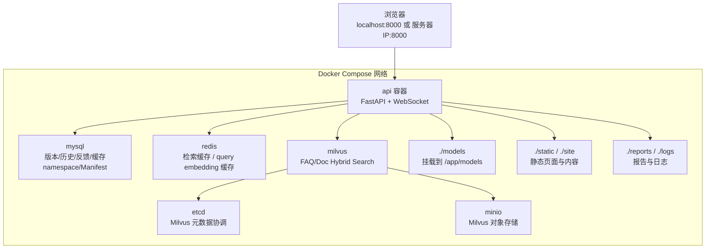

## 第一部分：示例实现 Docker 架构

> 系统概述与环境搭建已经完成 Docker 最小启动。本文不重复镜像、容器和 Compose 的通用概念，直接解释系统的 Dockerfile、Compose 配置、完整交付流程和排障方法。

### 1.1 服务拓扑



### 1.2 六个服务分别做什么

| 服务 | 镜像 | 端口 | 作用 |
| --- | --- | --- | --- |
| `mysql` | `mysql:8.4` | `3306` | 保存控制面数据：聊天、反馈、版本、缓存 namespace、Manifest、质量报告索引 |
| `redis` | `redis:7-alpine` | `6379` | 保存 FAQ/Doc 检索缓存和 query embedding 缓存 |
| `etcd` | `quay.io/coreos/etcd:v3.5.18` | 容器内访问 | Milvus 元数据协调 |
| `minio` | `minio/minio` | `9000` / `9001` | Milvus 对象存储与控制台 |
| `milvus` | `milvusdb/milvus:v2.5.15` | `19530` / `9091` | 向量检索、BM25 Sparse、Hybrid Search |
| `api` | 示例实现 Dockerfile 构建 | `8000` | FastAPI、WebSocket、页面、诊断接口、入库脚本运行环境 |

这里的 `api` 是唯一由示例源码构建的镜像；其他服务使用官方镜像。Redis 缓存不保存普通 LLM 自由生成答案，只保存 query embedding 和带版本/权限边界的检索候选结果。

---

## 第二部分：Dockerfile 如何构建 API 镜像

系统把 API 镜像拆成两层：

- `Dockerfile.base`：安装系统库、PyTorch、LangChain、Milvus、Docling、PaddleOCR、BERT 推理等重型依赖。
- `Dockerfile`：基于基础镜像补齐依赖并复制当前应用代码。

日常开发改 Python 代码时，只重新构建 `Dockerfile` 这一层，避免每次都重新安装 4GB 级依赖。

`Dockerfile.base` 核心逻辑如下：

```bash
FROM python:3.12-slim

ENV PYTHONDONTWRITEBYTECODE=1
ENV PYTHONUNBUFFERED=1
ENV PYTHONIOENCODING=utf-8
ENV TOKENIZERS_PARALLELISM=false
ENV HF_HUB_DISABLE_TELEMETRY=1

WORKDIR /app

ARG DEBIAN_MIRROR=https://deb.debian.org/debian
ARG DEBIAN_SECURITY_MIRROR=https://deb.debian.org/debian-security

RUN set -eux; \
    if [ -f /etc/apt/sources.list.d/debian.sources ]; then \
        sed -i \
            -e "s|https\?://deb.debian.org/debian-security|${DEBIAN_SECURITY_MIRROR}|g" \
            -e "s|https\?://deb.debian.org/debian|${DEBIAN_MIRROR}|g" \
            /etc/apt/sources.list.d/debian.sources; \
    else \
        sed -i \
            -e "s|https\?://deb.debian.org/debian-security|${DEBIAN_SECURITY_MIRROR}|g" \
            -e "s|https\?://deb.debian.org/debian|${DEBIAN_MIRROR}|g" \
            /etc/apt/sources.list; \
    fi; \
    apt-get -o APT::Update::Error-Mode=any -o Acquire::Retries=5 -o Acquire::http::Timeout=30 -o Acquire::https::Timeout=30 update \
    && apt-get install -y --no-install-recommends \
        build-essential curl \
        libgl1 libglib2.0-0t64 libsm6 libxext6 libxrender1 libgomp1 \
    && rm -rf /var/lib/apt/lists/*

COPY requirements.txt ./
RUN --mount=type=cache,target=/root/.cache/pip \
    pip install --upgrade pip \
    && pip install --extra-index-url https://download.pytorch.org/whl/cpu -r requirements.txt \
    && pip check
```

默认 Debian 源使用 HTTPS。Linux 服务器若无法访问默认源，可在构建时传入企业镜像：

```bash
docker build -f Dockerfile.base \
  --build-arg DEBIAN_MIRROR=https://your-debian-mirror/debian \
  --build-arg DEBIAN_SECURITY_MIRROR=https://your-debian-mirror/debian-security \
  --build-arg PIP_INDEX_URL=https://your-pypi-mirror/simple \
  --build-arg PYTORCH_INDEX_URL=https://download.pytorch.org/whl/cpu \
  -t localhost/knowforge-rag-platform-base:py312 .
```

`DEBIAN_MIRROR` 和 `DEBIAN_SECURITY_MIRROR` 只影响基础镜像构建阶段的 APT 下载，`PIP_INDEX_URL` 和 `PYTORCH_INDEX_URL` 只影响 Python 依赖下载，不会改变运行时容器访问地址。API 层也会读取同名 Compose build args：

```bash
docker compose --env-file .env.compose build \
  --build-arg PIP_INDEX_URL=https://your-pypi-mirror/simple \
  --build-arg PYTORCH_INDEX_URL=https://download.pytorch.org/whl/cpu api
```

`Dockerfile` 核心逻辑如下：

```bash
ARG APP_BASE_IMAGE=localhost/knowforge-rag-platform-base:py312
FROM ${APP_BASE_IMAGE}

WORKDIR /app

COPY requirements.txt ./
RUN --mount=type=cache,target=/root/.cache/pip \
    python -m pip install --extra-index-url https://download.pytorch.org/whl/cpu -r requirements.txt \
    && python -m pip check \
    && python -c "import fastapi, uvicorn, langchain, langchain_milvus, pymilvus, sentence_transformers, transformers, safetensors, torch, pandas, fitz, docx, pptx, docling, ragas, markdown, mkdocs, redis; print('runtime dependencies ok')"

COPY . .

CMD ["python", "-m", "uvicorn", "app:app", "--host", "0.0.0.0", "--port", "8000"]
```

逐行看它做了几件事：

| 代码 | 作用 |
| --- | --- |
| `FROM python:3.12-slim` | 基础镜像固定 Python 运行时版本 |
| `FROM ${APP_BASE_IMAGE}` | API 镜像复用基础依赖镜像 |
| `ENV PYTHONUNBUFFERED=1` | 日志实时输出，便于 `docker compose logs` 查看 |
| `WORKDIR /app` | 容器内示例目录固定为 `/app` |
| `apt-get install ...` | 安装文档解析、向量模型、OpenCV 相关依赖 |
| `COPY requirements.txt ./` | 先复制依赖文件，利用 Docker 缓存 |
| `pip install ... -r requirements.txt` | 基础镜像完整安装；API 镜像补齐新增或版本变化的 Python 依赖 |
| `python -c "import ..."` | API 镜像构建时校验运行期依赖完整性，避免漏装依赖后才在运行期报错 |
| `COPY . .` | 复制示例源码 |
| `CMD uvicorn app:app` | 容器启动后运行 FastAPI |

常见误区：

| 误区 | 正确理解 |
| --- | --- |
| 改了 Python 代码后只重启容器就行 | API 镜像内代码来自构建时的 `COPY . .`，需要重新 `build api` |
| 改了 `.env.compose` 要重新 build | 环境变量是容器启动时注入，通常只需要 `up -d --force-recreate api` |
| 模型文件会打进镜像 | 不会。模型通过 `./models:/app/models` 挂载，避免镜像巨大 |

---

## 第三部分：docker-compose.yml 系统配置

### 3.1 API 服务的关键配置

```yaml
api:
  build:
    context: .
  container_name: knowforge-api
  env_file:
    - ${ENV_FILE:-.env.compose}
  ports:
    - "${API_PORT:-8000}:8000"
  volumes:
    - ./models:/app/models
    - ./scenarios:/app/scenarios
    - ./reports:/app/reports
    - ./logs:/app/logs
    - ./site:/app/site:ro
    - ./static:/app/static:ro
  depends_on:
    mysql:
      condition: service_healthy
    milvus:
      condition: service_healthy
```

这里有几个关键点：

| 配置 | 作用 |
| --- | --- |
| `build.context: .` | 从当前实现目录构建 API 镜像 |
| `env_file` | 从 `.env.compose` 注入容器环境变量 |
| `8000:8000` | 宿主机通过 8000 访问容器内 API |
| `./models:/app/models` | Windows / Linux 都使用实现内模型目录挂载 |
| `./scenarios:/app/scenarios` | 场景资料可以在宿主机修改后被容器看到 |
| `./reports:/app/reports` | 入库质量报告、评测报告输出到宿主机 |
| `./logs:/app/logs` | 日志输出到宿主机 |
| `./site:/app/site:ro` | 内容站点只读挂载 |
| `depends_on.condition` | MySQL 和 Milvus 健康后再启动 API |

### 3.2 为什么模型挂载用 `./models`

系统以前容易遇到一个部署问题：Windows 能用 `D:/models`，Linux 服务器没有这个路径。V1 当前统一使用：

```text
- ./models:/app/models
```

这样 Windows 和 Linux 的部署方式一致：

```text
系统根目录/
  models/
    bge-m3/
    bge-reranker-large/
```

容器内配置仍然使用：

```text
EMBEDDING_MODEL_PATH=/app/models/bge-m3
RERANKER_MODEL_PATH=/app/models/bge-reranker-large
INTENT_MODEL_PATH=/app/models/bert_intent_classifier_v1
```

宿主机本地 Python 调试时使用：

```text
EMBEDDING_MODEL_PATH=./models/bge-m3
RERANKER_MODEL_PATH=./models/bge-reranker-large
INTENT_MODEL_PATH=./models/bert_intent_classifier_v1
```

判断规则很简单：

| API 运行位置 | 模型路径怎么写 |
| --- | --- |
| API 在 Docker 容器里 | `/app/models/...` |
| API 在宿主机 Python 里 | `./models/...` |

### 3.3 数据卷和挂载目录

示例实现同时使用两类卷。

第一类是 Docker named volume，由 Docker 管理：

| Volume | 保存内容 |
| --- | --- |
| `mysql_data` | MySQL 数据库 |
| `etcd_data` | etcd 数据 |
| `minio_data` | MinIO 对象数据 |
| `milvus_data` | Milvus 本地数据 |

第二类是 bind mount，从示例目录挂进容器：

| 宿主机目录 | 容器目录 | 用途 |
| --- | --- | --- |
| `./models` | `/app/models` | 本地 Embedding / Reranker 模型 |
| `./scenarios` | `/app/scenarios` | 8 个业务场景资料 |
| `./reports` | `/app/reports` | 入库、评测、验收报告 |
| `./logs` | `/app/logs` | 应用日志 |
| `./site` | `/app/site` | MkDocs 构建后的内容站点 |
| `./static` | `/app/static` | 前端静态页面 |

不要随意执行：

```bash
docker compose down -v
```

`-v` 会删除 named volume，MySQL 和 Milvus 数据会一起被清掉。普通停止服务使用：

```bash
docker compose --env-file .env.compose down
```

---

## 第四部分：环境变量和运行模式

系统保留两个模板：

| 文件 | 用途 |
| --- | --- |
| `.env.compose.example` | API 在 Docker 容器内运行 |
| `.env.local.example` | API 在宿主机 Python 里运行 |

二者最大的区别是网络视角：

| 配置项 | Docker Compose 模式 | 本机 Python 模式 |
| --- | --- | --- |
| `MYSQL_HOST` | `mysql` | `localhost` |
| `REDIS_HOST` | `redis` | `localhost` |
| `MILVUS_URI` | `http://milvus:19530` | `http://localhost:19530` |
| `EMBEDDING_MODEL_PATH` | `/app/models/bge-m3` | `./models/bge-m3` |
| `RERANKER_MODEL_PATH` | `/app/models/bge-reranker-large` | `./models/bge-reranker-large` |
| `INTENT_MODEL_PATH` | `/app/models/bert_intent_classifier_v1` | `./models/bert_intent_classifier_v1` |

`.env.compose` 最小关键配置如下：

```text
APP_ENV=dev
ACTIVE_SCENARIO_ID=enterprise_knowledge
API_PORT=8000
ENV_FILE=.env.compose

MYSQL_HOST=mysql
MYSQL_PORT=3306
MYSQL_PUBLISHED_PORT=13307
MYSQL_USER=root
MYSQL_PASSWORD=root123
MYSQL_DATABASE=subjects_kg

CACHE_ENABLED=true
REDIS_HOST=redis
REDIS_PORT=6379
REDIS_PUBLISHED_PORT=6379
REDIS_DB=0

MILVUS_URI=http://milvus:19530
MILVUS_PUBLISHED_PORT=19530
MILVUS_HEALTH_PUBLISHED_PORT=9091

MINIO_API_PUBLISHED_PORT=9000
MINIO_CONSOLE_PUBLISHED_PORT=9001

DASHSCOPE_API_KEY=请替换为真实可用的模型服务 Key
ADMIN_API_TOKEN=请替换为随机长令牌

EMBEDDING_MODEL_PATH=/app/models/bge-m3
RERANKER_MODEL_PATH=/app/models/bge-reranker-large
INTENT_MODEL_PATH=/app/models/bert_intent_classifier_v1
```

`.env.compose` 不提交到 Git，因为里面会包含真实 Key。

---

## 第五部分：V1 Docker 部署流程

### 5.1 首次准备

Windows PowerShell：

```powershell
if (!(Test-Path .env.compose)) { Copy-Item .env.compose.example .env.compose }
notepad .env.compose

New-Item -ItemType Directory -Force models, logs, reports | Out-Null
Test-Path .\models\bge-m3
Test-Path .\models\bge-reranker-large
```

Linux Shell：

```text
cp -n .env.compose.example .env.compose
nano .env.compose

mkdir -p models logs reports
test -d models/bge-m3
test -d models/bge-reranker-large
```

确认两个模型目录存在后再启动服务。

### 5.2 构建并启动基础设施

```bash
docker compose --env-file .env.compose up -d mysql redis etcd minio milvus
# 新机器首次部署且本地没有基础镜像时先执行：
# docker build -f Dockerfile.base -t localhost/knowforge-rag-platform-base:py312 .
docker compose --env-file .env.compose build api
```

查看状态：

```bash
docker compose --env-file .env.compose ps
```

### 5.3 初始化 8 个业务场景

首次部署建议重建全部场景：

```bash
docker compose --env-file .env.compose run --rm api python scripts/rebuild_scenarios.py --reset-collections --description "docker init all scenarios"
```

这条命令会在 API 容器里执行入库脚本，使用容器内的：

```text
/app/scenarios
/app/models
/app/reports
```

### 5.4 启动 API

```bash
docker compose --env-file .env.compose up -d api
docker compose --env-file .env.compose logs --tail 80 api
```

浏览器访问：

| 环境 | 地址 |
| --- | --- |
| Windows 本机 | `http://127.0.0.1:8000` |
| Linux 局域网服务器 | `http://服务器IP:8000` |

### 5.5 单场景更新

只更新一个场景时，不需要重建全部 8 个场景：

```bash
docker compose --env-file .env.compose run --rm api python scripts/rebuild_kb_version.py --scenario enterprise_knowledge --new-version --force --quality-gate --activate
```

如果只是日常资料变更，推荐使用引用式增量版本：

```bash
docker compose --env-file .env.compose run --rm api python scripts/rebuild_kb_version.py --scenario enterprise_knowledge --new-version --incremental-from active --quality-gate --activate
```

只有在 Milvus collection schema 不兼容、BM25 Function 字段变化或需要清空重建时，才使用：

```bash
docker compose --env-file .env.compose run --rm api python scripts/rebuild_kb_version.py --scenario enterprise_knowledge --new-version --force --reset-collections --quality-gate --activate
```

---

## 第六部分：部署脚本做了什么

系统提供两个部署验收入口：

| 脚本 | 适用场景 | 作用 |
| --- | --- | --- |
| `scripts/deploy/deploy_docker.ps1` | Windows / PowerShell 环境 | 部署便捷入口，按标准顺序启动依赖、构建镜像、初始化知识库并启动 API |
| `scripts/deploy/verify_fresh_docker_deploy.py` | Windows / Linux 通用 | 新环境一键验收入口，在部署后继续执行发布门禁、接口冒烟和缓存冒烟 |

PowerShell 部署入口：

```text
.\scripts\deploy\deploy_docker.ps1
```

它的执行顺序可以理解为：

```text
1. 检查 .env.compose 是否存在
2. 启动 mysql / redis / etcd / minio / milvus
3. 构建 api 镜像
4. 在 api 容器中重建并激活知识库
5. 启动 api
6. 输出 docker compose ps 状态
```

只初始化当前 active 场景：

```text
.\scripts\deploy\deploy_docker.ps1 -ActiveScenarioOnly
```

脚本适合标准部署；排查问题时建议拆成手工命令逐步执行，这样能更快定位是构建失败、依赖未健康、入库失败还是 API 启动失败。

新环境从部署到验收一次跑完：

```bash
python scripts/deploy/verify_fresh_docker_deploy.py --evaluation-limit 3 --performance-limit 3
```

这条命令会按顺序执行：

```text
1. docker compose config --quiet
2. 启动 mysql / redis / etcd / minio / milvus
3. 检查或构建基础镜像
4. 构建 api 镜像
5. 初始化全部 8 个业务场景
6. 启动 api
7. 执行 V1 发布验收：评测门禁 + 性能门禁 + Docker 集成检查
8. 执行 API 冒烟和缓存冒烟
9. 写入 reports/verification/v1_fresh_docker_acceptance.json
```

Linux 服务器也使用同一个 Python 脚本。区别只在浏览器访问地址：

```bash
python scripts/deploy/verify_fresh_docker_deploy.py --base-url http://192.168.88.100:8000 --evaluation-limit 3 --performance-limit 3
```

---

## 第七部分：Docker 部署检查

### 7.1 Compose 配置检查

```bash
docker compose --env-file .env.compose config --quiet
```

这条命令只检查 Compose 文件和环境变量能否正确解析，不启动容器。

### 7.2 V1 发布自检

```bash
python scripts/verify_v1_release.py
python scripts/verify_v1_release.py --include-evaluation --include-docker
python scripts/verify_v1_release.py --include-performance --include-docker
python scripts/verify_v1_release.py --include-evaluation --include-performance --include-docker
```

它会检查：

| 检查项 | 含义 |
| --- | --- |
| Python 编译 | 主系统和测试文件语法正确 |
| 内容构建 | `mkdocs build --strict` 通过 |
| 示例代码一致性 | `codealong` 与主系统关键文件一致 |
| 系统守护规则 | 关键边界、依赖、冻结场景符合约束 |
| Compose config | Docker Compose 配置可解析 |
| 主链路评测 | `--include-evaluation --include-docker` 会在 api 容器里生成评测报告、执行评测门禁并导出 Bad Case 候选 |
| 性能门禁 | `--include-performance --include-docker` 会在 api 容器里采集首 token、总耗时、阶段耗时并执行性能门禁 |
| 新环境验收 | `verify_fresh_docker_deploy.py` 会串起构建、初始化、发布门禁、API 冒烟和缓存验收 |

### 7.3 API 冒烟检查

API 启动后执行：

```bash
docker compose --env-file .env.compose exec api python scripts/api_e2e_smoke.py --base-url http://127.0.0.1:8000
docker compose --env-file .env.compose exec api python scripts/intent/demo_intent_model.py --eval-only --output latest
docker compose --env-file .env.compose exec api python scripts/quality/cache_acceptance_smoke.py --base-url http://127.0.0.1:8000
docker compose --env-file .env.compose exec api python scripts/acceptance_smoke.py --base-url http://127.0.0.1:8000
```

如果在宿主机执行，也可以直接访问：

```bash
python scripts/acceptance_smoke.py --base-url http://127.0.0.1:8000
python scripts/quality/cache_acceptance_smoke.py --base-url http://127.0.0.1:8000
```

---

## 第八部分：常见问题排查

### 8.1 `ModuleNotFoundError: No module named 'pptx'`

含义：当前运行的 API 镜像不是最新依赖构建出来的。

检查镜像内 requirements：

```bash
docker run --rm knowforge-rag-platform-api:latest sh -lc "grep -n 'python-pptx' /app/requirements.txt"
```

重建镜像：

```bash
docker compose --env-file .env.compose build --no-cache api
docker compose --env-file .env.compose up -d --force-recreate api
```

### 8.2 模型目录不存在

现象：preflight 报 `Embedding 模型目录` 或 `Reranker 模型目录` 不存在。

宿主机检查：

```powershell
Test-Path .\models\bge-m3
Test-Path .\models\bge-reranker-large
```

容器内检查：

```bash
docker compose --env-file .env.compose run --rm --no-deps api sh -lc "ls -la /app/models && test -d /app/models/bge-m3 && test -d /app/models/bge-reranker-large"
```

### 8.3 API 容器连不上 MySQL 或 Milvus

先确认 `.env.compose` 使用的是容器服务名：

```text
MYSQL_HOST=mysql
MILVUS_URI=http://milvus:19530
```

再看服务状态：

```bash
docker compose --env-file .env.compose ps
docker compose --env-file .env.compose logs --tail 80 mysql
docker compose --env-file .env.compose logs --tail 80 milvus
```

### 8.4 `PermissionError: reports/...`

通常是 Linux 上容器用 root 写入了 `reports/` 或 `logs/`，宿主机当前用户没有权限。

Linux 处理：

```text
sudo chown -R "$USER":"$USER" reports logs
```

Windows Docker Desktop 一般不会遇到同样的 ownership 问题。

### 8.5 `collection not found`

如果日志出现在 `--reset-collections` 或首次初始化阶段，通常表示系统尝试清理一个尚不存在的旧集合，后续继续入库即可。需要关注的是最终质量门禁是否通过、active 版本是否激活。

确认 active 版本：

```bash
docker compose --env-file .env.compose run --rm api python -c "from qa_core.scenarios.registry import resolve_scenario; from qa_core.governance.kb_versions import get_kb_version_store; sc=resolve_scenario('enterprise_knowledge'); print(get_kb_version_store(sc.scenario_id).resolve_active_version())"
```

### 8.6 修改代码后页面还是旧效果

分两种情况：

| 修改内容 | 处理 |
| --- | --- |
| Python 代码 | `docker compose --env-file .env.compose build api && docker compose --env-file .env.compose up -d api` |
| Python 依赖 | `docker compose --env-file .env.compose build api && docker compose --env-file .env.compose up -d api` |
| 系统依赖或基础镜像缺失 | `docker build -f Dockerfile.base -t localhost/knowforge-rag-platform-base:py312 .`，再 `docker compose --env-file .env.compose build api && docker compose --env-file .env.compose up -d api` |
| `static/` 页面 | 目录是 bind mount，刷新浏览器即可；必要时强制刷新缓存 |
| `docs/` 内容 | 先 `python -m mkdocs build --strict`，再刷新 `/docs` |
| `.env.compose` | `docker compose --env-file .env.compose up -d --force-recreate api` |

---

## 第九部分：交付检查清单

V1 Docker 交付前按下面顺序检查：

| 检查项 | 命令或判断 |
| --- | --- |
| 模型目录存在 | `models/bge-m3`、`models/bge-reranker-large`、`models/bert_intent_classifier_v1` |
| 基础依赖镜像存在 | `docker build -f Dockerfile.base -t localhost/knowforge-rag-platform-base:py312 .` |
| 环境变量已填写 | `.env.compose` 中 Key 和 token 不是占位符 |
| Compose 可解析 | `docker compose --env-file .env.compose config --quiet` |
| API 镜像已构建 | `docker compose --env-file .env.compose build api` |
| 基础服务健康 | `docker compose --env-file .env.compose ps` |
| 知识库已初始化 | `rebuild_scenarios.py --reset-collections` 成功 |
| active 版本存在 | 页面状态或脚本能查到 active kb version |
| API 可访问 | `http://127.0.0.1:8000` 或服务器 IP |
| 验收脚本通过 | `acceptance_smoke.py` 通过 |
| 意图模型治理通过 | `demo_intent_model.py --eval-only --output latest` 生成 `reports/intent_model/intent_model_latest.json` |
| 缓存验收通过 | `cache_acceptance_smoke.py` 连续两次同问，首次 miss、二次 hit |
| 内容可访问 | `/docs` 页面可打开 |

---

**体系收束**：到这里，V1 已经形成从 RAG 主链路、Web 服务、知识库治理、质量评测、可观测性到 Docker 部署交付的完整闭环。
