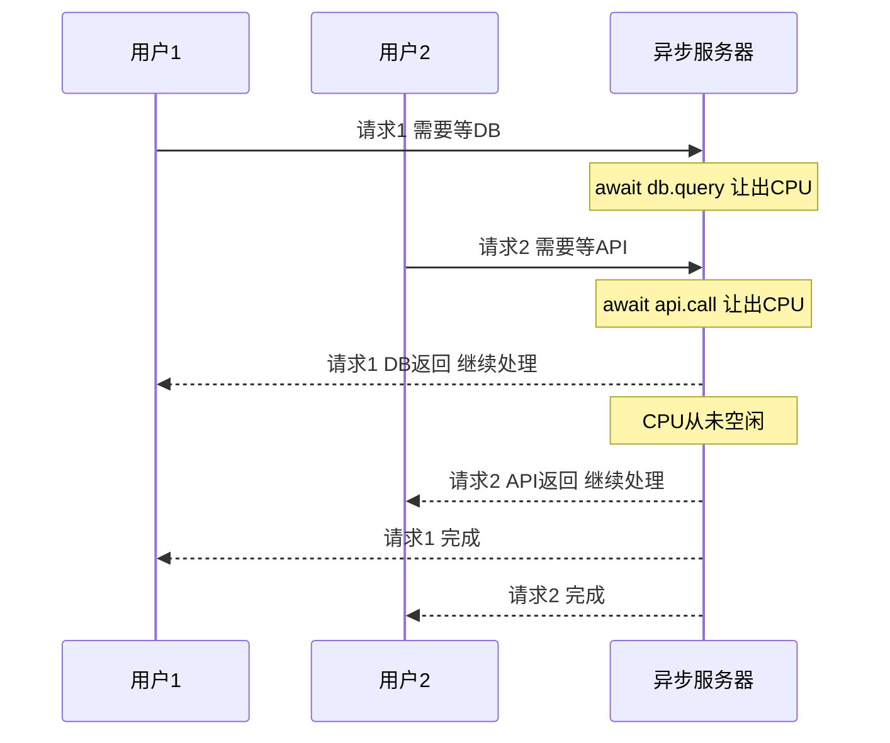
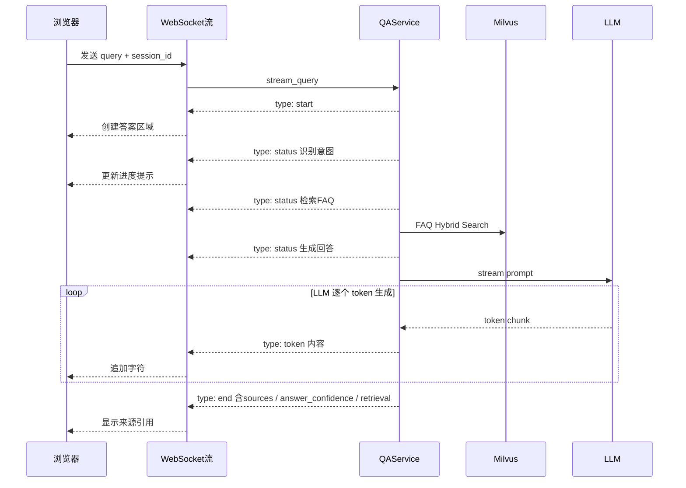

## 第一部分：同步 vs 异步

### 1.1 传统同步 Web 服务的瓶颈

假设一个 Web 服务收到一个请求，需要做三件事：

```text
请求 → 查数据库(100ms) → 调外部API(200ms) → 查Milvus(150ms) → 返回
```

在传统的同步模型中，一个工作线程处理单个请求时会被 I/O 占住：

```yaml
时间线（3个请求先后到达）：
Req1: [===查DB===][===调API===][===查Milvus===]         (450ms)
Req2:                                            [===查DB===][===调API===][===查Milvus===] (450ms)
Req3:                                                                                     [===等...===]
```

真实 Web 服务器通常会用多个进程或线程并发处理请求，并不是所有请求严格串行。它的限制是：每个同步请求会占用一个工作线程；线程池耗尽后，后续请求才会排队。当线程等待数据库返回时，该线程不能处理其他请求。

### 1.2 异步（Async）模型

异步模型的核心思想：当一个操作在等待时（如等待数据库返回），切换到处理另一个请求。

```mermaid
gantt
    title 同步 vs 异步请求处理对比
    dateFormat X
    axisFormat %s

    section 同步模式 单工作线程示意
    Req1-等待DB :r1a, 0, 100
    Req1-等待API:r1b, 100, 200
    Req1-等待Milvus:r1c, 200, 300
    Req2-等待DB :r2a, 300, 400
    Req2-等待API:r2b, 400, 500
    Req2-等待Milvus:r2c, 500, 600
    Req3-等待DB :r3a, 600, 700
    Req3-等待API:r3b, 700, 800
    Req3-等待Milvus:r3c, 800, 900

    section 异步模式 事件循环
    Req1-DB :e1a, 0, 40
    Req2-DB :e2a, 40, 80
    Req3-DB :e3a, 80, 120
    Req1-API:e1b, 120, 160
    Req2-API:e2b, 160, 200
    Req3-API:e3b, 200, 240
    Req1-Milvus:e1c, 240, 280
    Req2-Milvus:e2c, 280, 320
    Req3-Milvus:e3c, 320, 360
```





```python
# 同步写法
def get_user(id):
    result = db.query("SELECT * FROM users WHERE id = ?", id)  # 阻塞在这里
    return result

# 异步写法
async def get_user(id):
    result = await db.query("SELECT * FROM users WHERE id = ?", id)  # await = 可以切换
    return result
```

`await` 关键字的意思是："这个操作需要等待，我先让出 CPU 去处理其他请求，等结果回来了再继续执行"。

```yaml
时间线（3个请求在异步模型中）：
Req1: [查DB][     ][调API][     ][查Milv][     ]
Req2:      [查DB][     ][调API][     ][查Milv]
Req3:           [查DB][     ][调API][     ][查Milv]
                    ↑ CPU 在等待间隙处理其他请求
```

所有请求的总完成时间大幅缩短。因为服务器在等待 I/O 的时候不会闲着。

### 1.3 async/await 核心语法

```python
# async def 定义一个协程函数
async def fetch_data(url):
    # await 等待一个可等待对象（协程、Task、Future）
    response = await http_client.get(url)
    return response.json()

# 在 async 函数内部才能用 await
async def main():
    data = await fetch_data("https://api.example.com")
    print(data)

# 运行方式
import asyncio
asyncio.run(main())
```

**关键区别**：

| 同步 | 异步 |
| --- | --- |
| `def func()` | `async def func()` |
| `requests.get(url)` | `await httpx.AsyncClient().get(url)` |
| `time.sleep(1)` | `await asyncio.sleep(1)` |
| 多线程处理并发 | 单线程事件循环处理并发 |

`async def` 本身不会把同步调用变成异步。如果协程内部直接执行 PyMySQL、同步 Redis 客户端或普通文件读写，事件循环仍会被阻塞。必须使用真正的异步客户端，或者把同步工作交给线程池。

```python
# 错误：函数虽然是 async，query() 仍会阻塞事件循环
async def history():
    return sync_mysql_store.query()

# 示例实现普通 HTTP 接口：FastAPI 自动在线程池执行 def 路由
def history():
    return sync_mysql_store.query()

# WebSocket 必须保持异步，阻塞步骤显式跨到线程池
async def stream():
    has_event, event = await asyncio.to_thread(next_event, generator)
```

### 1.4 为什么 RAG 系统需要异步

RAG 系统是典型的 **I/O 密集型** 应用：

- 查 Milvus（网络 I/O）
- 调 LLM API（网络 I/O）
- 读 MySQL 历史（网络 I/O）
- 读 Embedding 模型文件（磁盘 I/O）
- 计算 Embedding（CPU 密集型，用 `asyncio.to_thread` 放到线程池）

这些操作中，大部分时间都在等待外部系统响应。异步模型可以让服务器在等待期间处理其他用户的请求。

---

## 第二部分：FastAPI 基础

### 2.1 FastAPI 是什么

FastAPI 是一个现代 Python Web 框架，专为构建 API 设计。它的核心特点：

1. **原生异步支持**：直接使用 `async/await`，不依赖第三方层
2. **自动生成 OpenAPI 文档**：访问 `/api/docs` 即可看到 Swagger UI
3. **基于 Pydantic 的数据校验**：请求和响应自动校验类型
4. **WebSocket 支持**：内置双向通信协议

### 2.2 最小 FastAPI 应用

```python
from fastapi import FastAPI

app = FastAPI(title="我的 API")

@app.get("/hello")
def hello():
    return {"message": "Hello World"}

@app.get("/items/{item_id}")
def read_item(item_id: int, q: str = None):
    return {"item_id": item_id, "q": q}

# 运行：uvicorn main:app --reload
```

### 2.3 路由（Router）

当 API 变多时，把所有端点写在 `app.py` 会导致文件很长。FastAPI 提供了 `APIRouter` 来做模块化拆分：

```python
# qa_core/api/chat.py
from fastapi import APIRouter
router = APIRouter()

@router.websocket("/api/stream")
async def websocket_endpoint(websocket: WebSocket):
    ...

@router.get("/api/history/{session_id}")
def get_history(session_id: str):
    ...
```

```python
# app.py — 注册路由
from qa_core.api import chat, admin, pages, kb_versions

app.include_router(pages.router)
app.include_router(chat.router)
app.include_router(admin.router)
app.include_router(kb_versions.router)
```

### 2.4 Pydantic 数据校验


FastAPI 使用 Pydantic 模型做请求/响应的自动校验。当前实现里，在线问答只走 WebSocket payload；HTTP 请求模型只保留给检索诊断接口：

```python
from pydantic import BaseModel, Field

class RetrievalDebugRequest(BaseModel):
    """POST /api/retrieval/debug 的请求体。"""

    query: str = Field(..., min_length=1)
    session_id: str | None = None
    scenario_id: str | None = None
    source_filter: str | None = None
    tenant_id: str | None = None
    dataset_id: str | None = None
    visibility: str | None = None
    user_role: str | None = None
    user_roles: list[str] = Field(default_factory=list)
    kb_version: str | None = None

# FastAPI 会自动：
# 1. 检查 query 最短为 1 个字符
# 2. 把 JSON 中的字段映射到对象属性
# 3. 如果缺少必填字段或类型不对，返回 422 错误（附带清晰的错误信息）
```

设计口径：不要再为在线问答保留单独的 HTTP 请求模型。浏览器提问直接连 `WebSocket /api/stream`，检索诊断才使用 `RetrievalDebugRequest`。

### 2.5 CORS 中间件

```python
from fastapi.middleware.cors import CORSMiddleware

app.add_middleware(
    CORSMiddleware,
    allow_origins=settings.cors_allow_origins,
    allow_credentials=True,
    allow_methods=["GET", "POST", "DELETE", "OPTIONS"],
    allow_headers=["*"],
)
```

**CORS（跨域资源共享）** 是浏览器的安全机制。默认情况下，`http://localhost:3000` 上的前端页面不能请求 `http://localhost:8000` 的 API。CORS 中间件告诉浏览器哪些来源被允许跨域访问。

### 2.6 应用生命周期与依赖注入

```python
from contextlib import asynccontextmanager

# lifespan 的 yield 之前：服务启动时执行一次
@asynccontextmanager
async def lifespan(_: FastAPI):
    validate_runtime_environment()  # 校验环境
    start_retrieval_warmup_background()  # 在线程中预热，兼容 langchain-milvus
    await asyncio.to_thread(wait_for_retrieval_warmup)  # 就绪后才接受问答流量
    yield

app = FastAPI(lifespan=lifespan)

# 依赖注入：在路由函数执行前注入共享资源
from fastapi import Depends

def require_admin_token(x_admin_token: str | None = Header(default=None)) -> None:
    ...

@router.get("/api/admin/langsmith")
def get_langsmith_status(_=Depends(require_admin_token)):
    ...
```

**`asyncio.to_thread`** 的作用：把阻塞等待放到线程池中，避免阻塞事件循环。BGE-M3、Reranker 和 Milvus Collection 在独立预热线程中加载；`lifespan` 的启动阶段再通过 `wait_for_retrieval_warmup()` 等待结果。这样不是“后台慢慢加载、用户先提问”，而是“模型和连接就绪后服务才开始接收问答流量”。

---

## 第三部分：WebSocket 协议

### 3.1 为什么需要 WebSocket

HTTP 协议是"请求-响应"模式：客户端发一个请求，服务端返回一个响应，通信就结束了。

RAG 系统的答案生成有个特点：**LLM 是一个 token 一个 token 生成的**。如果等完整答案生成完再返回，用户可能等 5-10 秒才能看到任何内容。

WebSocket 是**全双工通信协议**：建立连接后，服务端可以持续向客户端推送消息，不需要客户端反复请求。

### 3.2 HTTP vs WebSocket 对比

```yaml
HTTP:
  客户端 ──请求──→ 服务端
  客户端 ←──响应── 服务端
  （连接关闭，下次需要重新建立）

WebSocket:
  客户端 ──握手──→ 服务端
  客户端 ←──确认── 服务端
  客户端 ←──消息1─ 服务端  （逐 token 推送）
  客户端 ←──消息2─ 服务端
  客户端 ←──消息3─ 服务端
  ...
  客户端 ←──关闭── 服务端
```

### 3.3 实际应用中的 WebSocket 实现

```python
# qa_core/api/chat.py — 简化的 WebSocket 流式问答

@router.websocket("/api/stream")
async def websocket_endpoint(websocket: WebSocket):
    await websocket.accept()  # 接受连接

    try:
        raw_data = await websocket.receive_text()  # 接收原始 JSON 字符串
        data = json.loads(raw_data)  # 手动解析 JSON
        service = get_qa_service()

        # 创建同步 Generator 不执行主链路；每次 next() 才推进检索或生成。
        generator = service.stream_query(
            query=data["query"],
            session_id=data.get("session_id"),
            ...
        )

        while True:
            has_event, event = await asyncio.to_thread(_next_stream_event, generator)
            if not has_event:
                break
            await websocket.send_json(event)

    except WebSocketDisconnect:
        pass  # 用户关闭页面，正常处理
```

### 3.4 流式事件协议

示例实现定义了一套事件协议，主流程通过 Generator 产出不同事件：



{"type": "start", "session_id": "..."} # ↓ 告知前端：请求已接收，准备展示答案区域

{"type": "status", "message": "正在识别问题意图..."} # ↓ 告知前端：当前进行到哪一步了

{"type": "token", "content": "入职"} {"type": "token", "content": "流程"} {"type": "token", "content": "包括"} # ↓ 逐字推送，前端实时渲染

{"type": "end", "sources": [...], "answer_confidence": {...}, "intent": {...}, "retrieval": {...}} # ↓ 告知前端：回答完毕，附带来源引用和诊断信息

**设计要点**：
- `status` 事件让用户知道系统在做什么，不是卡住了
- `token` 事件让答案逐步出现，体验类似 ChatGPT
- `end` 事件携带诊断信息，方便前端展示"参考来源 X 条"、命中路径、耗时和最终答案置信度

前端读取的是 `event.answer_confidence`，如果旧事件没有顶层字段，再回退到 `event.retrieval.answer_confidence`。右侧诊断面板和每次回答下方的检索诊断会显示：

- `answer_confidence.score`：最终综合置信度。
- `answer_confidence.evidence_confidence.score`：生成前证据置信度。
- `answer_confidence.generation_verification.status/score`：LLM 生成后引用和上下文支撑核验。
- `answer_confidence.reasons`：低置信或高置信原因。

这样前端能区分“单条来源相关性分数”“生成前证据是否扎实”和“最终答案文本是否被上下文支撑”。

### 3.5 为什么用同步 Generator 而非异步 Generator

```python
# 示例实现使用同步 Generator
def stream_query(...) -> Generator[dict, None, None]:
    yield {"type": "status", ...}
    # Milvus 检索（同步）
    # LLM 流式调用（同步）
    yield {"type": "token", ...}

# FastAPI 层在每次推进 Generator 时跨到线程池
generator = service.stream_query(...)
has_event, event = await asyncio.to_thread(_next_stream_event, generator)
```

原因：
1. LangChain 的 Milvus 检索和 ChatOpenAI 流式调用的底层是同步的
2. `asyncio.to_thread` 在每次推进生成器时执行当前阻塞步骤，不阻塞事件循环
3. 保持业务代码简洁，不需要在每一层都写 async/await

---

## 第四部分：示例实现 API 层详解

### 4.1 路由拆分架构

```text
app.py  ← 极薄入口：创建 FastAPI、CORS、静态资源、注册路由

qa_core/api/
├── pages.py       ← GET /, GET /admin, GET /health, POST /api/create_session
├── chat.py        ← WS /api/stream, GET /api/history/{id},
│                     DELETE /api/history/{id}, POST /api/feedback,
│                     POST /api/retrieval/debug, GET /api/sources,
│                     GET /api/scenarios
├── admin.py       ← GET /api/admin/status, GET /api/admin/langsmith,
│                     GET /api/admin/ingestion_reports,
│                     GET /api/admin/kb_version_compare,
│                     GET /api/admin/gate_reports, GET /api/admin/performance_reports,
│                     GET /api/admin/enterprise_governance
└── kb_versions.py ← GET /api/kb_versions,
                      POST /api/kb_versions/{kb_version}/activate,
                      POST /api/kb_versions/{kb_version}/archive
```

### 4.2 在线问答唯一入口：WebSocket /api/stream

```python
@router.websocket("/api/stream")
async def websocket_endpoint(websocket: WebSocket):
    await websocket.accept()
    while True:
        raw_data = await websocket.receive_text()
        if not check_rate_limit(client_key(websocket)):
            await websocket.send_json({"type": "error", "error": "请求过于频繁，请稍后再试。"})
            continue

        request_data = json.loads(raw_data)
        context = QueryServiceContext.from_ws_payload(request_data)
        stream = get_qa_service().stream_query(*context.service_args())

        while True:
            has_event, event = await asyncio.to_thread(_next_stream_event, stream)
            if not has_event:
                break
            await websocket.send_json(event)
            if event.get("type") in {"end", "error"}:
                break
```

前端逻辑：

```typescript
const ws = new WebSocket(`${protocol}//${window.location.host}/api/stream`);
ws.onopen = () => ws.send(JSON.stringify({ query, session_id, scenario_id, source_filter }));
ws.onmessage = (message) => renderStreamEvent(JSON.parse(message.data));
```

**设计意图**：
- 在线问答只走一套连接、限流、事件协议和历史写入逻辑
- 问候、越界、转人工等直答在 Pipeline 意图识别阶段通过 WebSocket 事件返回
- FAQ 命中、文档检索、LLM 生成也沿用同一条事件链路，避免 HTTP 与 WebSocket 两套实现产生不一致

### 4.3 管理接口认证

```python
# qa_core/api/dependencies.py
from fastapi import Header, HTTPException

def require_admin_token(x_admin_token: str | None = Header(default=None)) -> None:
    """校验管理接口令牌。"""
    expected = settings.admin_api_token.strip()
    if not expected:
        raise HTTPException(status_code=500, detail="ADMIN_API_TOKEN 未配置")
    if x_admin_token != expected:
        raise HTTPException(status_code=401, detail="管理接口令牌无效")

# 使用
@router.get("/api/admin/langsmith")
def get_langsmith_status(_=Depends(require_admin_token)):
    ...
```

前端状态页面提供令牌输入框，后端从 HTTP Header `X-Admin-Token` 中读取。命令行脚本默认从运行时配置读取令牌：本机调试来自 `.env`，Docker Compose 模式来自容器环境变量，避免把真实令牌写入终端历史。

### 4.4 限流保护

下面的滑动窗口示意图直观展示 `check_rate_limit` 的工作过程（limit=3，窗口=60 秒）：

```mermaid
gantt
    title 滑动窗口限流示例（limit=3，窗口=60秒）
    dateFormat  HH:mm:ss
    axisFormat  %M:%S

    section 窗口位置
    窗口① (t=0~60)  :crit, 00:00:00, 00:01:00
    窗口② (t=10~70)  :crit, 00:00:10, 00:01:00

    section 请求到达
    A @5s  接受  :milestone, 00:00:05, 0
    B @12s 接受  :milestone, 00:00:12, 0
    C @35s 接受  :milestone, 00:00:35, 0
    D @50s 拒绝  :milestone, 00:00:50, 0
    E @70s 接受  :milestone, 00:01:10, 0
    F @80s 接受  :milestone, 00:01:20, 0
```



横向为时间轴，窗口①和窗口②展示滑动前后的两个位置——窗口②比①向右滑动 10 秒。图中 A~F 依次到达，D 到达时 deque 中已有 3 个时间戳（已达上限），因此被拒绝；t=70 时旧请求 A 过期弹出，释放空间后 E 得以加入。

| 时间 | 请求 | 操作 | deque 状态（左→右） | 窗口计数 | 结果 |
| --- | --- | --- | --- | --- | --- |
| t=5 | A | 追加 | [5] | 1 | 接受 |
| t=12 | B | 追加 | [5, 12] | 2 | 接受 |
| t=35 | C | 追加 | [5, 12, 35] | 3 | 接受 |
| t=50 | D | 不追加（已达上限 3） | [5, 12, 35] | 3 | 拒绝 |
| t=70 | E | 弹出 5 → 追加 70 | [12, 35, 70] | 3 | 接受 |
| t=80 | F | 弹出 12 → 追加 80 | [35, 70, 80] | 3 | 接受 |

关键：`while bucket and now - bucket[0] >= 60` 循环从 deque **左端**弹出超过 60 秒的旧时间戳，新请求追加到**右端**。达到上限时请求被拒绝，其时间戳 **不会** 加入 deque，避免恶意请求撑爆窗口。

```python
# qa_core/api/dependencies.py
import time
from collections import defaultdict, deque

RATE_BUCKETS: dict[str, deque[float]] = defaultdict(deque)

def client_key(scope: Request | WebSocket) -> str:
    """从 HTTP/WebSocket 连接中提取限流 key。"""
    client = getattr(scope, "client", None)
    if client and getattr(client, "host", None):
        return str(client.host)
    return "local"

def check_rate_limit(key: str) -> bool:
    """执行进程内滑动窗口限流。"""
    limit = max(int(settings.api_rate_limit_per_minute or 0), 0)
    if limit <= 0:
        return True
    now = time.time()
    bucket = RATE_BUCKETS[key]
    while bucket and now - bucket[0] >= 60:
        bucket.popleft()
    if len(bucket) >= limit:
        return False
    bucket.append(now)
    return True

def enforce_http_rate_limit(request: Request) -> None:
    """HTTP 请求限流依赖，超限时返回 429。"""
    if not check_rate_limit(client_key(request)):
        raise HTTPException(status_code=429, detail="请求过于频繁，请稍后再试。")
```

---
