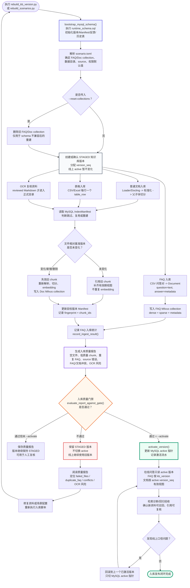
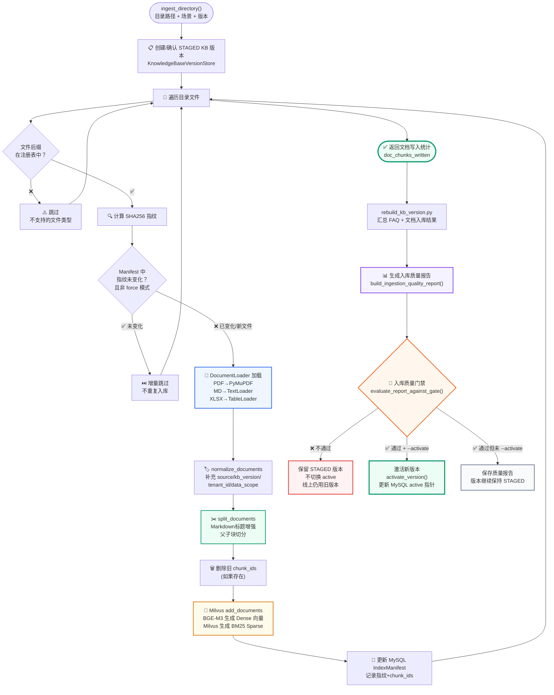
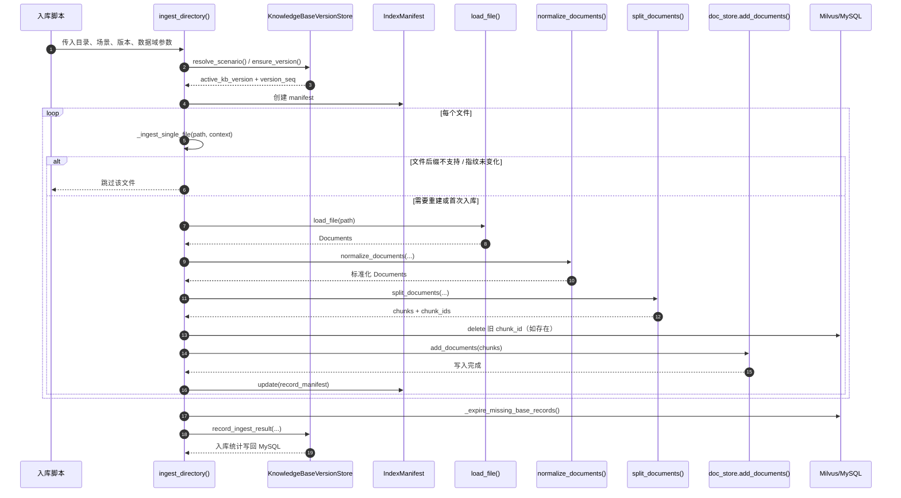

## 第一部分：离线 vs 在线链路

### 1.1 清晰的工程边界

```text
离线链路（入库）                      在线链路（问答）
─────────────────                    ─────────────────
定时/手动执行                         每次用户提问时执行
修改 Milvus 数据                      只读 Milvus 数据
可以慢（几分钟到几十分钟）            必须快（秒级响应）
可以重试、可以回滚                    必须一次成功
解析文件、切分、向量化                只做检索、不解析文件
```

**关键原则：在线问答不解析文件、不执行 OCR、不写入知识库。**

### 1.2 为什么分开

如果把文档解析放在在线链路：

- 用户提问时临时解析 PDF → 首 token 延迟增加 5-10 秒
- 文件解析失败时用户看到的是"PDF 损坏"而非答案
- 无法做质量报告（因为解析是即时的，没有机会检查）

如果把向量化放在在线链路：

- 用户问题需要等 Embedding 模型加载（冷启动 10+ 秒）
- 无法预热 Embedding 模型

### 1.3 知识库构建总链路

示例实现的离线知识库构建不是单独的“文档切分”或“FAQ 入库”，而是一条完整的版本化构建链路。可以用一句话概括：

> 离线链路负责把原始资料变成“带版本、带权限、可检索、可回滚”的知识资产；在线链路只读取当前 active 版本来回答问题。

生产、本地验证或资料发布时有两个常用入口：

| 入口 | 用途 | 适合场景 |
| --- | --- | --- |
| `scripts/rebuild_scenarios.py` | 一次初始化/重建全部 8 个冻结场景 | 新环境初始化、统一准备、Milvus schema 变更后全量修复 |
| `scripts/rebuild_kb_version.py` | 只重建单个业务场景 | 只修改了某个场景资料、验证单场景入库、定位某个场景问题 |

如果在 Docker Compose 里执行入库命令，先确认系统根目录存在 `.env.compose`。仓库只提交 `.env.compose.example`，首次部署需要生成本地配置文件：

```powershell
if (!(Test-Path .env.compose)) { Copy-Item .env.compose.example .env.compose }
notepad .env.compose
```

如果是新环境，或者 Milvus collection schema 变更后需要全量修复，优先使用批量脚本：

```bash
python scripts/rebuild_scenarios.py --reset-collections
```

它会对 8 个冻结场景逐个执行“新建版本 → 强制入库 → 质量门禁 → 激活”，并在 `--reset-collections` 开启时删除旧 FAQ/Doc collection，确保 Milvus schema 按当前代码重新创建。

在 Docker Compose 模式下，对应命令是：

```bash
docker compose --env-file .env.compose up -d mysql etcd minio milvus
docker compose --env-file .env.compose build api
docker compose --env-file .env.compose run --rm api python scripts/rebuild_scenarios.py --reset-collections
```

如果之前已经存在知识库，只是资料内容变化，批量重建全部 8 个场景时不加 `--reset-collections`：

```bash
docker compose --env-file .env.compose run --rm api python scripts/rebuild_scenarios.py
```

如果只重建一个场景，使用 `scripts/rebuild_kb_version.py`：

```bash
python scripts/rebuild_kb_version.py --scenario enterprise_knowledge --new-version --force --quality-gate --activate
```

Docker Compose 模式下，对应命令是：

```bash
docker compose --env-file .env.compose run --rm api python scripts/rebuild_kb_version.py --scenario enterprise_knowledge --new-version --force --quality-gate --activate
```

企业中更常见的日常资料更新方式，是“构建阶段增量，查询阶段按有效版本视图读取”。如果当前 active 版本已经存在，且只是少量文件变化，可以创建新候选版本并基于 active 做跨版本增量构建：

```bash
python scripts/rebuild_kb_version.py --scenario enterprise_knowledge --new-version --incremental-from active --quality-gate --activate
```

这条命令的语义是：FAQ 仍按新版本重建；文档先读取 active 版本的 MySQL IndexManifest，未变化文件直接引用旧版本 chunk，不复制 Milvus 行；变化文件让旧 chunk 从目标版本开始失效，再重新加载、切分、embedding；删除文件只写失效版本。在线查询按 active `version_seq` 解释有效期视图。

`--incremental-from` 不能和 `--force` 或 `--reset-collections` 同时使用：`--force` 表示全部重算，`--reset-collections` 会删掉可复用的旧向量。

文档入库与索引链路配套练习里提供了一个专门演示引用式增量的脚本：

```bash
python scripts\demo_incremental_ingestion.py
```

这个脚本会在临时目录里构造 v1/v2 两个版本：v2 同时包含未变化、修改、删除和新增文件。输出中的 `file_transitions` 会显示 `unchanged_reused`、`modified_reembedded`、`deleted_expired`、`added_reembedded` 四类结果；`visible_chunks` 会展示不同 `active_seq` 下哪些 chunk 可见。

#### 引用式增量版本

当前实现采用的是**引用式增量版本**：未变化文件不重新 embedding，也不复制旧 chunk；新版本只记录“从哪个基线版本继承、哪些文件新增、哪些文件修改、哪些文件删除”。查询时通过有效期字段判断当前版本能看到哪些 chunk。

文档检索表达式不再等价于 `kb_version == active`，而是用 active 版本序号解释有效视图：

```text
valid_from_seq <= active_seq
and (valid_to_seq == 0 or valid_to_seq > active_seq)
```

当前版本中新写入的 chunk 会带上 `valid_from_seq = active_seq`；未变化资料引用的旧 chunk 会保留原来的 `valid_from_seq`，并通过 `valid_to_seq` 判断是否失效。因此文档检索只需要有效期窗口，不需要再追加 `kb_version == active` 分支。

一种典型 metadata 设计如下：

| 字段 | 含义 |
| --- | --- |
| `scenario_id` | 业务场景 |
| `source_type` | 数据类型，文档为 `doc` |
| `record_type` | 记录粒度，文档 chunk 为 `doc_chunk` |
| `versioning_mode` | 文档版本模式，值为 `reference_incremental` |
| `version_filter_mode` | 文档检索过滤模式，值为 `validity_window` |
| `doc_id` | 稳定文件 ID |
| `chunk_id` | 稳定 chunk ID |
| `file_fingerprint` | 文件内容指纹 |
| `valid_from_seq` | 从哪个版本序号开始有效 |
| `valid_to_seq` | 到哪个版本序号前失效，`0` 表示仍然有效 |

假设 active 版本序号是 `8`，文档检索表达式为：

```text
scenario_id == "enterprise_knowledge"
and valid_from_seq <= 8
and (valid_to_seq == 0 or valid_to_seq > 8)
```

增量构建时：

| 文件状态 | 引用式增量处理方式 |
| --- | --- |
| 未变化 | 不写 Milvus，只继续引用旧 chunk |
| 新增 | 插入新 chunk，`valid_from_seq = 当前版本序号` |
| 修改 | 旧 chunk 写 `valid_to_seq = 当前版本序号`，新 chunk 写 `valid_from_seq = 当前版本序号` |
| 删除 | 旧 chunk 写 `valid_to_seq = 当前版本序号`，作为 tombstone 处理 |

这里的“旧 chunk”只来自本次增量基准版本的同路径 manifest，不是全历史版本扫描。也就是说，某个文件在 v2 中修改时，只让 v1 里被 v2 继承的那批 chunk 从 v2 开始不可见；更早或其他历史版本仍按自己的 `active_seq` 查询，不会被物理删除，也不会失去回滚价值。

下面用一个具体例子看引用式增量怎么工作。假设企业知识库里有三份资料：

```text
hr_onboarding.md      入职流程
it_vpn.md             VPN 处理
finance_expense.md    报销流程
```

### 版本 v1：首次全量入库

第一次入库时，三个文件都写入 Milvus：

| chunk_id | 文件 | 内容摘要 | valid_from_seq | valid_to_seq |
| --- | --- | --- | --- | --- |
| `hr_c1` | `hr_onboarding.md` | 入职需要提交身份证、银行卡、合同信息 | 1 | 0 |
| `it_c1` | `it_vpn.md` | VPN 连不上先检查账号、网络和 MFA | 1 | 0 |
| `fin_c1` | `finance_expense.md` | 报销流程包括提交单据、审批、财务复核 | 1 | 0 |

此时 active 版本序号是 `1`，查询表达式是：

```text
valid_from_seq <= 1
and (valid_to_seq == 0 or valid_to_seq > 1)
```

能查到：

```text
hr_c1, it_c1, fin_c1
```

### 版本 v2：只修改 VPN 文档

后来 IT 更新了 VPN 文档，新增了“客户端版本检查”的要求。引用式增量不会复制 HR 和财务 chunk，只处理变化文件：

| 操作 | chunk_id | 文件 | valid_from_seq | valid_to_seq | 说明 |
| --- | --- | --- | --- | --- | --- |
| 标记旧 chunk 失效 | `it_c1` | `it_vpn.md` | 1 | 2 | v2 开始不再使用旧 VPN 口径 |
| 插入新 chunk | `it_c2` | `it_vpn.md` | 2 | 0 | 新 VPN 口径从 v2 开始有效 |

Milvus 中现在一共有四条 chunk：

| chunk_id | 文件 | valid_from_seq | valid_to_seq |
| --- | --- | --- | --- |
| `hr_c1` | `hr_onboarding.md` | 1 | 0 |
| `it_c1` | `it_vpn.md` | 1 | 2 |
| `it_c2` | `it_vpn.md` | 2 | 0 |
| `fin_c1` | `finance_expense.md` | 1 | 0 |

如果 active 版本序号切到 `2`，查询表达式是：

```text
valid_from_seq <= 2
and (valid_to_seq == 0 or valid_to_seq > 2)
```

能查到：

```text
hr_c1, it_c2, fin_c1
```

注意：`hr_c1` 和 `fin_c1` 没有复制一份到 v2，但它们仍然有效，因为 `valid_to_seq = 0`。

### 版本 v3：删除财务报销文档，新增差旅文档

再后来财务删除旧的报销流程文档，并新增差旅规则文档：

```text
删除：finance_expense.md
新增：finance_travel.md
```

引用式增量处理如下：

| 操作 | chunk_id | 文件 | valid_from_seq | valid_to_seq | 说明 |
| --- | --- | --- | --- | --- | --- |
| 标记旧 chunk 失效 | `fin_c1` | `finance_expense.md` | 1 | 3 | v3 起旧报销资料不再可见 |
| 插入新 chunk | `fin_travel_c1` | `finance_travel.md` | 3 | 0 | 差旅规则从 v3 起生效 |

如果 active 版本序号切到 `3`，有效 chunk 是：

```text
hr_c1, it_c2, fin_travel_c1
```

完整状态表如下：

| chunk_id | 文件 | valid_from_seq | valid_to_seq | v1 可见 | v2 可见 | v3 可见 |
| --- | --- | --- | --- | --- | --- | --- |
| `hr_c1` | `hr_onboarding.md` | 1 | 0 | 是 | 是 | 是 |
| `it_c1` | `it_vpn.md` | 1 | 2 | 是 | 否 | 否 |
| `it_c2` | `it_vpn.md` | 2 | 0 | 否 | 是 | 是 |
| `fin_c1` | `finance_expense.md` | 1 | 3 | 是 | 是 | 否 |
| `fin_travel_c1` | `finance_travel.md` | 3 | 0 | 否 | 否 | 是 |

这个例子说明了引用式增量的关键点：

1. 未变化资料不复制，例如 `hr_c1` 从 v1 一直被 v2、v3 复用。
2. 修改资料不是覆盖旧 chunk，而是让旧 chunk 在新版本前失效，再插入新 chunk。
3. 删除资料不是立刻物理删除，而是写 `valid_to_seq`，让它从某个版本开始不可见。
4. 回滚时只需要把 active 版本序号从 `3` 切回 `2`，`fin_c1` 又会重新可见。

这种方案节省空间，也更适合大规模知识库。示例实现已经把它作为 V1 版本治理能力实现：MySQL 版本表提供 `version_seq`，文档 chunk 写入 `valid_from_seq / valid_to_seq`，检索时用 active 版本序号解释有效版本视图。

如果 Milvus Collection 的 schema 发生过变化，例如 sparse 字段从普通 SparseVector 改成 BM25 Function 输出字段，需要加上 `--reset-collections` 删除旧集合并重新建表：

```bash
python scripts/rebuild_kb_version.py --scenario enterprise_knowledge --new-version --force --reset-collections --quality-gate --activate
```

这里要区分两个参数：`--force` 只是忽略文件指纹、强制把资料重新写入新版本；`--reset-collections` 会删除 Milvus 里的 FAQ/Doc collection，让当前代码重新创建 schema。已有知识库只更新资料时，用 `--force`，不要默认加 `--reset-collections`。

完整入库链路闭环如下。这张图不是某一个函数的内部流程，而是从脚本入口到线上可检索、失败可修复、版本可回滚的端到端闭环：



这条链路里有几个容易混淆的点：

| 环节 | 作用 | 解释 |
| --- | --- | --- |
| `scenario.toml` | 定义业务场景、collection、数据目录、默认权限 | 先确定“这次给哪个业务场景建知识库” |
| `--new-version` | 创建一个新的 STAGED 版本 | 新资料先进入候选版本，不直接覆盖线上 |
| `--force` | 强制重新处理数据 | 用于需要重新入库时跳过增量判断 |
| `--incremental-from active` | 基于当前 active 版本做引用式增量构建 | 未变化文档引用旧 chunk，变化/删除文档写失效版本，查询按 active `version_seq` 解释有效视图 |
| `--reset-collections` | 删除并重建 Milvus collection | 只在 schema 变化或旧集合不兼容时使用 |
| FAQ 入库 | 把 CSV 问答对写入 FAQ collection | 适合标准问答、政策口径、固定流程 |
| 文档入库 | 把 PDF/Word/Markdown/表格等切成 chunk 写入 Doc collection | 适合长文档、制度、合同、手册 |
| IndexManifest | 在 MySQL 中记录文件指纹和 chunk ID | 下次入库时判断文件是否变化，避免重复处理 |
| 质量报告 | 统计入库质量问题 | 把“知识库是否可靠”变成可检查的数据 |
| `--quality-gate` | 质量门禁 | 可以显式执行门禁；如果同时传入 `--activate`，脚本会自动开启门禁 |
| `--activate` | 激活版本 | 只有通过门禁的新版本才进入在线链路 |

所以文档入库与索引链路后面的 FAQ 入库、文档加载、表格行入库、父子块切分、MySQL IndexManifest，都是这条总链路中的局部实现；知识库多版本管理负责解释版本状态机，RAG 回归验收与入库质量负责解释质量门禁和评测。

---

## 第二部分：文档加载器注册表

### 2.1 示例实现采用两层解析策略

文档入库与索引链路的目标不是只把文件读成字符串，而是把资料读成后续可以治理、切分、检索和引用的 `Document`。因此当前实现把文档解析拆成两层：

| 层级 | 负责内容 | 当前实现 |
| --- | --- | --- |
| 默认解析层 | Markdown、TXT、PDF 文本层、DOCX、PPTX、CSV、Excel | 实现内 native loader，行为可控 |
| 增强解析层 | 复杂 PDF、复杂 DOCX/PPTX、HTML 等版面资料 | Docling 已纳入主依赖，按配置启用后输出 Markdown，再进入同一入库链路 |

配置项在 `qa_core/config/settings.py` 中：

```yaml
document_parser_backend: str = Field(default="native", validation_alias="DOCUMENT_PARSER_BACKEND")
```

取值只有两个：

| 值 | 含义 | 适用场景 |
| --- | --- | --- |
| `native` | 默认解析路径 | 8 个业务场景的常规资料、稳定验收、快速部署 |
| `docling` | 对 PDF/DOCX/PPTX/HTML 启用 Docling 增强解析 | 复杂版面 PDF、图文混排、表格版式复杂的资料 |

注意：**CSV/Excel 不会交给 Docling**。示例实现对业务表格采用行级 Document 设计，每一行都会保留 `sheet_name`、`row_number`、表头和单元格键值。通用版面解析器可能把表格转成普通 Markdown 文本，反而削弱“按行定位、按行引用、按行回答”的业务能力。

### 2.2 Docling 是什么

Docling 是一个文档转换与版面理解工具。它的核心价值不是“直接做 RAG”，而是把 PDF、Word、PPT、HTML、图片等不同来源的资料先转换成统一的 `DoclingDocument`，再导出成 Markdown、JSON、HTML 或 DocTags 等格式。官方文档中，`DocumentConverter` 是主要入口；转换结果会包裹一个 `DoclingDocument`，而 `DoclingDocument` 可以序列化为 Markdown 等下游更容易处理的格式。

放到 RAG 入库链路里，Docling 所在的位置非常明确：

```text
原始复杂文档
  -> Docling DocumentConverter
  -> DoclingDocument
  -> Markdown 文本
  -> LangChain Document
  -> normalize_documents()
  -> split_documents()
  -> MilvusHybridStore.add_documents()
  -> IndexManifest / 质量报告 / 质量门禁
```

所以 Docling 在示例实现里只负责**解析阶段**，不负责下面这些事情：

| 不负责的内容 | 原因 |
| --- | --- |
| embedding / rerank | 仍由 BGE-M3 和 BGE reranker 负责 |
| Milvus 写入和混合检索 | 仍由 `MilvusHybridStore` 负责 |
| metadata 标准化 | 仍由 `normalize_documents()` 写入 source、scenario、kb_version、DataScope |
| chunk 切分策略 | 仍由 `split_documents()` 控制父子块、表格行和 Markdown 标题增强 |
| 质量报告和质量门禁 | 仍由 `qa_core/quality` 和 `rebuild_kb_version.py` 收口 |
| 知识库版本激活 | 仍由 `KnowledgeBaseVersionStore.activate_version()` 在门禁通过后执行 |

这条边界很重要。Docling 能提升复杂资料解析质量，但它不能替代企业 RAG 的版本治理、质量门禁和在线检索链路。

### 2.3 为什么需要 Docling

实现内置 native loader 已经可以处理常见资料：Markdown、TXT、带文本层 PDF、DOCX、PPTX、CSV、Excel。它轻量、稳定、可控，适合当前知识库数据和生产环境中的规范资料。

但企业资料经常不是“干净文本”：

| 资料问题 | native loader 常见风险 | Docling 的价值 |
| --- | --- | --- |
| PDF 多栏排版 | 读取顺序可能错乱 | 更关注页面 layout 和 reading order |
| PDF / Word 中复杂表格 | 表格可能被压成难读文本 | 尽量保留表格结构，再导出为 Markdown |
| PPT 图文混排 | 文本框、表格、标题层级容易丢失 | 统一转换成结构化文档表示 |
| HTML 页面 | 需要保留标题、段落和表格结构 | 转成统一 Markdown 后进入同一入库链路 |

因此，示例实现把 Docling 作为**增强解析后端**：默认仍走 native，遇到复杂版面资料时才切换到 `DOCUMENT_PARSER_BACKEND=docling`。这样既能保持主链路简单，也能给企业真实资料留出增强入口。

参考资料：

- [Docling Quickstart](https://docling-project.github.io/docling/getting_started/quickstart/)
- [Docling DocumentConverter](https://docling-project.github.io/docling/reference/document_converter/)
- [Docling serialization](https://docling-project.github.io/docling/concepts/serialization/)

### 2.4 注册表设计

```yaml
# qa_core/indexing/document_loaders.py

DOCLING_SUFFIXES = {".pdf", ".docx", ".pptx", ".html", ".htm"}

DOCUMENT_LOADER_SPECS: tuple[DocumentLoaderSpec, ...] = (
    DocumentLoaderSpec(
        suffixes=(".txt", ".md"),
        factory=_utf8_text_loader,
        description="UTF-8 文本和 Markdown；Markdown 保留原文给标题切分器处理。",
    ),
    DocumentLoaderSpec(
        suffixes=(".pdf",),
        factory=_pdf_loader,
        description="PDF 文本层解析；扫描件 OCR 不默认进入主链路。",
    ),
    DocumentLoaderSpec(
        suffixes=(".docx", ".doc"),
        factory=_word_loader,
        description="Word 文档文本解析。",
    ),
    DocumentLoaderSpec(
        suffixes=(".ppt", ".pptx"),
        factory=_powerpoint_loader,
        description="PowerPoint 文本解析。",
    ),
    DocumentLoaderSpec(
        suffixes=(".html", ".htm"),
        factory=_docling_loader,
        description="HTML 资料解析；需要 DOCUMENT_PARSER_BACKEND=docling。",
    ),
    DocumentLoaderSpec(
        suffixes=(".csv", ".xlsx", ".xls"),
        factory=_table_loader,
        description="CSV/Excel 表格解析；按行保留表头、sheet 和单元格键值。",
    ),
)
```

`load_file()` 的核心判断是：先按后缀确认文件受支持，再按配置决定是否启用 Docling。

```python
def _use_docling_for(path: Path) -> bool:
    return get_settings().document_parser_backend == "docling" and path.suffix.lower() in DOCLING_SUFFIXES


def load_file(path: Path) -> list[Document]:
    spec = get_document_loader_spec(path)
    if spec is None:
        raise ValueError(f"不支持的文档类型：{path}")
    if _use_docling_for(path):
        return _docling_loader(path).load()
    return spec.create_loader(path).load()
```

这段代码有两个边界：

- `DOCUMENT_PARSER_BACKEND=docling` 只影响 PDF/DOCX/PPTX/HTML/HTM；
- CSV/XLSX/XLS 始终走 `_table_loader()`，保证表格行 metadata 不丢失。

### 2.5 Docling 增强解析如何接入

Docling loader 只负责把复杂版面资料转换成 Markdown。转换后仍然返回 LangChain `Document`，后续的 `normalize_documents()`、`split_documents()`、`MilvusHybridStore.add_documents()`、IndexManifest 和质量门禁都不需要改。

```python
class DoclingLoader:
    """Docling 增强 loader，把复杂版面资料转换成 Markdown 后进入统一入库链路。"""

    def __init__(self, path: Path) -> None:
        self.path = path

    def load(self) -> list[Document]:
        if (
            importlib.util.find_spec("docling") is None
            or importlib.util.find_spec("docling.document_converter") is None
        ):
            raise RuntimeError("Docling 解析后端不可用：未安装 docling。")

        converter_module = importlib.import_module("docling.document_converter")
        result = converter_module.DocumentConverter().convert(str(self.path))
        content = result.document.export_to_markdown().strip()
        metadata = {
            "file_type": self.path.suffix.lower(),
            "parser_backend": "docling",
            "docling_format": "markdown",
        }
        return [Document(page_content=content, metadata=metadata)] if content else []
```

实际代码使用 `importlib` 做显式动态加载：只有配置为 `docling` 且文件类型需要增强解析时，才加载 Docling。这样默认运行路径不会提前初始化 Docling 的模型和依赖；如果当前环境没有按系统主依赖完整安装，会直接报明确错误，不会静默退回 native 路径。

### 2.6 如何启用 Docling

本机开发环境：

```bash
pip install -r requirements.txt
$env:DOCUMENT_PARSER_BACKEND="docling"
python scripts/tools/docling_parser_smoke.py
python scripts/rebuild_kb_version.py --scenario enterprise_knowledge --new-version --force --quality-gate --activate --description "docling parser rebuild"
```

Docker Compose 环境：

```bash
# 使用完整系统依赖构建 API 镜像
docker compose --env-file .env.compose build api

# 在 .env.compose 中设置
# DOCUMENT_PARSER_BACKEND=docling

docker compose --env-file .env.compose run --rm api python scripts/rebuild_kb_version.py --scenario enterprise_knowledge --new-version --force --quality-gate --activate --description "docling parser rebuild"
```

如果只是确认 Docling 是否能在当前环境解析文件，可以先运行：

```bash
python scripts/tools/docling_parser_smoke.py
```

这个命令会生成一个临时 HTML 样例，只检查 `load_file()` 是否能走 Docling 后端，不写 Milvus，也不创建知识库版本。也可以指定真实资料：

```bash
python scripts/tools/docling_parser_smoke.py --input 你的复杂版面资料.pdf
```

如果只是使用 8 个默认业务场景和当前已整理好的多格式资料，保持：

```text
DOCUMENT_PARSER_BACKEND=native
```

即可。native 路径已经覆盖 Markdown、TXT、带文本层 PDF、DOCX、PPTX、CSV、XLSX、XLS，并且更适合稳定验收。

### 2.7 为什么不把所有文件都交给 Docling

| 文件类型 | 当前选择 | 原因 |
| --- | --- | --- |
| Markdown / TXT | native | 已经是可控文本，保留原始标题和段落结构即可 |
| CSV / Excel | native table loader | 必须保留表头、sheet、行号、单元格键值，便于行级检索和引用 |
| 带文本层 PDF | native 或 Docling | 普通制度 PDF 可走 native；复杂版面 PDF 可切 Docling |
| DOCX / PPTX | native 或 Docling | 普通资料走 native；复杂版式或多表格版面可切 Docling |
| 扫描件 / 图片件 | 先走 OCR 复核流程 | 不能把低置信 OCR 结果直接写入 active 知识库 |

所以当前实现不是“native 和 Docling 二选一”，而是：

```text
默认资料：native，简单、稳定、可控
复杂版面：Docling，增强解析能力
结构化表格：系统行级 loader，保留业务语义
扫描件：OCR 复核治理，避免污染 active 知识库
```

### 2.8 为什么没有直接使用 LlamaIndex 入库流水线

LlamaIndex 的 `SimpleDirectoryReader` 可以快速读取本地目录文件，`IngestionPipeline` 可以把 transformations、embedding、缓存和向量库写入串起来。这些能力适合快速搭建 RAG 数据接入原型，也适合作为企业系统后续优化方向。

但示例实现没有把 LlamaIndex 接入文档入库与索引链路主代码，原因是本文要讲清楚的是企业知识库入库治理，而不只是“把文件变成向量”。

| 对比点 | 示例实现当前实现 | 如果直接换成 LlamaIndex |
| --- | --- | --- |
| 主线 | `load_file -> normalize_documents -> split_documents -> add_documents -> manifest -> quality report` 每一步都和代码对齐 | 会额外引入 `Document / Node / Index / QueryEngine / IngestionPipeline` 等概念 |
| 版本治理 | 每个 chunk 显式写入 `scenario_id / kb_version / source / DataScope` | 仍需要自己把这些 metadata 接回企业治理链路 |
| 增量机制 | MySQL `IndexManifest` 明确记录文件指纹和 chunk_id | LlamaIndex cache 能减少重复 transformation，但不能直接替代 active 版本发布和质量门禁 |
| 表格资料 | 自定义 table loader 按表头、工作表、行号生成行级 Document | 通用 loader 未必能保留示例实现需要的业务 metadata 粒度 |
| 质量报告 | 入库后生成空文件、重复 chunk、FAQ 冲突、OCR 风险等报告 | 质量指标仍然要由系统自己定义和落库 |

因此当前代码保持显式实现：文档解析使用 native + Docling 可选增强，切分和向量化使用 LangChain/Milvus，版本和质量治理由 `qa_core` 自己掌控。这样做的好处是每个字段为什么存在、每个步骤为什么执行，都能和后续检索、评测、回滚闭环对齐。

当前代码和依赖保持一致：`requirements.txt` 不包含 `llama-index`，`qa_core` 主链路也不导入 `llama_index`。

---

## 第三部分：文档入库主流程

### 3.1 ingest_directory() 完整流程



### 代码执行时序图

这张图对应离线入库主入口 `qa_core/indexing/service.py::ingest_directory()`。它最适合按“版本确认 -> 遍历文件 -> 单文件增量判断 -> 写 Milvus -> 回写清单”的顺序阅读。




FAQ CSV 的链路是另一条更短的路：`ingest_faq_csv()` 直接把 CSV 转成 FAQ 文档，再执行删除旧 FAQ + 批量写入 + 记录版本统计，不走普通文档切分。

```python
# qa_core/indexing/service.py
def ingest_directory(
    directory_path: str,
    source: str | None = None,
    *,
    scenario_id: str | None = None,
    tenant_id: str | None = None,
    dataset_id: str | None = None,
    visibility: str | None = None,
    allowed_roles: list[str] | None = None,
    force: bool = False,
    kb_version: str | None = None,
    create_new_version: bool = False,
    description: str = "",
) -> int:
    """把目录中的业务文档增量写入 Milvus，逐文件委托 _ingest_single_file 处理。"""

    # Step 1：解析场景、构建数据域、确定业务分类
    scenario = resolve_scenario(scenario_id)
    data_scope = resolve_data_scope(
        tenant_id=tenant_id, dataset_id=dataset_id,
        visibility=visibility, user_roles=allowed_roles,
    )
    root = Path(directory_path)
    resolved_source = source or normalize_source_from_path(root)
    if resolved_source not in scenario.valid_sources:
        raise ValueError(f"无效的业务分类：{resolved_source}")

    # Step 2：创建/确认知识库版本
    version_store = get_kb_version_store(scenario.scenario_id)
    version = version_store.ensure_version(
        kb_version, create_new=create_new_version,
        description=description, created_by="ingest_directory",
    )
    active_kb_version = version.kb_version

    # Step 3：打开增量清单 + 文档存储，并组装单次入库上下文
    context = DocumentIngestContext(
        source=resolved_source,
        kb_version=active_kb_version,
        scenario=scenario,
        data_scope=data_scope,
        allowed_roles=allowed_roles,
        doc_store=get_doc_store(scenario.doc_collection),
        manifest=IndexManifest(),
        force=force,
        incremental_base_kb_version=incremental_base_kb_version,
    )

    # Step 4：遍历目录，逐个文件委托给 _ingest_single_file
    stats = DirectoryIngestStats()
    for path in _walk_files(root):
        stats.add(_ingest_single_file(path, context))

    # Step 5：记录入库统计
    version_store.record_ingest_result(
        active_kb_version, content_type="doc",
        count=stats.total_chunks, source=resolved_source,
        extra_stats=stats.as_version_stats(incremental_base_kb_version),
    )

    # Step 6：入库函数只写入和记录统计，不直接激活。
    # 版本发布由 rebuild_kb_version.py 生成质量报告、执行门禁后统一切换 active。

    return stats.total_chunks
```

`_ingest_single_file()` 负责单个文件的增量入库逻辑，被 `ingest_directory` 的循环调用：

```python
def _ingest_single_file(path: Path, context: DocumentIngestContext) -> FileIngestResult:
    """处理单个文件：目标版本跳过、基准版本复用、变化文件重建。"""
    if get_document_loader_spec(path) is None:
        raise ValueError(f"不支持的文档类型：{path}")
    fingerprint = file_fingerprint(path)
    settings = get_settings()
    existing = context.manifest.get(context.source, path, context.kb_version, context.scenario_id)

    if not context.force and _manifest_matches_current_settings(existing, fingerprint, settings):
        return FileIngestResult(skipped=True)

    if not existing:
        base_record = _find_reusable_base_record(context, path, fingerprint, settings)
        if base_record:
            return _copy_from_base_version(context, path, fingerprint, base_record, settings)

    return _rebuild_file_chunks(context, path, fingerprint, existing, settings)
```

### 3.2 normalize_documents 的作用

```python
def normalize_documents(
    documents: list[Document],
    file_path: Path,
    source: str,
    kb_version: str | None = None,
    scenario_id: str | None = None,
    data_scope: DataScope | None = None,
    allowed_roles: list[str] | None = None,
) -> list[Document]:
    """为文档补充系统标准元数据，供过滤和引用使用。"""
    doc_id = file_fingerprint(file_path)
    scenario = resolve_scenario(scenario_id)
    scope = data_scope or resolve_data_scope()
    version_meta = version_metadata(kb_version, scenario.scenario_id)
    normalized: list[Document] = []
    for index, doc in enumerate(documents):
        metadata = dict(doc.metadata or {})
        metadata.update(
            {
                "source": source,
                "scenario_id": scenario.scenario_id,
                **scope.metadata(allowed_roles=allowed_roles),
                "file_path": str(file_path),
                "file_name": file_path.name,
                "file_type": file_path.suffix.lower(),
                "doc_id": doc_id,
                "page_index": metadata.get("page", index),
                "content_type": metadata.get("content_type") or "text",
                **version_meta,
            }
        )
        normalized.append(Document(page_content=doc.page_content, metadata=metadata))
    return normalized
```

### 3.3 split_documents() 的系统策略

`normalize_documents()` 输出统一 metadata 后，`split_documents()` 根据资料类型选择真实切分路径：

```yaml
# qa_core/indexing/chunking.py
for doc in documents:
    file_type = str(doc.metadata.get("file_type", "")).lower()

    if is_table_metadata(doc.metadata) or is_reviewed_ocr_metadata(doc.metadata):
        parent_content = doc.page_content.strip()
        if not parent_content:
            continue
        metadata = dict(doc.metadata)
        metadata["parent_content"] = parent_content
        parent_id, chunk_id = chunk_identity(parent_content, metadata)
        metadata.update({"parent_id": parent_id, "chunk_id": chunk_id})
        chunks.append(Document(page_content=parent_content, metadata=metadata))
        ids.append(chunk_id)
        continue

    if file_type == ".md":
        header_splitter = MarkdownHeaderTextSplitter(
            headers_to_split_on=[("#", "h1"), ("##", "h2"), ("###", "h3")]
        )
        header_docs = header_splitter.split_text(doc.page_content)
        for header_doc in header_docs:
            header_doc.metadata.update(doc.metadata)
        parent_docs = parent_splitter.split_documents(header_docs)
    else:
        parent_docs = parent_splitter.split_documents([doc])

    for parent_doc in parent_docs:
        parent_content = parent_doc.page_content
        for child_doc in child_splitter.split_documents([parent_doc]):
            metadata = dict(child_doc.metadata)
            metadata["parent_content"] = parent_content
            parent_id, chunk_id = chunk_identity(child_doc.page_content, metadata)
            metadata.update({"parent_id": parent_id, "chunk_id": chunk_id})
            chunks.append(Document(page_content=child_doc.page_content, metadata=metadata))
            ids.append(chunk_id)
```

这段代码表达的是系统策略，而不是新的 LangChain 概念：Markdown 先保留标题结构，普通文本执行父子块切分，表格行和已复核 OCR 保持完整；最终为每个块生成稳定的 `parent_id/chunk_id`。完整源码见 `qa_core/indexing/chunking.py`，chunk size 与 overlap 的原理见附录 G。

---

## 第四部分：表格 CSV / Excel 专用入库设计

### 4.1 为什么表格不能按普通文本切分

普通制度、流程、手册是一段段自然语言，适合用 Parent-Child Chunking 按章节和字符长度切分。

但 CSV / Excel 表格不是自然段，而是一条条**行记录**。一行里多个单元格共同表达一个完整业务事实：

```text
材料名称=施工照片
状态=待补交
责任人=系统经理
截止日期=2026-05-30
```

如果把表格当普通文本递归切分，可能出现：

- 检索命中了“施工照片”，但状态被切到另一个 chunk；
- 检索命中了“金额”，但付款节点、责任人丢失；
- 两行不同记录被拼到同一个 chunk，答案把 A 行状态说成 B 行状态；
- 答案引用只能定位到文件，不能定位到工作表和行号。

所以示例实现对表格资料的原则是：

> **一行表格 = 一个完整业务语义单元。**

### 4.2 文件读取策略

表格文件在 Loader 注册表中作为独立类型接入：

```text
# qa_core/indexing/document_loaders.py
DocumentLoaderSpec(
    suffixes=(".csv", ".xlsx", ".xls"),
    factory=_table_loader,
    description="CSV/Excel 表格解析；按行保留表头、sheet 和单元格键值。",
)
```

读取规则：

| 文件类型 | 读取方式 | 说明 |
| --- | --- | --- |
| `.csv` | `pandas.read_csv(..., encoding="utf-8-sig")` | 兼容带 BOM 的中文 CSV |
| `.xlsx` | `pandas.read_excel(..., sheet_name=None, engine="openpyxl")` | 一次读取全部工作表 |
| `.xls` | `pandas.read_excel(..., sheet_name=None, engine="xlrd")` | 兼容旧版 Excel |

Excel 会逐个 sheet 处理，避免把多个业务表混成一张表。

### 4.3 表格清洗

表格入库前先做轻量清洗：

```python
def _normalize_frame(frame: pd.DataFrame) -> pd.DataFrame:
    """清理表格空行空列，并把缺失表头补成稳定列名。"""
    data = frame.dropna(how="all").dropna(axis=1, how="all").fillna("")
    columns = []
    for index, column in enumerate(data.columns, start=1):
        name = str(column).strip()
        if not name or name.lower().startswith("unnamed:"):
            name = f"列{index}"
        columns.append(name)
    data.columns = columns
    return data
```

清洗目标不是复杂 ETL，而是保证表格行进入 RAG 时不会因为空行、空列表头、`Unnamed` 列名造成检索噪声。

单元格值也会转成适合检索的短文本：

```python
def _cell_text(value: object) -> str:
    text = str(value).strip()
    if text.endswith(".0") and text[:-2].isdigit():
        return text[:-2]
    return text
```

这样 `1000.0` 会变成 `1000`，金额、编号、数量类问题更容易命中。

### 4.4 每行转换为 Document

表格 loader 会把每一行转换成一个 LangChain `Document`：

```text
content = "\n".join(
    [
        f"表格文件：{path.name}",
        f"工作表：{sheet_name}",
        f"表头：{' / '.join(headers)}",
        f"行号：{row_number}",
        "单元格：",
        *cell_lines,
    ]
)
```

生成后的正文类似：

```text
表格文件：验收清单.xlsx
工作表：材料验收
表头：材料名称 / 状态 / 责任人 / 截止日期
行号：3
单元格：
- 材料名称：施工照片
- 状态：待补交
- 责任人：系统经理
- 截止日期：2026-05-30
```

这样做有两个好处：

1. **语义完整**：同一行的字段和值不会被拆散；
2. **适合向量检索和 BM25**：既有自然语言标签，也有明确的列名和值。

### 4.5 metadata 设计

表格行必须携带可追溯 metadata：

```text
metadata={
    "content_type": "table_row",
    "table_id": table_id,
    "sheet_name": str(sheet_name),
    "row_number": row_number,
    "row_count": len(normalized),
    "column_count": len(headers),
    "table_headers": " | ".join(headers),
}
```

字段含义：

| 字段 | 作用 |
| --- | --- |
| `content_type=table_row` | 告诉切分、质量检测、检索上下文：这是表格行 |
| `table_id` | 标识同一个文件下的同一个工作表 |
| `sheet_name` | 支持答案引用到具体工作表 |
| `row_number` | 支持答案引用到具体行 |
| `row_count` / `column_count` | 质量报告和容量评估使用 |
| `table_headers` | 帮助回看表结构，也便于后续扩展表头召回 |

### 4.6 表格行不再递归切分

`split_documents()` 会识别 `content_type=table_row`：

```yaml
# qa_core/indexing/chunking.py
if is_table_metadata(doc.metadata):
    parent_docs = [doc]
else:
    parent_docs = parent_splitter.split_documents([doc])
```

也就是说，表格行不会再进入普通字符切分器。

原因是：表格行已经是完整业务单元，再切一次反而会破坏“列名 -> 单元格值”的关系。

### 4.7 检索策略中的 prefer_table

表格入库只是第一步。检索时还要识别用户是否在问表格问题。

示例实现通过 `is_table_query()` 判断问题是否包含表格、清单、台账、字段、行号、工作表、状态、金额、责任人等表达：

```text
prefer_table = is_table_query(compact_query)
params = _apply_table_preference(prefer_table, params["run_doc"], params, settings)
```

当 `prefer_table=True` 时：

- 扩大 `doc_top_k`，多召回一些候选表格行；
- 扩大 `final_context_top_n`，给表格证据更多上下文空间；
- 设置 `faq_direct_exact_only=True`，禁止相似 FAQ 直接回答；
- 上下文构建时把表格行排在普通正文前。

为什么要禁用相似 FAQ 直出？

```text
用户问：验收材料清单里测试报告那一行是什么状态？
相似 FAQ：验收需要提交哪些材料？

这两个问题都包含“验收”“材料”“测试报告”，相似度可能不低。
但 FAQ 回答的是材料范围，用户问的是某一行字段值。
所以表格类问题只允许精确 FAQ 直出，相似 FAQ 必须让位给文档 RAG。
```

### 4.8 答案引用和兜底

表格资料的答案必须能回到原始证据。当前实现在来源标签中追加工作表和行号：

```text
[1] 验收清单.xlsx / 工作表：材料验收 / 第 3 行
```

另外，表格类问题经常涉及状态、金额、责任人、日期等精确值。LLM 有时会概括回答而漏掉某个关键单元格，所以系统里增加了表格行兜底：

```python
def enforce_table_row_details(answer: str, context_docs: list[Document]) -> str:
    """确保表格类答案在模型遗漏关键单元格时，确定性追加表格行要点。"""
```

如果模型回答没有覆盖表格行里的核心字段，系统会追加：

```text
表格行要点：状态：待补交；责任人：系统经理 [1]
```

这不是替代 LLM，而是对表格精确字段的一层确定性保护。

### 4.9 表格入库设计要点

Excel 和 CSV 入库可以概括为：

> Excel 和 CSV 不能按普通文本切分。我们把每一行转成一个带表头、工作表、行号和单元格键值的 LangChain Document，并写入 `content_type=table_row`。切分阶段识别到表格行后不会再递归切分；检索阶段如果问题命中表格、清单、台账、金额、状态等关键词，会启用 `prefer_table`，扩大文档召回并优先保留表格行。答案引用会展示文件、工作表和行号，如果模型漏掉关键单元格，系统会追加表格行要点，保证表格类问题能追溯、能复核、字段不丢。

### 4.10 表格入库完整示例

下面用最小数据演示“表格读取 → 行级 Document → 检索偏好 → 答案引用”的完整处理方式。

准备一个最小 CSV：

```text
材料名称,状态,责任人,截止日期,备注
施工图纸,已提交,设计负责人,2026-05-10,版本为 V3
隐蔽工程照片,待补交,系统经理,2026-05-18,缺少二层西侧照片
验收测试报告,已通过,质量负责人,2026-05-20,检测编号 QA-2026-021
```

下面这段代码用于在本地快速验证表格 loader 和切分策略。它不连接 Milvus，也不会改动线上知识库，只检查三件事：

- `load_table_file()` 是否把 CSV 每一行转换成一个 `Document`；
- `split_documents()` 是否保持表格行完整，不再递归切分；
- `is_table_query()` 是否能把表格类问题识别为 `prefer_table=True`。

```python
from pathlib import Path

from qa_core.indexing.chunking import split_documents
from qa_core.indexing.table_documents import load_table_file
from qa_core.intent.question_category import is_table_query


csv_path = Path("reports/table_practice/acceptance_material_checklist.csv")
csv_path.parent.mkdir(parents=True, exist_ok=True)
csv_path.write_text(
    "\n".join(
        [
            "材料名称,状态,责任人,截止日期,备注",
            "施工图纸,已提交,设计负责人,2026-05-10,版本为 V3",
            "隐蔽工程照片,待补交,系统经理,2026-05-18,缺少二层西侧照片",
            "验收测试报告,已通过,质量负责人,2026-05-20,检测编号 QA-2026-021",
        ]
    ),
    encoding="utf-8-sig",
)

documents = load_table_file(csv_path)
print("行级 Document 数量：", len(documents))
print("第一条 Document 正文：")
print(documents[0].page_content)
print("第一条 Document metadata：")
print(documents[0].metadata)

chunks, ids = split_documents(documents)
print("切分后 chunk 数量：", len(chunks))
print("chunk_id 示例：", ids[0])
print("第二条 chunk 正文：")
print(chunks[1].page_content)
print("第二条 chunk metadata：")
print(chunks[1].metadata)

query = "验收清单里隐蔽工程照片是什么状态，责任人是谁？"
print("是否表格类问题：", is_table_query(query))
```

运行时应该看到：

```text
行级 Document 数量： 3
切分后 chunk 数量： 3
是否表格类问题： True
```

第二条 chunk 的正文应该仍然保留完整行记录，类似：

```text
表格文件：acceptance_material_checklist.csv
工作表：csv
表头：材料名称 / 状态 / 责任人 / 截止日期 / 备注
行号：2
单元格：
- 材料名称：隐蔽工程照片
- 状态：待补交
- 责任人：系统经理
- 截止日期：2026-05-18
- 备注：缺少二层西侧照片
```

metadata 中至少要看到这些字段：

```json
{
  "content_type": "table_row",
  "sheet_name": "csv",
  "row_number": 2,
  "row_count": 3,
  "column_count": 5
}
```

如果要把这个 CSV 真正放进知识库，可以把文件移动到某个场景的数据目录，例如：

```text
scenarios/engineering_project_qa/data/quality_data/acceptance_material_checklist.csv
```

然后执行单场景重建：

```bash
python scripts/rebuild_kb_version.py --scenario engineering_project_qa --new-version --force --quality-gate --activate --description "table row ingestion practice"
```

入库后可以用检索诊断或页面提问：

```text
验收清单里隐蔽工程照片是什么状态，责任人是谁？
```

期望链路是：

```text
问题命中 prefer_table=True
  ↓
文档检索优先保留 table_row
  ↓
答案引用能定位到 CSV 文件、工作表 csv、第 2 行
  ↓
如果模型漏掉状态或责任人，后处理追加表格行要点
```

建议把它放到工程系统资料问答场景的数据目录中，并按常规知识库重建流程入库。重点观察四件事：

| 检查点 | 期望结果 | 为什么检查 |
| --- | --- | --- |
| 入库后的 metadata | 包含 `content_type=table_row`、`sheet_name`、`row_number` | 证明表格行没有被当成普通正文。 |
| chunk 数量 | 每个有效数据行生成一个可检索 `Document` | 证明行级证据粒度正确。 |
| 检索计划 | 表格类问题命中 `prefer_table=True` | 证明检索策略知道当前问题更适合查表格。 |
| 答案来源 | 来源中能看到文件、工作表、行号 | 证明答案可以回到原始证据复核。 |

可以在页面或接口中提问：

```text
验收清单里隐蔽工程照片是什么状态，责任人是谁？
```

理想回答应该包含：

- 状态是“待补交”；
- 责任人是“系统经理”；
- 引用来源能定位到 CSV/Excel 的对应行；
- 如果模型遗漏状态或责任人，系统会追加“表格行要点”。

这个练习的目的不是测试模型文采，而是验证表格证据没有在切分和生成阶段丢失。

### 4.11 当前边界

一期表格入库只覆盖“规范二维表”。复杂 Excel 能力不能无边界扩散，否则会把 RAG 系统变成 Office 解析系统。

| 边界场景 | 一期处理策略 | 推荐做法 |
| --- | --- | --- |
| 合并单元格 | 不默认还原层级语义 | 入库前整理成普通二维表。 |
| 多级表头 | 不自动推断复杂表头关系 | 人工扁平化字段名，比如“合同-金额”“合同-付款节点”。 |
| 公式单元格 | 读取解析后的单元格值，不重新计算业务公式 | 关键计算逻辑应在业务系统或数据准备阶段完成。 |
| 图表 | 不把柱状图、折线图直接转成结构化证据 | 导出图表背后的原始数据表再入库。 |
| 截图表格 | 不走 CSV/Excel 表格 loader | 进入 OCR/VLM 图文资料治理链路。 |
| 超大 Excel | 不在一期做复杂分布式解析 | 拆分工作表、拆分文件，或按业务周期归档。 |
| 隐藏行列和批注 | 不作为可信主证据 | 重要内容必须整理成显式列。 |
| 透视表 | 不直接作为原始证据 | 导出明细表或汇总表后再入库。 |

这部分能力可以概括为：

> 我们一期支持的是规范 CSV/Excel 的行级语义入库，不追求解析所有复杂 Office 特性。这样做是为了保证 RAG 主链路清晰可控：表格行能召回、字段能引用、来源能复核。合并单元格、截图表格、图表解释这类复杂资料会进入后续 OCR/VLM 和资料治理链路，而不是塞进普通表格 loader 里。

---

## 第五部分：MySQL IndexManifest 增量机制

### 5.1 先分清两个“版本”

学习增量入库时，最容易混淆的是“知识库版本”和“Manifest 记录”。

| 概念 | 保存位置 | 作用 |
| --- | --- | --- |
| 知识库版本 `kb_version` | MySQL `kb_versions` / `kb_active_versions` | 控制线上当前查哪个知识库版本，例如 `kb_enterprise_knowledge_20260618_xxx`。 |
| Manifest 记录 | MySQL `kb_document_manifests` | 记录某个文件在某个 `kb_version` 下生成了哪些 chunk，用于判断下次是否可以跳过、复用或重建。 |
| Milvus chunk | Milvus collection | 保存真正用于检索的文本、向量和 metadata。 |

一句话概括：

> `kb_version` 决定线上查哪一版；`IndexManifest` 记录每一版里每个文件对应哪些 chunk。

当前实现的线上检索始终只查一个 active 版本：

```text
valid_from_seq <= active_seq
and (valid_to_seq == 0 or valid_to_seq > active_seq)
```

它不是查询时把“旧版本 + 增量版本”拼起来查。增量发生在离线构建阶段，最终仍然产出一个完整的新 `kb_version`。

### 5.2 为什么需要 Manifest

假设一个业务场景有 500 个文档，只改了其中 1 个文件。如果每次都全量重建，会有三个问题：

| 问题 | 后果 |
| --- | --- |
| 时间浪费 | 499 个未变化文件重复解析、切分、embedding。 |
| 成本浪费 | embedding 和 Milvus 写入重复执行。 |
| 发布风险 | 全量重建过程中任何一步失败，都可能影响新版本发布。 |

Manifest 要解决的是三个判断问题：

| 判断问题 | 处理动作 |
| --- | --- |
| 目标版本里这个文件已经入过库，而且文件、embedding 模型、切分策略都没变 | 直接跳过。 |
| 新建目标版本时，基准版本里这个文件没变，而且模型和切分策略也没变 | 目标版本 manifest 引用旧 chunk，不复制、不重新 embedding。 |
| 文件内容变化、新增文件、embedding 模型变化、切分策略变化 | 重新加载、切分、embedding、写入 Milvus。 |

所以它不是“简单记录文件名”，而是离线入库的决策依据。

### 5.3 Manifest 表结构

当前实现把文档增量清单保存到 MySQL 表 `kb_document_manifests`。这张表记录“某个文件在某个场景、某个知识库版本下生成了哪些 chunk”。

| 字段 | 说明 |
| --- | --- |
| `manifest_key` | `scenario_id + source + kb_version + 文件绝对路径` 的稳定 hash |
| `scenario_id` | 业务场景 |
| `source` | 业务分类 |
| `path` | 本地文件绝对路径 |
| `fingerprint` | 文件指纹，用于判断是否变化 |
| `chunk_ids_json` | 该文件写入 Milvus 后生成的 chunk id 列表 |
| `kb_version` | 所属知识库版本 |
| `embedding_model_version` / `chunk_schema_version` | 入库配置快照 |
| `updated_at` | 最近入库时间 |

这里有两个字段尤其关键：

- `embedding_model_version`：同一个文件如果换了 embedding 模型，旧向量不能继续复用。
- `chunk_schema_version`：同一个文件如果切分策略或 chunk metadata 契约变了，旧 chunk 结构不能继续复用。

这里采用严格等值匹配，不做“字段种类没少就算兼容”的宽松判断。`valid_from_seq / valid_to_seq` 是引用式增量有效期窗口，属于 chunk metadata 契约；引入这类影响检索过滤语义的字段时，要同步提升 `CHUNK_SCHEMA_VERSION`，让旧 manifest 自动失配并重建。

Manifest 表结构集中在 `qa_core/storage/runtime_schema.sql`：

```sql
CREATE TABLE IF NOT EXISTS {{INDEX_MANIFEST_TABLE}} (...);
```

`qa_core/indexing/manifest.py` 不再直接维护大段 `CREATE TABLE` 字符串，而是只负责 Manifest 的读写动作：

| 模块 | 职责 |
| --- | --- |
| `qa_core/storage/runtime_schema.sql` | 定义 `kb_document_manifests` 表结构 |
| `qa_core/storage/bootstrap.py` | 在 API 或脚本入口显式初始化 MySQL schema |
| `qa_core/indexing/manifest.py` | 查询、更新、删除 Manifest 记录 |
| `qa_core/indexing/service.py` | 在入库流程中根据 Manifest 判断跳过、复用或重建 |

这种拆分不是为了增加文件数量，而是让“数据库初始化”和“入库业务判断”分开。读文档入库与索引链路时先理解 Manifest 怎么做增量决策；需要看表结构时，再进入 `runtime_schema.sql`。

因此“文件没变”还不够，必须同时满足：

```text
fingerprint 相同
embedding_model_version 相同
chunk_schema_version 相同
```

### 5.4 两种增量：同版本跳过与跨版本复用

系统里实际有两类增量场景，它们的处理动作不同。

#### 场景 A：同一个目标版本重复执行入库

比如某次入库中断了，重新执行同一个目标 `kb_version`。这时目标版本里可能已经有部分文件写入成功。

处理逻辑是：

```text
读取目标版本 manifest
  ↓
当前文件 fingerprint / embedding_model_version / chunk_schema_version 都一致
  ↓
直接跳过，不重复写入 Milvus
```

这就是 `_ingest_single_file()` 里第一层判断：

```text
existing = manifest.get(source, path, target_kb_version, scenario_id)

if (
    existing
    and existing.fingerprint == fingerprint
    and existing.embedding_model_version == settings.embedding_model_version
    and existing.chunk_schema_version == settings.chunk_schema_version
):
    return 0, True, 0
```

#### 场景 B：基于 active 版本创建一个新版本

这是更常见的企业发布方式：

```bash
python scripts/rebuild_kb_version.py --scenario enterprise_knowledge --new-version --incremental-from active --quality-gate --activate
```

这时目标版本是新的，例如：

```text
旧 active 版本：kb_v1
新 staged 版本：kb_v2
```

如果某个文件在 `kb_v1` 里已经入过库，并且文件内容、embedding 模型、切分策略都没变，目标版本也必须把它纳入自己的可见视图。因为线上检索激活后只查：

```text
kb_version == kb_v2
```

如果未变化文件什么都不写入 `kb_v2`，激活后这些文件就查不到了。

因此跨版本增量的动作是：

```text
读取基准版本 kb_v1 的 manifest
  ↓
确认文件未变化，模型和切分策略也未变化
  ↓
目标版本 manifest 直接记录旧 chunk_ids
  ↓
查询时由 active version_seq 决定这些 chunk 是否可见
```

对应代码是 `_reference_base_version()`：

```text
_record_manifest(context, path, fingerprint, base_record.chunk_ids, settings)
```

这里复用的是旧版本已经存在的 chunk 和向量，不复制 Milvus 行，也不重新调用 embedding 模型。

### 5.5 完整决策流程

对每一个文件，文档入库服务会按下面顺序判断：

| 顺序 | 判断 | 动作 |
| --- | --- | --- |
| 1 | 文件类型不支持 | 报错，进入质量检查问题。 |
| 2 | 目标版本已有相同 manifest，且文件、模型、切分策略都未变化 | 跳过，不重复写入。 |
| 3 | 指定了 `--incremental-from`，基准版本有相同文件，且文件、模型、切分策略都未变化 | 目标版本 manifest 引用基准版本 chunk，不复制 Milvus 行。 |
| 4 | 文件新增、文件变化、模型变化、切分策略变化 | 旧 chunk 写失效序号后，重新加载、标准化、切分、写入 Milvus。 |
| 5 | 新目录中已经没有某个旧文件 | 旧 chunk 写 `valid_to_seq = 目标版本序号`，激活新版本后不再可见。 |

这也是为什么 `--incremental-from` 不能和下面两个参数同时使用：

| 参数 | 不能共用的原因 |
| --- | --- |
| `--force` | `--force` 表示全部重算，和引用旧版本 chunk 的目标冲突。 |
| `--reset-collections` | 重置 collection 会删除旧向量，引用式增量没有可继承的数据来源。 |

### 5.6 具体示例

假设当前 active 版本是 `kb_v1`，包含三份资料：

| 文件 | `kb_v1` Manifest | 状态 |
| --- | --- | --- |
| `hr/onboarding.md` | chunk `[hr_1, hr_2]` | 未变化 |
| `finance/expense.md` | chunk `[fin_1, fin_2]` | 内容修改 |
| `finance/budget_preapproval_matrix.xlsx` | chunk `[table_1, table_2]` | 文件被删除 |

现在执行：

```bash
python scripts/rebuild_kb_version.py --scenario enterprise_knowledge --new-version --incremental-from active --quality-gate --activate
```

系统创建新版本 `kb_v2`，处理结果如下：

| 文件 | 处理方式 | `kb_v2` 结果 |
| --- | --- | --- |
| `hr/onboarding.md` | `kb_v2` manifest 引用 `kb_v1` 的旧 chunk | `kb_v2` 也能查到入职资料，且不重新 embedding、不复制向量。 |
| `finance/expense.md` | 旧 chunk 写 `valid_to_seq=2`，新内容重新加载、切分、embedding | `kb_v2` 使用新的报销资料内容。 |
| `finance/budget_preapproval_matrix.xlsx` | 旧 chunk 写 `valid_to_seq=2` | `kb_v2` 激活后查不到这份已删除资料。 |
| 新增 `it/vpn.md` | 重新加载、切分、embedding | `kb_v2` 新增 VPN 资料。 |

最终线上激活后，文档检索按 active 版本序号解释有效期视图：

```text
valid_from_seq <= active_seq
and (valid_to_seq == 0 or valid_to_seq > active_seq)
```

所以用户看到的是一套完整的新知识库视图：

- 未变化文件仍然能查到，因为 `kb_v2` 的 manifest 会继续引用旧 chunk，且旧 chunk 的有效期覆盖 active_seq；
- 变化文件查到的是新内容；
- 删除文件不会再被召回；
- 旧版本 `kb_v1` 仍可保留，用于回滚。

### 5.7 引用式增量的运行语义

当前实现采用的是**引用式增量版本**：

```text
未变化文件不重新 embedding、不复制 Milvus 行，只通过有效期字段继续可见。
```

这个设计有三个直接结果：

| 结果 | 说明 |
| --- | --- |
| 存储更省 | 未变化 chunk 只保存一份。 |
| 构建更轻 | 日常更新只处理新增、修改、删除文件。 |
| 回滚清晰 | MySQL active 指针切回旧版本，检索重新解释对应 `version_seq` 的有效视图。 |

线上查询、质量报告、调试诊断和垃圾回收都围绕同一套“有效版本视图”工作。

| 对比点 | 引用式增量版本 |
| --- | --- |
| 核心思路 | 新版本只记录变化，未变化 chunk 继续引用旧版本中仍然有效的 chunk。 |
| 未变化文件 | 不写新的 Milvus 记录，只通过 `valid_from_seq / valid_to_seq` 继续可见。 |
| 变化文件 | 旧 chunk 标记失效，新 chunk 从当前版本开始生效。 |
| 删除文件 | 给旧 chunk 写失效版本，例如 `valid_to_seq = 当前版本序号`。 |
| 线上查询表达式 | `valid_from_seq <= active_seq and (valid_to_seq == 0 or valid_to_seq > active_seq)`。 |
| 新版本完整性 | active 版本是一张“有效版本视图”，由历史 chunk 和当前变化共同组成。 |
| 存储占用 | 较低，未变化 chunk 只保存一份。 |
| 构建耗时 | 较低，只处理新增、修改、删除文件。 |
| 回滚方式 | 切换 MySQL active 指针到旧 `kb_version`，重新解释有效版本视图。 |
| 垃圾回收 | 需要确认没有任何版本继续引用旧 chunk，才能物理清理。 |

用一句话记：

```text
引用式增量方案：离线只记录变化，线上按 active version_seq 解释 chunk 有效期。
```

### 5.8 核心方法

```python
class IndexManifest(_MySqlStore):
    @staticmethod
    def key(source, file_path, kb_version=None, scenario_id=None):
        """根据来源、路径、版本和场景生成稳定清单键。"""
        return stable_hash(scenario_id or "", source, kb_version or "", str(Path(file_path).resolve()))

    def get(self, source, file_path, kb_version=None, scenario_id=None):
        """按 manifest_key 从 MySQL 读取文件入库记录。"""
        row = conn.execute(
            text("SELECT ... FROM kb_document_manifests WHERE manifest_key=:key"),
            {"key": self.key(source, file_path, kb_version, scenario_id)},
        ).mappings().fetchone()
        return ManifestRecord.from_row(row) if row else None

    def update(self, source, file_path, fingerprint, chunk_ids, *, scenario_id="", kb_version="", ...):
        """Milvus 写入成功后，把新 fingerprint 和 chunk_ids upsert 到 MySQL。"""
        conn.execute(text("INSERT INTO kb_document_manifests (...) VALUES (...) ON DUPLICATE KEY UPDATE ..."), params)

    def iter_records(self, *, scenario_id=None, source=None, kb_version=None):
        """按条件列出清单记录，用于缺失文件清理和治理报告。"""
        rows = conn.execute(text("SELECT ... FROM kb_document_manifests WHERE ..."), params)
        return [ManifestRecord.from_row(row) for row in rows]
```

方法和职责可以这样记：

| 方法 | 职责 |
| --- | --- |
| `IndexManifest.get()` | 查询某个文件在某个版本下是否已经入库。 |
| `IndexManifest.update()` | 文件成功写入或成功引用后，记录新的 fingerprint 和 chunk_ids。 |
| `IndexManifest.iter_records()` | 按场景、source、版本列出清单，用于治理和诊断。 |
| `IndexManifest.remove_by_key()` | 清理某条 manifest 记录。 |
| `expire_documents_for_version()` | 修改或删除文件时，把旧 chunk 的 `valid_to_seq` 写成目标版本序号。 |

### 5.9 常见误解

| 误解 | 正确理解 |
| --- | --- |
| Manifest 是向量库 | Manifest 只保存文件指纹和 chunk id，不保存正文和向量。 |
| 增量版本查询时要查旧版本加新版本 | 当前实现不是手工拼接多个版本，而是用 active `version_seq` 解释 chunk 有效期视图。 |
| 文件内容没变就一定能复用 | 还要检查 embedding 模型版本和 chunk schema 版本。 |
| 跨版本增量就是跳过未变化文件 | 不是。目标版本 manifest 会引用旧 chunk，检索表达式保证这些 chunk 在新版本仍然可见。 |
| 删除文件会立即删除旧版本数据 | 不会。旧版本数据保留用于回滚；新版本通过 `valid_to_seq` 让它不可见。 |

---

## 第六部分：FAQ 入库流程

### 6.1 CSV 格式

FAQ 使用 CSV 文件管理，每行一个问答对：

```text
source,question,answer
hr,入职需要准备哪些材料,入职当天需要携带：身份证原件及复印件、学历证书复印件、离职证明、体检报告、银行卡信息...
hr,试用期转正流程是什么,试用期转正流程：1. 员工提交转正申请 2. 直属领导评估 3. HR 审核 4. 部门负责人审批...
it,VPN 连接失败怎么办,请按以下步骤排查：1. 确认账号密码正确 2. 检查网络连接 3. 尝试切换 VPN 节点...
billing,如何申请发票,在订单页面点击"申请发票"，选择发票类型（电子/纸质），填写发票抬头...
```

### 6.2 入库实现

```python
# qa_core/indexing/faq_ingestion.py

def faq_documents_from_csv(
    csv_path: str,
    kb_version: str | None = None,
    scenario_id: str | None = None,
    tenant_id: str | None = None,
    dataset_id: str | None = None,
    visibility: str | None = None,
    allowed_roles: list[str] | None = None,
) -> tuple[list[Document], list[str]]:
    """把 FAQ CSV 转换为可写入 Milvus 的问题文档。

    FAQ 的 page_content 只放"标准问题"，答案放在 metadata.answer。这样检索时匹配的是
    用户问题和标准问题的相似度；一旦高置信命中，就可以直接返回 metadata.answer。
    """
    scenario = resolve_scenario(scenario_id)
    data_scope = resolve_data_scope(tenant_id=tenant_id, dataset_id=dataset_id, visibility=visibility, user_roles=allowed_roles)
    version_meta = version_metadata(kb_version, scenario.scenario_id)
    data = pd.read_csv(csv_path, encoding="utf-8")
    docs: list[Document] = []
    ids: list[str] = []
    seen_ids: set[str] = set()
    for _, row in data.iterrows():
        question = str(row.get("问题") or row.get("question") or "").strip()
        answer = str(row.get("答案") or row.get("answer") or "").strip()
        subject = str(
            row.get("source")
            or row.get("source_filter")
            or row.get("业务分类")
            or row.get("subject_name")
            or ""
        ).strip()
        if not question or not answer:
            continue

        source = normalize_faq_source(subject, scenario=scenario, question=question)
        faq_id = stable_hash(scenario.scenario_id, kb_version or "", source, question)
        if faq_id in seen_ids:
            faq_id = stable_hash(scenario.scenario_id, kb_version or "", source, question, answer)
        if faq_id in seen_ids:
            continue
        seen_ids.add(faq_id)
        docs.append(
            Document(
                page_content=question,
                metadata={
                    "faq_id": faq_id,
                    "scenario_id": scenario.scenario_id,
                    "source_type": "faq",
                    "record_type": "faq",
                    "versioning_mode": "snapshot",
                    "version_filter_mode": "kb_version_exact",
                    **data_scope.metadata(allowed_roles=allowed_roles),
                    "standard_question": question,
                    "answer": answer,
                    "source": source,
                    "subject_name": subject,
                    "status": "published",
                    **version_meta,
                },
            )
        )
        ids.append(faq_id)
    return docs, ids
```

**存储策略**：

- `page_content` = FAQ 标准问题 → 用于向量检索
- `metadata.answer` = 标准答案 → 检索命中后直接取 metadata 返回
- `metadata.source` = 当前场景 `valid_sources` 中的标准分类 → 用于 Milvus 过滤和数据隔离
- `metadata.versioning_mode = snapshot` → FAQ 是按版本快照重建，不做引用式增量复用
- `metadata.version_filter_mode = kb_version_exact` → FAQ 检索按 `kb_version == active_version` 精确过滤

这样 FAQ 直出时不需要再调用 LLM，直接从 metadata 读取答案即可。

FAQ metadata 里也会出现 `valid_from_seq/valid_to_seq`，这是因为版本字段由统一函数生成，便于质量报告和排障时看到同一套版本上下文。它不表示 FAQ 使用引用式增量；FAQ 的线上可见性由 `kb_version` 精确过滤决定，文档 chunk 的线上可见性才由有效期窗口决定。

`normalize_faq_source()` 只依赖当前场景包的 `valid_sources` 和 `source_patterns`。如果 CSV 中的分类无法映射到当前场景，系统会直接报错，而不是偷偷写入 Milvus。这样可以保证 FAQ 入库的业务边界和场景配置一致。

---

## 第七部分：清理与维护

### 7.1 清理已删除的本地文件

当本地文档被删除时，Milvus 中的旧 chunk 不会自动消失。需要运行清理脚本：

```bash
# 预览将要清理的内容（默认 dry-run）
python scripts/kb/cleanup_missing_docs.py --scenario enterprise_knowledge

# 实际执行清理
python scripts/kb/cleanup_missing_docs.py --scenario enterprise_knowledge --no-dry-run
```

### 7.2 cleanup_missing_document_chunks 原理

```python
def cleanup_missing_document_chunks(
    *,
    scenario_id: str | None = None,
    source: str | None = None,
    kb_version: str | None = None,
    dry_run: bool = True,
) -> dict[str, Any]:
    """清理 MySQL manifest 中已不存在本地文件的文档 chunk。

    该操作会删除 Milvus 数据，默认 dry-run 先预览再执行。
    """
    scenario = resolve_scenario(scenario_id)
    manifest = IndexManifest()
    records = manifest.iter_records(
        scenario_id=scenario.scenario_id,
        source=source,
        kb_version=kb_version,
    )
    missing = [r for r in records if r.path and not Path(r.path).exists()]

    if dry_run:
        return {
            "dry_run": True,
            "missing_file_count": len(missing),
            "affected_chunk_count": sum(len(r.chunk_ids) for r in missing),
            "missing_files": [
                {"path": r.path, "chunk_count": len(r.chunk_ids)}
                for r in missing
            ],
        }

    # 实际删除
    doc_store = get_doc_store(scenario.doc_collection)
    for record in missing:
        doc_store.delete_ids(record.chunk_ids)
        manifest.remove_by_key(record.key)

    return {
        "dry_run": False,
        "deleted_chunk_count": sum(len(r.chunk_ids) for r in missing),
        "deleted_file_count": len(missing),
    }
```

**默认 dry-run**：先预览再执行，防止误删。

---

## 第八部分：复杂图文资料入库闭环

> 本部分边界
>
> 本部分是 V1 对图片资料的最小闭环：识别图片风险、阻断未复核图片资料、支持 OCR 复核后入库。它不是实时多模态问答，也不宣称模型已经能理解流程图、照片和截图里的全部视觉语义。

### 8.1 这属于多模态吗

导入文档中同时存在文字、图片、截图、扫描页、流程图、设备照片时，本质上已经进入了**多模态资料处理**范围。

但在当前一期系统里，它应该被定位为：

> **多模态入库治理**，不是多模态在线问答。

两者区别如下：

| 类型 | 做什么 | 当前一期定位 |
| --- | --- | --- |
| 多模态入库治理 | 离线识别图片风险、扫描件和图文 PDF，把确认后的内容转成可复核文本 | V1 已做最小闭环 |
| 多模态在线问答 | 用户实时上传图片，模型现场看图回答 | 不放一期主链路 |
| 多模态检索 | 同时存文本向量和图片向量，用 CLIP/VLM 做跨模态召回 | 更适合二期或三期 |

这样设计的原因是：在线问答必须稳定、低延迟、可追踪；图片解析、OCR、VLM 描述成本高且失败率高，如果直接塞进在线链路，会让 RAG 主流程变慢、变重、变不可控。

### 8.2 为什么不能“图片 OCR 一下就入库”

真实企业资料中的图片经常包含：

- 合同扫描件；
- 审批截图；
- 设备告警截图；
- 流程图；
- 验收照片；
- 表格截图；
- 盖章文件；
- 票据和单证照片。

这些内容的风险不只是“能不能识别出文字”，而是：

| 风险 | 示例 |
| --- | --- |
| OCR 识别错误 | 金额 `8000` 被识别成 `B000` |
| 上下文断裂 | 图片中的“处理步骤”脱离前后正文后无法理解 |
| 来源不可追溯 | 回答引用了图片内容，但不知道来自第几页第几张图 |
| 证据未确认 | 扫描件内容未经人工复核，不能作为正式制度口径 |
| 图中信息不全 | 流程图箭头、颜色、图例无法仅靠 OCR 还原 |

所以复杂图文资料不能简单走“OCR -> 普通文本切分 -> 入库”。当前实现在 V1 先实现下面这个闭环：

```text
图文资料
  -> analyze_image_risk() 识别图片、扫描页、独立图片文件
  -> 入库质量报告写入 image_risk_files
  -> image_risk_blocking_files_count > 0 时质量门禁失败
  -> OCR 生成候选 Markdown
  -> 人工复核
  -> 提升为已复核 OCR Markdown
  -> 入库质量检查
  -> 新知识库版本激活
```

这里的关键点是：**图片风险先可见，再决定能不能上线**。普通文档里的 logo 或配图不会直接阻断；独立图片、图片型 PDF、文本层不足的扫描页必须先走 OCR 复核。

如果后续引入 VLM 和图文块，再升级为：

```text
图片/流程图/设备照片
  -> OCR 或 VLM 生成候选说明
  -> 绑定附近正文、页码、图片编号
  -> 人工复核
  -> 生成 image_text_block
  -> 入库质量检查
  -> 新知识库版本激活
```

### 8.3 三类资料的处理策略

| 资料类型 | 处理方式 | 是否直接进入 active 知识库 |
| --- | --- | --- |
| 有文本层的 PDF / Word / PPT | 正文先按普通文档入库，图片进入风险报告 | 正文可以，图片不直接进 |
| 扫描件 / 图片 PDF | 进入离线 OCR，生成待复核 Markdown；复核后提升为 `ocr_reviewed_text` | 复核后才可以进 |
| 独立图片文件 | 质量报告标记为 `severity=block`，门禁阻断 | 不可以，必须 OCR/复核 |
| 图片和正文强相关资料 | V1 先做风险报告和 OCR 复核；后续可生成 `image_text_block` | V1 只允许复核后的文本入库 |

当前实现已有离线 OCR 脚本：

```bash
python scripts/ocr/run_offline_ocr.py --input-dir incoming_scans --output-dir reports/ocr/batch_001
python scripts/ocr/promote_ocr_candidates.py --input-dir reports/ocr/batch_001 --scenario engineering_project_qa --source quality --apply
```

第一条命令只生成待复核资料，第二条命令才把复核后的 Markdown 提升到场景资料目录。提升后仍然要执行知识库版本重建、入库质量检查和 RAG 回归验收。

当前已经落地的最小闭环是：

```text
qa_core/indexing/image_risk.py
  -> 识别 standalone image / image-only PDF / 图文混排文档
  -> build_ingestion_quality_report() 记录 image_risk_files
  -> check_ingestion_quality_gate.py 阻断 blocking 图片资料
  -> run_offline_ocr.py
  -> 输出 OCR Markdown 和报告
  -> 人工把复核状态改为“已复核”或加入 review_status: reviewed
  -> promote_ocr_candidates.py 复制到场景资料目录
  -> 文本 loader 标记 content_type=ocr_reviewed_text
  -> 入库质量门禁不再按未复核 OCR 风险拦截
  -> rebuild_kb_version.py 生成候选知识库版本
```

质量报告中的关键字段：

| 字段 | 含义 |
| --- | --- |
| `image_risk_files` | 本次发现的图片、扫描页或图文混排风险文件 |
| `image_risk_files_count` | 图片风险文件总数 |
| `image_risk_blocking_files_count` | 必须 OCR/人工复核、不能直接激活的文件数 |
| `severity=review` | 文档含图片，但已有足够文本层；需要确认图片是否承载业务信息 |
| `severity=block` | 独立图片、图片型 PDF 或文本层不足，必须先 OCR/复核 |

### 8.4 多模态能力边界

这里的“多模态”指的是**文档里同时存在文本、图片、截图、扫描件、表格、流程图**。V1 不是做在线看图问答，而是先把多模态资料纳入入库治理。

V1 已经闭环的部分是：

- 独立图片、扫描件、图文混排资料先做风险识别；
- 风险文件进入入库质量报告；
- 阻断级图片必须先 OCR / 人工复核；
- 复核后的文本再以 `ocr_reviewed_text` 进入场景资料目录；
- 版本激活和评测仍然沿用统一入库链路。

这意味着，V1 已经能处理企业资料里的多模态内容，但方式是**治理式闭环**，不是实时视觉理解。

### 8.5 后续增强

`image_text_block`、页码级引用和图文专用检索是后续增强项，不在 V1 主链路展开。后续如果接入 VLM，再把图片说明、页码、附近正文和置信度整理成图文块即可。

---

## 第九部分：data_packs 与企业资料增强包（扩展）

> 扩展内容
>
> 本部分解释企业增强资料、脏样本和正式场景资料的边界。它服务于真实资料治理，不改变 `scenarios/` 作为主链路数据源的默认规则。

这一部分不是为了多介绍一个目录，而是为了讲清楚企业 RAG 系统里的一个真实问题：

> 正式知识库不能直接接收所有资料。候选资料、增强资料、脏样本、扫描件、冲突 FAQ，都必须先在隔离区完成治理、预检和评测，确认可靠后才能进入 active 知识库。

所以系统里除了 `scenarios/`，还保留了 `data_packs/`。两者的定位完全不同：

```text
scenarios/                         当前正式知识库数据源
  enterprise_knowledge/
  equipment_ops/
  ...

data_packs/enterprise_realistic_pack/   企业仿真增强资料包
  clean_overlay/                        可治理、可预检的增强候选资料
  dirty_samples/                        只用于资料治理的风险样本
```

一句话记：

```text
scenarios 是当前线上知识库资料。
data_packs 是企业增强资料和脏数据治理隔离区。
```

如果把 `data_packs` 里的所有资料直接塞进 `scenarios`，主链路会变得难以讲清：

| 直接合并进 `scenarios/` 的问题 | 后果 |
| --- | --- |
| 资料越来越复杂 | 很难判断问题来自 RAG 链路还是资料质量。 |
| 候选资料未经预检 | 可能把冲突、过期、OCR 噪声资料直接写入 active 知识库。 |
| 脏样本和正式资料混在一起 | 质量门禁会失败，排查对象会从资料质量扩散到代码、环境和模型多个方向。 |
| 企业增强资料无法单独评估 | 不知道增强后到底提升了哪些问题，也不知道是否引入回归。 |

因此示例实现把资料分成三层：

```text
第一层：scenarios
  当前正式知识库，保证 8 个业务场景可稳定初始化、稳定验证。

第二层：clean_overlay
  企业增强候选资料，先预检、再计划激活、再回归评测。

第三层：dirty_samples
  脏数据风险样本，只用于识别企业资料治理风险，不能直接入库。
```

### 9.1 scenarios 是主链路数据源

`scenarios/` 是当前 8 个冻结业务场景的正式资料目录。执行下面命令时，默认读取的就是 `scenarios/`：

```bash
python scripts/rebuild_scenarios.py --reset-collections
```

单场景重建也是一样：

```bash
python scripts/rebuild_kb_version.py --scenario enterprise_knowledge --new-version --force --quality-gate --activate
```

所以首轮跑通主链路时只需要关心 `scenarios/`，它保证主链路足够稳定、可控、可复现。8 个冻结业务场景都已经包含 Markdown、CSV、XLSX、DOCX、PPTX 和带中文文本层的 PDF 样例，用来验证多格式 loader、表格行入库和普通文档切分不是只停留在代码接口上。

`scenarios/` 的意义是：

| 目标 | 说明 |
| --- | --- |
| 保证主链路可跑通 | 新环境初始化 8 个场景时，不依赖额外资料包。 |
| 保证排查边界清晰 | 如果检索为空、版本未激活、loader 失败，可以先排查代码和环境，不被复杂资料干扰。 |
| 保证测试稳定 | 测试、回归、内容示例都基于一组冻结资料，结果更容易复现。 |
| 保证入库质量可控 | 资料格式覆盖足够多，但不会故意混入冲突、过期、噪声样本。 |

### 9.2 clean_overlay 是“可上线候选资料”，不是默认资料

`data_packs/enterprise_realistic_pack/clean_overlay/` 用来模拟更真实的企业资料，例如：

- 区域差异和例外规则；
- 角色权限和金额阈值；
- 审批链和补签流程；
- 合同付款风险；
- 跨境单证金额变更；
- 理赔材料不一致；
- SaaS 企业客户账单和集成问题。

它不是 active 知识库的一部分，也不会被 `rebuild_scenarios.py` 自动读取。这样设计是为了避免“增强资料还没治理完，就污染正式知识库”。

它存在的意义是：模拟企业里“业务部门又给了一批新资料，想加入知识库”的发布流程。

真实企业不会把新资料直接覆盖线上知识库，一般会先问几个问题：

| 问题 | clean_overlay 要回答什么 |
| --- | --- |
| 新资料能不能被 loader 正常解析？ | 先构建预览数据集并跑入库质量报告。 |
| 新资料的 source 是否符合场景白名单？ | 避免资料进错业务域。 |
| 新 FAQ 有没有覆盖到回归集？ | 避免新增标准答案没有评测样本。 |
| 新资料有没有和原有 FAQ 冲突？ | 避免增强资料引入口径冲突。 |
| 是否值得激活为新版本？ | 通过计划脚本生成标准 rebuild 命令。 |

clean overlay 的正确流程是：

```text
clean_overlay
  -> 构建预览数据集
  -> 入库质量预检
  -> overlay 就绪检查
  -> 生成上线计划
  -> 执行经过校验的 rebuild_kb_version.py
  -> 激活新版本
  -> 跑 overlay 回归评测
```

常用命令：

```bash
python scripts/enterprise_overlay/build_enterprise_overlay_dataset.py --all-scenarios --output reports/verification/enterprise_overlay_build_latest.json
python scripts/enterprise_overlay/check_enterprise_overlay_readiness.py --output reports/verification/enterprise_overlay_readiness_latest.json
python scripts/enterprise_overlay/plan_enterprise_overlay_activation.py --output reports/verification/enterprise_overlay_activation_plan_latest.json
python scripts/enterprise_overlay/run_enterprise_overlay_activation.py --plan reports/verification/enterprise_overlay_activation_plan_latest.json --output reports/verification/enterprise_overlay_activation_run_latest.json
```

注意：`clean_overlay` 不是“备份目录”，也不是“备用数据源”。它是一个**候选发布包**。只有通过预检、就绪检查、上线计划和回归评测后，才会生成新的知识库版本并激活。

一个具体例子：

```text
scenarios/enterprise_knowledge/
  已有通用入职、报销、IT 支持资料。

data_packs/.../clean_overlay/enterprise_knowledge/
  增加区域入职差异、付款阈值、特殊审批规则。
```

如果在主链路初始资料中直接混入这些复杂规则，RAG 链路验证和资料治理问题会被混在一起；把它们放在企业增强阶段，可以把流程拆清楚：

```text
基础知识库能回答通用问题
  -> clean_overlay 增加企业真实复杂度
  -> 预检确认资料质量
  -> 激活新版本
  -> 回归评测确认增强没有破坏旧能力
```

### 9.3 dirty_samples 是风险样本，不能直接入库

`data_packs/enterprise_realistic_pack/dirty_samples/` 不能直接入库。它里面放的是用于识别资料治理风险的样本，例如：

| 脏样本类型 | 风险 |
| --- | --- |
| 过期制度 | 可能覆盖当前有效口径 |
| OCR 噪声 | 金额、日期、编号可能识别错误 |
| 表格导出混乱 | 字段缺失、列名不规范、行语义不完整 |
| 命名混乱 | source 难以推断，影响检索过滤 |
| FAQ/正文冲突 | 标准答案和正文口径不一致 |

dirty samples 的正确流向是：

```text
dirty_samples
  -> 风险识别
  -> 人工清洗/复核
  -> 变成 clean_overlay
  -> 再走 overlay 预检和版本激活
```

对应分析命令：

```bash
python scripts/enterprise_overlay/analyze_dirty_enterprise_samples.py --output reports/verification/dirty_enterprise_samples_latest.json
```

`dirty_samples` 存在的意义是说明：RAG 的问题很多不是模型问题，也不是向量库问题，而是资料本身不能直接作为可信知识。

例如：

| 看起来像什么 | 实际风险 |
| --- | --- |
| 一份扫描报销材料 | OCR 可能把金额、日期、票据号识别错。 |
| 一份旧制度 | 可能和当前制度冲突，导致回答旧口径。 |
| 一份表格导出 | 列名缺失、字段错位，检索到也无法可靠回答。 |
| 一条 FAQ | 标准答案可能和正文资料相反。 |

这些样本不能为了“数据量多”直接入库。它们应该进入治理流程：

```text
识别问题
  -> 人工清洗或业务复核
  -> 变成 clean_overlay
  -> 再进入预检和版本激活流程
```

### 9.4 为什么不删掉 data_packs

如果只做一个能跑通的 RAG demo，确实可以没有 `data_packs`。但这个系统目标不是只验证“问答能返回内容”，而是覆盖企业级 RAG 的完整治理边界。

`data_packs` 的价值是：

| 价值 | 说明 |
| --- | --- |
| 把主链路和增强资料隔离 | 保证初始主链路验证不被复杂资料扰乱。 |
| 保留企业资料发布流程 | 能讲“候选资料如何变成 active 知识库”。 |
| 支持资料治理 | 能说明脏样本为什么不能直接入库。 |
| 支持回归评测扩展 | overlay 增强后可以单独验证新增能力。 |
| 支持工程说明 | 能说明系统不是只会写检索代码，还考虑资料治理和版本发布。 |

### 9.5 三类资料目录的职责边界

| 目录 | 是否默认入库 | 作用 |
| --- | --- | --- |
| `scenarios/` | 是 | 当前正式知识库资料，8 场景初始化读取这里 |
| `data_packs/.../clean_overlay/` | 否 | 企业仿真增强候选资料，预检通过后才能按计划激活 |
| `data_packs/.../dirty_samples/` | 否 | 资料治理风险样本，只用于风险识别和清洗流程 |

判断一份资料该放在哪里：

| 资料状态 | 应该放哪里 |
| --- | --- |
| 已确认、可作为当前知识库口径 | `scenarios/<scenario>/data/<source>_data/` |
| 新增资料，想评估后再上线 | `data_packs/.../clean_overlay/<scenario>/` |
| 存在 OCR 噪声、过期制度、冲突口径、格式混乱 | `data_packs/.../dirty_samples/` 或治理临时目录 |
| OCR 复核后确认可用 | 先进入场景资料目录，再通过质量门禁和版本激活 |

工程口径总结：

> 不把所有资料都直接塞进 active 知识库。`scenarios/` 是当前正式数据源，保证主链路稳定；`clean_overlay` 是企业增强候选资料，必须先通过预检、就绪检查、上线计划和回归评测；`dirty_samples` 是资料治理风险样本，只用于说明 OCR 噪声、过期制度、FAQ 冲突等风险，不能直接入库。这样既能保持 RAG 主链路可控，又能说明企业资料从候选包、脏数据到可上线知识资产的治理过程。

---

## 第十部分：入库失败排查手册（排障附录）

> 排障附录
>
> 本部分是问题定位清单，不是新的入库流程。只有在重建失败、质量门禁失败、active 版本异常或页面仍显示旧答案时，再按这里的顺序排查。

入库链路牵涉 MySQL、Milvus、Embedding、Reranker、场景配置、质量门禁和版本激活。排查时不要直接猜原因，按下面顺序查，速度最快。

### 10.1 先确认当前 active 版本

页面提示“信息不足”、检索结果为空、或者刚重建后仍然回答旧内容时，先查 active 版本：

```bash
docker compose --env-file .env.compose run --rm api python -c "from qa_core.config.settings import get_settings; from qa_core.scenarios.registry import resolve_scenario; from qa_core.governance.kb_versions import get_kb_version_store; s=get_settings(); sc=resolve_scenario(s.active_scenario_id); store=get_kb_version_store(sc.scenario_id); print(sc.scenario_id); print(store.resolve_active_version())"
```

判断：

| 现象 | 含义 | 处理 |
| --- | --- | --- |
| `active=None` | 没有激活版本，在线问答不知道查哪批数据 | 重新执行 `rebuild_kb_version.py --quality-gate --activate` |
| active 不是刚构建的版本 | 新版本停留在 staged 或 gate 失败 | 查看质量报告，修复后重新激活 |
| active 是新版本但仍没答案 | 继续查 collection 和过滤条件 | 看 10.2/10.3 |

### 10.2 再确认 Milvus collection 是否存在且有数据

```bash
docker compose --env-file .env.compose run --rm api python -c "from pymilvus import MilvusClient; from qa_core.config.settings import get_settings; c=MilvusClient(uri=get_settings().milvus_uri); print(c.list_collections())"
```

如果 collection 不存在，说明入库没有真正写到 Milvus；如果 collection 存在但实体数量很少或为 0，需要回看入库日志。

常见原因：

| 现象 | 原因 | 处理 |
| --- | --- | --- |
| collection 不存在 | 场景配置里的 collection 名和实际不一致，或入库任务失败 | 检查 `scenario.toml`，重新构建 |
| 只有 FAQ 没有 Doc | 文档目录为空，或 `--skip-docs` 被使用 | 检查 `scenarios/<id>/docs` |
| 只有 Doc 没有 FAQ | FAQ CSV 不存在，或 `--skip-faq` 被使用 | 检查 `faq.csv` |

### 10.3 schema 不兼容时使用 reset-collections

如果日志出现：

```text
sparse 字段不是 BM25 Function 输出字段
nq [0] is invalid
BM25 Function / sparse 字段不兼容
```

通常表示复用了旧 schema collection。处理方式是删除旧 collection 并重建：

```bash
docker compose --env-file .env.compose run --rm api python scripts/rebuild_kb_version.py --scenario enterprise_knowledge --new-version --force --reset-collections --quality-gate --activate
```

排查口径：

> 只手动删除 collection 不会自动生成新知识库版本。必须重新跑入库脚本，让脚本重新创建 collection、写入 FAQ/Doc、生成质量报告并激活版本。

### 10.4 质量门禁失败先看报告，不要直接跳过

`--quality-gate` 失败时，说明资料里可能存在空文件、重复 FAQ、source 无效、FAQ/正文冲突或低质量 chunk。

排查顺序：

```text
查看 reports/quality/
  -> 找到对应 scenario 和 kb_version 的报告
  -> 先修复 failed_files / unsupported_files / empty_files
  -> 再修复 duplicate_faq_questions / invalid_sources
  -> 最后再考虑调整阈值
```

不要为了让命令通过就尝试绕过质量门禁。当前脚本已把 `--activate` 和质量报告、质量门禁绑定在一起：要激活就必须先通过门禁，否则低质量资料只能停留在 STAGED，不会进入 active 知识库。

### 10.5 重建后页面还是旧答案

按这个顺序检查：

1. 页面右侧当前状态里的知识库版本是否变成新版本。
2. `.env.compose` 中 `ACTIVE_SCENARIO_ID` 是否是你刚重建的场景。
3. API 容器是否重新加载了 `.env.compose`：

```bash
docker compose --env-file .env.compose up -d --force-recreate api
docker logs -f knowforge-api
```

1. 是否有多个 Milvus 实例：宿主机脚本连的是 `127.0.0.1:19530`，容器内脚本连的是 `http://milvus:19530`。要确认两者指向同一个 Docker Compose 服务。

### 10.6 八场景全量初始化的推荐命令

如果需要在新环境中一次性把全部 8 个场景初始化到可运行状态，使用：

```powershell
if (!(Test-Path .env.compose)) { Copy-Item .env.compose.example .env.compose }
notepad .env.compose
docker compose --env-file .env.compose up -d mysql etcd minio milvus
docker compose --env-file .env.compose build api
docker compose --env-file .env.compose run --rm api python scripts/rebuild_scenarios.py --reset-collections
```

如果之前已经存在知识库，只是资料内容变化，重建全部 8 个场景时不要删除 collection：

```bash
docker compose --env-file .env.compose run --rm api python scripts/rebuild_scenarios.py
```

如果容器镜像里还没有最新脚本，执行 `docker compose --env-file .env.compose build api` 后再运行入库命令。

---
