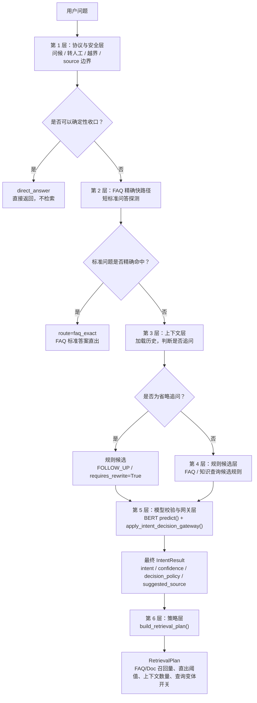
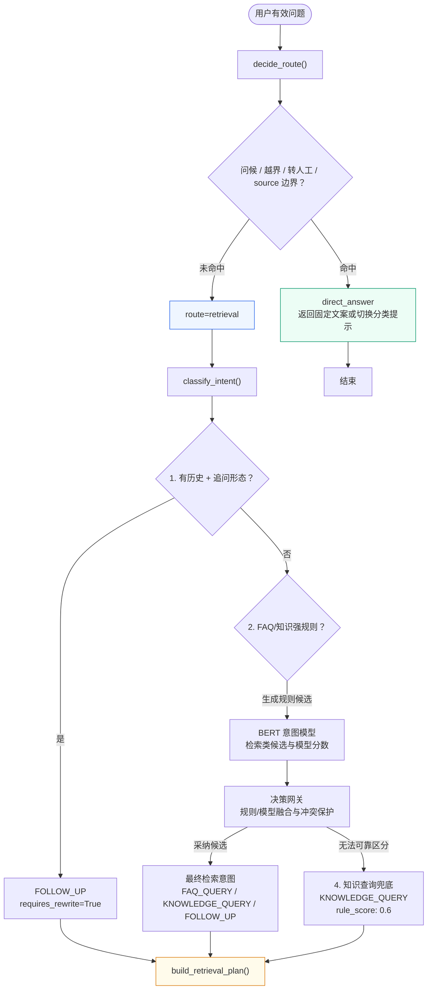
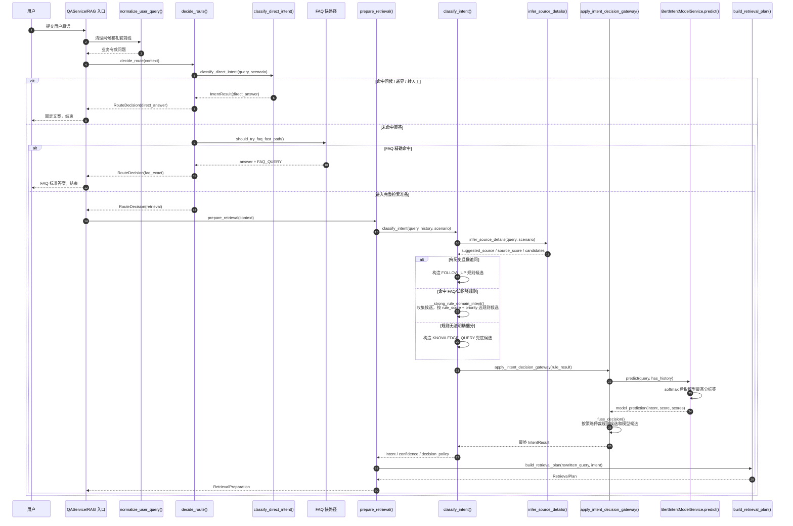
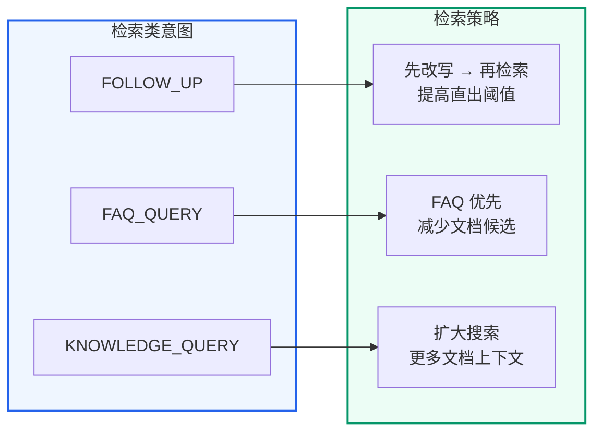
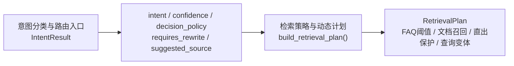

## 第一部分：NLU 中的意图识别

### 1.1 什么是意图识别

在自然语言理解（NLU）中，**意图识别（Intent Classification）** 是判断用户"想干什么"的技术。

```text
用户说："入职流程有哪些步骤"
意图：知识咨询（KNOWLEDGE_QUERY）
→ 需要检索文档 + LLM 生成答案

用户说："你好"
意图：问候（GREETING）
→ 直接返回问候语，不需要检索

用户说："你好，新人入职流程有哪些？"
意图：业务知识/FAQ 查询
→ 不能只当成问候，需要继续进入检索链路
```

### 1.2 传统做法 vs 示例实现做法

**传统 NLU 意图分类**（如 Rasa、BERT 分类器）：

- 训练一个专门的分类模型
- 需要标注训练数据
- 意图类型固定，新增意图需要重新训练

**示例实现做法（规则候选 + BERT 模型 + 决策网关）**：

- 高频确定场景用正则规则（快、稳定、零成本）
- 检索类长尾表达由本地 BERT 意图模型参与判断
- 决策网关融合规则候选与模型候选，处理冲突、低分和安全边界
- 两侧都不能可靠区分时才进入 `KNOWLEDGE_QUERY`，交给后续检索和上下文质量判断
- 模型训练、评测、报告和在线版本状态都进入治理闭环

### 1.3 规则、BERT 模型与 LLM 意图识别的边界

意图识别可以拆成三类能力：规则候选、本地分类模型和大语言模型结构化分类。三者都能工作，但适合的位置不同。

| 对比项 | 规则意图识别 | BERT 分类模型 | 大语言模型意图识别 | | --- | --- | --- | | 典型实现 | 正则、关键词、场景配置、历史长度判断 | BERT/Transformer 分类头 + 本地权重 | Prompt + JSON 输出，或函数调用/结构化输出 | | 稳定性 | 高，相同输入稳定得到相同结果 | 高，同一权重和输入结果可复现 | 中等，受模型版本、Prompt、温度和上下文影响 | | 成本与延迟 | 低，基本只有本地 CPU 字符串匹配成本 | 本地推理成本，通常低于远程 LLM | 高，每次分类都要调用模型 | | 可解释性 | 强，`reason` 能直接说明命中哪条规则 | 中等，可记录分数、候选分布和模型版本 | 中等，需要看 Prompt、模型输出和解释文本 | | 测试方式 | 单测容易覆盖，输入输出固定 | 使用标注评测集、混淆矩阵和版本报告 | 通常需要 mock、评测集和线上抽样 | | 适合场景 | 问候、越界、转人工、确定性高频规则 | 检索类长尾表达和规则边界纠偏 | 开放域、多标签和复杂推理等可选扩展 | | 主要风险 | 规则覆盖不足时可能过于保守 | 训练数据不足或分布漂移时准确率下降 | 分类结果不稳定，入口决策难复现，排障成本更高 |

示例实现把意图识别放在 RAG 主链路入口，所以更看重**稳定、可解释、可测试、低成本**。入口层一旦把问题分错，后面的检索计划、FAQ 直出阈值、是否改写、是否跳过检索都会被影响。因此意图分类与路由入口采用下面这条入口决策路径：

```text
规则先生成检索类候选
  -> BERT 模型生成候选意图与模型分数
  -> 决策网关融合、纠偏或保护规则结果

仍不能可靠细分
  -> KNOWLEDGE_QUERY 保守兜底
  -> 检索策略与动态计划生成更保守的检索计划
  -> 多召回证据，由后续 RAG 链路判断答案质量
```

这样设计的好处是：**不确定时不在入口处强行做高风险分类，而是让网关采用可解释的规则或模型结果；仍不确定时进入更稳的证据检索路径**。LLM 会用在更适合它的位置，例如查询改写与变体生成的追问改写、查询变体生成，以及RAG Pipeline 主流程深度解析之后的最终答案生成。

#### 面试答辩：如何回应“规则方案不够灵活、准确率不够高”

如果面试官质疑规则意图识别的灵活性和准确率，可以这样回答：

> 示例实现不是纯规则意图识别，而是采用“规则候选 + BERT 意图模型校验 + 决策网关仲裁”的方案。规则层负责高确定性、低风险、可解释的入口判断，例如问候、越界、转人工会在路由层直接收口；进入检索分支后，规则先生成 `FAQ_QUERY`、`KNOWLEDGE_QUERY`、`FOLLOW_UP` 等候选意图，并附带 `rule_score`、`reason`、`requires_rewrite`、`suggested_source` 等诊断字段。
>
> 随后本地 BERT 意图模型会对检索类问题做校验，输出模型候选意图、`model_score` 和候选分布。系统最终不是简单相信规则或模型，而是由 `apply_intent_decision_gateway()` 统一仲裁：规则和模型一致时提高最终置信度；规则是 `default_knowledge` 兜底时允许模型纠偏；模型低置信度或无历史却判断为追问时保留规则；强规则和模型冲突时保留规则但降低 `final_score`，让后续检索更保守。
>
> 这些字段不是只写进 Trace 展示。`confidence`、`decision_policy`、`suggested_source` 和 `requires_rewrite` 会继续影响检索策略与动态计划的检索计划，例如 FAQ 是否允许直出、文档召回数量是否扩大、是否启用追问改写、是否添加 source 过滤，以及最终选择哪套 Prompt Profile。
>
> 因此我们的设计重点不是“规则替代模型”，而是让规则提供稳定边界，让 BERT 覆盖检索类长尾表达，再通过网关把不确定性传递给检索策略。评测也不只看意图标签是否正确，还会验证 `decision_policy`、`confidence`、`RetrievalPlan`、Prompt Profile 等下游行为是否符合预期。
>
> LLM 不承担入口层的主意图分类，是因为远程大模型分类在成本、延迟、复现和排障上都不如本地规则与 BERT 网关稳定。LLM 更适合放在追问改写、查询变体和答案生成这些更需要语义推理的位置。

一句话总结：

> **规则负责稳定入口和候选生成，BERT 意图模型负责校验与弱规则纠偏，决策网关负责最终仲裁，下游检索策略消费最终置信度。**

### 1.4 意图识别在 RAG 中的特殊角色

在 RAG 系统中，意图识别**不只是贴标签**。它直接影响后续所有决策：

```text
意图识别结果
├─ 是否直接返回答案（跳过检索和生成）
├─ 是否需要结合历史改写追问
├─ FAQ 和文档各召回多少条
├─ FAQ 直出阈值应该高还是低
├─ 是否能自动推断业务分类过滤项
└─ 使用哪套 Prompt Profile 生成答案
```

### 1.5 意图识别与检索策略漏斗

示例实现的入口判断可以抽象成一个漏斗模型。漏斗的含义是：越靠前的层越确定、越便宜、越应该提前收口；越往后的层越不确定，需要保留更多证据，交给检索计划和 RAG 生成链路继续处理。



这六层不是六个互相孤立的功能，而是一条完整决策链：

| 漏斗层 | 代码入口 | 解决的问题 | 输出 |
| --- | --- | --- | --- |
| 协议与安全层 | `decide_route()` / `classify_direct_intent()` | 能不能直接回答或拒答？ | `route="direct_answer"` 或继续 |
| FAQ 精确快路径 | `should_try_faq_fast_path()` / `try_fast_faq_direct_answer()` | 是否为标准 FAQ 精确命中？ | `route="faq_exact"` 或继续 |
| 上下文层 | `classify_intent(history=...)` | 当前问题是否依赖历史？ | `FOLLOW_UP` 规则候选 / `requires_rewrite` |
| 规则候选层 | `_strong_rule_domain_intent()` | 更像 FAQ 还是知识查询？ | `FAQ_QUERY` / `KNOWLEDGE_QUERY` 规则候选 |
| 模型校验与网关层 | `BertIntentModelService.predict()` / `apply_intent_decision_gateway()` | 模型是否支持、纠偏或反对规则候选？ | 最终 `IntentResult` / `confidence` / `decision_policy` |
| 策略层 | `build_retrieval_plan()` | 检索应该多保守、多充分？ | `RetrievalPlan` |

漏斗模型的核心不是“尽快给出一个标签”，而是“按确定性逐层过滤风险”。确定的问题提前结束；检索类问题先形成规则候选，再由 BERT 模型校验，最后由网关把 `confidence`、`decision_policy` 和风险标签传给检索策略与动态计划，让检索计划根据不确定性变得更保守。

### 1.6 如果系统必须交付意图识别模型

成熟企业架构中通常会有意图识别模型，但模型不是唯一决策者，而是意图决策系统中的一层。V1 当前实现采用“规则候选 + BERT 微调意图模型 + 网关仲裁”：规则负责确定性、可解释和安全边界，模型负责长尾表达和默认兜底纠偏，网关负责最终采用哪一个结果。

```text
规则与模型一致
  -> 提高 final_score，说明这次判断更稳定

规则低置信 / 长尾表达
  -> 允许模型纠偏，例如 default_knowledge 被模型改成 FAQ_QUERY

规则与模型冲突
  -> 保守保留规则意图，降低 final_score，让检索计划多召回证据
```

示例实现使用本地 `bert-base-chinese` 微调得到 `bert_intent_classifier_v1`，在线链路通过 `BertIntentModelService` 加载模型并输出检索类意图预测。它不是大模型 SFT，而是监督式文本分类模型，适合放在 RAG 入口层承担低延迟、可评测、可版本化的意图判断。

| 环节 | 交付内容 | 说明 |
| --- | --- | --- |
| 训练数据 | `eval_sets/intent/train.jsonl` | 外部 JSONL 资产，包含 `query`、`label`、`has_history` |
| 模型训练 | `scripts/intent/train_intent_bert.py` | 基于本地 BERT 训练三分类意图模型 |
| 评测 | `evaluate()` | 输出 accuracy 和 confusion matrix |
| 预测 | `predict()` | 输出 intent、score、候选分数和 model_version |
| 主链路接入 | `apply_intent_decision_gateway()` | 在线调用模型，和规则候选一起仲裁 |
| 治理报告 | `qa_core/intent/governance.py` | 固化模型文件、标签、评测指标、策略版本和后台状态 |
| 企业边界 | 直答/安全不进模型 | GREETING、OUT_OF_SCOPE、HUMAN_SERVICE 仍由规则确定性收口 |

可运行命令：

```bash
python scripts\intent\train_intent_bert.py --train-data eval_sets/intent/train.jsonl --eval-data eval_sets/intent/eval.jsonl --epochs 10
python scripts\intent\demo_intent_model.py --eval-only --output latest
python scripts\intent\demo_intent_model.py "新人入职流程有哪些"
python scripts\intent\demo_intent_model.py "那要谁审批" --has-history
```

这里的 BERT 意图模型只覆盖检索类意图：

```text
FAQ_QUERY
KNOWLEDGE_QUERY
FOLLOW_UP
```

它不负责 `GREETING / OUT_OF_SCOPE / HUMAN_SERVICE`，因为这些属于协议、安全和确定性直答层，更适合用规则处理。模型只参与 `route="retrieval"` 后的检索类意图，这样既能体现企业级模型接入，又不会让安全边界依赖概率模型。

企业级落地时，最终输出不是一个裸 `intent`，而是结构化 `IntentResult`：

```text
intent            最终采用的检索类意图
rule_score        规则层分数，继续驱动检索策略与动态计划检索计划
final_score       网关仲裁后的最终分数，驱动后续检索保守程度
decision_policy   rule_model_agreed / model_assisted_default / rule_model_conflict_guarded / model_low_confidence_rule_kept / deterministic_route
risk_tags         风险和业务标签，如 domain/source/risk/pricing
candidate_intents 规则候选 + 模型候选，供 Trace 回放
model_score       模型最终候选分数
model_version     模型版本，如 bert-intent-v1
policy_version    网关策略版本，便于后续升级对比
```

核心代码位置：

```text
qa_core/intent/classifier.py        # 规则意图识别，输出基础 IntentResult
qa_core/intent/model_classifier.py  # BERT 意图模型服务：加载、评测、预测，主链路由网关调用
qa_core/intent/decision.py          # 企业级意图决策网关：规则候选 + 模型候选 + 风险标签 + 策略版本
qa_core/intent/governance.py        # 意图模型治理报告：模型文件、评测、策略和后台状态
config/rules.toml                   # 查询变体、规则分数和检索策略保护线
scripts/intent/evaluate_intent_policy.py   # 意图策略校准评测：验证分数是否驱动正确检索策略
eval_sets/intent_policy_cases.jsonl # 校准样本：覆盖 direct、FAQ、知识、追问、低分兜底、风险保护
```

训练样本和模型评测样本不写在 Python 源码中，而是作为可审查、可版本化的 JSONL 数据资产：

```text
eval_sets/intent/train.jsonl  # BERT 微调训练集
eval_sets/intent/eval.jsonl   # 独立评测集，不与训练集重复
```

每行必须包含 `query`、`label` 和布尔型 `has_history`。加载器会拒绝空问题、未知标签、重复样本和非法字段；训练脚本还会阻断训练集与评测集的问题重叠，避免数据泄漏。需要新增业务表达时，修改 JSONL 后重新训练并重新执行评测，不需要修改模型服务代码。

### 1.7 BERT 意图模型源码级实现

意图模型的核心源码在 `qa_core/intent/model_classifier.py`。这个文件不负责业务路由，也不直接修改检索计划；它只做一件事：把一个检索类问题预测成 `FAQ_QUERY / KNOWLEDGE_QUERY / FOLLOW_UP` 之一，并把分数、候选分布和模型版本交给意图决策网关。

#### 1.7.1 三个数据结构

```python
@dataclass(frozen=True)
class IntentTrainingExample:
    query: str
    label: str
    has_history: bool = False


@dataclass(frozen=True)
class IntentModelPrediction:
    intent: str
    score: float
    scores: dict[str, float]
    reason: str
    model_version: str


@dataclass(frozen=True)
class IntentModelEvaluation:
    accuracy: float
    total: int
    correct: int
    confusion_matrix: dict[str, dict[str, int]]
```

这三个结构分别对应训练、在线预测和离线评测：

| 结构 | 用途 | 为什么需要 |
| --- | --- | --- |
| `IntentTrainingExample` | 训练和评测样本 | 除了 `query/label`，还记录 `has_history`，让模型区分普通问题和追问问题 |
| `IntentModelPrediction` | 在线预测结果 | 不只返回最终标签，还返回 `score/scores/model_version`，便于 Trace 和治理页复盘 |
| `IntentModelEvaluation` | 模型评测结果 | 输出 accuracy 和 confusion matrix，判断模型是否真的可用 |

这里不要只返回一个字符串标签。企业级系统需要知道“模型为什么这么判、分数是多少、版本是什么、有没有和规则冲突”。这些字段后面会进入 `IntentResult.as_dict()`，最终出现在诊断信息和治理报告里。

#### 1.7.2 模型输入为什么要带历史标记

```python
def format_intent_model_input(query: str, *, has_history: bool) -> str:
    history_marker = "有历史对话" if has_history else "无历史对话"
    return f"{history_marker}。用户问题：{query.strip()}"
```

`FOLLOW_UP` 不是单纯靠关键词判断的。例如：

```text
这个需要多久
```

如果没有历史，它可能是一个表达不完整的问题；如果有历史，它更可能是追问。因此训练和推理必须使用同一种输入格式，把“是否有历史”显式告诉模型。否则模型只能从文本本身猜测，追问类意图会更不稳定。

#### 1.7.3 `BertIntentModelService.__init__()` 做了什么

```python
class BertIntentModelService:
    def __init__(self, model_path, *, device="cpu", max_length=64, model_version=None):
        self.model_path = Path(model_path)
        self.max_length = max_length
        self.device = _resolve_device(device)
        _require_model_artifact(self.model_path)
        self.labels = _load_label_sequence(self.model_path)
        self.label2id = {label: index for index, label in enumerate(self.labels)}
        self.model_version = model_version or _read_model_version(self.model_path)

        self.tokenizer = AutoTokenizer.from_pretrained(str(self.model_path), local_files_only=True)
        self.model = AutoModelForSequenceClassification.from_pretrained(
            str(self.model_path),
            local_files_only=True,
        )
        if int(self.model.config.num_labels) != len(self.labels):
            raise RuntimeError(...)
        self.model.to(self.device)
        self.model.eval()
```

这段初始化有四个关键点：

1. `model_path` 来自运行时配置 `INTENT_MODEL_PATH`，Docker 环境一般是 `/app/models/bert_intent_classifier_v1`。
2. `_require_model_artifact()` 会检查模型目录、`config.json`、`intent_labels.json` 和权重文件是否存在。
3. `local_files_only=True` 表示只加载本地模型，不在服务启动时访问外网，适合企业内网部署。
4. `self.model.eval()` 把模型切到推理模式，禁用 dropout 等训练行为，保证线上预测稳定。

其中标签顺序必须固定：

```text
RETRIEVAL_INTENTS = ("FAQ_QUERY", "KNOWLEDGE_QUERY", "FOLLOW_UP")
```

原因是分类模型输出的是 logits 数组，例如 `[0.1, 2.3, 0.4]`。数组第 0、1、2 位到底对应哪个意图，必须由 `intent_labels.json` 固化。如果标签顺序错了，模型分数本身可能没问题，但解释出来的意图会整体错位。

#### 1.7.4 `predict()` 的完整推理流程

```python
def predict(self, query: str, *, has_history: bool = False) -> IntentModelPrediction:
    text = format_intent_model_input(query, has_history=has_history)
    encoded = self.tokenizer(
        text,
        return_tensors="pt",
        truncation=True,
        max_length=self.max_length,
    )
    encoded = {key: value.to(self.device) for key, value in encoded.items()}
    with torch.no_grad():
        logits = self.model(**encoded).logits[0]
        probabilities = torch.softmax(logits, dim=-1).detach().cpu().tolist()
    scores = {label: float(probabilities[index]) for index, label in enumerate(self.labels)}
    intent = max(scores, key=scores.get)
    return IntentModelPrediction(
        intent=intent,
        score=scores[intent],
        scores=scores,
        reason="bert_intent_model",
        model_version=self.model_version,
    )
```

逐步看：

| 步骤 | 代码 | 作用 |
| --- | --- | --- |
| 1 | `format_intent_model_input()` | 把历史标记和用户问题拼成稳定输入 |
| 2 | `tokenizer(...)` | 把中文文本转成 BERT 可读的 `input_ids/attention_mask` |
| 3 | `value.to(self.device)` | 把输入放到 CPU 或 GPU |
| 4 | `torch.no_grad()` | 推理阶段不计算梯度，降低内存和耗时 |
| 5 | `torch.softmax(logits)` | 把模型原始输出转成 0-1 分数分布 |
| 6 | `max(scores, key=scores.get)` | 取分数最高的标签作为模型候选意图 |

一个典型输出类似：

```json
{
  "intent": "FAQ_QUERY",
  "score": 0.91,
  "scores": {
    "FAQ_QUERY": 0.91,
    "KNOWLEDGE_QUERY": 0.06,
    "FOLLOW_UP": 0.03
  },
  "reason": "bert_intent_model",
  "model_version": "bert-intent-v1"
}
```

注意：这个 `score` 是模型分类分数，不等同于 Milvus 相似度分数，也不等同于最终答案置信度。它只表示“模型认为这个问题属于某个检索意图的强弱”。

#### 1.7.5 `evaluate()` 如何形成模型评测

```python
def evaluate(self, examples: Iterable[IntentTrainingExample]) -> IntentModelEvaluation:
    total = 0
    correct = 0
    matrix = {
        label: {predicted: 0 for predicted in RETRIEVAL_INTENTS}
        for label in RETRIEVAL_INTENTS
    }
    for example in examples:
        prediction = self.predict(example.query, has_history=example.has_history)
        total += 1
        if prediction.intent == example.label:
            correct += 1
        matrix[example.label][prediction.intent] += 1
    accuracy = correct / total if total else 0.0
    return IntentModelEvaluation(...)
```

评测不是只看一条预测是否正确，而是对固定样本集批量预测，输出：

- `accuracy`：总体准确率。
- `correct/total`：正确数和总数。
- `confusion_matrix`：哪些标签容易互相混淆。

例如如果 `FOLLOW_UP` 经常被预测成 `FAQ_QUERY`，混淆矩阵会直接暴露出来。后续应该补追问样本或调整训练数据，而不是只修改线上规则分数。

#### 1.7.6 为什么还需要 `decision.py`

模型服务只产生“模型候选”，最终线上不能直接采用模型输出。主链路使用 `qa_core/intent/decision.py` 做仲裁：

```python
def apply_intent_decision_gateway(query, history, scenario, rule_result):
    if rule_result.intent not in RETRIEVAL_INTENTS:
        return _with_decision_fields(..., decision_policy="deterministic_route")

    model_prediction = _default_model().predict(query, has_history=bool(history))
    final_intent, final_score, decision_policy = _fuse_decision(
        rule_result,
        model_prediction,
        has_history=bool(history),
    )
    return _with_decision_fields(...)
```

这段代码体现了企业级意图识别的边界：

| 情况 | 处理方式 | 原因 |
| --- | --- | --- |
| `GREETING / OUT_OF_SCOPE / HUMAN_SERVICE` | 不进模型，直接按规则收口 | 安全、边界和人工服务不应该依赖概率模型 |
| 检索类意图 | 调用 BERT 模型 | 让模型参与 FAQ/知识/追问的长尾表达判断 |
| 规则与模型一致 | 提高最终分数 | 两路信号一致，判断更稳定 |
| 规则默认兜底，模型高分 | 允许模型纠偏 | 解决规则覆盖不到的表达 |
| 规则与模型冲突 | 保守保留规则，降低最终分数 | 避免模型误判直接改变高风险链路 |
| 模型把无历史问题判成追问 | 保留规则结果 | `FOLLOW_UP` 必须依赖历史上下文 |

核心仲裁逻辑在 `_fuse_decision()`：

```text
if model_prediction.intent == "FOLLOW_UP" and not has_history:
    return rule_result.intent, rule_result.rule_score, "model_follow_up_without_history_guarded"

if model_prediction.score < POLICY.model_min_score:
    return rule_result.intent, rule_result.rule_score, "model_low_confidence_rule_kept"

if model_prediction.intent == rule_result.intent:
    final_score = min(1.0, max(rule_result.rule_score, model_prediction.score) + POLICY.agreement_score_boost)
    return rule_result.intent, final_score, "rule_model_agreed"

if rule_result.reason == "default_knowledge":
    return model_prediction.intent, model_prediction.score, "model_assisted_default"

return rule_result.intent, min(rule_result.rule_score, POLICY.conflict_final_score), "rule_model_conflict_guarded"
```

这不是简单的“模型分高就听模型”。网关先保护上下文、安全和规则强约束，再允许模型在低置信默认兜底场景中发挥作用。最终写回 `IntentResult` 的字段包括：

```text
intent              最终采用的意图
final_score         网关仲裁后的最终分数
decision_policy     本次采用哪条仲裁策略
risk_tags           业务域、source、风险类别、低置信等标签
candidate_intents   规则候选 + 模型候选完整列表
model_score         模型最高分
model_version       模型版本
policy_version      网关策略版本
```

这些字段继续进入检索策略与动态计划的检索计划、RAG Pipeline 主流程深度解析的 Pipeline 诊断事件和 `/admin` 治理页。这样意图模型才不是孤立 demo，而是完整接入在线问答闭环。

#### 1.7.7 启动预热为什么必要

`decision.py` 中的模型是单例缓存：

```python
@lru_cache(maxsize=1)
def _default_model() -> BertIntentModelService:
    return BertIntentModelService.from_settings()
```

第一次加载 BERT 模型会读取 tokenizer、config 和权重文件。如果等到第一个用户提问时才加载，首个请求会明显变慢。因此应用入口与环境前置校验启动前置校验会调用：

```text
warmup_intent_decision_gateway()
```

预热动作会加载模型并执行一次样例预测：

```text
prediction = model.predict("新人入职流程有哪些", has_history=False)
```

这能提前发现模型目录、标签文件、权重文件、设备参数等问题，也能避免首个在线请求承担冷启动成本。

#### 1.7.8 本节源码调用链

完整调用链如下：

```text
用户问题
  -> qa_core/pipeline/steps.py
  -> classify_intent()
  -> 规则候选 IntentResult
  -> apply_intent_decision_gateway()
  -> BertIntentModelService.predict()
  -> _fuse_decision()
  -> 带 final_score/model_score/decision_policy 的 IntentResult
  -> build_retrieval_plan()
  -> FAQ/Doc 检索计划
```

一句话总结：**`model_classifier.py` 负责让模型会判断，`decision.py` 负责决定线上能不能采用这个判断。**

### 1.8 规则分数怎样形成闭环评测

`rule_score` 和 `confidence` 不是只写进 Trace 的展示字段。它们会继续影响检索策略与动态计划的 `RetrievalPlan`，所以评测不能只看“意图标签是否正确”，还要检查“这个分数有没有让系统采取正确的保守策略”。

示例实现把意图相关评测分成两层：

| 评测层 | 命令 | 关注点 |
| --- | --- | --- |
| 模型评测 | `python scripts\intent\demo_intent_model.py --eval-only --output latest` | BERT 三分类模型的 accuracy、confusion matrix 和 `reports/intent_model/intent_model_latest.json` |
| 策略校准评测 | `python scripts\intent\evaluate_intent_policy.py --fail-on-critical` | `rule_score/confidence` 是否驱动正确 route、source、rewrite、RetrievalPlan 和 Prompt Profile |

策略校准评测使用 `eval_sets/intent_policy_cases.jsonl`。每条样本不是只写 expected intent，而是同时写下游期望：

```json
{
  "case_id": "default_low_score_guard",
  "question": "帮我分析一下这个问题",
  "expected_intent": "KNOWLEDGE_QUERY",
  "expected_confidence_max": 0.7,
  "expected_plan_contains": {
    "faq_direct_exact_only": true,
    "faq_direct_threshold": 0.86
  }
}
```

这条样本的业务含义是：默认兜底问题可以进入知识查询，但不能让相似 FAQ 模糊直出。评测脚本会实际调用 `classify_intent()`、`apply_intent_decision_gateway()` 和 `build_retrieval_plan()`，检查结果是否满足期望。

生成报告：

```bash
python scripts\intent\evaluate_intent_policy.py --output reports\intent_policy\intent_policy_latest.json --fail-on-critical
```

意图模型报告生成后，`/admin` 的“意图识别模型”面板会展示：

- 模型版本、标签顺序、模型路径和训练/评测样本数
- 固定验证集 accuracy 和 confusion matrix
- 决策网关策略版本、冲突保护分和模型最低采用分
- 训练脚本、模型评测脚本和策略校准脚本

这样模型不是“接进主链路就结束”，而是形成：

```text
训练样本 -> 训练脚本 -> 模型产物 -> 固定评测 -> 治理报告 -> admin 状态 -> 主链路 Trace
```

报告会输出：

```text
route_accuracy
intent_accuracy
source_accuracy
rewrite_accuracy
policy_accuracy
rule_score_accuracy
question_category_accuracy
prompt_profile_accuracy
confidence_bands
threshold_snapshot
critical_failures
```

看这份报告时，不要只看 `ok=true` 或 `intent_accuracy=1.0`。意图识别闭环真正要回答的是：**如果失败，应该改规则、改模型、改网关，还是改 source 推断**。

| 报告现象 | 优先判断 | 主要改动位置 |
| --- | --- | --- |
| `route_accuracy` 下降 | 问候、越界、转人工、source boundary 是否提前收口错误 | `classify_direct_intent()`、路由规则、边界规则 |
| `intent_accuracy` 下降 | FAQ / KNOWLEDGE / FOLLOW_UP 是否互相误判 | FAQ 规则、知识查询规则、追问规则、意图模型训练样本 |
| `policy_accuracy` 下降 | 规则候选和 BERT 候选的仲裁是否符合预期 | `apply_intent_decision_gateway()`、`model_min_score`、冲突保护策略 |
| `source_accuracy` 下降 | source 自动推断是否错把问题过滤到错误资料域 | source patterns、场景 source 白名单、前端 source 优先级 |
| `rewrite_accuracy` 下降 | 追问是否该改写、是否错误触发改写 | FOLLOW_UP 规则、历史上下文判断、`requires_rewrite` |
| `question_category_accuracy` 下降 | 费用、合规、排障、总结等风险类别是否识别错误 | `infer_question_category()`、风险关键词和类别规则 |
| `prompt_profile_accuracy` 下降 | 意图和类别是否把问题送进了错误回答模板 | Prompt Profile 选择规则，必要时回查 intent/category |
| `critical_failure_count > 0` | 关键样本失败，不能继续讨论参数优化 | 先修失败样本，再进入阈值或检索策略调参 |

如果要看完整跨章闭环和一条可落地的排障案例，直接去RAG 回归验收与入库质量；本文只保留意图识别层该怎么看。

这张表的核心是排查顺序：先确认 route、intent、source 和网关策略正确，再讨论检索策略与动态计划的 `top_k`、FAQ 直出阈值和上下文数量。如果 FAQ 问题被判成 KNOWLEDGE，或者 source 推断错了，直接调检索阈值通常会掩盖真正问题。

这就是分数闭环：先用业务样本定义正确行为，再让脚本验证当前 `config/rules.toml` 和网关策略能否产生这些行为。以后调整 0.82、0.84、0.86、0.70、0.82 这些值时，不应该只看代码能否运行，而要重新跑这份策略校准报告。

---

## 第二部分：路由意图与检索意图

当前主链路把入口分成两层，而不是让一个函数包办所有判断：

- `decide_route()` / `classify_direct_intent()`：处理确定性直答和边界拦截。
- `classify_intent()`：只在 `route="retrieval"` 后运行，负责检索类意图。

```text
Intent = Literal[
    "GREETING",        # 路由层：纯问候 → 直接返回
    "HUMAN_SERVICE",   # 路由层：人工客服 → 直接返回联系方式
    "OUT_OF_SCOPE",    # 路由层：越界 → 直接拒答
    "FOLLOW_UP",       # 检索层：追问 → 先改写再检索
    "FAQ_QUERY",       # 检索层：标准问答 → FAQ 优先
    "KNOWLEDGE_QUERY", # 检索层：知识咨询 → 文档证据更充分
]
```

| 所属层 | 意图 | 触发场景举例 | 后续行为 |
| --- | --- | --- | --- |
| 路由层 | GREETING | "你好"、"在吗"、"你是谁" | 直接返回问候语，不检索 |
| 路由层 | HUMAN_SERVICE | "客服电话"、"转人工" | 直接返回联系方式 |
| 路由层 | OUT_OF_SCOPE | "怎么买彩票" | 直接拒答 |
| 检索层 | FOLLOW_UP | "那审批呢"、"费用呢" | 先改写再检索，提高直出阈值 |
| 检索层 | FAQ_QUERY | "API 限流怎么办" | FAQ 优先，必要时再用文档补充 |
| 检索层 | KNOWLEDGE_QUERY | "入职流程有哪些步骤" | FAQ+文档都查，更多文档上下文 |

这样分层后，代码主线更清楚：直答问题在路由层已经结束；进入 `classify_intent()` 的问题默认就是需要检索的问题。

---

## 第三部分：入口判断顺序（核心设计）

进入规则前，系统会先得到一个“业务有效问题”：用户原话保留给历史、Trace 和诊断，去掉礼貌开场后的问题用于入口判断和检索。例如：

| 用户原话 | 业务有效问题 | | --- | --- | --- | --- | | `你好` | `你好` | | `你好，请问新人入职流程有哪些？` | `新人入职流程有哪些？` | | `您好，VPN 连不上怎么处理？` | `VPN 连不上怎么处理？` | | `麻烦帮我看下账号权限怎么申请` | `账号权限怎么申请` |

这一步只处理常见问候和礼貌前缀，不会删除“转人工”“彩票”“合同风险”等业务或安全关键词。纯问候剥离后没有业务内容，因此保留原文，继续由 GREETING 规则直答。

```python
def normalize_user_query(query: str) -> str:
    raw_query = (query or "").strip()
    if not raw_query:
        return ""

    normalized = re.sub(r"\s+", " ", raw_query).strip()
    for _ in range(4):
        next_query = GREETING_PREFIX.sub("", normalized, count=1)
        next_query = POLITE_PREFIX.sub("", next_query, count=1)
        next_query = next_query.lstrip(LEADING_SEPARATORS).strip()
        if next_query == normalized:
            break
        normalized = next_query

    return normalized or raw_query
```

入口判断分两段：



这张图的关键是职责边界：`classify_intent()` 不再重复处理 GREETING / OUT_OF_SCOPE / HUMAN_SERVICE。它只服务检索分支，输出 FOLLOW_UP / FAQ_QUERY / KNOWLEDGE_QUERY。

### 代码执行时序图

下图展示一次普通问答请求从入口进入，到最终产出 `IntentResult` 和 `RetrievalPlan` 的代码执行顺序。




这张时序图里有三个容易混淆的决策点：

1. `decide_route()` 是顺序短路：直答命中就结束，FAQ 精确命中也结束，只有都不命中才进入 `prepare_retrieval()`。
2. `_strong_rule_domain_intent()` 是规则候选内部排序：同一个问题可能同时命中 FAQ 和知识规则，所以先收集候选，再按 `rule_score + priority` 选出规则候选。
3. `BertIntentModelService.predict()` 内部是模型分数最高者胜出，但系统最终不是模型分最高就采纳，而是交给 `apply_intent_decision_gateway()` 按历史保护、低置信保护、规则模型一致、默认兜底纠偏、强规则冲突保护的顺序仲裁。

### 意图到检索策略的映射



直答类问题不映射检索策略，因为它们不会生成 `RetrievalPlan`。`build_retrieval_plan()` 接收的就是检索类 `IntentResult`，输出 faq_top_k、doc_top_k、threshold、use_rerank 等参数。

### 完整源码解读

`classify_direct_intent()` 负责路由层直答：

```python
def classify_direct_intent(query, scenario):
    if GREETING_PATTERNS.match(query):
        return IntentResult("GREETING", direct_answer=greeting_text, rule_score=1.0)

    if OFF_TOPIC_HINTS.search(query):
        return IntentResult("OUT_OF_SCOPE", direct_answer=refuse_text, rule_score=0.95)

    if HUMAN_SERVICE_HINTS.search(query) and len(query) <= 18:
        return IntentResult("HUMAN_SERVICE", direct_answer=support_text, rule_score=0.9)

    return None
```

`classify_intent()` 只负责检索分支：

```python
def classify_intent(query, history, scenario):
    source_details = infer_source_details(query, scenario)

    if history and (FOLLOW_UP_HINTS.search(query.strip()) or len(query.strip()) <= 8):
        rule_result = IntentResult(
            intent="FOLLOW_UP",
            rule_score=0.8,
            reason="follow_up_rule",
            requires_rewrite=True,
            **source_details.intent_kwargs(),
        )
        return apply_intent_decision_gateway(query, history, scenario, rule_result)

    strong_rule_intent = _strong_rule_domain_intent(query, source_details)
    if strong_rule_intent is not None:
        return apply_intent_decision_gateway(query, history, scenario, strong_rule_intent)

    rule_result = IntentResult(
        intent="KNOWLEDGE_QUERY",
        rule_score=0.6,
        reason="default_knowledge",
        **source_details.intent_kwargs(),
    )
    return apply_intent_decision_gateway(query, history, scenario, rule_result)
```

追问的两个触发条件：

1. 代词或追问词开头：`那|这个|那个|它|上面|刚才|还有|审批呢|费用呢`。
2. 问题很短（≤8 字符）：极短的问题在有历史上下文时更可能是追问。

`requires_rewrite=True` 意味着后续流程会先结合历史改写问题，再进入检索。

强规则的核心价值是给高频业务问题提供稳定候选。规则命中时会给出明确的 `intent`、`reason` 和 `rule_score`；没有命中时，规则层生成知识查询兜底候选，随后仍由 BERT 模型和决策网关确认或纠偏。

这层设计带来四个直接收益：

- 标准 FAQ 问题优先进入 `FAQ_QUERY`，更容易复用标准答案，减少不必要的文档召回和生成成本。
- 明确的流程、制度、文档类问题进入 `KNOWLEDGE_QUERY`，扩大文档证据召回，更适合综合回答。
- 模糊问题进入 `default_knowledge`，由检索策略与动态计划的低分保护策略提高 FAQ 直出门槛、扩大文档召回。
- `reason` 保留具体规则标签，Trace 和诊断面板能看清楚系统为什么走这条路径。

```python
def _strong_rule_domain_intent(
    query: str, source_details: _SourceInference
) -> IntentResult | None:
    normalized = query.strip().lower()
    candidates: list[_IntentCandidate] = []
    suggested_source = source_details.source

    # 规则 1：FAQ 关键词 → FAQ_QUERY，覆盖面广，分数相对保守
    if FAQ_HINTS.search(normalized):
        candidates.append(_IntentCandidate(
            result=IntentResult(
                intent="FAQ_QUERY",
                rule_score=0.82,
                reason="strong_faq_rule",
                **source_details.intent_kwargs(),
            ),
            priority=10,
        ))

    # 规则 2：source 已推断 + 短问题 + 标准问法 → FAQ_QUERY
    if (suggested_source and len(normalized) <= 32
        and FAQ_QUESTION_SHAPE_HINTS.search(normalized)):
        candidates.append(_IntentCandidate(
            result=IntentResult(
                intent="FAQ_QUERY",
                rule_score=0.85,
                reason="source_question_shape_rule",
                **source_details.intent_kwargs(),
            ),
            priority=30,
        ))

    # 规则 3：source 已推断 + 口语化短问法 → FAQ_QUERY
    if (suggested_source and len(normalized) <= 36
        and DIRECT_FAQ_SHAPE_HINTS.search(normalized)):
        candidates.append(_IntentCandidate(
            result=IntentResult(
                intent="FAQ_QUERY",
                rule_score=0.86,
                reason="direct_faq_shape_rule",
                **source_details.intent_kwargs(),
            ),
            priority=40,
        ))

    # 知识类强规则：知识库关键词 + 有 source 或短问题 → KNOWLEDGE_QUERY
    if (KNOWLEDGE_HINTS.search(normalized)
        and (suggested_source or len(normalized) <= 24)):
        candidates.append(_IntentCandidate(
            result=IntentResult(
                intent="KNOWLEDGE_QUERY",
                rule_score=0.84,
                reason="strong_knowledge_rule",
                **source_details.intent_kwargs(),
            ),
            priority=20,
        ))

    # 四类规则不要求互斥；同一个问题可能同时命中 FAQ 问法和知识类关键词。
    # 最终选择 rule_score 最高的候选；同分时用 priority 保持稳定的业务优先级。
    if not candidates:
        return None
    return max(candidates, key=lambda candidate: (
        candidate.result.rule_score,
        candidate.priority,
    )).result
```

这里的 4 类强规则不是互斥的。比如“新人入职流程有哪些？”既像标准问法，也包含“流程”这样的知识类关键词。系统会把命中的候选都收集起来，再用 `rule_score + priority` 做一次稳定选择：明确 FAQ 问法优先于泛知识关键词，同分时按照显式优先级保留业务排序。

### 4.2 各规则的关键词设计

**FAQ_HINTS** — 触发标准问答检索：

```text
FAQ_HINTS = re.compile(
    r"(费用|价格|安装|环境|失败|报错|地址|时间|退费|优惠|"
    r"发票|账号|登录|权限|审批|合同|隐私|账单|支付|开票|工单|售后)"
)
```

这些词通常是具体的、有标准答案的问题。例如"API 调用失败怎么办"→ 大概率 FAQ 里有标准答案。

**FAQ_QUESTION_SHAPE_HINTS** — 标准问答的问法形态：

```text
FAQ_QUESTION_SHAPE_HINTS = re.compile(
    r"(怎么办|如何处理|怎么处理|需要什么|需要哪些|"
    r"需要准备哪些|有哪些|为什么|什么时候|由谁|能不能|会不会)"
)
```

这些词表示用户在问一个具体的"How-to"类问题，这类问题通常有标准答案。

**DIRECT_FAQ_SHAPE_HINTS** — 口语化的短问答形态：

```text
DIRECT_FAQ_SHAPE_HINTS = re.compile(
    r"(资料呢|材料呢|是什么|如何回收|怎么排查|怎么处理|能不能|可以吗|要看什么)"
)
```

这些是真实业务场景中更口语化的问法，比如"那隐蔽工程验收资料呢"、"API 限流导致接口失败怎么排查"。

**KNOWLEDGE_HINTS** — 触发知识文档检索：

```text
KNOWLEDGE_HINTS = re.compile(
    r"(知识库|文档|手册|流程|制度|规范|说明|配置|接口|功能|"
    r"排查|故障|步骤|sop|告警|巡检|设备|合规|条款|入职|"
    r"审批|合同|隐私|webhook|回调|发票|账单)"
)
```

这些词表示用户需要综合性的知识解答，不一定是 FAQ 能覆盖的。

### 4.3 规则分数阶梯

注意规则分数的设计：`0.82 → 0.84 → 0.85 → 0.86`

这不是随意设置的。宽泛 FAQ 关键词最低，知识类关键词居中，带业务 source 的明确 FAQ 问法更高。这样可以避免“流程、入职、文档”等泛知识词把“需要哪些材料、怎么办、是什么”这类标准问答误分到知识查询，同时仍然给规则判断留有余地（不设为 1.0 或 0.95）。

`rule_score` 是入口规则候选分数，不是模型概率，也不是 Milvus 相似度。模型接入后，`confidence` 表示规则候选和模型候选经过 `apply_intent_decision_gateway()` 仲裁后的最终决策分。检索策略与动态计划会消费这个最终分数：低分兜底或规则/模型冲突的问题会提高 FAQ 直出门槛、扩大文档召回，必要时只允许精确 FAQ 直出。

---

## 第五部分：知识查询保守兜底

### 5.1 兜底分支的设计边界

意图识别是入口决策模块，目标是快速、稳定地把问题分到可执行链路。追问和强领域规则无法进一步细分时，规则层先生成 `KNOWLEDGE_QUERY` 候选；BERT 模型仍会参与判断，最终由决策网关确认、纠偏或保留该兜底：

- 入口阶段保持低延迟和稳定输出
- BERT 模型先参与检索类意图判断，并通过决策网关进入主链路
- LLM 能力集中服务于查询变体和最终答案生成
- 让后续检索分数、上下文构建和 Prompt 约束共同决定是否回答
- 主链路清晰：意图识别负责路由，答案可靠性由检索与生成链路闭环

### 5.2 实现代码

```text
# 规则与模型都不能可靠细分时，保守进入知识查询
return IntentResult(
    intent="KNOWLEDGE_QUERY",
    rule_score=0.6,
    reason="default_knowledge",
    suggested_source=suggested_source,
)
```

这个分支的含义不是“系统已经确定能回答”，也不是最终意图已经锁定，而是“规则层暂时无法细分”。决策网关若没有足够证据改判，才保留知识查询结果并交给检索链路继续判断。

### 5.3 下游影响

`default_knowledge` 会继续进入检索策略与动态计划的检索计划：

- `intent="KNOWLEDGE_QUERY"`：FAQ 和文档都会参与召回
- `rule_score=0.6`：表示低分兜底，检索计划会更保守
- `suggested_source`：只有 `infer_source()` 命中场景 source 时才携带

因此这个值不是只用于记录。它会被后续链路消费，用来调整 FAQ 直出门槛、文档召回数量和低分保护策略。

### 5.4 LLM 能力在后续链路中的位置

本文负责入口路由，后续模块负责模型生成能力：

- 查询改写与变体生成：查询变体生成会使用结构化输出
- RAG Pipeline 主流程深度解析：最终答案生成会使用流式输出

---

## 第六部分：Source 自动推断

### 6.1 为什么需要 Source 推断

用户在页面上提问时，不一定手动选择业务分类。系统需要自动判断"入职流程有哪些步骤"属于 HR 分类，"API 限流怎么办"属于 IT 分类。

前端也有业务分类下拉框，但很多用户不会手动选择。自动推断可以作为默认值，也可以作为前端选择的补充。

### 6.2 infer_source() 实现

```python
def infer_source(query: str, scenario: ScenarioDefinition) -> str | None:
    """只根据当前业务场景配置推断可能的业务分类过滤项。

    该结果只是建议值，不会覆盖前端显式选择。
    """
    best_source, _ = score_source_matches(query, scenario)
    return best_source
```

当前实现是多业务场景知识问答平台，`source` 会参与 Milvus 过滤表达式和数据隔离，必须来自当前场景的 `valid_sources`。新增业务分类时，只修改 `scenario.toml` 的 `valid_sources` 和 `source_patterns`，不要在 Python 主链路里堆业务硬编码。

### 6.3 Source Pattern 的评分算法

当一个问题同时命中多个业务分类时，系统不能只取第一个正则结果，而是先计算可解释的规则分数：

```text
source_score = 命中次数 × 10 + 命中文本长度总和
```

这个公式表达两层证据：

1. **命中次数是主证据**：同一个 source 命中多个业务词，通常比只偶然命中一个词更可信；乘以 10 是为了让次数在排序中占主导。
2. **匹配长度用于细分**：命中次数相同时，更长、更具体的业务词获得少量优势。

例如问题“员工入职需要哪些材料，同时如何报销”中，假设 HR 命中“员工、入职”两次、总长度 4，Finance 命中“报销”一次、长度 2：

```text
hr      = 2 × 10 + 4 = 24
finance = 1 × 10 + 2 = 12
```

`10` 是规则基线权重，不是模型训练得到的概率。生产环境需要使用标注问题集观察 source 准确率、跨场景误报率和漏报率，再联合校准该权重以及 `CURRENT_SCENARIO_SAFE_SCORE`、`MIN_OTHER_SCENARIO_SCORE`。

`valid_sources` 的顺序不进入相关性分数。只有两个 source 完全同分时，系统才按配置顺序稳定决胜，避免把业务优先级伪装成相关性证据。

```python
# qa_core/scenarios/boundary.py
def score_source_map(query: str, scenario: ScenarioDefinition) -> dict[str, int]:
    """计算问题在某个场景内命中各 source 的分数。

    分数来自场景 TOML 里的 source_patterns。命中次数越多、命中文本越长，
    分数越高；source 配置顺序只用于完全同分时的稳定排序。
    """
    normalized = query.strip()
    scores: dict[str, int] = {}
    for source, pattern in scenario.compiled_source_patterns().items():
        # pattern 已经按 re.IGNORECASE 编译，只匹配一次，避免重复计数。
        matches = list(pattern.finditer(normalized))
        if not matches:
            continue
        scores[source] = len(matches) * 10 + sum(len(match.group(0)) for match in matches)
    return scores


def score_source_matches(query: str, scenario: ScenarioDefinition) -> tuple[str | None, int]:
    """返回问题在某个场景内最像的 source 及其加权分数。"""
    matches = rank_source_matches(query, scenario)
    if not matches:
        return None, 0
    return matches[0].source, matches[0].score
```

这里不能同时对 `query` 和 `query.lower()` 各执行一次匹配，因为场景正则已经使用 `re.IGNORECASE` 编译；重复执行会把每个关键词算两次，使边界阈值失真。

该算法只适合高确定性的业务关键词路由。它不表示语义概率，也不能替代 BERT 意图模型或 Milvus 语义检索。最终 `suggested_source` 仍会绑定租户、知识库版本和权限域进入检索过滤，不能跨数据域复用。

### 6.4 跨场景边界为什么要比较双方分数

跨场景判断不能采用“当前场景只要命中一个词就立即保留”的逻辑。问题可能同时包含当前场景的弱提示词和另一个场景的多个强提示词，例如用户在企业知识场景中问“入职后需要做安全技术交底和高处作业防护吗”。“入职”只弱命中 HR，而“安全、交底、高处作业、防护”明显属于工程安全资料。

系统使用三层条件：

```text
候选场景最低分：MIN_OTHER_SCENARIO_SCORE = 12
当前场景可信分：CURRENT_SCENARIO_SAFE_SCORE = 8
候选领先幅度：OTHER_SCENARIO_SCORE_MARGIN = 4
```

决策顺序如下：

1. 分别计算当前场景和其他场景的最佳 source 分数。
2. 最佳候选低于 `12` 时不切换，避免偶然文本触发跨场景。
3. 当前场景达到可信分时，候选还必须至少领先 `4` 分。
4. 候选同时满足最低分和相对领先条件，才返回跨场景建议。

这里的非对称设计用于减少界面频繁跳场景：当前场景具有用户显式选择这一先验，因此同分或接近时保留；只有另一个场景证据明显更强时才建议切换。三个值仍是可校准的规则参数，应通过跨场景标注集统计误切换率和漏切换率，而不是把它们解释成概率。

`rank_source_matches()` 中的 `confidence = 当前 source 分数 / 最高 source 分数` 也只是候选之间的相对强弱标签。第一名恒为 `1.0`，所以它不能单独证明第一名正确，更不能当作模型置信度；Trace 应同时展示原始 `score`、候选差距和最终边界决策。

---

## 第七部分：IntentResult 与下游联动

### 7.1 IntentResult 的字段与派生属性

```python
@dataclass(frozen=True)
class IntentResult:
    intent: Intent                          # 意图枚举值
    direct_answer: str | None = None        # 直接答案（非空时跳过检索）
    rule_score: float = 0.6                 # 规则候选强弱分数，不是模型概率
    reason: str = "rule"                    # 判断原因（可解释性）
    requires_rewrite: bool = False          # 是否需要改写追问
    suggested_source: str | None = None     # 建议的业务分类
    source_score: int = 0                   # source 规则匹配原始分
    source_confidence: float = 0.0          # source 候选相对置信度
    source_candidates: tuple[dict, ...] = () # source 候选列表
    final_score: float | None = None        # 网关仲裁后的最终分
    risk_tags: tuple[str, ...] = ()         # 风险、领域、source 等标签
    decision_policy: str = "rule_candidate" # 网关采用的仲裁策略
    candidate_intents: tuple[dict, ...] = () # 规则候选 + 模型候选
    model_score: float | None = None        # BERT 模型最高候选分
    model_version: str | None = None        # BERT 模型版本
    policy_version: str = "intent-policy-v1-bert"
```

这里最容易混淆的是 `rule_score` 和 `confidence`。`rule_score` 只表示规则候选本身有多强；`confidence` 是 `final_score` 的对外属性，表示规则候选和模型候选经过决策网关仲裁后的最终分数。检索策略与动态计划真正用来触发低分保护的是 `intent.confidence`，不是裸 `rule_score`。

### 7.2 各字段的下游影响

意图分类与路由入口不会真正执行检索，它交付的是 `IntentResult`。检索策略与动态计划的 `build_retrieval_plan()` 会把这个对象转成具体检索参数：



```text
# intent → 检索计划参数
if intent.intent == "FAQ_QUERY":
    doc_top_k = doc_top_k // 2        # 减少文档候选
    direct_threshold = 0.62           # 降低直出阈值

elif intent.intent == "KNOWLEDGE_QUERY":
    doc_top_k *= 2                    # 增加文档上下文

# confidence/final_score → 检索计划保护
decision_score = intent.confidence
if decision_score < 0.70:
    faq_direct_exact_only = True       # 低分兜底只允许精确 FAQ 直出
    direct_threshold = 0.86            # 提高模糊直出门槛
    doc_top_k = complex_doc_top_k      # 扩大文档证据召回

# rule_score 与 confidence 都会进入 RetrievalPlan 诊断
intent_rule_score = intent.rule_score
intent_decision_score = intent.confidence

# route → 是否进入检索计划
if route.route != "retrieval":
    return route.answer  # 路由层已经结束，不生成 RetrievalPlan

# requires_rewrite → 是否调用改写模型
if intent.requires_rewrite:
    query = rewrite_query_if_needed(query, history)

# 检索类意图的 suggested_source → Milvus 过滤表达式
if suggested_source and not source_filter:
    source_filter = suggested_source
```

---
