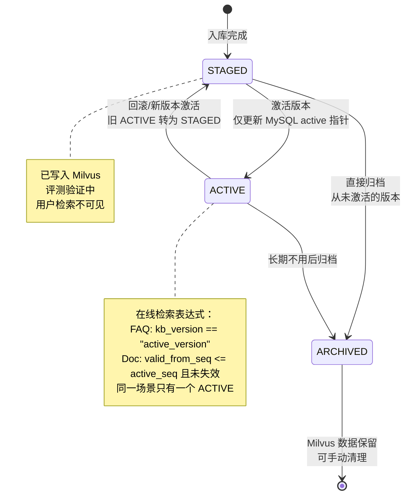
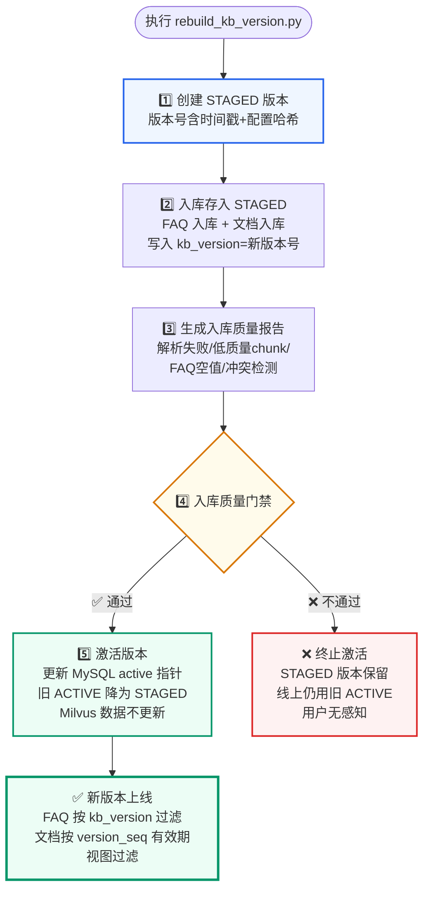
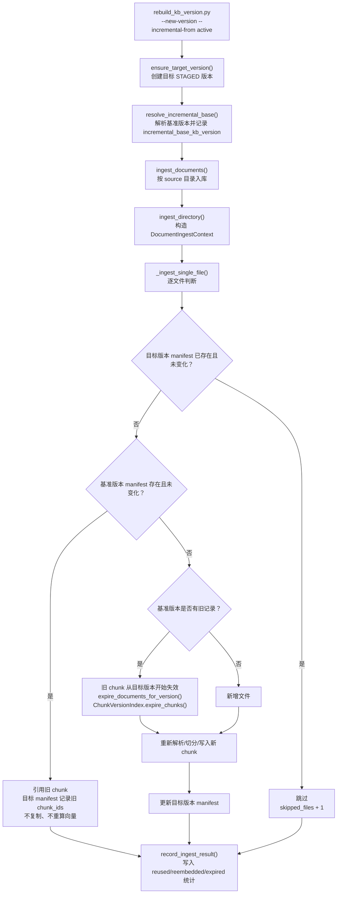

## 第一部分：为什么 RAG 需要版本管理

### 1.1 不加版本管理的风险

假设你用一个脚本把 500 个业务文档写入 Milvus。运行完毕后：

```text
场景 A：一切正常，问答效果好

场景 B：你发现新的 Embedding 模型（bge-m3-v2）效果更好，想切换
  → 重新入库，覆盖了旧的向量数据
  → 新模型效果反而更差（新的切分策略导致 chunk 太碎）
  → 无法回滚，因为旧数据已经被覆盖了

场景 C：你修改了文档切分参数（chunk_size 从 500 改为 300）
  → 想对比新旧切分方案的效果
  → 没有版本机制，你只能删除旧数据重建，对比无从谈起
```

**版本管理的核心价值**：让知识库的更新成为**可逆操作**。

版本管理还承担一个发布边界：新版本写入 Milvus 只是进入 `STAGED`，不等于可以上线。上线前必须有质量依据，当前实现通过入库质量报告和质量门禁决定是否允许激活。

### 1.2 版本管理的典型需求

| 需求 | 说明 |
| --- | --- |
| 安全入库 | 新版本先写入，不影响线上正在使用的版本 |
| 灰度验证 | 新版本入库后先评测，确定没问题再切换 |
| 快速回滚 | 新版本效果不好，一键切回旧版本 |
| 对比评测 | 同一个问题可以分别在新旧版本上验证召回效果 |
| 长期保留 | 历史版本不删除，作为 A/B 测试和故障分析的依据 |

---

## 第二部分：版本状态机

### 2.1 三种状态



### 安全入库与激活流程



- **STAGED**：版本已写入 Milvus，但线上检索不使用。通常用于新入库的版本，等待评测验证。
- **ACTIVE**：当前在线检索使用的版本。同一场景只有一个 ACTIVE 版本。
- **ARCHIVED**：不再使用的历史版本。数据和 Milvus chunk 都保留，但不参与在线检索。

### 2.2 质量门禁与状态转换

知识库多版本管理只保留一个发布边界：`activate_version()` 负责切换 MySQL active 指针，不判断资料质量。脚本传入 `--activate` 时，会先生成入库质量报告、执行质量门禁；只有门禁通过，才允许调用 `activate_version()`。

质量报告和门禁在本文只表示“是否允许上线”。检测项、阈值和 Bad Case 闭环统一放到RAG 回归验收与入库质量，不在版本治理部分重复展开。

下面的代码展示的是步骤 5（激活）和归档操作。步骤 1（创建版本）见 `ensure_version()`，步骤 2（入库写入）见文档入库与索引链路，步骤 3-4（质量报告和门控）见RAG 回归验收与入库质量。

```python
# qa_core/governance/kb_versions.py

def activate_version(self, kb_version: str, *, reason: str = "", activated_by: str = "system") -> KnowledgeBaseVersion:
    """把指定版本切为当前在线检索版本。

    激活只更新 MySQL 控制面中的 active 指针，不更新 Milvus 数据。
    """  # → 流程图节点 5️⃣：激活版本
    record = self.get(kb_version)
    if record is None:
        raise ValueError(f"知识库版本不存在：{kb_version}")

    previous = self._active_pointer()[0]
    now = utc_now()

    with self.engine.begin() as conn:
        # 同一场景原 ACTIVE 统一转为 STAGED，保留回滚能力。
        conn.execute(text("UPDATE kb_versions SET status='STAGED' WHERE scenario_id=:scenario_id AND status='ACTIVE'"), ...)
        record.status = "ACTIVE"
        record.activated_at = now
        self._upsert_version_with_conn(conn, record)
        self._set_active_pointer_with_conn(conn, kb_version, previous)
    return self.get(kb_version) or record


def archive_version(self, kb_version: str) -> KnowledgeBaseVersion:
    """归档一个非 active 版本。

    归档不会删除 Milvus 数据，只是状态标记。
    """  # → 流程图未展示的附加操作：归档
    if self.active_version_candidate() == kb_version:
        raise ValueError("不能归档当前 active 知识库版本")

    record = self.get(kb_version)
    record.status = "ARCHIVED"
    record.archived_at = utc_now()
    self._upsert_version(record)
    return record
```

### 2.3 激活操作的轻量性

**关键设计**：激活版本只更新 MySQL 中的一行 active 指针，不碰 Milvus。

```text
激活前的在线检索：
  Milvus expr 包含 kb_version == "v1"

激活后的在线检索：
  Milvus expr 包含 kb_version == "v2"
  v1 的 chunk 数据仍在 Milvus 中，只是不再被查到
```

如果激活需要修改所有 chunk 的 metadata，一个 10 万条 chunk 的知识库需要很长时间。通过把版本切换放在检索表达式中，版本切换变成了 O(1) 操作。

### 2.4 为什么采用 STAGED 候选版本 + active 指针切换

多版本入库不要理解成“把资料重新写一遍”，而要理解成一次**知识库发布流程**。新资料可能出现解析失败、切分异常、FAQ 口径冲突、source 配错、召回退化等问题。如果直接覆盖线上向量数据，一旦新版本质量有问题，用户会立刻受到影响，而且很难快速回滚。

示例实现采用的是控制面和数据面分离：

| 层次 | 保存内容 | 主要职责 |
| --- | --- | --- |
| Milvus 数据面 | 所有版本的 FAQ 向量和文档 chunk 向量 | 保存可检索数据，不负责判断哪个版本上线 |
| MySQL 控制面 | `kb_versions`、`kb_active_versions`、`kb_version_activations`、`kb_chunk_versions` | 保存版本状态、`version_seq`、active 指针、激活流水和 chunk 有效期索引 |
| 在线检索表达式 | FAQ 使用 `kb_version == active_version`；文档使用有效期视图 | FAQ 按版本精确过滤，文档按 active `version_seq` 解释可见 chunk |

所以完整业务逻辑是：

```text
入库 = 生成一个候选版本
质量报告 = 描述候选版本有哪些风险
质量门禁 = 判断候选版本能不能上线
激活 = 切换 active 指针
回滚 = 把 active 指针切回旧版本
```

注意两个边界：

1. **写入 Milvus 不等于上线**：STAGED 版本已经在 Milvus 中存在，但线上检索不会命中它。FAQ 只查 active `kb_version`，文档只查 active `version_seq` 对应的有效期视图。
2. **质量报告不等于质量门禁**：质量报告负责记录事实，例如失败文件、重复 FAQ、低质量 chunk；质量门禁负责根据阈值决定是否阻断激活。

这种设计的好处是：

| 问题 | 直接覆盖式入库 | 多版本发布式入库 |
| --- | --- | --- |
| 新资料有问题 | 线上立即受影响 | STAGED 阶段被拦截 |
| 需要回滚 | 很难恢复旧向量 | 激活指定历史版本，并写入激活流水 |
| 发布速度 | 可能要修改大量向量数据 | 只更新 MySQL active 指针 |
| 排查问题 | 不知道哪次入库引入问题 | 每个版本有独立版本号、报告和统计 |
| 多场景管理 | 容易互相影响 | 每个场景独立 active 指针 |

企业系统中也经常做跨版本增量构建。示例实现采用的是**引用式增量版本**：未变化文件不重新 embedding，也不把旧 chunk 复制到新版本，而是通过 `version_seq`、`valid_from_seq`、`valid_to_seq` 描述 chunk 在哪些版本中有效。

| 资料状态 | 处理方式 | 查询可见性 |
| --- | --- | --- |
| 未变化 | 目标版本 manifest 继续引用旧 chunk | `valid_from_seq <= active_seq` 且未失效时可见 |
| 新增 | 插入新 chunk，`valid_from_seq = 当前版本序号` | 从当前版本开始可见 |
| 修改 | 旧 chunk 写 `valid_to_seq = 当前版本序号`，新 chunk 写当前 `valid_from_seq` | 旧口径在新版本不可见，新口径可见 |
| 删除 | 旧 chunk 写 `valid_to_seq = 当前版本序号` | 从当前版本开始不可见 |

当前版本治理采用“active 指针 + version_seq + chunk 有效期视图”。FAQ 体量小且要求标准口径一致，仍按目标 `kb_version` 重建；文档 chunk 走引用式增量视图。

### 2.5 引用式增量版本的完整实现链路

引用式增量要先区分两个概念：

| 概念 | 含义 |
| --- | --- |
| 物理数据 | Milvus 中真实存在的 FAQ 行和文档 chunk 行 |
| 逻辑版本 | 某个 `kb_version` 对外呈现出来的一组可见资料 |

新建一个增量版本时，目标不是“把基准版本所有 chunk 复制一份”，而是产出一个新的逻辑版本视图：

```text
目标版本 = 新增/变更文件的新 chunk + 未变化文件引用的旧 chunk - 已删除/已变更文件失效的旧 chunk
```

这个逻辑版本由三类数据共同决定：

| 数据 | 存放位置 | 作用 |
| --- | --- | --- |
| `version_seq` | MySQL `kb_versions` | 给每个版本分配单调递增序号，用于判断 chunk 在哪个版本可见 |
| `manifest` | MySQL `kb_document_manifests` | 记录某个版本中某个文件对应的 `fingerprint` 和 `chunk_ids` |
| `valid_from_seq` / `valid_to_seq` | Milvus 文档 chunk metadata + MySQL `kb_chunk_versions` | Milvus 用于在线过滤，MySQL 用于治理、排障、回滚审计和版本差异查询 |

`kb_version` 是人能读懂的版本 ID，`version_seq` 是机器做区间判断的版本序号。线上查询最终使用 active 版本的 `version_seq` 解释文档 chunk 是否可见。

```text
chunk 可见条件：

valid_from_seq <= active_seq
and
(valid_to_seq == 0 or valid_to_seq > active_seq)
```

例如：

| chunk | valid_from_seq | valid_to_seq | active_seq=1 | active_seq=2 |
| --- | --- | --- | --- | --- |
| A_v1 | 1 | 0 | 可见 | 可见 |
| B_v1 | 1 | 2 | 可见 | 不可见 |
| B_v2 | 2 | 0 | 不可见 | 可见 |

含义是：`A_v1` 文件没有变化，所以 v2 继续引用它；`B_v1` 在 v2 开始失效，`B_v2` 从 v2 开始生效。

### 2.6 增量构建时每个文件如何判断

日常资料更新使用下面的命令：

```bash
python scripts/rebuild_kb_version.py --scenario enterprise_knowledge --new-version --incremental-from active --quality-gate --activate
```

这条命令会创建一个新的 STAGED 版本，并把当前 active 版本作为增量基准。代码入口在 `scripts/rebuild_kb_version.py`，文档入库主逻辑在 `qa_core/indexing/service.py`。

执行链路如下：



每个文件只有四种结果：

| 文件情况 | 判断依据 | 实际动作 | 是否重新 embedding |
| --- | --- | --- | --- |
| 目标版本已经入过且未变化 | 目标版本 manifest 的 `fingerprint`、`embedding_model_version`、`chunk_schema_version` 均匹配 | 跳过 | 否 |
| 基准版本里未变化 | 基准版本 manifest 匹配当前文件和当前模型/切分配置 | 目标版本 manifest 记录同一批 `chunk_ids`，Milvus 不复制 | 否 |
| 新增文件 | 基准版本 manifest 不存在 | 解析、切分、写入新 chunk | 是 |
| 修改文件 | 基准版本 manifest 存在但指纹或配置不匹配 | 旧 chunk 写 `valid_to_seq=目标版本序号`，再写新 chunk | 是 |
| 删除文件 | 基准版本有记录，但目标目录扫描不到这个路径 | 旧 chunk 写 `valid_to_seq=目标版本序号` | 否 |

`chunk_schema_version` 是严格等值匹配。它不是“字段种类没少就算兼容”的宽松 schema 检查，而是 chunk 切分规则和 metadata 契约的版本号。`valid_from_seq / valid_to_seq` 属于引用式增量有效期窗口，会影响线上检索过滤语义，因此示例实现默认 `CHUNK_SCHEMA_VERSION=parent_child_validity_v2`。

这里的“引用”不是在查询时临时拼接多个版本，而是在目标版本构建时把可见性关系写清楚。构建完成后，线上仍然只解析当前 active 版本。

注意：修改或删除文件时，不会扫描并过期所有历史版本中的同名文件。入库只读取本次 `incremental_base_kb_version` 对应的 manifest；如果基准版本里同路径文件需要失效，就把这批旧 chunk 的 `valid_to_seq` 写成目标版本序号。更早的历史版本仍然通过自己的 `active_seq` 解释可见性，因此可以回滚和对比。

### 2.7 为什么 FAQ 不做引用式复用

当前实现中，引用式增量只用于文档 chunk；FAQ 每个新版本都会按目标 `kb_version` 重建。

原因是 FAQ 通常数量小，但它承担“高置信标准问答直出”的职责。FAQ 的标准问题、答案和 source 需要形成同一版本内的一致口径。如果 FAQ 也跨版本引用，直出答案可能来自旧口径，而文档证据来自新口径，反而增加解释成本。

所以规则是：

| 数据类型 | 版本策略 |
| --- | --- |
| FAQ | 新版本重建，检索时按 `kb_version == active_version` 精确过滤 |
| 文档 chunk | 引用式增量，检索时按 active `version_seq` 解释有效期视图 |

### 2.8 命令参数边界

引用式增量依赖基准版本中的旧 chunk 仍然存在，因此有几个参数不能混用：

| 参数组合 | 为什么不允许 |
| --- | --- |
| `--incremental-from` + `--reset-collections` | reset 会删除 collection，旧 chunk 已不存在，无法引用 |
| `--incremental-from` + `--force` | force 表示全部重建，和“复用未变化 chunk”的目标相反 |
| `--incremental-from` 但没有 `--new-version` 或显式 `--kb-version` | 增量构建必须有明确目标版本 |

常用命令分两类：

```bash
# 全量重建：适合初始化、schema 变化、模型变化后重建
python scripts/rebuild_kb_version.py --scenario enterprise_knowledge --new-version --force --quality-gate --activate

# 引用式增量：适合日常资料新增、修改、删除
python scripts/rebuild_kb_version.py --scenario enterprise_knowledge --new-version --incremental-from active --quality-gate --activate
```

构建日志中会出现类似统计：

```text
文档入库完成：目标版本 chunk=12，重新写入=3，引用复用=9，失效旧chunk=2，跳过未变化文件=0
```

这些统计最终也会写进版本记录的 `stats` 字段：

| 字段 | 含义 |
| --- | --- |
| `incremental_base_kb_version` | 当前版本基于哪个版本做增量构建 |
| `incremental_mode` | 当前增量模式，值为 `reference_delta_validity_window` |
| `last_doc_reembedded_count` | 本次重新 embedding 的 chunk 数 |
| `last_doc_reused_count` | 本次引用复用的 chunk 数 |
| `last_doc_expired_count` | 本次从目标版本开始失效的旧 chunk 数 |

### 2.9 一个简单例子

假设 v1 版本有 3 个文件：

| 文件 | v1 chunk | 有效期 |
| --- | --- | --- |
| `hr/onboarding.md` | `chunk_hr_v1` | `valid_from_seq=1, valid_to_seq=0` |
| `it/vpn.md` | `chunk_vpn_v1` | `valid_from_seq=1, valid_to_seq=0` |
| `finance/expense.md` | `chunk_expense_v1` | `valid_from_seq=1, valid_to_seq=0` |

现在基于 v1 构建 v2：

| 文件 | v2 中的变化 | v2 的处理 |
| --- | --- | --- |
| `hr/onboarding.md` | 未变化 | v2 的 manifest 直接引用 `chunk_hr_v1` |
| `it/vpn.md` | 内容修改 | `chunk_vpn_v1.valid_to_seq=2`，再写入 `chunk_vpn_v2` |
| `finance/expense.md` | 删除 | `chunk_expense_v1.valid_to_seq=2` |
| `legal/privacy.md` | 新增 | 写入 `chunk_privacy_v2` |

最终查询可见性是：

| active 版本 | active_seq | 可见内容 |
| --- | --- | --- |
| v1 | 1 | `hr/onboarding.md`、`it/vpn.md`、`finance/expense.md` |
| v2 | 2 | `hr/onboarding.md`、`it/vpn.md` 的新内容、`legal/privacy.md` |

一句话理解：**v2 是一个完整的新版本视图，但它不要求所有文件都重新写向量；未变化文件只引用旧 chunk，变化或删除的旧 chunk 从 v2 开始失效。**

---

## 第三部分：版本号设计

### 3.1 版本号生成

```python
def generate_kb_version(prefix="kb", scenario_id=None) -> str:
    """生成一个适合人读和机器过滤的知识库版本号。

    包含：
    - 时间戳：便于肉眼判断版本先后
    - 配置短 hash：把 embedding、reranker、chunk_schema、collection
      等关键配置纳入标识
    """
    settings = get_settings()
    scenario = _resolve_version_scenario(scenario_id)  # 私有 helper，避免 settings -> scenarios -> kb_versions 循环导入

    stamp = utc_file_stamp()  # 如 20260506_103000（年月日_时分秒）
    config_hash = stable_hash(
        scenario.scenario_id,
        settings.embedding_model_version,    # 如 "bge-m3-local-v1"
        settings.reranker_model_version,     # 如 "bge-reranker-v1"
        settings.chunk_schema_version,       # 如 "parent_child_validity_v2"
        scenario.doc_collection,
        scenario.faq_collection,
    )[:8]  # 只取前 8 位

    return f"{prefix}_{scenario.scenario_id}_{stamp}_{config_hash}"
    # 例：kb_enterprise_knowledge_20260506_103000_9f2a1b3c
```

### 3.2 为什么版本号包含配置哈希

设计意图：从版本号可以直接判断两个版本是否使用同一套配置。

```text
kb_enterprise_knowledge_20260506_103000_9f2a1b3c
kb_enterprise_knowledge_20260507_150000_7d3e8f1a
                           不同日期 ↑         不同 hash ↑
```

如果两个版本的 hash 相同但日期不同，说明是同一套配置下的数据更新（新增/修改了文档）。 如果 hash 不同，说明 Embedding 模型、Reranker 模型或 Chunk 方案有变化，需要重点关注召回质量的对比。

---

## 第四部分：MySQL 版本控制面

### 4.1 表结构

当前实现把知识库版本控制面保存到 MySQL，而不是本地 JSON 文件。核心是五张表：

| 表 | 作用 |
| --- | --- |
| `kb_versions` | 保存每个版本的状态、模型配置快照、collection、入库统计 |
| `kb_active_versions` | 保存每个场景当前 active 版本和上一个 active 版本，服务在线解析和一步快速回退 |
| `kb_version_activations` | 保存每一次激活、回滚和首次激活流水 |
| `kb_chunk_versions` | 保存文档 chunk 的有效期窗口，服务治理页、排障和版本差异查询 |
| `cache_namespaces` | 保存场景/租户/数据集的 `cache_epoch`，版本切换时用于缓存失效 |

`kb_versions` 的关键字段：

| 字段 | 说明 |
| --- | --- |
| `scenario_id` | 业务场景 |
| `kb_version` | 知识库版本号 |
| `status` | `STAGED` / `ACTIVE` / `ARCHIVED` |
| `doc_collection` / `faq_collection` | 对应 Milvus collection |
| `embedding_model_version` / `reranker_model_version` / `chunk_schema_version` | 入库配置快照 |
| `sources_json` / `stats_json` | 已入库 source 和统计信息 |

`kb_active_versions` 的关键字段：

| 字段 | 说明 |
| --- | --- |
| `scenario_id` | 业务场景 |
| `active_kb_version` | 在线检索默认使用的版本 |
| `previous_kb_version` | 上一个 active 版本，用于快速回退入口和页面提示 |

`kb_active_versions` 不保存完整版本链路。任意历史版本都可以通过 `activate_version(target_version)` 重新激活；每次切换都会写入 `kb_version_activations`。这样不需要增加 `previous_2`、`previous_3` 这类列，也能支持多次回滚审计。

`kb_version_activations` 的关键字段：

| 字段 | 说明 |
| --- | --- |
| `from_kb_version` / `to_kb_version` | 本次切换前后的版本 |
| `from_version_seq` / `to_version_seq` | 本次切换前后的版本序号 |
| `action` | `activate` / `rollback` |
| `reason` / `activated_by` | 切换原因和操作者 |

`kb_chunk_versions` 的关键字段：

| 字段 | 说明 |
| --- | --- |
| `chunk_id` | 文档 chunk 的稳定 ID |
| `source` / `file_path` | 所属业务分类和文件路径 |
| `kb_version` | 产生或引用该 chunk 的知识库版本 |
| `valid_from_seq` / `valid_to_seq` | chunk 的版本有效期窗口 |

表结构集中在 `qa_core/storage/runtime_schema.sql`：

```sql
CREATE TABLE IF NOT EXISTS {{KB_VERSIONS_TABLE}} (...);
CREATE TABLE IF NOT EXISTS {{KB_ACTIVE_TABLE}} (...);
CREATE TABLE IF NOT EXISTS {{KB_ACTIVATION_TABLE}} (...);
CREATE TABLE IF NOT EXISTS {{KB_CHUNK_VERSIONS_TABLE}} (...);
```

启动期由 `qa_core/storage/bootstrap.py` 调用 `qa_core/storage/mysql_schema.py` 执行这个 SQL 文件。这样表结构初始化和版本状态机读写分开：

| 模块 | 职责 |
| --- | --- |
| `qa_core/storage/runtime_schema.sql` | 维护 MySQL 控制面表结构 |
| `qa_core/storage/mysql_schema.py` | 读取 SQL 文件、替换表名占位符并执行 |
| `qa_core/storage/bootstrap.py` | API 和脚本入口在业务读写前显式初始化 MySQL schema |
| `qa_core/governance/kb_version_models.py` | 维护版本状态常量、`KnowledgeBaseVersion` 数据结构和 JSON 字段解析 |
| `qa_core/governance/kb_versions.py` | 负责版本状态机、active 指针、激活流水、归档和回滚 |
| `qa_core/governance/chunk_versions.py` | 负责 chunk 有效期控制面索引 |
| `scripts/rebuild_kb_version.py` | 负责编排入库、质量门禁，通过后才激活版本 |

这个拆分的目的不是增加层级，而是把三类变化分开：表结构变化看 `runtime_schema.sql`，版本对象字段变化看 `kb_version_models.py`，版本激活和回滚流程看 `kb_versions.py`。当前实现暂不引入 Alembic；生产环境如果需要严格版本化 DDL，可以把 `runtime_schema.sql` 迁移成 Alembic revision。

### 4.2 KnowledgeBaseVersionStore 类

```python
class KnowledgeBaseVersionStore(_MySqlStore):
    """知识库版本状态机的 MySQL 存储实现。

    每个场景在 kb_versions 中有多条版本记录，在 kb_active_versions
    中有一条 active 指针记录。这样多场景可以独立激活、回滚和对比。
    """

    def __init__(self, scenario_id=None):
        self.scenario = _resolve_version_scenario(scenario_id)
        self.settings = get_settings()
        self._engine = None

    def resolve_active_version(self, requested=None) -> str:
        """解析一次检索应该使用的知识库版本。

        优先级：
        1. 请求显式传入的 kb_version（用于评测/灰度）
        2. 环境变量 ACTIVE_KB_VERSION
        3. MySQL active 指针表中的 active_kb_version

        当前在线检索必须带版本过滤。没有 active 版本直接报错。
        """
        if requested:
            if not self.exists(requested):
                raise ValueError(f"请求的知识库版本不存在：{requested}")
            return requested

        active = self.active_version_candidate()
        if not active:
            raise ValueError(
                f"场景 {self.scenario.scenario_id} 没有 active 知识库版本"
            )
        if not self.exists(active):
            raise ValueError(
                f"active 知识库版本不存在于版本表：{active}"
            )
        return active
```

---

## 第五部分：与 Milvus 检索的集成

### 5.1 写入时携带版本信息

```python
# qa_core/governance/kb_versions.py
def version_metadata(kb_version, scenario_id=None, *, version_seq=None):
    """构建写入每个 FAQ/chunk metadata 的版本字段。"""
    settings = get_settings()
    scenario = _resolve_version_scenario(scenario_id)
    resolved_seq = int(version_seq or 0)
    return {
        "scenario_id": scenario.scenario_id,
        "kb_version": kb_version,
        "valid_from_seq": resolved_seq,
        "valid_to_seq": 0,
        "embedding_model_version": settings.embedding_model_version,
        "reranker_model_version": settings.reranker_model_version,
        "chunk_schema_version": settings.chunk_schema_version,
    }
```

每条 FAQ 和 chunk 入库时，这些字段都会被写入 metadata：

```text
chunk = Document(
    page_content="入职流程包括以下步骤...",
    metadata={
        "source": "hr",
        "chunk_id": "abc123",
        "source_type": "doc",
        "record_type": "doc_chunk",
        "versioning_mode": "reference_incremental",
        "version_filter_mode": "validity_window",
        "kb_version": "kb_enterprise_knowledge_20260507_150000_7d3e8f1a",
        "valid_from_seq": 2,
        "valid_to_seq": 0,
        "embedding_model_version": "bge-m3-local-v1",
        ...
    }
)
```

FAQ 和文档 chunk 都会携带 `kb_version`、`valid_from_seq`、`valid_to_seq` 这些公共版本字段，但它们的业务语义不同，不能只看字段名判断增量模式：

| 数据类型 | `source_type` | `versioning_mode` | `version_filter_mode` | 版本闭环语义 |
| --- | --- | --- | --- | --- |
| FAQ | `faq` | `snapshot` | `kb_version_exact` | 每个版本重建 FAQ 行，检索按 `kb_version == active_version` 精确过滤；`valid_from_seq/valid_to_seq` 只是公共版本元数据 |
| 文档 chunk | `doc` | `reference_incremental` | `validity_window` | 新增/修改写新 chunk，未变化文件引用旧 chunk；检索按 `valid_from_seq <= active_seq` 且未失效判断可见 |

文档 chunk 入库时还会同步写入 MySQL `kb_chunk_versions`。两边职责不同：

| 存储位置 | 使用时机 | 作用 |
| --- | --- | --- |
| Milvus metadata | 在线检索 | 用 `valid_from_seq/valid_to_seq` 直接过滤可见 chunk |
| MySQL `kb_chunk_versions` | 治理、排障、版本对比 | 查询某个版本应该看到哪些 chunk，解释回滚前后差异 |

### 5.2 检索时过滤版本

```text
# FAQ 检索：按 active kb_version 精确过滤
faq_expr = f'kb_version == "{active_version}" and source == "hr"'

# 文档检索：按 active version_seq 解释引用式有效期视图
doc_expr = (
    f'(valid_from_seq <= {active_seq} and '
    f'(valid_to_seq == 0 or valid_to_seq > {active_seq}))'
    f' and source == "hr"'
)
```

对应真实代码在 `qa_core/retrieval/filters.py::build_source_expr()`。当 `source_type="doc"` 时，会先解析目标版本记录，拿到 `version_seq`，再拼出文档有效期表达式；FAQ 没有传 `source_type="doc"`，因此仍使用 `kb_version == active_version`。

文档检索不额外拼 `kb_version == active_version`。当前版本新写入的 chunk 会通过 `valid_from_seq == active_seq` 命中；从旧版本引用复用的 chunk 会通过 `valid_from_seq < active_seq` 且未失效命中。文档检索只看有效期窗口，才能完整表达“当前逻辑版本可见哪些 chunk”。

### 5.3 评测用历史版本

```text
# 评测脚本可以显式指定历史版本
service.debug_retrieval(
    query="入职流程有哪些步骤",
    kb_version="kb_enterprise_knowledge_20260506_103000_9f2a1b3c",  # 旧版本
    ...
)

# 对比两个版本对同一批问题的召回效果
for question in eval_set:
    old_result = service.debug_retrieval(query=question, kb_version=old_version)
    new_result = service.debug_retrieval(query=question, kb_version=new_version)
    compare(old_result, new_result)
```

---

## 第六部分：全量重建的安全流程

文档入库与索引链路负责把资料写入新版本，质量评测负责生成检查报告；版本管理则保证质量报告不通过时无法激活版本。

```bash
python scripts/rebuild_kb_version.py --scenario enterprise_knowledge --new-version --force --quality-gate --activate
```

执行顺序：

```text
1. 创建 STAGED 版本（version = "kb_...20260507_150000_xxxx"）
2. FAQ 入库（写入 STAGED 版本的 kb_version）
3. 文档入库（写入 STAGED 版本的 kb_version）
4. 生成入库质量报告
5. 执行入库质量门禁
   ├─ 通过 → 调用 activate_version()，将 STAGED 切换为 ACTIVE
   └─ 不通过 → 终止流程，STAGED 版本仍保留（不激活）
```

对应真实代码在 `scripts/rebuild_kb_version.py`：

```text
report = build_ingestion_quality_report(...)
gate_result = evaluate_report_against_gate(report, thresholds)
if not gate_result["ok"]:
    save_ingestion_quality_report(report)
    sys.exit(1)

if args.activate:
    version_store.activate_version(kb_version)
```

这段逻辑表达的是：版本已经入库不代表可以上线；只有质量门禁通过，才允许切换 active 指针。

**关键安全点**：即使新的 STAGED 版本已经写入了 Milvus，只要没有执行激活步骤，线上检索仍然使用旧的 ACTIVE 版本。用户完全无感知。

---
