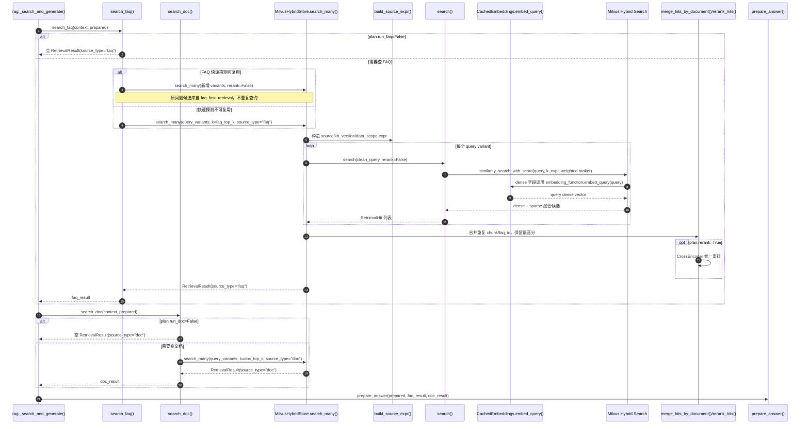
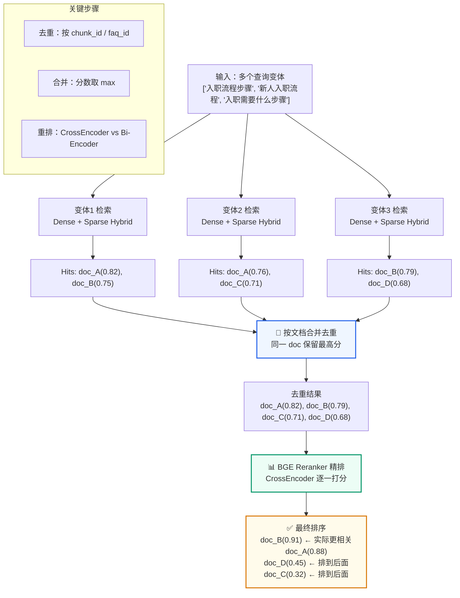
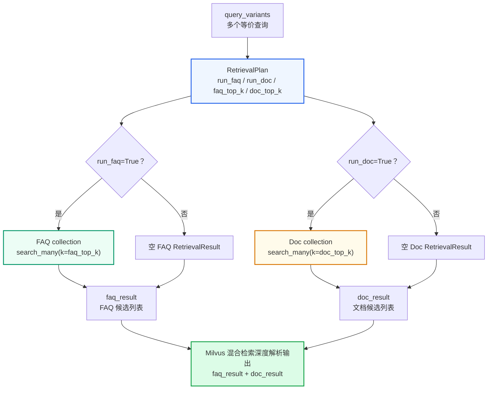

## 第一部分：Milvus 混合检索实现

> Dense/Sparse、BM25 的基础原理已经在RAG 基础原理第三部分说明。本文不重复算法公式，直接进入 Milvus `BM25BuiltInFunction`、混合召回和系统实现。

### 1.1 先划清两个容易混淆的概念

系统里会同时出现 `FAQ 检索`、`文档检索`、`Hybrid Search` 这几个词，它们不是同一层概念。

| 概念 | 准确定义 | 在系统里的落点 |
| --- | --- | --- |
| Milvus Hybrid Search | 单个 collection 内同时使用 Dense 向量召回和 BM25 Sparse 关键词召回，再做融合排序 | `MilvusHybridStore.search()` / `search_many()` |
| FAQ + Doc 分层检索 | 业务上把标准问答和正文资料放在两个 collection，按计划分别或同时检索 | `RetrievalPlan.run_faq` / `RetrievalPlan.run_doc` |

也就是说，真实业务中并不是“只要混合检索就必须同时查 FAQ 和 Doc”。更严谨的说法是：

- FAQ collection 内部可以执行一次 Milvus Hybrid Search。
- Doc collection 内部也可以执行一次 Milvus Hybrid Search。
- 是否执行 FAQ、是否执行 Doc，由检索策略与动态计划生成的 `RetrievalPlan` 决定。
- 企业知识问答默认通常两路都查，因为 FAQ 提供标准口径，Doc 提供制度依据；但问候、越界、转人工、某些确定性直答问题不应该查知识库。

所以示例实现的在线检索是两层结构：

```text
检索计划层：决定查 FAQ、查 Doc、还是都不查
检索执行层：每个被执行的 collection 内部使用 Dense + BM25 Sparse Hybrid Search
```

### 1.2 双向量字段的 Schema

在 Milvus 中，每个 collection 有两个向量字段：

```text
Collection Schema:
┌──────────────┬──────────────┬──────────────────────────────┐
│ 字段名        │ 类型          │ 说明                          │
├──────────────┼──────────────┼──────────────────────────────┤
│ pk           │ VARCHAR      │ 主键（稳定 chunk_id）          │
│ text         │ VARCHAR      │ 原始文本（检索输入 + 生成展示） │
│ dense        │ FLOAT_VECTOR │ BGE-M3 生成的 1024 维向量      │
│ sparse       │ SPARSE_VECTOR│ Milvus 服务端 BM25 生成         │
│ source       │ VARCHAR      │ 业务分类（用于过滤）           │
│ kb_version   │ VARCHAR      │ 知识库版本（用于过滤）         │
│ scenario_id  │ VARCHAR      │ 场景 ID（用于过滤）            │
│ tenant_id    │ VARCHAR      │ 租户 ID（用于过滤）            │
│ ...          │ ...          │ 更多标量过滤字段               │
└──────────────┴──────────────┴──────────────────────────────┘
```

### 1.3 LangChain Milvus 初始化

```python
# qa_core/retrieval/store.py
from langchain_milvus import Milvus
from qa_core.retrieval.milvus_compat import hybrid_index_params, hybrid_search_params

self._store = Milvus(
    embedding_function=get_embeddings(),      # BGE-M3 → 生成 dense 向量
    builtin_function=bm25_function(),          # Milvus 内置 BM25 → 生成 sparse 向量
    collection_name=self.collection_name,
    connection_args=connection_args,
    vector_field=["dense", "sparse"],          # 双向量字段
    index_params=hybrid_index_params(),        # dense/sparse 两路索引参数
    search_params=hybrid_search_params(),      # dense/sparse 两路搜索参数
    text_field="text",
    primary_field="pk",
    auto_id=False,                             # 手动指定 ID
)
```

**关键参数分析**：

- `embedding_function`：当调用 `add_documents()` 写入数据时，LangChain 自动调用 BGE-M3 对 `text` 字段生成 Dense 向量
- `builtin_function`：Milvus 2.5.x 可用的服务端内置函数，在写入时自动对 `text` 字段执行中文分词 + BM25 编码，生成 Sparse 向量
- `vector_field=["dense", "sparse"]`：声明两个向量字段，相似度搜索时会**同时使用两者**，Milvus 内部自动加权融合分数
- `index_params/search_params`：顺序必须和 `vector_field` 对齐。当前 V1 显式使用 `dense: HNSW + L2`、`sparse: AUTOINDEX + BM25`，不是依赖 langchain-milvus 的隐藏默认值；旧 collection 必须重建后才会应用 HNSW。
- `auto_id=False`：使用入库时生成的稳定 chunk_id 作为主键。这使得文档更新时可以按 ID `delete(ids=old_ids)` 再 `add_documents(new_chunks)`

这里故意选择 `L2` 而不是 `COSINE`：系统的 BGE 向量在 `get_embeddings()` 中已经做了 L2 归一化，归一化向量下 L2 距离和 Cosine 相似度的排序等价；同时早期环境中的 collection 已按 langchain-milvus 默认的 L2 metric 建好，显式使用 L2 可以避免 `metric type not match`，不强制重建已有数据。

### 1.3.1 查询时 embed_query 在哪里被调用

`embedding_function` 不只在入库时使用，查询时也会用。示例代码里调用的是：

```text
# qa_core/retrieval/store.py
self.store.similarity_search_with_score(query, k=k, expr=expr, **HYBRID_RANKER_KWARGS)
```

这里的 `self.store` 是 `langchain_milvus.Milvus`。进入 langchain-milvus 后，`similarity_search_with_score()` 会识别当前是 `vector_field=["dense", "sparse"]` 的多向量检索，然后进入内部的 hybrid search 逻辑。它的核心行为可以理解为下面这段伪代码：

```yaml
for field in ["dense", "sparse"]:
    if field 来自 embedding_function:
        search_data = embedding_function.embed_query(query)
    else:
        search_data = query
    build AnnSearchRequest(field, search_data)

milvus.hybrid_search(requests, weighted_ranker)
```

也就是说：

- `dense` 字段来自 `embedding_function=get_embeddings()`，所以查询时会调用 `get_embeddings().embed_query(query)`，把用户 query 转成 BGE-M3 dense 向量。
- `sparse` 字段来自 `builtin_function=bm25_function()`，所以查询时传的是原始 query 文本，由 Milvus 服务端的 BM25 Function 生成 sparse query representation。
- 两路请求随后进入同一次 `hybrid_search()`，再由 weighted ranker 融合排序。

这个细节非常关键：系统没有在 `search_many()` 里手动写 `embed_query()`，而是把 `CachedEmbeddings` 作为 `embedding_function` 交给 LangChain Milvus。只要 LangChain Milvus 查询 dense 字段，就会回调到 `CachedEmbeddings.embed_query()`；如果 query embedding 已经在 Redis 命中，就直接返回向量，否则才调用底层 BGE-M3 模型推理。

### 1.4 BM25 中文分词配置

```python
# qa_core/retrieval/milvus_compat.py
def bm25_function():
    return BM25BuiltInFunction(
        input_field_names="text",        # 对哪个字段做 BM25
        output_field_names="sparse",     # 输出到哪个向量字段
        analyzer_params={"type": "chinese"},  # 使用中文分词器
        enable_match=True,               # 启用 BM25 match 评分
    )
```

`analyzer_params={"type": "chinese"}` 确保 BM25 使用中文分词器（而不是默认的英文空格分词）。这样"企业知识库智能问答"会被正确拆分为"企业/知识库/智能/问答"，而不是按空格当成一个整体。

### 1.5 Milvus 内置 BM25 的优势

示例实现没有在 Python 侧自己维护 BM25 索引，而是使用 Milvus 2.5.x 的 `BM25BuiltInFunction`。这样做有几个工程优势：

| 方案 | 问题 |
| --- | --- |
| Python 自己跑 BM25 | Demo 很简单，但生产化时还要补中文分词、索引缓存、删除/新增 chunk 更新、BM25 与 Dense 结果合并去重 |
| MySQL `LIKE` / 全文索引 | 可以做关键词匹配，但无法和 Dense 向量检索在同一套向量检索流程里融合 |
| Milvus 内置 BM25 | 文本写入时自动生成 sparse 向量，查询时自动生成 sparse query，并能和 dense 检索统一融合 |

具体到示例实现，Milvus 内置 BM25 带来这些收益：

1. **入库简单**：`add_documents()` 只写入文本和 metadata，Milvus 服务端自动从 `text` 字段生成 `sparse` 向量。
2. **查询简单**：用户输入 query 后，Milvus 自动生成 sparse query representation，不需要业务代码手动调用 BM25 编码器。
3. **融合自然**：Dense 和 Sparse 在一次 Hybrid Search 请求里完成，避免 Python 侧分别查两套系统再手动 merge。
4. **数据一致**：文档文本、dense 向量、sparse 向量、metadata 都在同一个 collection 中，版本过滤、租户过滤、source 过滤可以一起生效。
5. **更适合增量重建**：删除旧 chunk、写入新 chunk 后，BM25 sparse 字段由 Milvus 重新生成，不需要额外维护外部倒排索引。
6. **中文配置集中**：中文分词器通过 `analyzer_params={"type": "chinese"}` 固定在 collection schema / function 配置里，避免不同脚本分词口径不一致。

### 1.5.1 BM25 sparse vs BGE-M3 sparse

上面讲的是示例实现当前默认实现：`sparse` 字段由 Milvus 的 `BM25BuiltInFunction` 自动生成。 但在工程上，`sparse` 还可以来自 BGE-M3 的模型输出。两种方案都能做混合检索，区别在于谁来生成 sparse、写入和查询时由谁负责这一步。

| 方案 | 写入方式 | 查询方式 | 优点 | 缺点 |
| --- | --- | --- | --- | --- |
| Milvus `BM25BuiltInFunction` | 业务只写 `text + metadata`，Milvus 根据 `text` 自动生成 `sparse` | 业务直接传自然语言 query，Milvus 自动生成 sparse query | 写入/查询最省事，BM25 规则清晰，可解释，和当前增量版本/删除重建最一致 | 依赖 BM25 词项匹配，对同义改写和复杂语义的上限不如学习型 sparse |
| BGE-M3 sparse 向量 | 业务侧调用 BGE-M3，同时拿到 dense 和 sparse，再写入普通 `SPARSE_FLOAT_VECTOR` 字段 | 业务侧也要用 BGE-M3 对 query 生成 sparse 再搜索 | sparse 权重来自模型学习，理论上更擅长语义化关键词权重和复杂表达 | 写入/查询链路更复杂，需要自己维护 sparse 字段、query 编码和 schema 兼容，调试成本更高 |

如果要试验 BGE-M3 sparse，推荐新增独立字段，例如 `sparse_bge`，不要把它写进 `BM25BuiltInFunction` 的输出字段。 当前 V1 采用 `BM25BuiltInFunction`，是因为它和 FAQ/Doc 分集合、active 版本过滤、引用式增量重建最匹配。

### 1.5.2 为什么 V1 采用 Dense + BM25BuiltInFunction

当前 V1 的正式方案是：

```text
BGE-M3 Dense Embedding
        +
Milvus BM25BuiltInFunction
        +
Weighted Hybrid Ranker
```

这个组合是合理的企业级 V1 方案，原因是：

- Dense 向量负责语义相似和同义表达召回。
- BM25 负责专有名词、编号、条款和精确关键词召回。
- Milvus 在服务端处理 BM25 文本分析和稀疏表示，业务代码只需要维护原始文本、Dense 向量和 metadata。
- FAQ/Doc 分集合、`kb_version` 过滤、DataScope 隔离和引用式增量都可以沿用同一套检索治理边界。
- 相比同时维护 BGE-M3 Dense、BGE-M3 Sparse 和 BM25 三路信号，两路方案更容易解释、测试和调参。

Milvus 官方在 Hybrid Search Retriever 文档中将“Dense embedding + `BM25BuiltInFunction`”列为推荐方案之一。官方示例也是通过 `embedding=...`、`builtin_function=BM25BuiltInFunction()` 和 `vector_field=["dense", "sparse"]` 构建同一 Collection 内的 Dense + BM25 混合检索：

[Milvus Hybrid Search Retriever：Dense embedding + Milvus BM25 built-in function](https://milvus.io/docs/v2.5.x/milvus_hybrid_search_retriever.md)

这里的“推荐”是针对该类组合的工程便利性和适用性，不代表任何业务数据都必然优于 BGE-M3 Sparse。最终仍要通过示例实现的 Recall@K、MRR、关键词覆盖率、FAQ 误直出率和性能报告进行验证。

如果未来评测证明 BGE-M3 Sparse 对某些场景有明显收益，应新增独立的 `sparse_bge` 字段和双侧编码路径，作为独立实验方案，不覆盖当前 V1 的 BM25 字段，也不直接把三路融合当成默认配置。

所以这里的设计可以概括为：

```text
Python 负责业务编排
Embedding 模型负责 dense 语义向量
Milvus BM25 Function 负责 sparse 关键词向量
Milvus Hybrid Search 负责统一召回和融合排序
```

### 1.6 Hybrid Search 的分数融合

当同时使用 Dense 和 Sparse 检索时，Milvus 内部如何融合两者的分数？

```text
总分数 = w_dense × dense_score + w_sparse × sparse_score

当前权重：w_dense = 0.55, w_sparse = 0.45
          （可在搜索参数中调整）
```

示例实现在 `HYBRID_RANKER_KWARGS` 中显式使用 `0.55 : 0.45`，让 Dense 语义召回略占优势，同时保留 BM25 对专有名词、编号和精确关键词的补充能力。该权重不是 Milvus 强制默认值，也不是概率；需要用 Recall@K、MRR 和 Bad Case 对比校准。对于更依赖精确条款编号的场景，可以评测后提高 sparse 权重，但不能只改内容或只改某一路代码。

`WeightedRanker` 与 `RRFRanker` 的原理、公式和选型对比已经在Milvus 索引机制与基本操作 4.9 节介绍。本文只落地当前 V1 的 `ranker_type="weighted"` 与 `weights=[0.55, 0.45]` 配置。

### 1.7 检索执行的完整时序

Milvus 混合检索深度解析承接检索策略与动态计划的 `RetrievalPlan` 和查询改写与变体生成的 `query_variants`。在线链路里不是直接拿用户问题调用 Milvus，而是先由 `search_faq()` / `search_doc()` 按计划决定查哪一路，再由 `MilvusHybridStore.search_many()` 执行多查询变体合并、Milvus Hybrid Search 和可选重排。

FAQ 还有一条请求内优化：路由层已经对原问题做过一次 `faq_fast_retrieval`，但没有精确命中时，主链路不再把原问题完整查一遍。它保留这批未重排候选，只把新增查询变体送到 Milvus，随后合并、去重并统一重排。这是候选复用，不是最终答案缓存。



复用必须同时满足四个条件：没有追问改写、变体列表第一个仍是原问题、有效 `source_filter` 未变化、快速探测的候选数不少于完整计划要求的 `faq_top_k`。任一条件不满足都退回完整 FAQ 检索。这样不会把“为短问题准备的少量候选”错误地当成“完整检索结果”。


口语化理解：

> 检索策略与动态计划决定查 FAQ 还是查文档、查多少；查询改写与变体生成准备一个或多个等价查询；Milvus 混合检索深度解析真正把这些查询打到 Milvus，在每个 collection 内用 Dense + BM25 做混合召回，合并重排后交给RAG Pipeline 主流程深度解析构建上下文。

---

## 第二部分：过滤表达式构建

### 2.1 为什么需要过滤表达式

向量检索是在整个 collection 中找最相似的内容。但实际业务中，我们需要限制搜索范围：

- 同一个 collection 中存了多个场景的数据 → 只搜当前场景的
- 同一个场景中有多个知识库版本 → 只搜 active 版本的
- 开启了数据隔离 → 只搜当前租户/数据集的
- 前端选择了业务分类 → 只搜该分类的

这些限制通过 Milvus 的**标量过滤表达式**实现。

### 2.2 build_source_expr() 实现

```python
# qa_core/retrieval/filters.py
def build_source_expr(
    source_filter: str | None,
    kb_version: str | None = None,
    data_scope: DataScope | None = None,
    *,
    scenario_id: str | None = None,
    source_type: str | None = None,
) -> str | None:
    """把业务过滤条件转换为 Milvus 布尔表达式。

    表达式包含四类约束：
    - source：业务分类，例如 hr、billing、alarm
    - kb_version：FAQ 按版本精确过滤；文档用它解析 active version_seq
    - tenant_id/dataset_id：轻量多租户和数据集隔离
    - visibility/allowed_roles：轻量可见性控制
    """
    clauses: list[str] = []

    # 1. 业务分类过滤
    if source_filter:
        safe_source = escape_expr_value(str(source_filter))
        clauses.append(f'source == "{safe_source}"')

    # 2. 知识库版本过滤
    if kb_version and source_type == "doc" and scenario_id:
        version = get_kb_version_store(scenario_id).resolve_version(kb_version)
        clauses.append(
            f"(valid_from_seq <= {int(version.version_seq)} and "
            f"(valid_to_seq == 0 or valid_to_seq > {int(version.version_seq)}))"
        )
    elif kb_version:
        safe_version = escape_expr_value(str(kb_version))
        clauses.append(f'kb_version == "{safe_version}"')

    # 3. 数据隔离过滤
    if data_scope is not None:
        clauses.extend(data_scope.expr_clauses())

    # 4. 用 AND 拼接所有条件
    return " and ".join(clauses) if clauses else None
```

### 2.3 拼接后的实际表达式

对于一次具体的查询，过滤表达式可能长这样：

```text
# FAQ 场景：HR 分类，active 版本，默认租户
faq_expr = (
    'source == "hr"'
    ' and kb_version == "kb_enterprise_knowledge_20260506_103000_9f2a1b3c"'
    ' and tenant_id == "default"'
    ' and dataset_id == "default"'
    ' and visibility in ["public", "internal"]'
)

# 文档场景：按 active version_seq 解释有效期窗口
doc_expr = (
    'source == "hr"'
    ' and (valid_from_seq <= 8 and (valid_to_seq == 0 or valid_to_seq > 8))'
    ' and tenant_id == "default"'
)
```

这个表达式在 Milvus 内部先做标量过滤（缩小搜索范围），再做向量检索，大幅提升检索精度和效率。

### 2.4 安全转义

```python
# qa_core/governance/data_scope.py
def escape_expr_value(value: str) -> str:
    """转义 Milvus 表达式中的特殊字符。

    防止用户输入中包含双引号等特殊字符破坏表达式结构。
    例如 source_filter='hr" or 1==1 or "' 这种注入尝试必须被转义。
    """
    return str(value).replace('"', '\\"')
```

---

## 第三部分：多查询变体检索与合并

### 3.1 search_many() 的完整流程



```python
def search_many(
    self,
    queries: list[str],
    *,
    k: int,
    source_filter: str | None,
    kb_version: str | None = None,
    data_scope: DataScope | None = None,
    scenario_id: str | None = None,
    source_type: Literal["faq", "doc"],
    rerank: bool = True,
) -> RetrievalResult:
    """对多个查询变体分别检索，合并结果后 rerank"""
    merged: dict[str, RetrievalHit] = {}
    searched_queries = normalize_queries(queries)

    for clean_query in searched_queries:
        # 对每个变体执行 Hybrid Search（关闭 rerank 避免重复重排）
        result = self.search(
            clean_query,
            k=k,
            source_filter=source_filter,
            kb_version=kb_version,
            data_scope=data_scope,
            scenario_id=scenario_id,
            source_type=source_type,
            rerank=False,
        )
        # 合并到全局结果（按文档去重，保留最高分）
        merge_hits_by_document(merged, result.hits)

    # 按分数排序
    hits = sort_hits_by_score(merged.values())

    # Rerank 重排（只对合并后的有限候选统一重排）
    if rerank and hits:
        hits = self._rerank(searched_queries[0], hits)

    return RetrievalResult(hits=hits[:k], ...)
```

### 3.2 文档去重逻辑

```python
def document_key(document: Document) -> str:
    """返回用于合并重复命中文档的稳定标识。

    优先级：
    1. chunk_id — 文档 chunk 的唯一 ID
    2. faq_id — FAQ 的唯一 ID
    3. 内容前 120 字符 — 最后兜底
    """
    metadata = document.metadata or {}
    return str(
        metadata.get("chunk_id")
        or metadata.get("faq_id")
        or document.page_content[:120]
    )

def merge_hits_by_document(merged, hits):
    """同一个文档被多个 query variant 命中时，只保留分数更高的那次。"""
    for hit in hits:
        key = document_key(hit.document)
        previous = merged.get(key)
        if previous is None or hit.score > previous.score:
            merged[key] = hit
```

**为什么需要去重？**

```text
用户问："入职流程有哪些步骤"
变体 1："入职流程有哪些步骤" → 命中 chunk_A (分数 0.82)
变体 2："入职需要做什么"     → 命中 chunk_A (分数 0.76)  ← 重复！
变体 3："入职具体步骤"       → 命中 chunk_A (分数 0.79)  ← 重复！

去重后：chunk_A 只保留分数最高的那次 (0.82)
```

### 3.3 Reranker 重排实现

```python
def rerank_hits(
    query: str,
    hits: list[RetrievalHit],
    *,
    reranker: Any,
    top_n: int,
) -> list[RetrievalHit]:
    """使用 CrossEncoder 重排候选结果。

    与向量检索（Bi-Encoder）不同，CrossEncoder 将 query 和 passage
    拼接后一起编码，通过交叉注意力获得更精确的相关性判断。
    """
    if not hits:
        return []
    if reranker is None:
        raise RuntimeError("Reranker 未初始化，但当前检索计划要求重排。")

    # 构建 (query, passage) 对
    pairs = [(query, hit.document.page_content) for hit in hits]

    # CrossEncoder 逐对打分
    scores = reranker.predict(pairs)

    # 按新分数重新排序
    reranked = [
        RetrievalHit(document=hit.document, score=float(score))
        for hit, score in sorted(
            zip(hits, scores),
            key=lambda item: float(item[1]),
            reverse=True
        )
    ]
    return reranked[:top_n]
```

**Reranker 的计算代价**：

- 向量检索（Bi-Encoder）：O(n) 次向量比较，n=候选数，每次都是快速的向量内积
- Reranker（CrossEncoder）：O(k) 次 Transformer 前向传播，k=候选数（通常 20-50），每次都需要模型推理

这就是为什么 Reranker 只对检索召回的前 k 个候选做重排，而不是对整个 collection 做。如果对整个 collection（可能有几十万条）做 CrossEncoder，一次查询就要几分钟。

---

## 第四部分：FAQ 与文档分集合设计

### 4.1 适用边界

Milvus 混合检索深度解析只做一件事：**按检索计划执行 FAQ collection 和 Doc collection 检索，返回可排序、可过滤、可追溯的候选证据。**

本文不负责：

- 判断最终回答路径
- 生成自然语言答案
- 写入对话历史
- 推送前端流式事件

这些能力会在Pipeline 编排模块中接入。

### 4.2 为什么要分成 FAQ collection 和 Doc collection

FAQ 和文档虽然都进入 Milvus，但它们的业务语义不同：

| 类型 | 内容形态 | 检索目标 | 典型输出 |
| --- | --- | --- | --- |
| FAQ collection | 标准问题、标准答案、业务分类、source | 找到最接近的标准问答候选 | `question / answer / score / metadata` |
| Doc collection | 文档 chunk、表格行、父子 chunk 元数据 | 找到可引用的业务材料片段 | `page_content / source / score / metadata` |

如果把 FAQ 和文档混在同一个 collection 里，会带来三个问题：

- 难以分别控制 FAQ 和文档的 `top_k`
- 难以区分“标准问答候选”和“文档证据片段”
- 难以在后续 Pipeline 中按不同来源组织上下文

分集合后，检索策略与动态计划生成的 `RetrievalPlan` 可以明确控制：

- `run_faq=True/False`：是否检索 FAQ collection
- `run_doc=True/False`：是否检索 Doc collection
- `faq_top_k`：FAQ 候选数量
- `doc_top_k`：文档候选数量



### 4.3 本文输出契约

Milvus 混合检索深度解析的输出不是 answer，而是两个 `RetrievalResult`：

```text
faq_result = get_faq_store().search_many(
    queries=query_variants,
    k=prepared.plan.faq_top_k,
    source_filter=prepared.effective_source_filter,
    kb_version=context.kb_version,
    data_scope=context.data_scope,
    scenario_id=context.scenario.scenario_id,
    source_type="faq",
)

doc_result = get_doc_store().search_many(
    queries=query_variants,
    k=prepared.plan.doc_top_k,
    source_filter=prepared.effective_source_filter,
    kb_version=context.kb_version,
    data_scope=context.data_scope,
    scenario_id=context.scenario.scenario_id,
    source_type="doc",
)
```

`RetrievalResult` 需要满足四个契约：

| 契约 | 说明 |
| --- | --- |
| `hits` | 保留候选文档和分数 |
| `top_score` | 暴露最高命中分，供后续编排使用 |
| `top_document` | 暴露最高命中文档，便于后续快速读取 metadata |
| `source_payloads()` | 把候选来源整理成前端和日志可展示的数据结构 |

---
