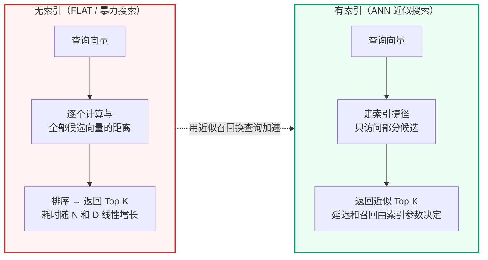
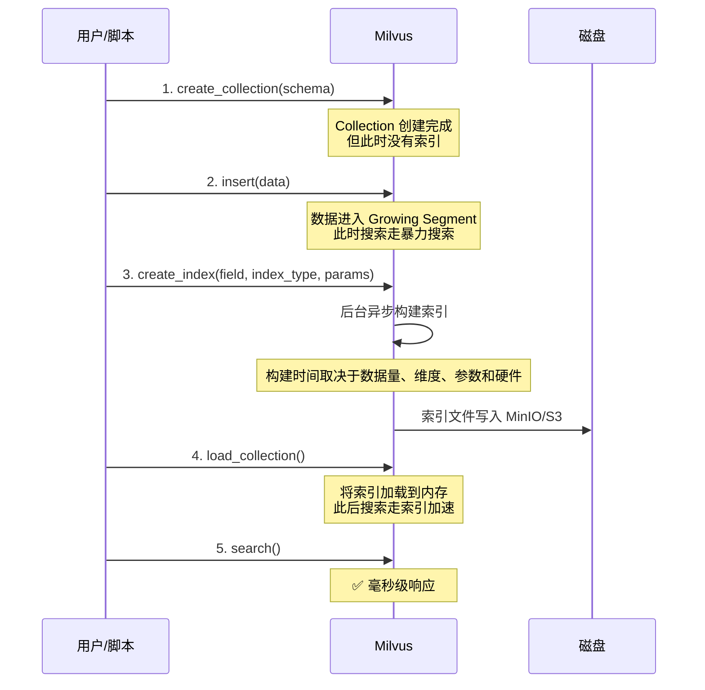
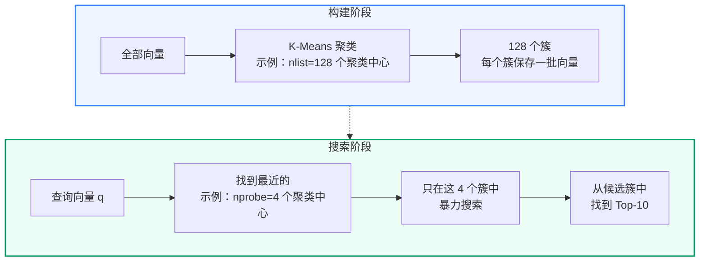
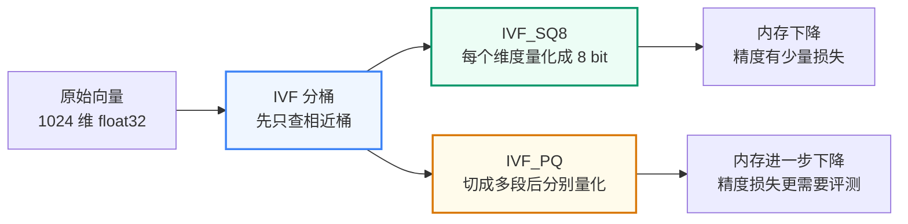
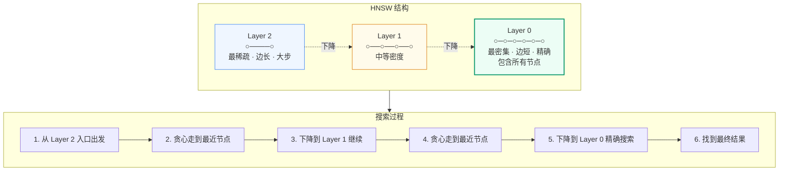
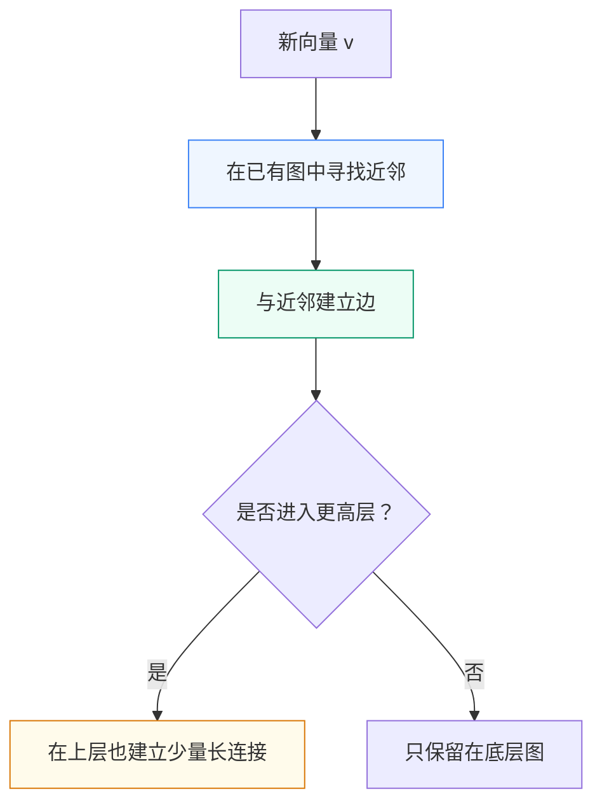
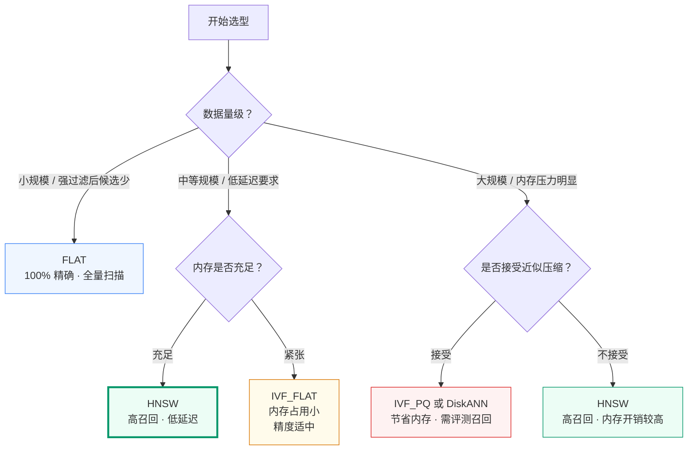
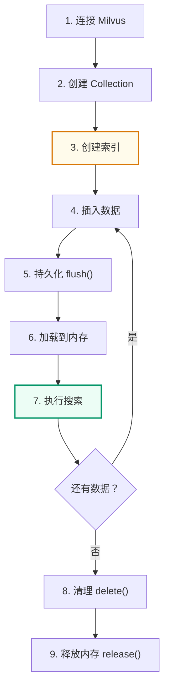
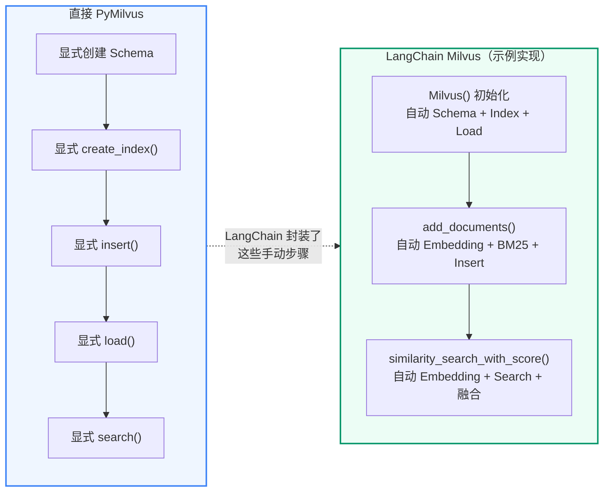

## 第一部分：Milvus 与向量数据库选型

### 1.1 Milvus 是什么

Milvus 是面向向量相似度检索的数据库。它不是普通文件索引，也不是只放 embedding 的缓存，而是一个能长期保存向量、文本和元数据，并支持高性能 Top-K 检索的独立基础设施。

在 RAG 系统里，用户问题会先被 embedding 模型转换成向量，知识库文档也会提前被转换成向量。Milvus 要解决的是：

```text
给定一个查询向量，在大量知识片段向量中快速找出最相似的 Top-K 候选，
同时还能按业务场景、知识库版本、租户、角色、source 等元数据做过滤。
```

实际应用中，Milvus 主要承担四类职责：

| 职责 | 在 RAG 链路中的作用 |
| --- | --- |
| 向量存储 | 保存 FAQ 和文档 chunk 的 dense 向量、sparse 向量、原文和 metadata |
| 相似度检索 | 根据用户问题召回语义相近的 FAQ / 文档候选 |
| 元数据过滤 | 通过 `kb_version`、`source`、`tenant_id`、`dataset_id`、`visibility`、`allowed_roles` 控制检索范围 |
| 混合检索 | 在同一个 collection 内同时使用 Dense 语义召回和 BM25 Sparse 关键词召回 |

所以，Milvus 在系统里不是“可有可无的存储组件”，而是在线知识问答链路的核心检索引擎。

### 1.2 为什么示例实现需要服务化向量数据库

RAG 基础原理已经解释向量数据库在 RAG 中的基本职责。本节只回答系统选型问题：为什么这里需要可独立部署、支持长期运行和治理的向量数据库，而不是本地索引文件。

普通关系型数据库擅长结构化查询，例如按订单号、用户 ID、时间范围查数据。RAG 检索面对的是自然语言相似性问题，核心查询方式不是 `where id = ?`，而是：

```text
search(query_vector, top_k=10, filter="kb_version == ... and source == ...")
```

如果不用向量数据库，常见替代方式会遇到边界：

| 方案 | 能做什么 | 边界 |
| --- | --- | --- |
| MySQL / PostgreSQL 普通表 | 存原文、存元数据、做精确过滤 | 不擅长大规模向量 Top-K 相似度检索 |
| 传统全文检索 | 关键词匹配、倒排索引、BM25 | 对同义表达、语义改写和多语言表达不够稳定 |
| 本地向量索引文件 | 快速做单机向量实验 | 缺少服务化、多集合、权限过滤、版本治理和运维能力 |
| 向量数据库 | 向量检索、元数据过滤、服务化部署、集合管理 | 需要额外部署和维护 |

企业级 RAG 不只是“能把向量查出来”，还要求：

- 数据可以按业务场景、版本、租户、角色隔离。
- 检索链路可以长期运行，而不是每次启动重新加载本地索引文件。
- 新旧知识库版本可以共存，active 指针切换后不影响历史版本。
- 检索失败、schema 不匹配、collection 缺失可以被明确发现。
- 后续能接质量评测、Trace、治理页和运维监控。

这些要求决定了示例实现需要服务化向量数据库，而不是只用一个本地向量索引库。

### 1.3 可用向量数据库与检索后端对比

向量数据库选型没有绝对最优，只有是否匹配当前实现的约束。下面是企业 RAG 系统中常见候选方案：

| 方案 | 类型 | 优点 | 主要边界 | 更适合的场景 |
| --- | --- | --- | --- | --- |
| FAISS | 本地向量索引库 | 性能强、适合离线实验和算法验证 | 不是数据库，缺少服务化、多租户、元数据治理和在线运维能力 | 单机 demo、召回算法实验、离线评测 |
| Chroma | 轻量向量库 | 上手快，适合快速原型 | 企业级部署、治理、复杂过滤和大规模稳定性需要谨慎评估 | 小型原型、早期 demo |
| pgvector | PostgreSQL 插件 | 和 PostgreSQL 事务、SQL、权限体系集成方便 | 向量检索和混合检索能力受数据库设计边界影响，高并发大规模场景需要压测 | 已经以 PostgreSQL 为中心的业务系统 |
| Elasticsearch / OpenSearch | 搜索引擎 + 向量检索 | 全文检索、日志搜索、过滤和聚合能力强 | 向量 RAG 的 collection/schema、embedding 写入、混合融合需要更多工程适配 | 关键词搜索强需求、已有 ES/OpenSearch 基础设施 |
| Qdrant | 向量数据库 | API 简洁，过滤能力强，部署轻量 | 与示例实现当前 LangChain + Milvus Hybrid Search 代码不直接对齐 | 轻量服务化向量检索、Rust 技术栈偏好 |
| Weaviate | 向量数据库 | schema、GraphQL、模块生态较完整 | 部署和模块配置复杂度相对更高 | 需要 schema 化知识对象和模块生态的系统 |
| Milvus | 向量数据库 | 面向大规模向量检索，支持 collection/schema/index/load、metadata filter、Docker Compose 生态和 Dense + Sparse 混合检索 | 需要部署 etcd/MinIO/Milvus，学习曲线高于轻量库 | 多场景企业 RAG、版本治理、混合检索、权限过滤 |

示例实现选择 Milvus 的原因不是“Milvus 永远最好”，而是它和系统目标匹配：

1. **多业务场景隔离**：每个场景可以配置独立 FAQ collection 和文档 collection。
2. **版本治理友好**：`kb_version`、`version_seq`、`valid_from_seq`、`valid_to_seq` 可以写入 metadata，并在检索表达式里过滤。
3. **数据域过滤清楚**：租户、数据集、可见级别、角色可以统一转换成 Milvus boolean expr。
4. **混合检索能力直接可用**：Milvus 2.5+ 支持 BM25 Function，系统可以把 Dense 语义召回和 Sparse 关键词召回放到同一检索后端。
5. **部署形态贴近企业系统**：Docker Compose 中 Milvus、etcd、MinIO 独立运行，和 MySQL、FastAPI 分工清楚。
6. **适合讲清底层机制**：Collection、Schema、Field、Index、Load、Search 都能用 PyMilvus 明确演示，再进入Milvus 混合检索深度解析的 `MilvusHybridStore` 封装。

### 1.4 实际应用中 Milvus 的代码落点

PyMilvus 用于展示底层概念与操作，MilvusHybridStore 将这些能力封装为业务检索接口。代码对应关系如下：

| 系统文件 | 与 Milvus 的关系 |
| --- | --- |
| `docker-compose.yml` | 启动 Milvus、etcd、MinIO 基础服务 |
| `scripts/demo/demo_ch04_milvus_basics.py` | Milvus 索引机制与基本操作可运行 demo，演示 Collection 创建、HNSW 索引、插入、搜索、清理 |
| `qa_core/retrieval/milvus_compat.py` | 管理 Milvus 连接参数、database、BM25 Function |
| `qa_core/retrieval/store.py::MilvusHybridStore` | 示例实现 FAQ/文档混合检索的统一封装 |
| `qa_core/retrieval/filters.py` | 把 `kb_version`、`source`、DataScope 转成 Milvus 过滤表达式 |
| `scripts/rebuild_kb_version.py` | 重建知识库版本时写入 FAQ 和文档 chunk 到 Milvus |
| `scenarios/*/scenario.toml` | 声明每个业务场景使用的 FAQ collection 和文档 collection |


---

## 第二部分：向量索引的本质

### 2.1 为什么需要索引



**索引的本质**：用额外的存储空间和构建时间，换取查询时的大幅加速。类比：

- 无索引 = 在未排序的书架上逐本翻找
- 有索引 = 先查图书馆目录卡片，按索书号直接走到对应书架

### 2.2 索引在什么时候构建



**关键点**：

- 创建 Collection 时不会自动建索引——必须显式调用 `create_index()`
- 索引构建是**异步**的——调用 `create_index()` 后立即返回，Milvus 在后台构建
- 必须先 `load_collection()` 将索引加载到内存，才能使用索引加速搜索

---

## 第三部分：主流索引类型图解

> **数字口径说明**：本节会出现两类数字。`nlist`、`nprobe`、`M`、`efConstruction`、`ef` 这类参数范围来自 Milvus 官方文档；规模线、耗时和硬件容量只能作为示例或系统经验估算，不能当成官方标准。实际环境必须结合向量维度、过滤条件、QPS、硬件、collection/segment 状态和压测结果重新校准。

### 3.1 FLAT — 暴力搜索

```yaml
FLAT 不做任何索引优化。搜索时逐条计算距离。

数据: [v1, v2, v3, v4, v5, ..., v1000000]
查询: q
      ↓
      q 与 v1 计算距离
      q 与 v2 计算距离
      ...
      q 与 v1000000 计算距离
      ↓
      排序 → 取 Top-10

✅ 精度 100%（找到的一定是最近邻）
❌ 速度最慢 O(N×D)
🎯 适用：需要 100% 精确召回的小规模数据、离线评测基准，或强过滤后候选集很小的场景
```

注意：Milvus 官方只明确 FLAT 是 exhaustive search / brute-force search，精确但慢，不适合 massive vector data；官方没有给出“少于 1 万就用 FLAT”这种固定阈值。内容或系统中出现的“1 万”只能解释为单机本地环境下的保守经验线，不是通用结论。

### 3.2 IVF_FLAT — 倒排索引 + 暴力搜索



**用二维坐标看清 IVF 的倒排表**

假设只有 6 个二维向量，方便直接画在平面上：

| 向量 ID | 坐标 `(x, y)` |
| --- | --- |
| `V1` | `(0.1, 0.2)` |
| `V2` | `(0.2, 0.1)` |
| `V3` | `(0.3, 0.3)` |
| `V4` | `(9.9, 10.1)` |
| `V5` | `(10.2, 9.8)` |
| `V6` | `(10.5, 10.5)` |

设置 `nlist = 2` 时，K-Means 会先把整体空间聚成两个区域。示例中可以理解为两个聚类中心：

| 聚类中心 | 坐标 `(x, y)` | 代表区域 |
| --- | --- | --- |
| `C0` | `(0.2, 0.2)` | 左下角的一组向量 |
| `C1` | `(10.2, 10.1)` | 右上角的一组向量 |

然后系统遍历所有向量，把每个向量挂到最近的聚类中心下面：

```text
V1 / V2 / V3 整体上离 C0 更近 → 进入 C0 的倒排列表
V4 / V5 / V6 整体上离 C1 更近 → 进入 C1 的倒排列表
```

此时 IVF 的倒排索引可以简化理解为：

| 倒排表 Key | 倒排表 Value |
| --- | --- |
| `C0` | `[V1, V2, V3]` |
| `C1` | `[V4, V5, V6]` |

这里最容易误解的一点是：IVF 的倒排表不是按向量内部的某一维特征建的。它不是 `x = 0.1 -> [V1]`、`y = 0.2 -> [V1]` 这种结构。IVF 的 Key 是“聚类中心编号”，Value 是“属于这个聚类区域的向量 ID 或向量位置”。算法关心的是一个向量整体上离哪个中心更近，而不是某一维的具体取值。

查询时也沿用这张倒排表。假设查询向量 `Q = (0.25, 0.25)`，并设置 `nprobe = 1`：

1. 先计算 `Q` 到两个聚类中心的距离，发现 `Q` 离 `C0` 更近。
2. 拿 `C0` 去倒排表中取出候选列表 `[V1, V2, V3]`。
3. 只在这三个候选里执行 FLAT 暴力距离计算，排序后返回 Top-K。

所以，IVF_FLAT 中的“倒排索引”可以记成一句话：**簇号到成员向量列表的映射**。它先用聚类中心缩小搜索范围，再在被选中的桶内保留原始向量并做精确距离计算。

**核心参数**：

| 参数 | 含义 | 官方范围 / 调参方向 |
| --- | --- | --- |
| `nlist` | 聚类中心数 | Milvus 文档给出的取值范围是 `[1, 65536]`，默认值 `128`，常用建议范围是 `[32, 4096]`；值越大，簇更细，构建时间和索引体积也更高 |
| `nprobe` | 搜索时探测的聚类数 | Milvus 文档给出的取值范围是 `[1, nlist]`，默认值 `8`；值越大，召回率更高，查询延迟也更高；它通常是在线查询阶段最直接的调参旋钮 |

**IVF 参数怎么调**

- `nlist` 更像“离线建库时的分桶颗粒度”。它决定了索引要先把向量切成多少个簇，直接影响构建时间、索引大小和每个桶的拥挤程度。
- `nprobe` 更像“在线查询时的扫桶宽度”。它决定一次查询要检查多少个簇，几乎直接决定召回率和延迟的平衡。
- 一般先固定一个不过分极端的 `nlist`，再围绕 `nprobe` 做召回和延迟的折中；如果 `nlist` 变化，通常意味着需要重建索引，而 `nprobe` 可以按查询或环境单独调整。
- 召回不足时，优先增大 `nprobe`；构建过慢或索引过大时，优先检查 `nlist` 是否过高；如果延迟已经很高但召回足够，先减小 `nprobe`。

| 现象 | 优先动作 | 解释 |
| --- | --- | --- |
| 召回偏低，但延迟还能接受 | 增大 `nprobe` | 先扩大查询覆盖面，再看是否需要改 `nlist` |
| 构建时间太长、索引文件过大 | 适当减小 `nlist` | 分桶太细会抬高建库和存储成本 |
| 延迟偏高，但召回已经够用 | 减小 `nprobe` | 少扫一些桶，查询会更快 |
| 需要更强压缩、内存压力明显 | 评估 `IVF_SQ8` / `IVF_PQ` | 压缩可以降内存，但要重新验证召回 |

```text
✅ 通常比 FLAT 更快
✅ 内存占用比 HNSW 小
❌ 精度取决于 nprobe（可能漏掉边界附近的向量）
🎯 适用：希望在召回率、内存和查询延迟之间做平衡的场景
```

### 3.3 IVF_SQ8 / IVF_PQ — 倒排索引 + 量化压缩

先记住一句话：

> IVF 负责“少查一些桶”，SQ8/PQ 负责“每个向量少占一点内存”。

IVF_FLAT 只做聚类分桶，桶里的向量仍然以原始 float32 保存。IVF_SQ8 和 IVF_PQ 在 IVF 的基础上继续压缩向量，所以它们解决的核心问题不是“怎么更聪明地找桶”，而是“桶里的向量太多、太占内存怎么办”。



**沿用上面的二维例子：倒排列表里存什么**

IVF_SQ8 和 IVF_PQ 仍然先走同一套 IVF 分桶逻辑：`C0 -> [V1, V2, V3]`、`C1 -> [V4, V5, V6]`。它们和 IVF_FLAT 的区别不在“是否聚类”，而在每个倒排列表里保存的向量表示不同，桶内距离计算方式也不同。

| 索引类型 | 倒排列表里保存的内容 | 查询 `Q = (0.25, 0.25)` 时怎么比较 |
| --- | --- | --- |
| `IVF_FLAT` | 原始 float 向量，例如 `V1 = (0.1, 0.2)` | 在选中的桶内直接计算原始向量距离，结果最精确 |
| `IVF_SQ8` | 每一维量化后的 8 bit 编码，例如 `V1 -> [64, 128]` | 把查询也量化后，用压缩表示近似计算距离，内存更省但有舍入误差 |
| `IVF_PQ` | 分段量化后的码本编号，例如 `V1 -> [0, 1]` | 先算查询到各段码本中心的距离表，再按编号查表求和，压缩更强但误差更依赖参数 |

可以把三者的差别理解为：

```text
IVF_FLAT：先少查桶，桶里仍然存原始向量
IVF_SQ8 ：先少查桶，桶里存每一维压缩后的整数编码
IVF_PQ  ：先少查桶，桶里存每个子向量对应的码本编号
```

**IVF_SQ8：Scalar Quantization，逐维压缩**

SQ8 可以理解成“把每一维的小数压缩成 8 bit 编码”。原始向量每一维通常是 float32，占 4 字节；SQ8 会把每一维映射到 0-255 的整数区间，占 1 字节。这样向量主体存储会明显变小，但距离计算不再完全基于原始浮点数，因此召回率需要用评测集验证。

```text
原始向量：
[0.1234, -0.5521, 0.0388, ...]  每维 float32

SQ8 压缩后：
[138,     42,      117,   ...]  每维 uint8

搜索时：
先找最近的 IVF 桶 → 在桶内用量化后的向量近似计算距离 → 返回 Top-K
```

继续用二维例子理解：如果 `C0` 桶内每一维的有效范围近似是 `0.0` 到 `0.4`，就可以用下面这个简化公式把一维 float 压缩成 0-255 的整数：

```text
quantized_value = round((value - min_value) / (max_value - min_value) * 255)
```

那么 `C0` 桶里的三个向量可以近似编码为：

| 向量 ID | 原始坐标 | SQ8 编码 |
| --- | --- | --- |
| `V1` | `(0.1, 0.2)` | `[64, 128]` |
| `V2` | `(0.2, 0.1)` | `[128, 64]` |
| `V3` | `(0.3, 0.3)` | `[191, 191]` |

此时倒排列表可以理解为：

```text
C0 -> [(V1, [64, 128]), (V2, [128, 64]), (V3, [191, 191])]
C1 -> [(V4, ...),       (V5, ...),       (V6, ...)]
```

查询 `Q = (0.25, 0.25)` 到来时，流程和 IVF_FLAT 很像，只是桶内比较方式变了：

1. 先计算 `Q` 到 `C0`、`C1` 的距离，`nprobe = 1` 时仍然选择 `C0`。
2. 把 `Q` 也量化成约 `[159, 159]`。
3. 只在 `C0` 的三个压缩候选里比较 `[159, 159]` 和 `[64,128]`、`[128,64]`、`[191,191]`。
4. 得到近似距离排序，示例中 `V3` 会更接近 `Q`。

所以 IVF_SQ8 的结构可以记成：

```text
聚类中心编号 -> 这个桶里的向量 ID + 每维 8 bit 压缩编码
```

这个例子只用于解释“逐维压缩”的方向，真实量化范围、残差处理和距离计算细节由 Milvus 索引实现负责。

**IVF_PQ：Product Quantization，分段压缩**

PQ 的压缩更激进。它不是逐维单独压缩，而是先把一个高维向量切成多段，每一段用一个“码本”表示。存储时不再保存每段的原始浮点值，而是保存“这一段最像码本里的第几个中心”。

以 1024 维向量为例：

```text
原始向量：
1024 维 float32

切成 m=64 段：
每段 16 维

每段用 nbits=8 编码：
每段只保存 1 个 code

最终主体编码：
64 个 code，而不是 1024 个 float32
```

仍然套回二维例子，可以把 `(x, y)` 临时看成两段：第一段是 `x`，第二段是 `y`。为了讲清楚机制，假设 `m = 2`、`nbits = 2`，也就是每个子空间有 4 个码本中心：

| 子空间 | code `0` | code `1` | code `2` | code `3` |
| --- | --- | --- | --- | --- |
| `x` 码本 | `0.1` | `0.2` | `0.3` | `10.2` |
| `y` 码本 | `0.1` | `0.2` | `0.3` | `10.1` |

这样，`C0` 桶里的向量可以被编码成：

| 向量 ID | 原始坐标 | PQ code |
| --- | --- | --- |
| `V1` | `(0.1, 0.2)` | `[0, 1]` |
| `V2` | `(0.2, 0.1)` | `[1, 0]` |
| `V3` | `(0.3, 0.3)` | `[2, 2]` |

此时倒排列表可以理解为：

```text
C0 -> [(V1, [0, 1]), (V2, [1, 0]), (V3, [2, 2])]
C1 -> [(V4, ...),    (V5, ...),    (V6, ...)]
```

查询 `Q = (0.25, 0.25)` 到来时，PQ 不需要把 `Q` 逐个还原后再和每个原始向量完整计算距离，而是先做两张很小的查表结果：

```text
Q.x 到 x 码本的距离：
code 0: (0.25 - 0.1)^2 = 0.0225
code 1: (0.25 - 0.2)^2 = 0.0025
code 2: (0.25 - 0.3)^2 = 0.0025

Q.y 到 y 码本的距离：
code 0: (0.25 - 0.1)^2 = 0.0225
code 1: (0.25 - 0.2)^2 = 0.0025
code 2: (0.25 - 0.3)^2 = 0.0025
```

然后按候选向量的 PQ code 查表相加：

| 候选 | PQ code | 近似距离计算 | 结果 |
| --- | --- | --- | --- |
| `V1` | `[0, 1]` | `x_code_0 + y_code_1` | `0.0225 + 0.0025 = 0.0250` |
| `V2` | `[1, 0]` | `x_code_1 + y_code_0` | `0.0025 + 0.0225 = 0.0250` |
| `V3` | `[2, 2]` | `x_code_2 + y_code_2` | `0.0025 + 0.0025 = 0.0050` |

示例中 `V3` 的近似距离最小，所以会排在更靠前的位置。注意这里比较的是“查询到码本中心的距离之和”，不是查询和原始 float 向量的完整距离。

所以 IVF_PQ 的结构可以记成：

```text
聚类中心编号 -> 这个桶里的向量 ID + 每个子向量的码本编号
```

这个例子只是帮助理解压缩方向，不是容量承诺。真实索引还包含 IVF 聚类中心、PQ 码本、主键、元数据和段管理开销。Milvus 官方参数里，`m` 表示 PQ 分段数量，并要求向量维度能被 `m` 整除；`nbits` 表示每个低维子向量编码使用的 bit 数，默认常见为 8。

**IVF_SQ8 和 IVF_PQ 的取舍**

| 对比项 | IVF_SQ8 | IVF_PQ |
| --- | --- | --- |
| 压缩方式 | 每一维从 float32 量化为 8 bit | 向量切成多段，每段用码本编号表示 |
| 内存节省 | 明显下降 | 通常比 SQ8 更省 |
| 召回损失 | 一般小于 PQ，但仍需评测 | 更依赖 `m`、`nbits` 和评测集 |
| 理解难度 | 相对容易 | 更复杂 |
| 适用场景 | 内存有压力，但希望保留相对稳定召回 | 数据规模更大、内存更紧张、能接受更强近似 |

不要把 SQ8/PQ 理解成“更高级所以更好”。它们的本质是压缩。压缩带来内存收益，也会带来距离近似误差。是否值得用，要看业务对召回率、延迟、内存成本的取舍。

### 3.4 HNSW — 分层可导航小世界图




HNSW 和 IVF 的思路完全不同：

- IVF 是“先聚类分桶，再只查少数桶”。
- HNSW 是“把向量组织成图，搜索时沿着越来越近的节点走”。

可以把 HNSW 想象成城市道路：

```text
高层图：高速路，节点少，跳得远，用来快速接近目标区域
中层图：主干路，节点变多，继续缩小范围
底层图：街区路，包含全部节点，在附近精细搜索
```

为了和前面的 IVF 例子对齐，下面仍然使用这 6 个二维向量：

| 向量 ID | 坐标 `(x, y)` |
| --- | --- |
| `V1` | `(0.1, 0.2)` |
| `V2` | `(0.2, 0.1)` |
| `V3` | `(0.3, 0.3)` |
| `V4` | `(9.9, 10.1)` |
| `V5` | `(10.2, 9.8)` |
| `V6` | `(10.5, 10.5)` |

IVF 会把它们分到 `C0`、`C1` 两个桶里；HNSW 不建桶，而是把每个向量变成图节点，再给相近节点之间连边。为了便于讲解，假设最后形成了这样一个简化 HNSW 图：

```text
Layer 2:
  V5

Layer 1:
  V5 ----- V2 ----- V3

Layer 0:
  V1 ----- V2 ----- V3 ----- V4 ----- V5 ----- V6
   \_______________/          \_______________/
```

这张图不是 Milvus 对这 6 个点的固定输出，只是讲解用的简化结构。真实 HNSW 会受到插入顺序、随机层高、`M`、`efConstruction` 和内部邻居选择策略影响。

### 3.4.1 HNSW 是怎么建出来的

构建 HNSW 时，每个向量会变成图里的一个节点。新节点插入时，会在图中寻找离它比较近的已有节点，并建立连接。不是每个节点都出现在所有层：

- 最底层包含全部向量。
- 越往上，节点越少。
- 上层负责快速跳转，下层负责精细搜索。



**构建示例：把 `V3 = (0.3, 0.3)` 插入 HNSW**

假设当前图里已经有 `V1`、`V2`、`V4`、`V5`、`V6`，入口点是高层的 `V5`。为了方便观察，假设参数大致是：

```text
M = 2
efConstruction = 3
V3 被随机分配到最高 Layer 1
```

插入 `V3` 时，可以按下面的流程理解：

1. 从当前最高层入口 `V5` 开始，用 `V3` 作为“查询向量”在已有图里找近邻。
2. 在 Layer 1 中，`V5` 很远，沿边看到 `V2` 更接近 `V3`，于是移动到 `V2`。
3. Layer 1 已经没有更近节点，就从 `V2` 下降到 Layer 0。
4. 在 Layer 0 中，以 `efConstruction = 3` 的候选宽度继续找附近节点，候选里可能包含 `V1`、`V2` 和较远的桥接节点。
5. 根据距离选出最多 `M = 2` 个近邻，在 Layer 0 给 `V3` 连接 `V1`、`V2`。
6. 因为 `V3` 的最高层是 Layer 1，所以还会在 Layer 1 给 `V3` 连接靠近它的节点，例如 `V2`。
7. 如果某些旧节点的边超过 `M`，算法会按规则修剪边，尽量保留更有用的邻居。

插入后，局部结构可以简化成：

```text
Layer 1:
  V5 ----- V2 ----- V3

Layer 0:
  V1 ----- V2 ----- V3
   \_______________/
```

这个过程的重点不是“每条边一定长这样”，而是：**HNSW 建索引时就在提前铺路**。它通过插入、找近邻、连边、修剪，把未来查询可能走的路径预先保存在图结构里。

这就是为什么 HNSW 的构建成本和内存占用会比较高：它不只是保存向量，还要保存节点之间的连接关系。

### 3.4.2 HNSW 是怎么查的

查询时，HNSW 不会从底层全量扫描开始，而是从上层入口点开始：

```text
1. 从最高层入口节点出发
2. 在当前层贪心移动：只要邻居更接近查询向量，就走过去
3. 当前层走不动了，就下降一层
4. 重复上面的过程
5. 到最底层后，保留一批候选节点，返回 Top-K
```

**查询示例：用 `Q = (0.25, 0.25)` 搜索**

继续使用上面的简化图，假设入口点仍然是 Layer 2 的 `V5`，查询参数里 `ef = 3`、`top_k = 2`。

先看几个关键距离的直觉：

| 节点 | 坐标 | 到 `Q` 的平方距离 |
| --- | --- | --- |
| `V5` | `(10.2, 9.8)` | 很大 |
| `V2` | `(0.2, 0.1)` | `0.0250` |
| `V3` | `(0.3, 0.3)` | `0.0050` |
| `V1` | `(0.1, 0.2)` | `0.0250` |

搜索过程可以这样走：

1. 从 Layer 2 的入口 `V5` 出发，发现它离 `Q` 很远。
2. 下降到 Layer 1，沿着 `V5 -> V2` 走，因为 `V2` 明显更接近 `Q`。
3. 继续看 `V2` 的邻居，发现 `V3` 比 `V2` 更接近 `Q`，于是走到 `V3`。
4. Layer 1 没有更近节点后，从 `V3` 下降到 Layer 0。
5. 在 Layer 0 中，以 `ef = 3` 保留一个小候选池，检查 `V3` 附近的 `V1`、`V2`、`V4` 等邻居。
6. 最终候选大致是 `V3`、`V1`、`V2`，当 `top_k = 2` 时会返回 `V3` 和 `V1/V2` 中的一个；`V1` 与 `V2` 在这个例子里距离相同，实际排序会由实现细节和分数决定。

这和 IVF_FLAT 的查询路径非常不同：

```text
IVF_FLAT：Q -> 找最近的桶 C0 -> 扫 C0 桶里的向量
HNSW    ：Q -> 从高层入口出发 -> 沿图走向更近节点 -> 底层局部扩展候选
```

HNSW 快的原因是：它用上层图快速接近目标区域，再在底层图局部搜索。它不是全量扫描，也不是只查固定几个 IVF 桶。

**核心参数**：

| 参数 | 控制什么 | 调大后的变化 |
| --- | --- | --- |
| `M` | 每个节点最多连多少个邻居 | 图更密，召回可能更好；内存和构建成本上升 |
| `efConstruction` | 构建索引时为新节点寻找近邻的候选宽度 | 图质量可能更好；构建更慢 |
| `ef` / `efSearch` | 查询时在底层保留多少候选 | 召回可能更好；查询延迟上升 |

这些参数的默认值由当前 Milvus / langchain-milvus 版本和创建方式决定，不应在内容里当成固定标准。需要确认时，看 collection 的 index 描述。

**HNSW 参数调小/调大的直觉**

```text
M 太小：
  图太稀，可能找不到足够好的路径，召回下降

M 太大：
  图更密，搜索路径更多，但内存和构建时间增加

efConstruction 太小：
  建图时邻居找得不充分，图质量受影响

ef 太小：
  查询时候选太少，速度快但可能漏掉更好的近邻

ef 太大：
  查询更认真，召回更稳，但延迟上升
```

**为什么仍要重点理解 HNSW**

HNSW 是常用的高召回低延迟 ANN 索引，适合用来理解“向量索引用空间换查询速度”的核心思想。本文的 PyMilvus 原生 demo 会显式创建 HNSW，方便观察 `M`、`efConstruction`、`ef` 这些参数。

V1 系统主链路的 dense 侧也采用 HNSW；sparse 侧使用 Milvus BM25 Built-in Function。也就是说，当前正式配置是 `dense: HNSW + L2`、`sparse: BM25BuiltInFunction`。如果 collection 还是旧版本的索引配置，需要先删除旧 collection 再重建，HNSW 不会在已有 collection 上自动替换。

### 3.5 索引选型决策树



**分支一：小规模 / 强过滤后候选少 → FLAT**

FLAT 不做任何近似——逐条计算与全部向量的距离后排序返回。优势是 100% 精确，适合原型验证、离线评测基准、强过滤后候选集很小的场景。示例实现的单个场景 FAQ Collection 通常只有几十到几百条，在这个数量级上 FLAT 和 HNSW 的延迟差异通常不明显，但这仍然要以本机压测为准。

**分支二：中等规模 + 内存充足 → HNSW**

HNSW 是常用的高召回低延迟 ANN 索引。它预先构建多层"高速公路图"——上层节点少跳得远，下层节点密查得准。Milvus 官方口径是：HNSW 查询延迟低、搜索准确性好，但需要更高内存来维护图结构。示例实现当前 dense 主链路使用 HNSW，sparse 主链路使用 BM25BuiltInFunction；后续是否继续使用该配置、调整 `M`/`ef`，或切换到 IVF/DiskANN，仍要以容量估算和压测为准。

**分支三：内存更敏感 → IVF_FLAT**

用 K-means 聚类分桶，检索时只搜最近 N 个桶。内存比 HNSW 小（不需要存储图结构），但精度略低——查询向量落在桶边界附近时可能漏掉相邻桶中的近邻。

**分支四：大规模 / 内存压力明显 → IVF_PQ 或 DiskANN**

当向量规模继续扩大、内存成本成为主要瓶颈时，才考虑 IVF_PQ、DiskANN 等方案。IVF_PQ 通过量化压缩减少内存，DiskANN 将部分索引压力转移到 SSD。它们不是“规模一大就必选”，而是需要结合召回率目标、SSD 性能、过滤条件和压测结果来定。

---

## 第四部分：PyMilvus 基本操作与原生混合检索

这部分对应 `scripts/demo/demo_ch04_milvus_basics.py` 的流程：连接 Milvus、创建 Collection、创建 HNSW 索引、插入样本、执行搜索、清理临时 Collection。内容会把脚本中的步骤拆开解释，完整运行以实现内置 demo 为准。

```bash
python scripts/demo/demo_ch04_milvus_basics.py
```

理解这些基础步骤后，再看Milvus 混合检索深度解析中 langchain-milvus 的封装，就能知道系统检索代码底层发生了什么。

### 4.1 连接 Milvus

```python
from pymilvus import connections, MilvusClient

# 方式一：connections 模块（示例实现 LangChain 使用的方式）
connections.connect(
    alias="default",
    uri="http://127.0.0.1:19530",
    db_name="",
)

# 方式二：MilvusClient（新版 API，更简洁）
client = MilvusClient(uri="http://127.0.0.1:19530")

# 查看所有 Collection
collections = client.list_collections()
```

### 4.2 创建 Collection 和 Schema

```python
from pymilvus import Collection, CollectionSchema, FieldSchema, DataType

# 定义字段
pk_field = FieldSchema(name="pk", dtype=DataType.VARCHAR, is_primary=True, max_length=128)
text_field = FieldSchema(name="text", dtype=DataType.VARCHAR, max_length=65535)
dense_field = FieldSchema(name="dense", dtype=DataType.FLOAT_VECTOR, dim=1024)
sparse_field = FieldSchema(name="sparse", dtype=DataType.SPARSE_FLOAT_VECTOR)
source_field = FieldSchema(name="source", dtype=DataType.VARCHAR, max_length=64)
kb_version_field = FieldSchema(name="kb_version", dtype=DataType.VARCHAR, max_length=128)

# 创建 Schema
schema = CollectionSchema(
    fields=[pk_field, text_field, dense_field, sparse_field, source_field, kb_version_field],
    description="示例 FAQ 集合",
    enable_dynamic_field=True,
)

# 创建 Collection
collection = Collection(
    name="demo_collection",
    schema=schema,
    consistency_level="Session",
)
```

### 4.3 创建索引

```text
# 为 Dense 向量字段创建 HNSW 索引
dense_index_params = {
    "index_type": "HNSW",
    "metric_type": "COSINE",
    "params": {"M": 16, "efConstruction": 200},
}
collection.create_index(field_name="dense", index_params=dense_index_params)

# 为 Sparse 向量字段创建索引
sparse_index_params = {
    "index_type": "SPARSE_INVERTED_INDEX",
    "metric_type": "IP",
}
collection.create_index(field_name="sparse", index_params=sparse_index_params)
```

### 4.4 插入数据

```python
import numpy as np

entities = [
    ["doc_001", "doc_002", "doc_003"],  # pk
    [
        "入职流程包含以下步骤：1. 提交个人材料 2. 签订劳动合同 3. 办理社保",
        "员工报销需要准备发票原件、报销申请单、部门审批签字",
        "VPN 连接失败时，请先检查网络连接，然后尝试重启 VPN 客户端",
    ],  # text
    np.random.rand(3, 1024).tolist(),     # dense 向量（实际由 BGE-M3 生成）
    [{} for _ in range(3)],               # sparse 手动占位；自动生成必须配置 3.8 的 BM25 Function
    ["hr", "finance", "it"],              # source
    ["v1", "v1", "v1"],                   # kb_version
]

mr = collection.insert(entities)
print(f"插入了 {mr.insert_count} 条数据")
```

### 4.5 加载到内存并搜索

```text
# 必须先加载才能搜索
collection.load()

# 执行搜索
search_params = {"metric_type": "COSINE", "params": {"ef": 64}}
query_vector = np.random.rand(1, 1024).tolist()

results = collection.search(
    data=query_vector,
    anns_field="dense",
    param=search_params,
    limit=5,
    expr='source == "hr"',            # 标量过滤
    output_fields=["text", "source"],  # 返回字段
)

for hits in results:
    for hit in hits:
        print(f"  id={hit.id}, distance={hit.distance:.4f}")
        print(f"  text={hit.entity.get('text')[:50]}...")
```

### 4.6 删除数据

```text
# 按主键删除
collection.delete(ids=["doc_001", "doc_002"])

# 按表达式删除
collection.delete(expr='kb_version == "v1"')
```

### 4.7 完整流程串联



### 4.8 用 PyMilvus 直接实现混合检索

前面的 `collection.search()` 只查一个向量字段。真实 RAG 系统常常需要同时查两路：

- `dense`：语义向量，适合相似表达和改写。
- `sparse`：BM25 稀疏向量，适合关键词、编号、术语、制度名称。

如果完全不用 langchain-milvus，可以用 PyMilvus 明确写出“创建 schema → 配置 BM25 Function → 分别建 dense/sparse 索引 → 发起 hybrid_search → 融合排序”的过程。

```python
from pymilvus import (
    AnnSearchRequest,
    Collection,
    CollectionSchema,
    DataType,
    FieldSchema,
    Function,
    FunctionType,
    WeightedRanker,
)

fields = [
    FieldSchema(name="pk", dtype=DataType.VARCHAR, is_primary=True, max_length=128),
    FieldSchema(
        name="text",
        dtype=DataType.VARCHAR,
        max_length=65535,
        enable_analyzer=True,
        analyzer_params={"type": "chinese"},
    ),
    FieldSchema(name="dense", dtype=DataType.FLOAT_VECTOR, dim=1024),
    FieldSchema(name="sparse", dtype=DataType.SPARSE_FLOAT_VECTOR),
    FieldSchema(name="source", dtype=DataType.VARCHAR, max_length=64),
]

bm25 = Function(
    name="text_bm25",
    function_type=FunctionType.BM25,
    input_field_names="text",
    output_field_names="sparse",
)

schema = CollectionSchema(
    fields=fields,
    functions=[bm25],
    enable_dynamic_field=True,
    description="PyMilvus hybrid search demo",
)

collection = Collection("demo_hybrid_search", schema=schema, consistency_level="Session")

collection.create_index(
    field_name="dense",
    index_params={"index_type": "HNSW", "metric_type": "COSINE", "params": {"M": 16, "efConstruction": 200}},
)
collection.create_index(
    field_name="sparse",
    index_params={"index_type": "SPARSE_INVERTED_INDEX", "metric_type": "IP"},
)
```

插入时，业务代码只需要提供 `pk`、`text`、`dense` 和业务元数据。`sparse` 是 BM25 Function 的输出字段，由 Milvus 根据 `text` 自动生成，不需要手动传入。

```text
collection.insert(
    [
        {
            "pk": "doc_001",
            "text": "新人入职需要提交身份证、学历证明和银行卡信息。",
            "dense": dense_vectors[0],  # 实际系统中由 BGE-M3 生成
            "source": "hr",
        },
        {
            "pk": "doc_002",
            "text": "报销需要发票、审批单和部门负责人签字。",
            "dense": dense_vectors[1],
            "source": "finance",
        },
    ]
)
collection.flush()
collection.load()
```

检索时，PyMilvus 需要显式构造两路请求，再指定融合器：

```text
dense_request = AnnSearchRequest(
    data=[query_dense_vector],
    anns_field="dense",
    param={"metric_type": "COSINE", "params": {"ef": 64}},
    limit=20,
    expr='source == "finance"',
)

sparse_request = AnnSearchRequest(
    data=[query_text],
    anns_field="sparse",
    param={"metric_type": "IP"},
    limit=20,
    expr='source == "finance"',
)

results = collection.hybrid_search(
    reqs=[dense_request, sparse_request],
    rerank=WeightedRanker(0.55, 0.45),
    limit=5,
    output_fields=["text", "source"],
)
```

这段代码能看清混合检索的底层结构：

1. `dense_request` 负责语义召回。
2. `sparse_request` 负责关键词召回。
3. `WeightedRanker(0.55, 0.45)` 负责把两路结果按权重融合。
4. `expr` 负责 source、版本、租户、可见性等标量过滤。

PyMilvus 原生写法的优点是透明、可控，适合学习底层机制、排查 schema、做索引调参和性能压测；缺点是业务代码会变长，需要自己处理 embedding、BM25 Function、连接、schema 校验、结果转换和异常提示。

### 4.9 WeightedRanker 与 RRFRanker

Milvus 的 Hybrid Search 先得到 Dense 和 Sparse 两路候选，再用 ranker 合并排序。常见方案有两种：

| Ranker | 核心做法 | 优点 | 局限 | 适用场景 |
| --- | --- | --- | --- | --- |
| `WeightedRanker` | 对各路分数归一化后按权重加权求和 | 可以明确表达 Dense/Sparse 的业务偏好，便于解释和调参 | 依赖各路分数具有可比较性；权重变化需要评测 | 已知语义召回和关键词召回的相对重要性时 |
| `RRFRanker` | 主要按各路结果的名次计算 Reciprocal Rank，再融合名次 | 不依赖 Dense 与 Sparse 的原始分数尺度，跨检索器更稳健 | 不能直接表达“Dense 比 Sparse 更重要多少”，需要调 `k` 和结果名次 | 分数尺度明显不同、希望采用稳健名次融合时 |

官方机制、参数和 Python 用法参见：[Milvus Reranking：WeightedRanker 与 RRFRanker](https://milvus.io/docs/v2.5.x/reranking.md)。

#### 一个小例子

假设查询“无线耳机”得到以下两路排名：

```text
Dense：A(第1)、B(第2)、C(第3)、D(第4)
BM25：B(第1)、C(第2)、D(第3)、E(第4)
```

以 `k=60` 的 RRF 为例：

```text
A = 1/(60+1)                         ≈ 0.0164
B = 1/(60+2) + 1/(60+1)              ≈ 0.0325
C = 1/(60+3) + 1/(60+2)              ≈ 0.0320
D = 1/(60+4) + 1/(60+3)              ≈ 0.0315
E =                         1/(60+4) ≈ 0.0156
```

因此 RRF 排序为 `B > C > D > A > E`：B、C、D 同时出现在两路结果中，虽然没有比较原始分数，也能体现交叉命中优势。RRF 的 `k` 是平滑参数，不是业务置信度或相似度阈值。

WeightedRanker 则使用两路归一化后的分数：

```text
final_score = w_dense * normalized_dense_score
            + w_sparse * normalized_sparse_score
```

如果把 Dense 权重设为 `0.8`、BM25 权重设为 `0.2`，并且 A 的 Dense 分数明显高于其他候选，A 可能排在第一；如果提高 BM25 权重，关键词命中更好的 B 可能反超。这个例子用于理解“权重会改变排序”，不是 Milvus 的精确复算：Milvus 的实际分数归一化由其 ranker 实现负责，不能直接用简单 Min-Max 结果替代。

两种写法的基本形式如下：

```python
from pymilvus import RRFRanker, WeightedRanker

# 明确表达 Dense 比 Sparse 略重要
weighted_ranker = WeightedRanker(0.55, 0.45)

# 不指定各路权重，按结果名次融合；默认 k 通常为 60
rrf_ranker = RRFRanker()
```

选择原则可以简化为：

- 有明确业务优先级，且能够通过评测校准权重：选择 `WeightedRanker`。
- 各路分数尺度差异大、检索器重要性不明确，先求稳定融合：选择 `RRFRanker`。

示例实现 V1 选择 `WeightedRanker(0.55, 0.45)`，因为当前策略是 Dense 略优先于 BM25。`0.55/0.45` 是融合权重，不是概率；权重是否合理仍需用 Recall@K、MRR、关键词覆盖率、FAQ 误直出率和延迟验证。

注意，这里的两个 ranker 都属于 **Milvus 多路召回融合**。它们与后续的 BGE CrossEncoder Reranker 不是同一个阶段：CrossEncoder 会对已经融合出的候选文档进行 query-document 相关性精排。

---

## 第五部分：langchain-milvus 如何实现混合检索

> **上下文**：[LangChain 生态系统](/zh/notes/ambiguity-to-action) 已经建立了 VectorStore 抽象；本文先用 PyMilvus 展示 Milvus 的底层操作，再回到示例实现的 langchain-milvus 封装。这样你能理解"为什么示例代码中没有显式的 `create_collection()` 或 `create_index()` 调用"。

理解了上面的 PyMilvus 原生混合检索后，再看下面的 `Milvus()`、`add_documents()`、`similarity_search_with_score()`，就能知道 langchain-milvus 帮我们省掉了哪些重复代码。Milvus 混合检索深度解析会在完整 Hybrid Search 场景中再次使用这些封装。

### 5.1 初始化时的隐藏操作

```python
# Milvus 混合检索深度解析中的代码（qa_core/retrieval/store.py）
from qa_core.retrieval.milvus_compat import hybrid_index_params, hybrid_search_params

self._store = Milvus(
    embedding_function=get_embeddings(),
    builtin_function=bm25_function(),
    collection_name=self.collection_name,
    vector_field=["dense", "sparse"],
    index_params=hybrid_index_params(),
    search_params=hybrid_search_params(),
    text_field="text",
    primary_field="pk",
    auto_id=False,
    enable_dynamic_field=True,
    consistency_level="Session",
    drop_old=False,
)
```

这个封装对应 PyMilvus 里的多步操作：

```text
1. 用 PyMilvus 连接到 Milvus
2. 检查 Collection 是否存在
   ├─ 不存在 → 自动创建 Collection + Schema + HNSW(L2) + BM25(BM25BuiltInFunction) + load()
   └─ 存在 → 直接使用现有 Collection
3. 如果 drop_old=True → 先 drop 再重建（⚠️ 示例实现设为 False）
```

**这就是为什么示例代码中没有直接调用 `create_collection()` 或 `create_index()`**：常规创建和插入流程由 langchain-milvus 封装完成；系统通过 `index_params/search_params` 显式传入索引意图，只在 schema 校验、database 管理、重建 collection 等地方直接使用 PyMilvus。

在示例实现里，这段代码位于 `qa_core/retrieval/store.py::MilvusHybridStore.store`。它是 FAQ 集合和文档集合的统一检索入口。

### 5.2 add_documents() 的隐藏操作

```text
store.add_documents(documents=docs, ids=ids)
```

底层实际执行：

```text
1. 对每个 doc.page_content 调用 embedding_function → 生成 Dense 向量
2. Milvus 服务端 BM25BuiltInFunction 对 text 字段 → 生成 Sparse 向量
3. 将 Dense + Sparse + text + metadata 包装为 insert 请求
4. collection.insert(entities) → collection.flush()
```

在示例实现里，`scripts/rebuild_kb_version.py` 和 `scripts/rebuild_scenarios.py` 会通过检索封装把 FAQ 和文档 chunk 写入 Milvus。文档入库与索引链路会完整展开入库链路；本文只需要先知道：系统最终不是手写 `collection.insert()`，而是通过 `MilvusHybridStore.add_documents()` 写入。

### 5.3 similarity_search_with_score() 的隐藏操作

```text
store.similarity_search_with_score(
    query,
    k=20,
    expr=expr,
    ranker_type="weighted",
    ranker_params={"weights": [0.55, 0.45]},
)
```

底层实际执行：

```text
1. embedding_function.embed_query(query) 将 query 文本 → Dense 向量
2. 内置 BM25Function 将 query 文本 → Sparse 向量
3. 通过 PyMilvus 发起 dense/sparse 多向量搜索 → 标量过滤 → 加权融合
4. 结果包装为 [(Document, score), ...]
```

在示例实现里，这段调用位于 `qa_core/retrieval/store.py::MilvusHybridStore.search()`。系统还会在 LangChain 返回结果之后继续做两件事：

1. 转成实现内部的 `RetrievalHit`，避免上层业务直接依赖 langchain-milvus 的返回结构。
2. 按需调用 CrossEncoder reranker，对初始候选做二阶段重排。

注意：当前内容代码与示例实现现有 `langchain-milvus==0.2.2` 调用方式保持一致。后续如果升级到新的 reranker Function API，再把这里的 `ranker_type/ranker_params` 替换为新写法。

### 5.4 PyMilvus 与 langchain-milvus 对比



**PyMilvus 原生混合检索 vs langchain-milvus 混合检索**：

| 维度 | PyMilvus 原生写法 | langchain-milvus 写法 |
| --- | --- | --- |
| 代码透明度 | 每一步都显式写出来，适合学习和排障 | 细节被封装，业务代码更短 |
| Schema / 索引控制 | 更细，可以直接控制字段、索引、ranker | 通过封装参数控制，常规场景足够 |
| Embedding | 需要自己调用模型并组织向量 | 自动调用 `embedding_function` |
| BM25 Sparse | 需要自己配置 BM25 Function 和 sparse 搜索请求 | 通过 `builtin_function=BM25BuiltInFunction(...)` 收口 |
| 结果结构 | 返回 Milvus 原始命中，需要自己转换 | 返回 LangChain Document，方便接 RAG 链路 |
| 示例实现用途 | 连接、database、schema 校验、排障、底层机制验证 | FAQ/文档在线检索和入库主入口 |

---

## 第六部分：langchain-milvus 与 PyMilvus 的职责边界

### 6.1 示例实现为什么两者都存在

示例实现最终选择：**继续使用 langchain-milvus 作为业务检索入口，保留 PyMilvus 作为底层连接、database 管理和 schema 检查工具，不迁移为纯 PyMilvus 实现。**

原因是 `langchain-milvus` 不是独立驱动——它是套在 PyMilvus 之上的 LangChain VectorStore。业务代码面向 LangChain VectorStore，但底层连接、database、collection schema 仍然由 PyMilvus 完成。

这里的“适配层”不是为了兼容旧版本而额外凑出来的代码，而是职责边界：

- 业务检索要接 LangChain 的 `Document`、embedding、reranker 和 QAService，所以入口放在 langchain-milvus。
- Milvus 连接、database、BM25 Function、schema 检查属于数据库驱动层，放在 PyMilvus 相关工具里更清楚。
- 当 collection 结构不符合当前 Dense + BM25 Sparse 设计时，必须靠底层 schema 检查及时报错，不能让业务层悄悄切换到简化路径。

### 6.2 示例实现当前的稳定做法

适配代码集中在 `qa_core/retrieval/milvus_compat.py`：

```python
def langchain_connection_args() -> dict[str, str]:
    args = {"uri": settings.milvus_uri}
    if settings.milvus_database:
        args["db_name"] = settings.milvus_database
    return args
```

`MilvusHybridStore.store` 在首次创建 wrapper 时做三件事：

```text
if self._store is None:
    ensure_milvus_database()
    connection_args = langchain_connection_args()
    self._store = Milvus(...)
```

工程价值：

```text
store.py 仍表达"业务检索走 langchain-milvus"
milvus_compat.py 表达"BM25 Function、database、连接参数在这里收口"
系统不需要改成纯 PyMilvus
```

> 如果已经用了 LangChain Milvus，为什么还要导入 PyMilvus？ 答案：LangChain Milvus 是抽象层，不是底层驱动。抽象层让 RAG 好写，底层驱动负责连接、database 和 collection schema。系统用一个很薄的适配层把这些底层细节收口。

## 调参与性能提醒

本文不要求记固定耗时，也不把“多少条向量用什么索引”讲成死规则。索引效果要看自己的数据、向量维度、过滤条件、QPS、硬件和评测集。真正上线前，至少要同时观察四个指标：召回率、查询 P95、索引大小、构建时间。

本文先理解取舍关系即可：

| 变化 | 通常影响 |
| --- | --- |
| `nprobe` / `ef` 调大 | 召回更稳，查询更慢 |
| `M` / `efConstruction` 调大 | HNSW 图质量可能更好，构建和内存成本更高 |
| 使用 SQ8 / PQ | 内存下降，但召回损失必须评测 |
| 过滤条件更复杂 | 检索计划和查询延迟都可能变化 |

---
