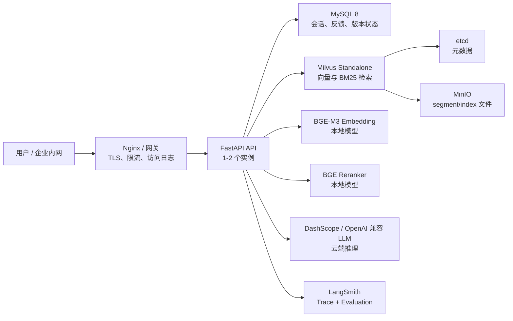

## 第一部分：可观测性的三个支柱

### 1.1 什么是可观测性

在 RAG 系统中，用户说"答案不对"，单看最终回答无法判断问题出在哪里：

```text
答案不对的 5 种可能原因：
1. 意图识别错了（本该 FAQ 直出，却走了文档 RAG）
2. source 推断错了（该搜 HR 文档却搜了 IT 文档）
3. 检索召回了无关内容（Embedding 或 BM25 失效）
4. 上下文构建截断了关键信息（max_context_chars 太小）
5. LLM 生成了幻觉（Prompt 约束不够）
```

没有可观测数据，你只能**猜测**。有了可观测数据，你可以**定位**。

### 1.2 示例实现的可观测架构

示例实现采用 **轻量观测适配** 架构——业务代码只负责整理领域 metadata；本地默认通过评测报告、状态接口和日志完成闭环，企业环境可以把 Trace 存储、查询、可视化、协作标注和实验对比交给 LangSmith。

```text
RAG 运行时                     可选 LangSmith 平台
┌──────────────────┐          ┌─────────────────────┐
│ record_query_trace│  ───→   │ Trace 存储 + 过滤    │
│ (adapter)        │  metadata│ Dataset 管理         │
│                  │          │ Evaluation 自动评分   │
│ langsmith_status()│          │ 协作标注             │
└──────────────────┘          └─────────────────────┘
```

**核心原则**：系统不把 LangSmith 作为本地验收前置条件。本地质量闭环由RAG 回归验收与入库质量的 `reports/evaluation/`、`eval_sets/` 和 Gate 脚本完成；LangSmith 负责企业环境里的页面化 Trace、团队协作标注和实验趋势对比。

---

## 第二部分：langsmith_adapter.py — 核心代码

系统中与 LangSmith 交互的唯一模块是 `qa_core/observability/langsmith_adapter.py`（147 行）。它包含四个函数：

### 2.1 环境配置：configure_langsmith_environment()

```python
# qa_core/observability/langsmith_adapter.py
def configure_langsmith_environment() -> None:
    settings = get_settings()
    os.environ.setdefault("LANGSMITH_TRACING", "true" if settings.langsmith_tracing else "false")
    if settings.langsmith_api_key:
        os.environ.setdefault("LANGSMITH_API_KEY", settings.langsmith_api_key)
    if settings.langsmith_project:
        os.environ.setdefault("LANGSMITH_PROJECT", settings.langsmith_project)
    if settings.langsmith_endpoint:
        os.environ.setdefault("LANGSMITH_ENDPOINT", settings.langsmith_endpoint)
```

在 `app.py` 启动时调用一次，将 Pydantic Settings 中的 LangSmith 配置写入环境变量，使 LangChain 集成能自动感知。

### 2.2 开关检测：langsmith_enabled()

```python
def langsmith_enabled() -> bool:
    settings = get_settings()
    return bool(settings.langsmith_tracing and settings.langsmith_api_key)
```

所有 trace 写入操作的守卫。LangSmith 未启用时直接跳过，不影响请求主链路。

### 2.3 状态查询：langsmith_status()

返回轻量状态字典供状态页使用，包含 `provider`、`enabled`、`project`、`endpoint` 和系统 URL。

### 2.4 核心函数：record_query_trace()

```python
def record_query_trace(
    *,
    trace_id: str,
    session_id: str,
    question: str,
    answer: str,
    hit_type: str,
    scenario,
    data_scope: dict[str, Any],
    source_filter: str | None,
    kb_version: str,
    rewritten_query: str | None,
    intent: dict[str, Any] | None,
    retrieval: dict[str, Any] | None,
    sources: list[dict[str, Any]],
    elapsed_ms: float,
    error: str | None = None,
) -> None:
```

**执行流程**：

1. `configure_langsmith_environment()` — 确保环境变量已注入
2. `langsmith_enabled()` 检查 → 未启用直接返回
3. 构建 `metadata` 字典（18 个业务字段，见下方）
4. 构建 `inputs`（question / scenario_id / source_filter / kb_version）
5. 构建 `outputs`（answer_preview[:800] / hit_type / sources / error）
6. 通过 `langsmith.run_helpers.trace()` 上下文管理器写入 LangSmith
7. 异常只记日志不抛出——trace 写入失败不影响用户请求

### 2.5 写入 LangSmith 的业务 metadata

```text
metadata = {
    "trace_id": trace_id,           # 与实现内部 trace_id 一致，可跨系统关联
    "session_id": session_id,
    "scenario_id": ...,             # 当前业务场景
    "scenario_name": ...,
    "source_filter": ...,           # 前端选择的业务分类
    "effective_source": ...,        # 最终生效的 source 过滤
    "kb_version": ...,              # 知识库版本号
    "tenant_id": ...,               # 数据隔离四维
    "dataset_id": ...,
    "visibility": ...,
    "user_role": ...,
    "intent": ...,                  # 意图分类结果
    "intent_reason": ...,           # 意图判断原因（rule / llm_structured）
    "hit_type": ...,                # faq_direct / rag / insufficient_context
    "prompt_profile": ...,          # 使用的 Prompt 档位
    "question_category": ...,       # 风险类别（pricing / compliance / ...）
    "sources_count": ...,           # 引用来源数量
    "top_source_score": ...,        # 最高来源检索相关性分数
    "answer_confidence": ...,       # 最终答案综合置信度，含 evidence_confidence / generation_verification
    "evidence_confidence_score": ...,
    "generation_verification_status": ...,
    "generation_verification_score": ...,
    "cache": ...,                   # 缓存开关、命中次数、命中阶段
    "first_token_ms": ...,          # 首 token 延迟
    "stage_timings_ms": ...,        # 各阶段耗时
    "slowest_stage": ...,           # 最慢阶段
    "elapsed_ms": ...,              # 总耗时
    "error": ...,                   # 错误信息（如有）
}
```

**设计要点**：

- **metadata 不存完整 prompt/上下文**——敏感资料（合同条款、薪酬信息）不应进入外部平台
- **trace_id 使用系统 UUID**——可在 LangSmith UI 中搜索 `trace_id` 直接定位
- **tags** 自动包含 `scenario_id` 和 `hit_type`，支持在 LangSmith 中按场景和命中路径过滤
- **LangSmith SDK 懒加载**——只有启用 Trace 且 API Key 存在时才导入 `langsmith.run_helpers.trace`；本地没装 LangSmith 或版本不匹配时只记录 warning，不影响问答链路和本地评测

缓存诊断也在 `retrieval.cache` 中展示。排查性能时先看：

| 字段 | 含义 |
| --- | --- |
| `enabled` | 当前请求是否启用缓存 |
| `hit_count` / `miss_count` | FAQ/Doc 检索阶段命中与未命中次数 |
| `events[].stage` | 命中发生在哪个阶段，例如 `faq_retrieval`、`doc_retrieval` |
| `events[].key_digest` | 缓存 key 摘要，不暴露用户原文和权限明文 |

如果用户反馈“同样问题有时快有时慢”，先看 `cache.hit_count` 和 `slowest_stage`。版本刚切换后缓存未命中是正常现象；新版本热起来后命中率会恢复。

FAQ 快速探测的请求内候选复用还要结合以下字段判断：

| 字段或阶段 | 看到它代表什么 | 正常预期 |
| --- | --- | --- |
| `faq_fast_retrieval` | 路由层用原问题做了一次精确 FAQ 探测 | 短 FAQ 候选问题可能出现；精确命中后直接结束 |
| `faq_reused_from_fast_path=true` | 探测未精确命中，但原问题候选被主链路接管 | 后续 FAQ 不应再完整重查原问题 |
| `faq_variant_retrieval` | 主链路仅为新增查询变体补查 FAQ | `faq_incremental_variant_queries` 列出实际补查的变体 |
| `faq_reuse_reason=full_faq_search_required` | 候选不能安全复用 | 常见于追问改写、来源过滤变化或 fast top_k 不足，完整重查是正确行为 |

页面诊断中的“FAQ 复用”与上述字段一一对应。这里要区分两种耗时：`faq_fast_retrieval` 是路由层已经花掉的时间，`faq_variant_retrieval` 是补查变体的时间；它们不会合并成第二次原问题 Milvus 查询。

---

## 第三部分：线上 Trace 如何交接给质量闭环

RAG 回归验收与入库质量已经完整讲过 Bad Case 如何复核、进入 `eval_sets/`、参与 Evaluation 和 Gate。本文不重复评测闭环，只回答生产现场更常见的问题：

```text
线上出现一次异常回答，如何快速判断问题出在哪里？
```

### 3.1 线上定位先看哪些字段

一次线上问答写入 LangSmith 后，先按下面顺序看 Trace metadata：

| 排查顺序 | 字段 | 判断什么 | 常见结论 |
| --- | --- | --- | --- |
| 1 | `error` | 是否运行异常 | 代码、依赖、模型服务或网络问题 |
| 2 | `hit_type` | 命中路径是否合理 | FAQ 直出、RAG 生成、信息不足是否符合预期 |
| 3 | `sources_count` | 是否召回到来源 | 0 通常优先排查知识库版本、过滤条件或召回策略 |
| 4 | `top_source_score` | 最高来源相关性是否足够 | 分数低时优先排查 query rewrite、embedding、资料覆盖 |
| 5 | `answer_confidence` | 最终答案综合置信度 | 低置信优先看 evidence_confidence、generation_verification、reasons 和 signals |
| 6 | `kb_version` | 是否查到当前 active 版本 | active 指针、重建版本或部署环境可能不一致 |
| 7 | `source_filter` / `effective_source` | 是否查错业务分类 | 前端选择、source 推断或场景配置可能有问题 |
| 8 | `prompt_profile` | 回答模板是否正确 | 费用、合规、排障类问题是否走保护模板 |
| 9 | `first_token_ms` / `stage_timings_ms` | 慢在哪里 | LLM、Reranker、Milvus 或历史加载慢 |

这一步的目标不是立刻修复，而是把“答案不对”拆成可定位的工程事实。

### 3.2 Trace 到质量闭环的交接规则

LangSmith 观测、Trace 与生产化部署负责发现和定位，RAG 回归验收与入库质量负责沉淀和回归。交接规则可以这样定：

| Trace 现象 | 先归因 | 交接到RAG 回归验收与入库质量后的动作 |
| --- | --- | --- |
| `sources_count=0`，但业务上应有资料 | 检索或入库覆盖问题 | 补入库质量样本，检查 expected source 与 Recall@K |
| `top_source_score` 长期偏低 | query rewrite / embedding / 切分问题 | 加入回归样本，观察 MRR 和关键词覆盖 |
| `answer_confidence.level=low`，且 reasons 包含 `history_rewrite_used` | 追问改写依赖历史导致不稳定 | 补追问型回归样本，复核 rewrite 和 expected keywords |
| `hit_type=insufficient_context` 但资料实际存在 | 召回阈值、过滤条件或版本问题 | 形成 Bad Case，验证 active `kb_version` 与 DataScope |
| `prompt_profile` 不符合问题风险等级 | Prompt 路由问题 | 增加 expected_prompt_profile 评测项 |
| `source_filter` 明显选错 | source 边界或场景配置问题 | 增加 source 推断和边界提示样本 |
| LLM 答案漏关键信息，但来源正确 | 生成质量问题 | 增加 expected_keywords / grading_notes |
| 某阶段耗时异常 | 性能或依赖问题 | 进入性能基线和压测排查，不一定进入质量样本 |

### 3.3 一个线上排查示例

```text
用户问题：VPN 客户端版本、账号锁定、公网 IP 这些排查项分别应该怎么处理？

Trace 现象：
- hit_type = rag
- sources_count = 3
- top_source_score = 0.91
- prompt_profile = troubleshooting_steps
- slowest_stage = llm_generation
```

这说明检索和 Prompt 路由基本正常，问题更可能在生成耗时或模型服务侧。此时LangSmith 观测、Trace 与生产化部署的处理重点是看 `llm_generation`、首 token、模型服务日志和网络连接，不需要立刻把它当作 Bad Case 加入RAG 回归验收与入库质量。

再看另一种情况：

```text
用户问题：新人入职异地办理需要哪些材料？

Trace 现象：
- hit_type = insufficient_context
- sources_count = 0
- kb_version = kb_enterprise_knowledge_xxx
- effective_source = hr
```

这更像资料覆盖、版本或过滤条件问题。LangSmith 观测、Trace 与生产化部署负责确认 trace 证据；确认后交给RAG 回归验收与入库质量，把它沉淀为回归样本，标注 `expected_source=hr`、`expected_hit_type=rag`、`expected_keywords=["入职材料", "劳动合同", "审批"]`。

### 3.4 与RAG 回归验收与入库质量的分工

```text
LangSmith 观测、Trace 与生产化部署：发现问题、定位问题、判断问题属于质量/性能/部署/依赖哪一类。
RAG 回归验收与入库质量：把质量类问题结构化复核，沉淀为 `eval_sets/`，并纳入 Evaluation 和 Gate。
```

因此本文只保留 Trace 侧的定位方法；Bad Case 复核、`eval_sets/` 沉淀、Evaluation 和 Gate 的完整做法统一回到RAG 回归验收与入库质量。

---

## 第四部分：RAGQueryContext 中的 trace 调用

trace 不只是在问答结束时写一次，而是在整个 Pipeline 生命周期中逐步累积数据。调用链：

```text
app.py 启动时
  └── configure_langsmith_environment()   ← 注入环境变量

Pipeline 执行中（qa_core/pipeline/runtime.py）
  └── RAGQueryContext.run_stage()         ← 每个阶段自动计时
  └── RAGQueryContext.retrieval_info      ← 累积检索诊断数据
  └── RAGQueryContext.mark_first_token()  ← 记录首 token 时刻

Pipeline 结束时（qa_core/pipeline/rag.py）
  └── finish_success() / finish_error()
      └── RAGQueryContext.record_trace()
          └── record_query_trace()        ← 汇总所有数据写入 LangSmith
```

`RAGQueryContext.run_stage()` 是阶段自动计时的关键：它执行回调并记录 `time.perf_counter()` 差值，最终汇总为 `stage_timings_ms`。

---

## 第五部分：工程收口 — 生产部署、容量评估与监控

只说“系统用了 LangChain + Milvus + FastAPI”是不够的。更完整的工程表达是：这个系统不仅能回答问题，还考虑了上线后的容量、压测、扩容、监控和故障定位。

### 5.1 生产部署拓扑

示例实现当前适合中小规模知识库和企业内部门户场景，推荐的最小生产拓扑如下：



组件分工：

| 组件 | 部署建议 | 主要瓶颈 |
| --- | --- | --- |
| FastAPI | 1-2 个 API 容器，后续水平扩容 | Python worker 数、外部 LLM 等待、WebSocket 长连接 |
| Milvus | 小规模用 Standalone，中大规模改 Cluster | 内存、segment 数、索引加载、磁盘 IO |
| MySQL | 单实例起步，生产建议独立数据盘和备份 | 连接数、慢 SQL、磁盘 |
| Embedding/Reranker | 有 GPU 优先本地 GPU；无 GPU 可 CPU 小并发 | 模型推理延迟和并发队列 |
| LLM | 云端 API，配置超时和重试 | 首 token 延迟、限流、费用 |
| LangSmith | 外部平台 | Trace 采样率、敏感字段脱敏 |

### 5.2 并发访问量怎么估算

RAG 系统的并发不能只看 HTTP QPS，因为一次请求通常会经历多阶段：

```text
总耗时 = 意图识别 + Embedding + Milvus 检索 + Reranker + Prompt 构建 + LLM 首 token + 流式生成
```

如果平均一次完整问答耗时 6 秒，系统同时有 30 个请求在处理，那么粗略吞吐是：

```text
QPS ≈ 并发请求数 / 平均请求耗时 = 30 / 6 = 5 QPS
```

但是 WebSocket 流式请求会长时间占用连接，需要区分：

| 指标 | 含义 | 为什么重要 |
| --- | --- | --- |
| 并发连接数 | 同时保持的 HTTP/WS 连接 | 决定 API worker、网关和系统 fd 上限 |
| 请求 QPS | 每秒新进来的问题数 | 决定排队压力 |
| 首 token 延迟 | 用户多久看到第一个字 | 直接决定体感速度 |
| 完整回答耗时 | 一个回答全部结束需要多久 | 决定总体吞吐 |
| Milvus P95 检索耗时 | 检索是否成为瓶颈 | 决定是否调索引/扩 Milvus |
| Reranker P95 耗时 | 重排是否成为瓶颈 | 决定是否降候选数或上 GPU |
| LLM P95 首 token | 云端模型是否稳定 | 决定是否切模型/供应商/限流 |

### 5.3 容量分档和硬件选型

下面是容量估算的经验分档，实际环境必须以压测结果为准。表里的并发、chunk 数和机器配置不是官方标准，也不是示例实现承诺的容量，只是说明“如何估算、如何验证、如何扩容”的起点。

| 规模 | 典型场景 | 建议配置 | 说明 |
| --- | --- | --- | --- |
| 本地验证 | 少量并发，几千到几万 chunk | 4C8G，SSD，CPU 推理可用 | 适合示例实现 Docker Compose 单机运行 |
| 小团队内部门户 | 十级并发，十万级 chunk | 8C32G，NVMe SSD，Embedding/Reranker 可 CPU 或单 GPU | Milvus、MySQL、API 可同机但要限制资源 |
| 企业部门级 | 数十到百级并发，几十万到数百万 chunk | 16C64G+，NVMe SSD，至少一张 16-24GB 显存 GPU | API 与 Milvus/MySQL 建议拆机，模型服务独立 |
| 企业级多部门 | 更高并发，百万到千万级 chunk | Milvus Cluster，多 API 实例，独立 MySQL，GPU 模型服务池 | 需要网关限流、队列、监控告警和容量预案 |

扩容优先级建议：

1. **先看 LLM 延迟和限流**：如果慢在云端 LLM，本地加 CPU 没用。
2. **再看 Reranker**：CrossEncoder 最容易成为本地推理瓶颈，候选数越多越慢。
3. **再看 Milvus**：检索 P95 高时，检查索引、collection 是否 load、segment 是否过碎、内存是否不足。
4. **最后看 API worker**：API 本身通常不是最重的计算点，但会受 WebSocket 长连接影响。

### 5.4 什么时候需要升级硬件

不要用“访问量大了就加机器”这种笼统说法。更专业的判断方式是看指标阈值：

| 现象 | 可能原因 | 处理方式 |
| --- | --- | --- |
| CPU 长期高位 | API worker、Embedding CPU 推理、Reranker CPU 推理吃满 | 增加 API 实例，或将模型推理迁移到 GPU |
| 内存长期高位 | Milvus index/segment 占用过高 | 增加内存，拆分 collection，或升级 Milvus 部署 |
| Milvus 检索 P95 明显高于基线 | 索引不合适、未 load、segment 过碎、内存不足 | 检查索引参数、compact/load 状态、增加内存 |
| Reranker P95 明显高于基线 | 候选文档过多或 CPU 推理慢 | 降低 rerank_top_k，上 GPU，或做 batch 推理 |
| LLM 首 token P95 明显高于基线 | 云端模型慢或被限流 | 更换模型档位、增加供应商、做排队和降并发保护 |
| WebSocket 断连增加 | 网关超时、worker 被阻塞、网络抖动 | 调整网关超时，拆分 worker，增加心跳 |
| MySQL 连接数打满 | 会话存储连接未复用或并发过高 | 配连接池、调 max_connections、读写拆分 |

### 5.5 压测方式

RAG 压测要分层做，不能只压健康检查，也不能只看单次人工提问。

第一层：健康检查和普通 HTTP 接口。

```text
hey -n 1000 -c 20 http://192.168.88.100:8001/health
```

第二层：HTTP 检索诊断接口，用来测不含最终 LLM 生成的检索半链路。

```text
hey -n 200 -c 10 -m POST \
  -H "Content-Type: application/json" \
  -d '{"query":"新人入职需要完成哪些流程？","scenario_id":"enterprise_knowledge"}' \
  http://192.168.88.100:8001/api/retrieval/debug
```

第三层：WebSocket 流式问答主链路。`hey` 不适合测 WebSocket，可以用 Python 脚本模拟多用户连接：

```python
import asyncio
import json
import time
import websockets

URL = "ws://192.168.88.100:8001/api/stream"
PAYLOAD = {
    "question": "新人入职需要完成哪些流程？",
    "scenario_id": "enterprise_knowledge",
}

async def one_user(i: int):
    started = time.perf_counter()
    first_token = None
    async with websockets.connect(URL, ping_interval=20) as ws:
        await ws.send(json.dumps(PAYLOAD, ensure_ascii=False))
        async for msg in ws:
            event = json.loads(msg)
            if event.get("type") == "token" and first_token is None:
                first_token = time.perf_counter() - started
            if event.get("type") in {"end", "error"}:
                total = time.perf_counter() - started
                return {"user": i, "first_token": first_token, "total": total, "type": event.get("type")}

async def main():
    results = await asyncio.gather(*(one_user(i) for i in range(30)))
    print(results)

asyncio.run(main())
```

压测报告至少要给出：

- 成功率 / 错误率
- P50 / P95 / P99 首 token 延迟
- P50 / P95 / P99 完整回答耗时
- 每阶段耗时：intent、embedding、milvus、rerank、llm
- CPU、内存、磁盘 IO、网络
- Milvus collection 是否 load、查询 P95、segment 数
- LLM API 错误、限流、超时次数

### 5.6 监控与告警

生产环境建议把监控分成四层：

| 层级 | 监控项 | 工具 |
| --- | --- | --- |
| 主机层 | CPU、内存、磁盘、网络、文件句柄 | node_exporter / Docker stats |
| 容器层 | API/Milvus/MySQL/MinIO/etcd 健康状态、重启次数 | Docker Compose / cAdvisor |
| 应用层 | 请求数、错误率、首 token、阶段耗时、命中路径 | FastAPI middleware + LangSmith metadata |
| RAG 质量层 | sources_count、top_source_score、answer_confidence、evidence_confidence_score、generation_verification_status、hit_type、Evaluation 分数 | LangSmith Trace/Evaluation + 本地 Gate |

告警建议：

下面的阈值是示例起点，不是通用生产标准。真正上线时应先压测得到示例实现的正常基线，再按“明显偏离基线 + 持续一段时间”设置告警。

| 告警 | 阈值设置方式 | 处理动作 |
| --- | --- | --- |
| API 5xx 错误率 | 高于压测或线上历史基线 | 查看错误日志和 LangSmith error trace |
| 首 token P95 | 持续高于基线 | 检查 LLM、Embedding、Reranker 阶段耗时 |
| Milvus 检索 P95 | 持续高于基线 | 检查 collection load、内存和索引状态 |
| insufficient_context 比例 | 单场景持续高于基线 | 检查知识库版本、召回阈值和资料覆盖 |
| active 版本缺失 | 任意场景 active=None | 阻断启动或立即重新激活版本 |
| 磁盘使用率 | 接近容量红线 | 清理旧日志、旧 segment、备份后扩容 |

### 5.7 生产发布流程

推荐把上线流程讲成一条稳定流水线：

```text
代码变更
  → pytest 单元测试
  → 文档/配置一致性检查
  → 构建 API 镜像
  → 预发环境 rebuild_kb_version.py --quality-gate
  → 本地 Evaluation / LangSmith Evaluation
  → 小流量压测
  → 生产 docker compose --env-file .env.compose pull + up -d
  → 观察 LangSmith Trace、错误率、首 token、Milvus P95
```

如果只是 `.env.compose` 变化，例如更换模型地址、LangSmith 配置、DashScope Key：

```bash
docker compose --env-file .env.compose up -d --force-recreate api
docker logs -f knowforge-api
```

如果 Milvus schema 或入库逻辑变化，必须先重建知识库。已有知识库只更新资料内容时不加 `--reset-collections`；只有旧 collection schema 不兼容时才删除 collection 重建：

```bash
docker compose --env-file .env.compose run --rm api python scripts/rebuild_kb_version.py --scenario enterprise_knowledge --new-version --force --reset-collections --quality-gate --activate
```

### 5.8 生产事故排查案例

生产环境排查要从“现象”走到“证据”，不要只看最后的错误消息。下面这些案例可以作为常见问题排查模板。

| 现象 | 优先看哪里 | 常见原因 | 处理方式 |
| --- | --- | --- | --- |
| API 启动失败 | `docker logs knowforge-api`、preflight 输出 | LLM Key 无效、active 版本为空、Milvus/MySQL 未就绪、模型目录不存在 | 修复配置或依赖后 `docker compose --env-file .env.compose up -d --force-recreate api` |
| 页面提示信息不足 | 右侧诊断、LangSmith trace、top_source_score、sources_count、answer_confidence.evidence_confidence、generation_verification_status | 知识库没覆盖、active 版本错、过滤条件过窄、召回阈值过高、生成后引用支撑不足 | 查 active 版本、检索诊断、必要时重建知识库或补资料 |
| Milvus 查询慢 | trace 中 retrieval 耗时、Milvus 日志、collection load 状态 | collection 未 load、segment 过多、过滤表达式复杂、top_k 过大 | 预热 collection、控制 top_k、优化过滤字段和索引 |
| 服务刚重启后首个问题慢 | 启动日志中的 intent / retrieval warmup，随后请求的 stage timings | 旧实现把 BERT、BGE、Reranker 或 Milvus collection 冷启动留给首个请求 | 当前启动会等待三类依赖预热完成；若仍慢，检查预热是否失败或被绕过 |
| 首 token 慢 | trace 中 intent / embedding / rerank / llm 阶段耗时 | LLM 排队、Reranker 耗时高、Embedding 在 CPU 上跑 | 分离模型服务、降低候选数、增加 GPU 或并发实例 |
| 回答引用不对 | trace 中 retrieval hits、context docs、final references | 召回到了相似但错误的 chunk，Reranker 没压下去 | 补 query variants、调整 rerank 策略、修正资料和 source |
| 重建后仍是旧答案 | 页面当前版本、active kb_version、API 容器环境 | 新版本未激活、API 未重建、连了另一套 Milvus | 重新激活版本，force recreate API，确认 Milvus URI |
| 并发升高后大量超时 | HTTP/WS 错误率、LLM API 错误、连接池、CPU/GPU | LLM 限流、线程池饱和、MySQL 连接池不足 | 限流排队、扩 API 实例、拆分模型服务、调整连接池 |

一个通用排查顺序：

```text
1. 看服务是否活着：docker compose --env-file .env.compose ps / healthcheck
2. 看启动校验：preflight 是否全部通过
3. 看业务状态：scenario、active kb_version、collection 名称
4. 看 trace：命中路径、阶段耗时、top score、sources_count
5. 看依赖：Milvus/MySQL/LLM/Embedding/Reranker
6. 看数据：资料是否入库、source 是否正确、质量门禁是否通过
```

### 5.9 可选扩展边界

当前版本先把企业级多场景 RAG 主链路做稳。扩展能力不要一次性塞进主线，建议采用“主线必做 + 亮点选做”的边界。

| 版本 | 建议范围 | 说明 |
| --- | --- | --- |
| 一期 | 多场景 RAG、Milvus Hybrid、Reranker、版本、隔离、质量门禁、Trace、生产部署 | 当前实现主线，保证可运行、可追踪、可验收 |
| 可选扩展 | 轻量 GraphRAG、OCR/VLM 入库增强、自动评测集扩展 | 作为企业系统亮点，不影响现有 RAG 主链路 |
| 暂不主推 | 完整视觉聊天、强依赖 Neo4j 的重图谱平台 | 成本和不可控性较高，容易冲淡主线 |

扩展边界可以这样理解：

> 当前主线不把 RAG 改造成任务编排系统。GraphRAG 作为独立关系推理扩展，不强依赖 Neo4j；基础版可以先用 MySQL 存实体和关系，Neo4j 作为增强方案。多模态也不做任意图片聊天，而是作为 OCR/VLM 文档入库增强。

### 5.10 工程表达模板

生产环境部署和容量评估可以这样表达：

> 我不会直接说一个固定 QPS，因为 RAG 的瓶颈取决于 LLM 首 token、Embedding/Reranker 推理、Milvus 检索和 WebSocket 长连接。我的做法是先定义指标：并发连接数、请求 QPS、首 token P95、完整回答 P95、Milvus P95、Reranker P95 和错误率。小规模可以用单机 Docker Compose，8C32G 起步；部门级会把 API、Milvus/MySQL、模型推理拆开，Reranker 尽量放 GPU；更大规模再上 Milvus Cluster 和多 API 实例。上线前分别压 HTTP 诊断接口和 WebSocket 在线问答主链路，线上用 LangSmith Trace 记录阶段耗时和命中质量，再配合主机/容器监控和质量告警判断是否扩容。

---
