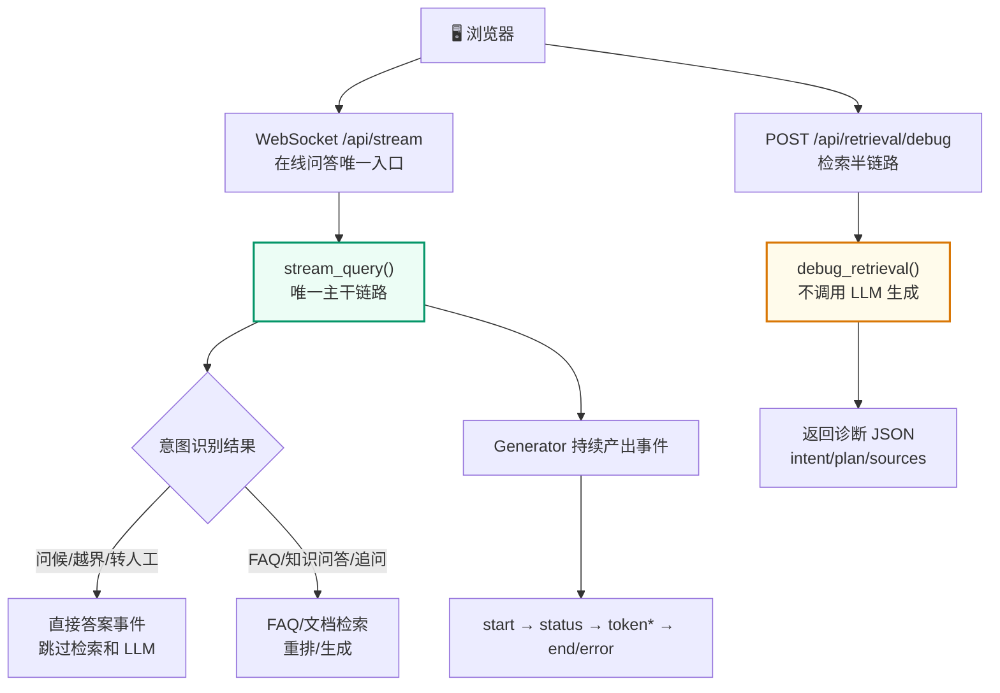
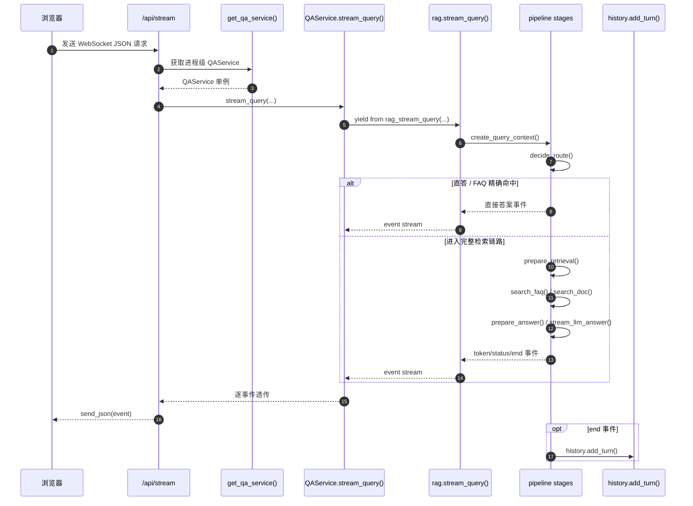

## 第一部分：服务编排模式

### 1.1 什么是服务编排

**服务编排（Service Orchestration）** 是软件架构中的一种模式：用一个中心化的"编排器"来协调多个子服务的调用顺序和数据流转。

打个比方：

- **没有编排**：每个厨师自己决定做什么菜、用什么食材、先炒哪个后炒哪个 → 混乱
- **有编排**：主厨（编排器）决定菜单、分配任务、协调出菜顺序 → 有序

在 RAG 系统中，"子服务"包括：

- 意图识别 → 判断用户想干什么
- 历史读取 → 获取会话上下文
- 查询改写 → 补全追问
- 检索计划 → 决定如何检索
- FAQ 检索 → 查标准答案
- 文档检索 → 查业务资料
- 上下文构建 → 组织参考资料
- LLM 生成 → 产生答案
- 历史写入 → 保存对话

QAService 就是协调这些子服务的"主厨"。

### 1.2 QAService 不做什么（边界）

```python
class QAService:
    """
    这层代码承担的职责：
    1. 读取历史并决定是否需要改写追问
    2. 判断问题意图，过滤无需 RAG 的场景
    3. 根据意图构建检索计划
    4. 先查 FAQ，再查文档
    5. 生成最终上下文，调用 LLM 流式输出
    6. 保存历史，返回诊断信息

    这层不做的事情：
    1. 不创建 FastAPI 响应对象
    2. 不直接操作静态页面
    3. 不实现底层 Milvus 连接细节
    4. 不新增绕过 Pipeline 的并行检索入口
    """
```

---

## 第二部分：QAService 的两个核心方法

### 2.1 方法职责对照



### 代码执行时序图

这一章最值得阅读的是在线问答主干：WebSocket 路由只负责接入和转发，真正的业务编排在 `QAService.stream_query()` 和 `pipeline.rag.stream_query()` 里。




### 2.2 stream_query() — 唯一主干链路

```python
def stream_query(self, query, source_filter, session_id, ...):
    """委托 RAGPipeline 执行完整流式问答。"""
    yield from rag_stream_query(
        self.history,        # 历史存储适配器
        query,
        source_filter,
        session_id,
        kb_version=kb_version,
        scenario_id=scenario_id,
        ...
    )
```

`yield from` 是 Python 的委托语法。`rag_stream_query` 是 `qa_core.pipeline.rag` 模块中 `stream_query` 函数的 import alias（`from qa_core.pipeline.rag import stream_query as rag_stream_query`），它是一个生成器函数，每次 `yield` 产生一个事件。`yield from` 把这些事件"透传"给调用方（FastAPI WebSocket 路由），所以 QAService 不需要自己维护生成循环。

### 2.3 debug_retrieval() — 检索诊断半链路

```python
def debug_retrieval(self, query, source_filter, session_id=None, ...):
    """复用主链路的场景、数据域、意图和检索逻辑，但不调用最终回答 LLM。"""
    return rag_debug_retrieval(
        self.history,
        query,
        source_filter,
        session_id=session_id,
        ...
    )
```

这个方法服务于状态页、评测脚本和排障。它可以告诉开发者"本次请求走了什么路由、意图是什么、检索计划是什么、FAQ/Doc 命中了什么"，但不会生成面向用户的最终答案。

注意：`debug_retrieval()` 是**路由 + 检索诊断半链路**。它会先执行 `decide_route()`；如果是问候、转人工、越界或 source 边界问题，会直接返回 route 诊断，不生成 `RetrievalPlan`。如果是 `route="faq_exact"`，会返回命中的 FAQ 来源，方便排障时确认标准问题和答案。只有 `route="retrieval"` 时，才继续进入 `prepare_retrieval()`，观察检索类意图、source 推断、按需改写、检索计划和召回质量。

### 2.4 source 白名单校验

```python
def decide_route(context):
    context.run_stage(
        "validate_source",
        lambda: validate_source_filter(context.source_filter, context.scenario.valid_sources),
    )
    ...
```

这个校验放在 Pipeline 的查询路由阶段，而不是 QAService 薄包装里：

- **API 层**：不应该知道 Milvus 过滤规则（它只管 HTTP 参数校验）
- **QAService 层**：只做服务门面，透传给唯一主链路
- **Pipeline 路由阶段**：最早拿到场景和 source_filter，先拒绝非法分类，再进入直答、FAQ 精确命中或完整检索
- **Retrieval 层**：只负责构造过滤表达式和执行检索

---

## 第三部分：Generator 模式在 RAG 中的应用

### 3.1 什么是 Generator

Generator（生成器）是 Python 的一个核心特性，使用 `yield` 关键字：

```python
def simple_generator():
    yield "第一步完成"
    yield "第二步完成"
    yield "第三步完成"

for event in simple_generator():
    print(event)  # 逐个输出，而不是等全部完成
```

Generator 的特点是**惰性求值**：每次只产生一个值，调用方可以在每个值之间做其他事情。

### 3.2 为什么 RAG 适合用 Generator

RAG 的问答过程不是一个"输入→等待→输出"的单步操作，而是一个**多阶段持续产出**的过程：

```python
def stream_query(...):
    # 阶段 1：查询路由
    yield {"type": "status", "message": "正在进行查询路由..."}
    route = decide_route(context)
    if route.answer:
        yield {"type": "token", "token": route.answer}
        yield {"type": "end", ...}
        return

    # 阶段 2：检索准备
    yield {"type": "status", "message": "正在识别问题意图..."}
    prepared = prepare_retrieval(context)

    # 阶段 4：FAQ 检索
    yield {"type": "status", "message": "正在检索业务 FAQ 知识库..."}
    faq_result = search_faq(context, prepared)

    # 阶段 5：文档 RAG
    yield {"type": "status", "message": "正在匹配相关业务资料..."}
    doc_result = search_doc(context, prepared)

    # 阶段 6：LLM 流式生成
    yield {"type": "status", "message": "正在生成回答..."}
    for chunk in stream_llm_answer(system_prompt, user_prompt):
        yield {"type": "token", "token": chunk.content}

    # 阶段 7：保存 + 收尾
    yield {"type": "end", "sources": [...], "retrieval": {...}}
```

每个 `yield` 都是**一个可以立即推送给前端的事件**。用户不需要等全部流程跑完才能看到任何东西。

### 3.3 前端接收到的体验

```text
[0.0s] 用户点击发送 "入职流程有哪些步骤"
[0.1s] 页面显示 "正在进行查询路由..."
[0.5s] 页面显示 "正在识别问题意图..."
[1.2s] 页面显示 "正在检索业务 FAQ 知识库..."
[2.0s] 页面显示 "正在匹配相关业务资料..."
[3.5s] 页面显示 "正在生成回答..."
[3.8s] 页面开始逐字出现 "入" "职" "流" "程" "包" "括" ...
[6.0s] 回答完成，显示来源引用
```

如果不用 Generator 而是一次性返回：

```text
[0.0s] 用户点击发送
[6.0s] 空白等待...
[6.0s] 整个答案突然出现
```

---

## 第四部分：应用工厂模式

### 4.1 get_qa_service() 工厂函数

```python
# qa_core/application/factory.py
from functools import lru_cache

@lru_cache(maxsize=1)
def get_qa_service() -> QAService:
    """返回进程级缓存的 QAService 实例。

    单例缓存确保了 settings 和 history store 在整个进程中只加载一次。
    QAService 本身不保存请求级状态（所有变量都在方法局部作用域内），
    所以多用户并发是安全的。
    """
    return QAService()
```

**为什么用单例**：

- `history` 是历史存储适配器，本身负责按 session_id 隔离会话
- 每次请求创建新的 QAService 没有必要，复用进程级服务门面即可

**为什么不担心并发**：

- QAService 只保存 `history` 适配器，不保存请求级状态
- 请求级变量（query、intent、plan、sources 等）都不在 QAService 上，而在方法局部变量中

### 4.2 在 API 中使用

```python
# qa_core/api/chat.py
from qa_core.application.factory import get_qa_service

@router.websocket("/api/stream")
async def websocket_endpoint(websocket: WebSocket):
    service = get_qa_service()  # 同一个单例
    generator = await asyncio.to_thread(
        lambda: service.stream_query(...)
    )
    ...
```

---

## 第五部分：错误处理与事件协议

### 5.1 异常不抛给 WebSocket 路由

```yaml
# qa_core/pipeline/rag.py
try:
    # 完整的 RAG 流程...
    for chunk in stream_llm_answer(...):
        yield build_token_event(token, context.session_id)
    yield finish_success(context, answer=answer)

except Exception as exc:
    logger.exception("QA stream failed")
    # 错误以事件形式返回给前端，不抛出到路由层
    yield finish_error(context, exc)
```

**设计意图**：如果抛出异常到 WebSocket 路由，前端收到的就是一个 WebSocket 协议级别的错误，页面无法优雅地展示错误信息。以事件形式返回错误，前端可以按同一套 UI 渲染错误信息，并允许用户继续下一轮提问。

### 5.2 事件类型

| 事件类型 | 含义 | 前端处理 |
| --- | --- | --- |
| `start` | 请求已接收 | 创建答案区域，显示加载状态 |
| `status` | 当前进行到哪个阶段 | 更新进度提示文字 |
| `token` | LLM 生成的一个 token | 追加到答案文本末尾 |
| `end` | 问答完成 | 显示来源引用、诊断信息、耗时 |
| `error` | 可恢复的错误 | 显示错误信息，允许继续提问 |

---
