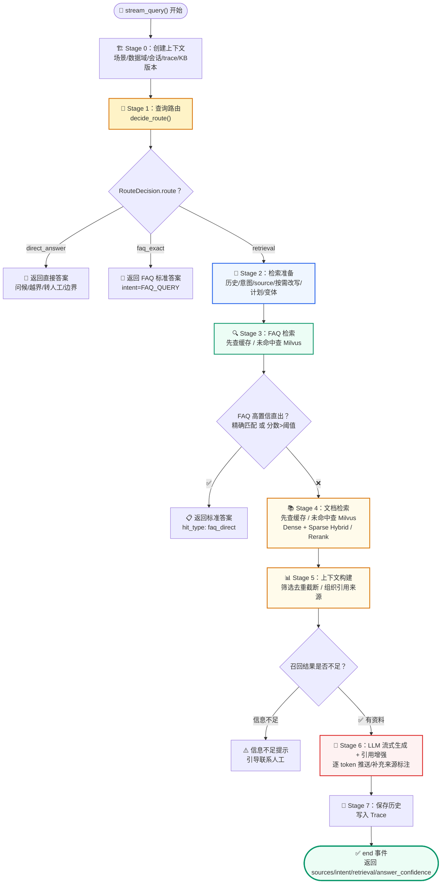
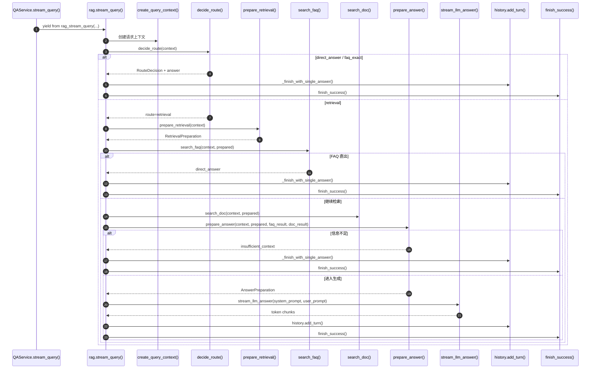
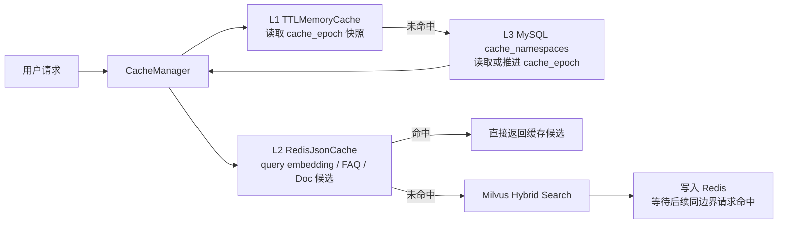
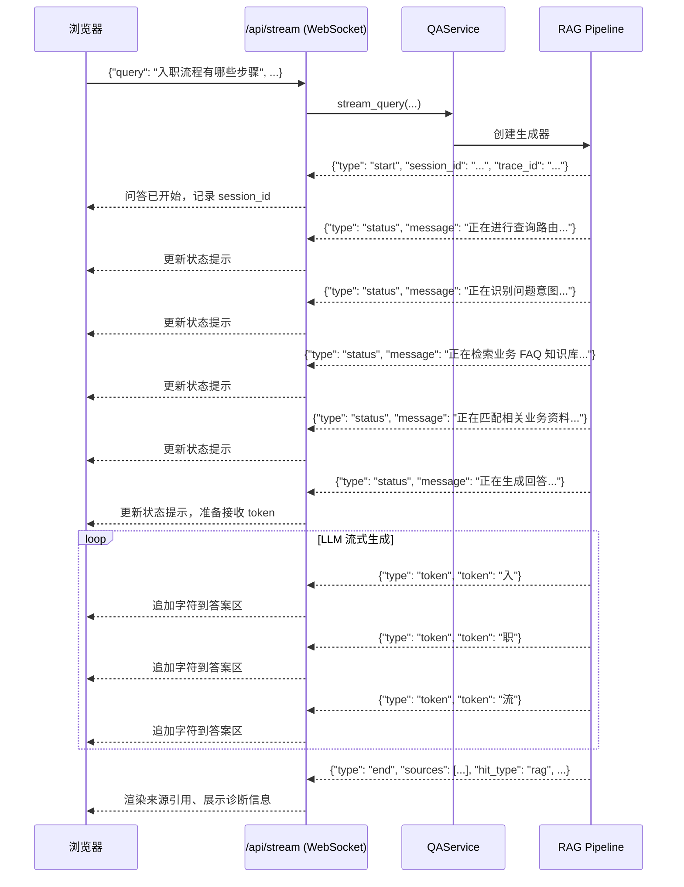
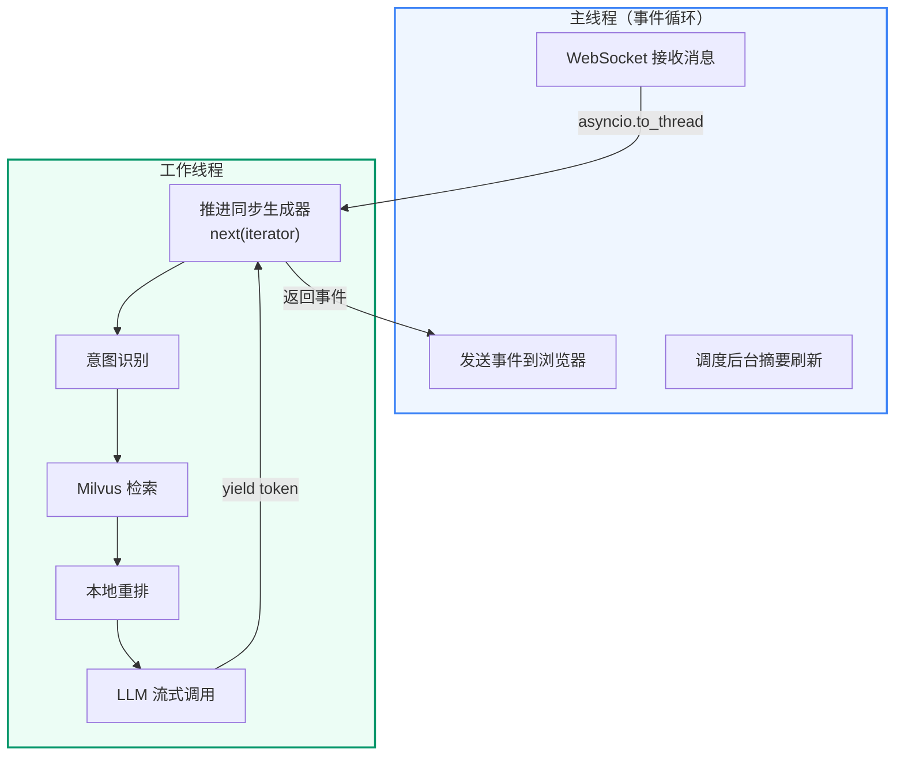

## 第一部分：Pipeline 设计模式

### 1.1 Pipeline vs Chain

**Chain（链）**：固定的步骤序列，A → B → C → D，没有分支。

**Pipeline（管道）**：有分支、有快慢路径的流程。每一步可以提前结束（如 FAQ 命中时跳过文档检索），也可以根据上一步的结果调整下一步的参数。

示例实现的 RAG 流程是 Pipeline 而非 Chain：

```text
用户问题
  → 查询路由（direct_answer / faq_exact / retrieval）
  → 检索准备（历史 / 意图 / source / 按需改写 / 计划 / 变体）
  → 按 RetrievalPlan 执行 FAQ 检索（先查安全缓存，高置信标准直出可结束）
  → 按 RetrievalPlan 执行文档检索（先查安全缓存）
  → 上下文构建 → LLM 生成
```

### 1.2 Pipeline 的模块化拆分

系统将 Pipeline 拆分为多个职责单一的文件：

```text
qa_core/pipeline/
├── rag.py          # 主流程编排（stream_query, debug_retrieval）
├── runtime.py      # 请求上下文（RAGQueryContext）和事件工具函数
├── steps.py        # 查询路由、检索准备、Prompt 准备
├── retrieval_steps.py  # FAQ / 文档检索执行
├── context.py      # 上下文构建（筛选、去重、格式化）
├── rewrite.py      # 查询改写
├── query_variants.py  # 查询变体生成
├── events.py       # 事件构造（start/status/token/end/error）
├── confidence.py   # 最终答案置信度（answer_confidence）
└── citations.py    # 答案引用增强
```

---

## 第二部分：8 个 Stage 主流程

### Stage 0-7 可视化总览



### 代码执行时序图

这张图对应的是 `qa_core/pipeline/rag.py::stream_query()` 的真实执行顺序。它比前面的阶段总览更适合代码调试，因为可以直接按函数名下断点。




### 2.1 V1 三级缓存设计

V1 的缓存不是“答案缓存”。系统不缓存普通 LLM 自由生成答案，只缓存可以被权限、版本和配置边界约束住的安全对象。

更准确地说，V1 的“三级缓存”不是三层都在缓存业务结果，而是：

```text
L1：进程内短 TTL epoch 快照
L2：Redis 业务缓存，存 query embedding 和 FAQ/Doc 检索结果
L3：MySQL cache namespace 治理层，存 cache_epoch，用于版本失效
```

因此 L3 不是“把检索结果再缓存一份到 MySQL”，而是缓存控制面。它只回答一个问题：当前场景、租户、数据集应该使用第几代缓存 key。

三级缓存分别解决三个问题：

| 层级 | 实现位置 | 缓存内容 | 主要作用 |
| --- | --- | --- | --- |
| L1 进程内短 TTL 缓存 | `qa_core/cache/stores.py` 的 `TTLMemoryCache`，由 `qa_core/cache/manager.py` 使用 | `cache_epoch` 这类低频 namespace 元数据 | 避免每次检索都查询 MySQL，默认短 TTL，版本激活时会主动清空 |
| L2 Redis 业务缓存 | `qa_core/cache/stores.py` 的 `RedisJsonCache` | query embedding、FAQ 检索候选、Doc 检索候选 | 提升热点问题检索速度，跨 API 请求复用 |
| L3 MySQL namespace 治理 | `qa_core/cache/namespaces.py` 和表 `cache_namespaces` | `scenario_id / tenant_id / dataset_id / cache_epoch` | 负责缓存失效边界，版本发布、回滚或人工失效时推进 epoch |

这三层不是彼此替代的关系：

- L1 只缓存少量元数据，生命周期在 API 进程内。
- L2 才保存可复用的检索结果和 query embedding。
- L3 不保存检索结果，只保存“当前缓存世代”，用于控制哪些 Redis key 还能被命中。



V1 只缓存这些对象：

| 缓存对象 | 代码位置 | 为什么可以缓存 |
| --- | --- | --- |
| query embedding | `qa_core/retrieval/models.py` 返回 `CachedEmbeddings` | 只和 query 文本、embedding 模型版本有关，不包含权限数据 |
| FAQ 检索候选 | `qa_core/pipeline/steps.py`、`qa_core/pipeline/retrieval_steps.py` | key 绑定版本、租户、数据集、角色、source 和查询变体 |
| Doc 检索候选 | `qa_core/pipeline/retrieval_steps.py` | key 绑定版本、权限域和检索参数，版本切换后 epoch 自动变化 |

这里要特别注意 `query embedding` 的调用入口：RAG Pipeline 本身没有手写 `embed_query()`。系统在创建 `langchain_milvus.Milvus` 时把 `CachedEmbeddings` 作为 `embedding_function` 传进去；当 `MilvusHybridStore.search()` 调用 `similarity_search_with_score()` 时，langchain-milvus 会在处理 `dense` 字段时回调 `embedding_function.embed_query(query)`。所以 query embedding 缓存的真实拦截点在 `CachedEmbeddings.embed_query()`，不是 Pipeline 的某个显式步骤。

这也解释了两种不同的缓存命中：

- 如果 FAQ/Doc 检索结果缓存命中，Pipeline 会直接复用候选，不进入 Milvus，也不会触发这次 `embed_query()`。
- 如果检索结果缓存未命中，但相同 query 的 embedding 缓存命中，仍然需要访问 Milvus，不过可以少做一次 BGE-M3 在线编码。

V1 明确不缓存这些对象：

| 不缓存对象 | 为什么不缓存 |
| --- | --- |
| 普通 LLM 最终答案 | 同一个问题会受知识库版本、权限域、Prompt Profile、历史追问和当前上下文影响，直接复用整段答案容易答错或泄露权限数据 |
| 文档入库 embedding | 入库 chunk 数量大、重复率低，写 Redis 会挤占 query embedding 和检索缓存空间 |
| 语义近似答案缓存 | “问题语义相近”不等于“企业上下文、权限和版本相同”，V1 不用近似匹配复用答案 |

#### 2.1.1 为什么不缓存 LLM 最终答案

同一个用户问题，不一定应该得到同一个最终答案。例如都问“入职流程是什么？”，最终答案仍可能因为以下条件不同而不同：

- **知识库版本不同**：今天 active 版本是 `kb_v1`，明天激活 `kb_v2`，流程资料可能已经更新，复用旧答案会答错。
- **权限不同**：普通员工只能看公开制度，HR 管理员可能能看到内部操作细则，复用管理员答案给普通员工就是权限泄露。
- **租户或数据集不同**：A 公司和 B 公司都问“入职流程”，业务流程可能完全不同，跨租户复用会污染答案。
- **Prompt Profile 不同**：同样上下文，`knowledge_answer` 可能要求总结口径，`troubleshooting_steps` 可能要求步骤化排查，缓存答案会绕过当前模板要求。
- **历史追问不同**：上一轮问的是“实习生入职”，下一轮问“需要哪些材料？”，答案依赖历史改写；这个答案不能给另一个没有相同历史上下文的人。

这并不是说“大模型答案永远不能缓存”，而是说 V1 现在没有必要立刻增加这个复杂度。标准 FAQ 已经可以精确命中后直接返回，不进入 LLM；另外，查询 embedding 和 FAQ/Doc 检索结果已经能减少重复计算和 Milvus 访问。在还没有线上数据证明“最终生成是主要延迟和成本瓶颈”之前，先做稳定性和可观测性优先。

**什么情况下才值得增加最终答案缓存？**

先用 Trace 和运行指标回答四个问题：

| 要观察的信号 | 想回答的问题 |
| --- | --- |
| LLM 调用比例和 P95 耗时 | 检索缓存已经命中时，LLM 是否仍然占大部分延迟和费用？ |
| 规范化问题重复率 | 相同问题、相同会话语义、相同权限域是否反复出现？ |
| 潜在缓存命中率 | 把版本、权限、Prompt 和会话都纳入 Key 后，真正能复用的请求还剩多少？ |
| 质量对比 | 复用缓存后，引用正确率、权限隔离和答案质量是否不下降？ |

只有当这些数据证明有明显重复热点，且 LLM 生成确实是主要成本和延迟来源时，才考虑扩展。这是“由评测和 Trace 验证后再做优化”，而不是为了缓存而缓存。

**如果将来实现，边界必须更严格：**

1. 只在引用补强和生成后核验都通过后写入缓存，缓存内容不只是一段文字，还应包含 `answer`、`sources` 和最终 `answer_confidence`。
2. 使用独立的答案缓存 Key，不能复用检索缓存 Key。Key 至少要包含 `scenario`、租户和数据集、可见范围与角色、知识库版本与 `cache_epoch`、`source_filter`、Prompt Profile 和版本、LLM 模型与参数，以及必要的会话语义指纹。
3. 命中缓存后仍要先校验当前用户权限，不能因为缓存命中就跳过权限边界。

一句话记住：**缓存负责复用稳定的计算和证据；最终回答仍然根据当前请求、当前权限和当前证据生成并核验。**

所以 V1 选择缓存更底层、更稳定的对象：query embedding 和 FAQ/Doc 检索候选。检索结果仍然必须绑定 `kb_version`、`cache_epoch`、DataScope、source、query variants、top_k、rerank 和模型版本等边界。最终答案则每次基于当前上下文、Prompt 和权限重新生成，并在生成后做引用补强和答案置信度核验。

缓存 key 的业务边界不是“问题文本”，而是：

```text
scenario + tenant_id + dataset_id + visibility + user_roles
+ kb_version + cache_epoch + source_filter + query_variants
+ top_k + rerank + embedding/reranker/chunk_schema 版本
```

所以同一个问题在不同知识库版本、不同租户、不同角色下不会复用同一份缓存。

#### 2.1.2 Redis 是精确键缓存，不是模糊查询

Redis 命中依赖结构化参数生成的稳定 hash。只有 query 文本/变体以及版本、权限、source、Top-K、重排开关和模型版本等维度全部一致，才会命中同一个 key；“新人入职怎么办”和“入职流程是什么”不会因为语义相近而互相命中。

因此它的命中率来自重复热点请求、前端快捷问题、会话重试和批量业务查询，不来自 Redis 模糊搜索。即使检索结果缓存未命中，完全相同的 query 文本仍可能命中 embedding 缓存，减少一次 BGE-M3 在线编码。V1 不做语义答案缓存，因为语义近似阈值、知识版本和权限边界组合后更容易复用错误答案；需要提升长尾命中率时，应先基于 Trace 统计真实重复率，再决定是否在后续版本引入带评测门禁的语义缓存。

`retrieval.cache` 会进入 end 事件和 Trace：

```json
{
  "enabled": true,
  "hit_count": 1,
  "miss_count": 2,
  "events": [
    {"stage": "faq_retrieval", "hit": false, "source_type": "faq"},
    {"stage": "doc_retrieval", "hit": true, "source_type": "doc"}
  ]
}
```

这就是缓存闭环：**命中能提速，未命中能解释，版本切换能失效，权限边界不会串数据**。 状态页 `/admin` 的“企业缓存”面板和 `scripts/quality/cache_acceptance_smoke.py` 会直接读取这些字段，用来验收首次 miss、二次 hit 和版本失效是否生效。

### 2.2 缓存如何失效

缓存失效不依赖扫描删除 Redis 全量 key，而是通过 `cache_epoch` 生成新 key。

版本发布或回滚时，`KnowledgeBaseVersionStore.activate_version()` 会在同一个事务中完成三件事：

1. 更新 `kb_active_versions.active_kb_version`。
2. 写入 `kb_version_activations` 激活或回滚流水。
3. 调用 `bump_cache_epoch_for_scenario_with_conn()` 推进当前场景的 `cache_epoch`。

随后代码会清空 L1：

```text
# qa_core/governance/kb_versions.py
bump_cache_epoch_for_scenario_with_conn(conn, self.scenario.scenario_id)
get_cache_manager().l1_cache.clear()
```

因此新版本激活后：

- FAQ/Doc 检索缓存会因为 `kb_version + cache_epoch` 改变而重新 miss。
- Redis 中旧 key 不会立即物理删除，会按 TTL 自然过期。
- query embedding 缓存可以继续复用，因为它只依赖 query 文本和 embedding 模型版本，不依赖知识库版本。
- `qa_core/retrieval/factory.py` 中的 Milvus store wrapper 是资源对象缓存，不是业务结果缓存；active 版本变化时会清空这个进程级 wrapper 缓存，避免长生命周期对象持有旧状态。

手工失效也走同一套 epoch 机制：

```text
POST /api/admin/cache/invalidate
```

### 2.3 缓存行为检查

本地单测验证 key 边界、epoch 失效和 query embedding 缓存：

```bash
python -m pytest tests/test_enterprise_cache.py -q
```

Docker 环境验证真实 Redis 命中路径：

```bash
docker compose --env-file .env.compose exec api python scripts/quality/cache_acceptance_smoke.py --base-url http://127.0.0.1:8000
```

验收预期是：同一个场景、同一个数据域、同一个问题连续问两次，第一次出现 cache miss，第二次出现 cache hit；如果中间激活了新知识库版本，下一次查询应重新 miss。

### 2.4 完整流程代码（简化）

```python
# qa_core/pipeline/rag.py
def stream_query(history, query, source_filter, session_id, ...):
    # === Stage 0: 创建运行上下文 ===
    context = create_query_context(...)
    yield build_query_start_event(context)  # start 事件

    try:
        # === Stage 1: 查询路由 ===
        yield build_status_event("正在进行查询路由...", context.session_id)
        route = decide_route(context)
        if route.answer:
            yield from _finish_with_single_answer(context, history, query, route.answer)
            return

        # === Stage 2: 检索准备 ===
        yield build_status_event("正在识别问题意图...", context.session_id)
        prepared = prepare_retrieval(context)

        # === Stage 3-6: FAQ 检索 → 文档检索 → 上下文构建 → LLM 生成 ===
        helper_result = yield from _search_and_generate(context, prepared, query, history)
        if helper_result is None:
            return  # 已在内部收尾（FAQ 直出或信息不足）

        # === Stage 6 continuation: 引用补强与生成后核验 ===
        answer = enforce_answer_citations(context.answer, helper_result.context_docs)

        # === Stage 7: 保存历史 + 写入 Trace + 结束事件 ===
        history.add_turn(context.session_id, query, answer)
        yield finish_success(context, answer=answer)

    except Exception as exc:
        yield finish_error(context, exc)


def _search_and_generate(context, prepared, query, history):
    """检索-生成核心链路：FAQ 检索 → 文档检索 → 上下文构建 → LLM 流式生成。

    提取为独立函数使 stream_query 主干更清晰，便于单步调试和异常定位。
    """
    # Stage 3: FAQ 检索 + 直出判断
    yield build_status_event("正在检索业务 FAQ 知识库...", context.session_id)
    faq_result = search_faq(context, prepared)
    direct_answer = get_faq_direct_answer(context, prepared, faq_result)
    if direct_answer:
        yield from _finish_with_single_answer(context, history, query, direct_answer)
        return None

    # Stage 4: 文档检索
    yield build_status_event("正在匹配相关业务资料...", context.session_id)
    doc_result = search_doc(context, prepared)

    # Stage 5: 上下文构建
    answer_prepared = prepare_answer(context, prepared, faq_result, doc_result)
    context.sources = answer_prepared.sources
    context.hit_type = answer_prepared.hit_type

    if context.hit_type == "insufficient_context":
        answer = build_insufficient_context_answer(context)
        yield from _finish_with_single_answer(context, history, query, answer)
        return None

    # Stage 6: LLM 流式生成
    yield build_status_event("正在生成回答...", context.session_id)
    for chunk in stream_llm_answer(answer_prepared.system_prompt, answer_prepared.user_prompt):
        token = str(getattr(chunk, "content", "") or "")
        if not token:
            continue
        yield build_token_event(token, context.session_id)

    return answer_prepared
```

### 2.5 Stage 1：查询路由

这是在线问答进入检索准备之前的低成本路由层。它统一处理三类结果：

| route | intent | 含义 |
| --- | --- | --- |
| `direct_answer` | `GREETING` / `HUMAN_SERVICE` / `OUT_OF_SCOPE` | 问候、转人工、越界、source 边界，直接返回 |
| `faq_exact` | `FAQ_QUERY` | FAQ 标准问题精确命中，直接返回标准答案 |
| `retrieval` | 暂不确定 | 路由不了，进入检索准备 |

这里的关键点是：**intent 描述用户想做什么，route 描述系统下一步怎么处理**。FAQ 精确命中不是新的用户意图，而是 `route=faq_exact`，同时携带 `intent=FAQ_QUERY`。

```python
@dataclass
class RouteDecision:
    route: Literal["direct_answer", "faq_exact", "retrieval"]
    answer: str | None = None
    intent: IntentResult | None = None
    reason: str = ""


def decide_route(context):
    # 1. 先校验 source_filter
    context.run_stage("validate_source", ...)

    # 2. 协议/安全类直答：问候、越界、短句转人工
    direct_intent = classify_direct_intent(context.query, context.scenario)
    if direct_intent:
        return RouteDecision("direct_answer", direct_intent.direct_answer, direct_intent)

    # 3. source 边界
    boundary_answer = detect_and_apply_boundary_answer(context)
    if boundary_answer:
        return RouteDecision("direct_answer", boundary_answer, out_of_scope_intent)

    # 4. FAQ 精确命中：route 是 faq_exact，intent 仍是 FAQ_QUERY
    if should_try_faq_fast_path(context.query, context.scenario):
        answer, intent = try_fast_faq_direct_answer(context)
        if answer:
            return RouteDecision("faq_exact", answer, intent)

    # 5. 路由不了，再进入检索准备
    return RouteDecision("retrieval")
```

这也是你截图里最应该调整的地方：`你好`、`转人工`、`彩票怎么买` 这类问题不应该先进入 FAQ 快速路径，而应该在这一阶段直接收口。

### 2.6 FAQ 精确命中为什么放在路由层

FAQ 精确命中依赖知识库内容、版本、tenant、source_filter 和标准问题文本，它不是“用户意图类型”。所以更准确的表达是：查询路由层可以产出 `route=faq_exact`，并把 `intent` 标记为 `FAQ_QUERY`。

```python
# qa_core/pipeline/steps.py
from qa_core.config.rules import get_rule_config

def should_try_faq_fast_path(query, scenario):
    """判断短问题是否值得先做 FAQ 精确匹配探测。

    快速路径只处理"短、完整、像标准问答"或能推断业务分类的问题。
    不是语义答案缓存：会先查带版本和权限边界的检索缓存，未命中时访问当前场景的 FAQ Milvus 集合，
    并带上 kb_version、tenant、dataset、visibility 和 role 过滤。
    返回 True 只代表可以先探测 FAQ 候选，不代表已经可以直出。
    """
    rules = get_rule_config().faq_fast_path
    compact_query = (query or "").strip()
    if (
        not compact_query
        or len(compact_query) > rules.max_chars
        or "\n" in compact_query
    ):
        return False  # 长问题、多行问题不适合快速路径
    return bool(
        rules.hint_matches(compact_query)  # FAQ 句式特征
        or infer_source(compact_query, scenario)  # 明确业务分类
    )

def try_fast_faq_direct_answer(context):
    """路由层的 FAQ 精确试探：只允许精确匹配，不允许相似直出。"""
    faq_store = get_faq_store(context.scenario.faq_collection)
    result = faq_store.search_many(
        [context.query],
        # 原问题候选随后可能供完整 FAQ 链路复用，容量不能小于计划所需。
        k=max(plan.faq_top_k, get_settings().faq_short_query_top_k),
        source_filter=effective_source_filter,
        kb_version=context.active_kb_version,
        data_scope=context.data_scope,
        source_type="faq",
        rerank=False,
    )
    # 只允许精确匹配，分数阈值设为无穷大
    answer, _ = _exact_faq_answer(context.query, result)
    return answer, intent  # 不是精确匹配就返回 (None, FAQ_QUERY intent)，继续主流程
```

FAQ 快路径的触发词和最大长度来自 `config/rules.toml` 中的 `faq_fast_path` 配置，不写死在代码里。`max_chars = 48` 是示例实现的初始保护阈值，不是官方标准。它的作用是把 FAQ 快路径限制在“一句话标准问法”上：短问题先试精确命中；长问题、多行问题、带多个条件的问题交给后面的完整检索链路处理。

诊断信息里的 `retrieval.plan` 会按 FAQ 快路径的实际执行方式展示：`run_faq=true`、`run_doc=false`、`rerank=false`，并标记 `match_policy=standard_question_exact`。这样 Trace 里看到的计划和真实执行链路一致，不会误以为 Stage 1 也进入了完整文档检索。

这里还有一个边界要注意：FAQ 快路径只做“是否精确命中标准 FAQ”的判断，不选择 Prompt Profile。因为精确命中会直接返回标准答案，不调用 LLM，也不需要构造回答 Prompt。Prompt Profile 的选择发生在后面的 `prepare_retrieval()` / `prepare_answer()`，也就是完整检索和生成路径里。

### `_exact_faq_answer()` — 精确匹配实现

```python
def _exact_faq_answer(query: str, faq_result: RetrievalResult) -> tuple[str | None, RetrievalResult]:
    """从 FAQ 候选中找与标准问题完全一致的答案。

    快速路径只允许精确标准问答直出，不按相似分数直出。
    找到精确命中后会把该命中排到来源列表第一位，方便页面展示。
    """
    for index, hit in enumerate(faq_result.hits):
        answer = direct_faq_answer(query, hit.document, hit.score, threshold=float("inf"))
        if not answer:
            continue
        if index:
            reordered = [hit, *faq_result.hits[:index], *faq_result.hits[index + 1 :]]
            faq_result = RetrievalResult(
                hits=reordered,
                query=faq_result.query,
                source_type=faq_result.source_type,
                elapsed_ms=faq_result.elapsed_ms,
            )
        return answer, faq_result
    return None, faq_result
```

**为什么在检索准备之前做**：

- 减少首 token 延迟。标准 FAQ 的精确命中不需要经过历史加载、检索类意图识别、改写、检索计划等步骤。
- FAQ 快速路径可以命中 Redis 检索缓存；缓存未命中时仍然访问 Milvus，并且始终带版本和数据隔离过滤。
- 它在同一个 `decide_route()` 中排在 direct_answer 之后，避免问候、转人工、越界问题先触发知识库查询。

**为什么只允许精确匹配**：

- 还没做意图识别，不知道这是 FAQ_QUERY 还是 KNOWLEDGE_QUERY
- 如果是知识咨询但 FAQ 相似分数高，可能误答。所以只允许用户问题和 FAQ 标准问题完全一致时才直出。

### 2.6.1 FAQ 快速探测未命中后的候选复用

先用一个具体例子理解。用户问“新人入职需要完成哪些流程？”。路由层为了判断能否精确 FAQ 直出，已经用原问题查过一次 FAQ；结果没有找到完全相同的标准问题，于是进入完整 RAG。完整链路生成的变体可能是：

```text
["新人入职需要完成哪些流程？", "新人入职需要完成哪些 SOP？", "新员工需要办理哪些入职手续？"]
```

当前请求上下文会保存 `fast_faq_result`、对应的 `source_filter` 和已取回的候选容量。复用条件成立时，完整检索读取原问题候选，只向 FAQ collection 查询两个新增变体：

```text
快速探测：原问题 -> FAQ 原始候选
完整检索：读取原问题候选 + 只查询后两个新增变体
        -> 按 FAQ/chunk 去重 -> 一次统一 CrossEncoder 重排 -> 取 top_k
```

这不是 Redis 中跨请求复用“整段回答”，也不会跳过后面的意图识别、来源过滤、引用补强或 LLM 生成。它只是在**同一次请求**里复用已经得到的原始 FAQ 候选，因此不会受到对话历史不同、Prompt 不同或最终答案不同的影响。

为保证正确性，只有以下条件同时满足才允许复用：

1. `rewritten_query` 仍等于原问题，说明没有追问改写。
2. `query_variants` 的第一个元素仍是原问题。
3. 快速探测与完整计划的有效 `source_filter` 相同。
4. 快速探测的候选容量不少于完整计划的 `faq_top_k`。

如果是追问、来源过滤发生变化，或者完整计划需要更多候选，系统会正常执行完整 `search_many(query_variants)`。这是性能优化的边界：不能以少查一次为理由复用不等价的数据。

### 2.7 FAQ 标准直出 vs FAQ 精确路由

这是两个容易混淆的概念：

|  | FAQ 精确路由（Stage 1） | FAQ 标准直出（Stage 3） |
| --- | --- | --- |
| 时机 | `decide_route()` 中，检索准备之前 | 检索准备之后 |
| route / intent | `route=faq_exact`，携带 `intent=FAQ_QUERY` | `route=retrieval`，保持原始检索意图：`FAQ_QUERY` / `FOLLOW_UP` / `KNOWLEDGE_QUERY` |
| FAQ 关系 | 只试 FAQ collection 的标准问题精确匹配 | 只要 `RetrievalPlan.run_faq=True`，就会执行 FAQ collection 检索 |
| 未精确命中 | 保存原问题候选；完整链路可按条件补查变体 | 合并原问题候选与变体候选后，再决定是否标准直出 |
| 匹配方式 | 仅精确匹配 | 精确匹配 + 相似分数阈值 |
| 阈值 | ∞（只精确） | 动态阈值；追问、低决策分、表格类问题会更保守 |
| 适用 | 短标准问答 | FAQ 候选足够可靠；不要求意图必须是 `FAQ_QUERY` |
| 风险 | 低（只精确） | 中（相似分数可能误命中） |

注意：Stage 3 的“FAQ 检索”不是“把意图改成 `FAQ_QUERY`”。例如用户追问“那审批呢？”时，如果存在历史上下文，检索类意图仍然是 `FOLLOW_UP`；后续只是因为检索计划里 `run_faq=True`，所以会同时查 FAQ collection。FAQ top 命中足够可靠时可以直接返回标准答案，否则继续查文档并进入生成链路。

---

## 第三部分：上下文构建

### 3.1 select_context_docs() 的筛选策略

```python
# qa_core/pipeline/context.py
def select_context_docs(faq_hits: list, doc_hits: list, plan: RetrievalPlan) -> list[Document]:
    """筛选进入 Prompt 的文档片段（只依赖 plan 对象，不需要 scenario 参数）。

    执行流程：
    1. FAQ 命中：过滤分数 → 取前 2 条 → 转成"常见问题 + 标准答案"格式
    2. 文档命中：过滤分数 → prefer_table 时表格行优先 → 优先用 parent_content
    3. 每条追加受 final_context_top_n / max_context_chars / max_context_doc_chars 三重约束
    """
    selected = []
    seen_keys = set()
    used_chars = 0

    # ── FAQ 部分：过滤 min_context_score → 取前 2 条 → 转成标准问答格式 ──
    for hit in [h for h in faq_hits if h.score >= plan.min_context_score][:2]:
        answer = hit.document.metadata.get("answer")
        question = hit.document.metadata.get("standard_question") or hit.document.page_content
        if answer:
            _append_with_budget(
                Document(page_content=f"常见问题：{question}\n标准答案：{answer}"),
                f"faq:{document_key(hit.document)}",
                selected, seen_keys, used_chars, plan)

    # ── 文档部分：过滤分数 → prefer_table 排序 → 优先用 parent_content ──
    eligible = [h for h in doc_hits if h.score >= plan.min_context_score]
    if plan.prefer_table:
        # 表格行（content_type 以 table 开头）排到普通正文前面
        eligible = sorted(eligible,
            key=lambda h: (0 if is_table_document(h.document) else 1, -h.score))

    for hit in eligible:
        parent_content = hit.document.metadata.get("parent_content")
        key = str(hit.document.metadata.get("parent_id") or document_key(hit.document))
        _append_with_budget(
            Document(page_content=str(parent_content or hit.document.page_content)),
            f"doc:{key}",
            selected, seen_keys, used_chars, plan)
    return selected
```

### 3.2 build_context() 的格式化输出

```python
def build_context(docs: list[Document]) -> str:
    """构建最终上下文文本（只依赖 doc.metadata，不依赖 scenario 对象）。"""
    lines = []
    seen: set[str] = set()
    for i, doc in enumerate(docs):
        content = doc.page_content.strip()
        if not content or content in seen:
            continue  # 内容去重
        seen.add(content)
        source = _context_source_label(doc.metadata or {})

        # 格式：[编号] 来源：文件名 或 标准问题名 或 表格 sheet+行号
        header = f"[{i+1}] 来源：{source}"
        lines.append(f"{header}\n{content}")

    return "\n\n".join(lines)
```

输出示例：

```text
[1] 来源：人事制度 / 入职管理
入职流程包括以下步骤：1. 提交入职材料（身份证复印件、学历证书...）

[2] 来源：人事制度 / 审批权限
部门经理负责审批本部门员工的入职申请，审批时限为 3 个工作日...

[3] 来源：行政管理 / 工位分配
新员工入职后由行政部统一分配工位和办公设备...
```

---

## 第四部分：信息不足处理

### 4.1 什么情况判定为信息不足

`prepare_answer` 在 `steps.py` 中定义，其内部的信息不足判定委托给 `_build_answer_context`：

```python
# qa_core/pipeline/steps.py
def prepare_answer(
    context: RAGQueryContext,
    prepared: RetrievalPreparation,
    faq_result: RetrievalResult,
    doc_result: RetrievalResult,
) -> AnswerPreparation:
    """将 FAQ + 文档检索结果整理为 LLM Prompt、引用来源列表和命中类型。

    信息不足判定委托给 _build_answer_context，prepare_answer 负责
    组装最终的 system_prompt 和 user_prompt。
    """
    context_docs, sources, hit_type, top_score = context.run_stage(
        "build_answer_context",
        lambda: _build_answer_context(prepared, faq_result, doc_result),
    )
    _record_context_stats(context, context_docs, prepared.plan, top_score)
    # 这里只记录生成前证据置信度；LLM 输出后会在 rag.py 中执行生成后核验并合并。
    record_evidence_confidence(
        context,
        hit_type=hit_type,
        retrieval_top_score=top_score,
        context_count=len(context_docs),
        source_count=len(sources),
    )

    user_prompt = prepared.prompt_profile.user_template.format(
        history=format_messages(prepared.history_messages),
        question=prepared.rewritten_query,
        context=build_context(context_docs)
        or "无可用上下文。必须明确回答：信息不足，无法确认。",
    )
    return AnswerPreparation(
        context_docs=context_docs,
        sources=sources,
        hit_type=hit_type,
        system_prompt=prepared.prompt_profile.system_template,
        user_prompt=user_prompt,
    )
```

`_build_answer_context` 负责实际的上下文筛选和命中类型判定：

```python
def _build_answer_context(prepared, faq_result, doc_result):
    """整理上下文文档、引用来源列表、命中类型和最高分数。

    无上下文通过分数过滤时命中类型标记为 insufficient_context。
    """
    context_docs = select_context_docs(faq_result.hits, doc_result.hits, prepared.plan)
    if prepared.plan.prefer_table:
        sources = doc_result.source_payloads(limit=5) + faq_result.source_payloads(limit=2)
    else:
        sources = faq_result.source_payloads(limit=2) + doc_result.source_payloads(limit=5)
    top_score = max(faq_result.top_score, doc_result.top_score)
    return context_docs, sources, "rag" if context_docs else "insufficient_context", top_score
```

### 4.2 最终答案置信度 answer_confidence

`sources[*].score` 是检索排序分：没有 reranker 时来自 Milvus Hybrid 召回，有 reranker 时来自 CrossEncoder 精排。它只回答“这条候选和 query 有多相关”，不能直接代表最终答案一定可靠。

V1 现在把 `answer_confidence` 拆成三段公共代码，统一放在 `qa_core/pipeline/confidence.py`：

| 公共函数 | 作用 | 是否包含 LLM 生成结果 |
| --- | --- | --- |
| `calculate_evidence_confidence()` | 生成前证据置信度：判断检索证据是否足以支撑回答 | 否 |
| `calculate_generation_confidence()` | 生成后核验：检查答案是否有有效引用、引用覆盖和上下文词面支撑 | 是 |
| `combine_answer_confidence()` | 最终合并：把证据分和生成核验分保守合并为 `answer_confidence` | 是 |

```text
prepare_answer()
  -> calculate_evidence_confidence()
  -> LLM 流式生成
  -> enforce_answer_citations()
  -> calculate_generation_confidence()
  -> combine_answer_confidence()
  -> finish_success()
```

#### 4.2.1 生成前证据置信度

`calculate_evidence_confidence()` 会综合以下信号：

| 信号 | 含义 |
| --- | --- |
| `retrieval_top_score` | FAQ / Doc 排序后第一条候选的检索相关性分 |
| `context_count` | 最终进入 Prompt 的上下文条数 |
| `source_count` | 返回给前端的来源数量 |
| `intent_rule_score` | 入口规则候选强弱，用于诊断 |
| `intent_decision_score` | 意图网关最终决策分，用于计算证据置信度 |
| `history_rewrite_used` | 是否依赖历史追问改写 |
| `hit_type` | FAQ 直出、RAG、信息不足或确定性直答 |

这里的 `retrieval_top_score` 不是“所有候选的平均分”，也不是“进入 Prompt 的文档数量”。检索会先返回并排序多条候选，例如：

```text
候选1 score=0.91
候选2 score=0.78
候选3 score=0.62
```

这时 top-1 检索分就是 `0.91`。它表示“当前最强的一条证据与问题有多匹配”。之所以让它在公式里权重最大，是因为如果最强证据都不相关，单纯堆更多低相关上下文不应该把置信度抬高。

检索分先转换为 `normalized_retrieval_score`：

```text
score <= 0：0
0 < score <= 1：保持原值
score > 1：1 - 1 / (1 + score)
```

第三种情况用于平滑压缩 CrossEncoder 可能输出的大于 1 的 logit。例如 `3.0` 被压缩为 `0.75`，而不是粗暴截断成 `1.0`。该归一化只用于答案置信度，不改变候选排序。

不同回答路径使用不同基础公式：

| 回答路径 | 公式 |
| --- | --- |
| 确定性直答 | `0.78 + 0.18 × intent_decision_score` |
| FAQ 标准问题精确命中 | 固定 `0.95` |
| FAQ 相似度直出 | `0.55 + 0.35 × normalized_retrieval_score + 0.08 × intent_decision_score` |
| 信息不足 | `0.12 + 0.15 × normalized_retrieval_score` |
| 文档 RAG | `0.20 + 0.45 × normalized_retrieval_score + min(context_count, 4) × 0.06 + min(source_count, 3) × 0.04 + 0.12 × intent_decision_score` |

文档 RAG 对上下文最多计 4 条、来源最多计 3 条，避免单纯堆更多候选把置信度无限抬高。追问依赖历史改写时扣 `0.05`，上下文少于 2 条时扣 `0.08`；意图决策分低于 `0.70` 再扣 `0.04`。RAG 没有选出上下文时，证据分上限强制为 `0.35`。

#### 4.2.2 生成后答案核验

如果最终走了 LLM 生成，`rag.py` 会在 `enforce_answer_citations()` 之后调用 `calculate_generation_confidence()`。这一步不再看召回分，而是看最终答案文本本身：

| 核验信号 | 含义 |
| --- | --- |
| `citation_coverage` | 有多少事实单元带有有效行内引用 |
| `valid_citation_numbers` | 答案引用的编号是否落在当前上下文范围内 |
| `invalid_citation_numbers` | 是否编造了不存在的 `[N]` 来源编号 |
| `context_overlap` | 答案事实单元与上下文的词面支撑比例 |
| `answer_char_count` | 答案是否为空或异常短 |

这里有一个重要边界：末尾自动追加的 `参考来源：[1] ...` 不算行内引用。它只能说明答案整体附带了来源列表，不能说明每个事实句都有依据。所以生成核验会先把参考来源尾部移除，再检查正文里的 `[1]`、`[2]`。

生成核验的状态有四种：

| 状态 | 含义 |
| --- | --- |
| `verified` | 引用覆盖和上下文支撑都较好 |
| `partial` | 有一定支撑，但引用覆盖或词面支撑不足 |
| `failed` | 答案为空、引用严重缺失或支撑明显不足 |
| `not_applicable` | 没有调用 LLM，如 FAQ 直出、确定性直答、信息不足兜底 |

#### 4.2.3 最终合并策略

最终 `answer_confidence` 由 `combine_answer_confidence()` 生成。合并策略采用保守口径：

```text
final_score = min(evidence_confidence.score, generation_verification.score)
```

如果本轮没有调用 LLM，`generation_verification.status = not_applicable`，最终分保留证据分。

这样设计是为了避免下面这种误判：

```text
检索证据很强：0.95
LLM 答案没有行内引用，或引用了不存在的 [9]：0.62
最终 answer_confidence = 0.62
```

也就是说，`answer_confidence.score = 1.00` 只有在“证据分”和“生成后核验”都足够强时才更有意义。它仍然不是概率校准后的答案正确率，但比只看检索证据更接近最终答案质量。

最终分限制在 `[0, 1]`，并按以下区间展示：

```text
high   >= 0.82
medium >= 0.55 且 < 0.82
low    < 0.55
```

#### 4.2.4 写入位置

| 路径 | 写入位置 | 说明 |
| --- | --- | --- |
| 确定性直答 | `finish_success()` 兜底写入 | 只写证据分，生成核验为 `not_applicable` |
| FAQ 直出 | `try_fast_faq_direct_answer()` / `_search_and_generate()` | 只写证据分，生成核验为 `not_applicable` |
| 信息不足 | `_finish_with_single_answer()` | 只写证据分，生成核验为 `not_applicable` |
| RAG 生成 | `prepare_answer()` + `rag.py` 生成后收口 | 先写证据分，再生成后核验，最后合并 |

因此前端和 Trace 要这样读：

- `sources[*].score`：单条来源的检索相关性排序分。
- `answer_confidence.score`：最终答案的综合置信度。
- `answer_confidence.evidence_confidence.score`：生成前证据置信度。
- `answer_confidence.generation_verification`：生成后核验状态、分数和 reasons。
- `answer_confidence.reasons`：为什么高或低，例如 `faq_exact_match`、`history_rewrite_used`、`insufficient_context`。

注意：V1 的 `answer_confidence` 是可解释的工程信号，不是经过概率校准的“答案正确率”。它适合用于前端提示、Trace 排查、Bad Case 分层和评测报告观察；默认不替代 Recall@K、MRR、关键词覆盖率和人工复核，也不把历史聊天当成真值来源。历史只作为“是否依赖追问改写”的稳定性信号参与扣分。

后续如果要把它升级成更严格的质量门禁，需要先积累评测集、人工标注和线上反馈，再做分数校准。否则直接用一个固定置信度阈值阻断发布，容易把“有证据但表达保守”和“无证据乱答”混在一起。

### 4.3 信息不足的答案

```python
def build_insufficient_context_answer(context: RAGQueryContext) -> str:
    """无可用上下文时返回确定性"信息不足"回答，避免 LLM 幻觉。"""
    context.retrieval_info["insufficient_context_reason"] = "no_context_after_score_filter"
    return f"信息不足，无法确认。当前知识库没有召回到足够可靠的依据，请联系{context.scenario.support_contact}。"
```

**设计意图**：信息不足时，系统**明确告知用户**（而不是让 LLM 即兴发挥），避免 LLM 在没有可靠资料的情况下生成"幻觉"答案。

---

## 第五部分：答案引用增强

### 5.1 什么是引用增强

LLM 生成的答案可能引用上下文中的信息，但不会自动标注"这个信息来自哪个文档"。引用增强在 LLM 生成完答案后，检查答案是否提到了上下文中的关键信息，如果提到了就补充来源标注。

```python
# qa_core/pipeline/citations.py
CITATION_RE = re.compile(r"\[\d+\]")

def has_source_citation(answer: str) -> bool:
    """判断答案中是否已经包含 [数字] 形式的来源编号。"""
    return bool(CITATION_RE.search(answer))

def source_reference_label(doc: Document, index: int) -> str:
    """生成简短来源标签（文件名/FAQ 标准问题；表格资料附加 sheet 和行号）。"""
    from qa_core.document_metadata import format_source_label
    return f"[{index}] {format_source_label(dict(doc.metadata or {}))}"

def enforce_table_row_details(answer: str, context_docs: list[Document]) -> str:
    """确保表格类答案在模型遗漏关键单元格时，确定性追加表格行要点。"""
    details = []
    for index, doc in enumerate(context_docs, start=1):
        if not is_table_document(doc) or not needs_table_row_detail(answer, doc):
            continue
        detail = build_table_row_detail(doc, index)
        if detail:
            details.append(detail)
        if len(details) >= 1:
            break
    if not details:
        return answer
    return f"{answer}\n\n" + "\n".join(details)

def enforce_answer_citations(answer: str, context_docs: list[Document]) -> str:
    """确保 RAG 答案带有可见来源编号：模型已写则保留，未写则末尾补充前 3 个来源。

    额外检查表格类答案：模型遗漏核心单元格值（状态/金额/责任人等）时
    确定性追加表格行要点，避免 LLM 忽略关键数据。
    """
    clean_answer = answer.strip()
    if not clean_answer or not context_docs:
        return clean_answer  # 空答案或空来源时原样返回，不阻断流程

    # 确保表格类答案不丢失关键单元格信息
    clean_answer = enforce_table_row_details(clean_answer, context_docs)
    # 答案已包含 [数字] 来源编号时不重复添加
    if has_source_citation(clean_answer):
        return clean_answer

    # 为前 3 个上下文文档生成来源标签（文件名/FAQ 问题名/表格 sheet 和行号）
    references = "；".join(
        source_reference_label(doc, index)
        for index, doc in enumerate(context_docs[:3], start=1)
    )
    return f"{clean_answer}\n\n参考来源：{references}"
```

---

## 第六部分：性能追踪

### 6.1 阶段计时

```python
# qa_core/pipeline/runtime.py
class RAGQueryContext:
    """RAG 请求的运行时状态（dataclass，字段名与内容一致）。"""
    started: float           # 请求开始时间戳（time.perf_counter()）
    stage_timings_ms: dict[str, float] = {}  # 各阶段耗时字典
    first_token_ms: float | None = None      # 首 token 到达时间（毫秒）

    @contextmanager
    def stage(self, name: str):
        """记录某个阶段的耗时。"""
        started = time.perf_counter()
        try:
            yield
        finally:
            self.record_stage(name, started)

    def record_stage(self, stage_name: str, started: float) -> float:
        """将阶段耗时写入 stage_timings_ms 字典。"""
        elapsed_ms = (time.perf_counter() - started) * 1000
        self.stage_timings_ms[stage_name] = round(elapsed_ms, 2)
        return elapsed_ms

    def mark_first_token(self):
        """记录首 token 时间（从请求 started 到首次推送 token 的毫秒数）。"""
        if self.first_token_ms is None:
            self.first_token_ms = round((time.perf_counter() - self.started) * 1000, 2)
```

追踪信息最终进入 `end` 事件：

```json
{
    "type": "end",
    "retrieval": {
        "first_token_ms": 2478.7,
        "stage_timings_ms": [
            {"stage": "intent", "elapsed_ms": 320.5},
            {"stage": "faq_search", "elapsed_ms": 450.2},
            {"stage": "doc_search", "elapsed_ms": 680.1},
            {"stage": "context_build", "elapsed_ms": 15.3},
            {"stage": "llm_generation", "elapsed_ms": 3200.8},
            {"stage": "save_history", "elapsed_ms": 45.2}
        ],
        "slowest_stage": {"stage": "llm_generation", "elapsed_ms": 3200.8}
    }
}
```

这些数据帮助性能优化：如果文档检索阶段总是很慢，可能需要调整 top_k 或索引参数；如果 LLM 生成阶段很慢，可能需要换更快的模型或调整 max_tokens。

---

## 第七部分：流式事件协议 — 前后端如何协作

### 7.1 事件驱动的问答模型

一次 RAG 问答不是"前端发请求 → 等 5 秒 → 收到完整答案"。实际的用户体验是：

```text
前端发送问题 → 看到"正在进行查询路由..." →
看到"正在识别问题意图..." → 看到"正在检索 FAQ..." → 看到"正在匹配业务资料..." → 看到"正在生成回答..." → token 逐字出现 →
看到完整答案 + 来源引用
```

这就是**事件驱动模型**。后端通过 WebSocket 持续推送事件，前端根据事件类型更新 UI。

### 7.2 五种事件类型



### 7.3 每种事件的字段结构

**start 事件** — 请求已被接收：

```json
{
    "type": "start",
    "session_id": "abc123",
    "trace_id": "xyz789",
    "scenario_id": "enterprise_knowledge",
    "scenario_name": "企业内部知识助手",
    "data_scope": {"tenant_id": "default", "dataset_id": "default"},
    "kb_version": "20260515_a1b2c3d4"
}
```

**status 事件** — 阶段性进度通知：

```json
{
    "type": "status",
    "session_id": "abc123",
    "message": "正在检索业务 FAQ 知识库..."
}
```

前端通常将 `message` 显示为一个动态更新的状态栏或加载提示。

**token 事件** — 流式答案的片段：

```json
{
    "type": "token",
    "session_id": "abc123",
    "token": "入"
}
```

每个 token 是一个或多个中文字符。前端将这些 token 逐个追加到答案区域，实现打字机效果。

**end 事件** — 问答完成：

```json
{
    "type": "end",
    "session_id": "abc123",
    "hit_type": "rag",
    "answer": "入职流程包括以下步骤：1. 提交材料 ...",
    "sources": [
        {"file_name": "入职流程.md", "source": "hr", "score": 0.92},
        {"file_name": "FAQ", "standard_question": "入职需要哪些材料", "score": 0.88}
    ],
    "answer_confidence": {
        "score": 0.82,
        "level": "high",
        "label": "高",
        "reasons": ["rag_with_context", "generation_grounded"],
        "evidence_confidence": {
            "score": 0.92,
            "level": "high",
            "label": "高"
        },
        "generation_verification": {
            "score": 0.82,
            "status": "verified",
            "reasons": ["generation_grounded"],
            "signals": {
                "citation_coverage": 1.0,
                "context_overlap": 0.76,
                "valid_citation_numbers": [1, 2],
                "invalid_citation_numbers": []
            }
        },
        "signals": {
            "retrieval_top_score": 0.92,
            "normalized_retrieval_score": 0.92,
            "context_count": 4,
            "source_count": 7,
            "intent_rule_score": 0.84,
            "intent_decision_score": 0.84,
            "history_rewrite_used": false,
            "evidence_confidence_score": 0.92,
            "generation_verification_score": 0.82,
            "generation_verification_status": "verified",
            "citation_coverage": 1.0,
            "context_overlap": 0.76
        }
    },
    "intent": {
        "intent": "KNOWLEDGE_QUERY",
        "rule_score": 0.84,
        "confidence": 0.84,
        "reason": "strong_knowledge_rule"
    },
    "retrieval": {
        "plan": {"faq_top_k": 20, "doc_top_k": 20, "rerank": true},
        "query_variants": ["入职流程", "入职步骤", "入职办理流程"],
        "faq_elapsed_ms": 45.2,
        "doc_elapsed_ms": 120.5,
        "stage_timings_ms": {...},
        "first_token_ms": 350.8,
        "total_elapsed_ms": 4520.3
    },
    "processing_time": 4.52,
    "trace_id": "xyz789"
}
```

**error 事件** — 异常恢复：

```json
{
    "type": "error",
    "session_id": "abc123",
    "error": "LLM 服务暂时不可用，请稍后重试。",
    "trace_id": "xyz789"
}
```

### 7.4 前端如何消费事件

```typescript
// static/js/chat.js（简化逻辑）

const ws = new WebSocket(`ws://${location.host}/api/stream`);

ws.onmessage = (event) => {
    const data = JSON.parse(event.data);

    switch (data.type) {
        case "start":
            state.sessionId = data.session_id;
            state.traceId = data.trace_id;
            break;

        case "status":
            updateStatusBar(data.message);  // "正在检索 FAQ..."
            break;

        case "token":
            appendToAnswer(data.content);    // 追加到答案区
            break;

        case "end":
            renderSources(data.sources);     // 渲染来源引用
            renderDiagnostics(data.retrieval); // 展示检索诊断
            updateStatusBar("");             // 清除状态栏
            state.inProgress = false;
            break;

        case "error":
            showError(data.error);           // 显示错误提示
            state.inProgress = false;
            break;
    }
};
```

### 7.5 后端如何推进生成器

关键问题：`QAService.stream_query()` 是**同步生成器**（它内部顺序执行意图识别、Milvus 检索、本地 rerank 和 LLM 流式调用），但 WebSocket 路由是**异步函数**。如果直接调用 `next(iterator)`，事件循环会被阻塞。

解决方案：`asyncio.to_thread` 将同步生成器的推进放到独立线程：

```text
# qa_core/api/chat.py
stream = get_qa_service().stream_query(*context.service_args())

while True:
    # 在线程中推进同步生成器，不阻塞事件循环
    has_event, event = await asyncio.to_thread(_next_stream_event, stream)
    if not has_event or event is None:
        break
    await websocket.send_json(event)

    if event.get("type") in {"end", "error"}:
        if event.get("type") == "end":
            # 后台异步刷新历史摘要（不阻塞用户看到结果）
            _schedule_summary_refresh(session_id)
        break
```



**为什么需要两个线程？** 这是一个 Python 异步编程中很经典的"同步生成器 + 异步 WebSocket"阻抗匹配问题。

`QAService.stream_query()` 是一个**同步生成器**——它内部顺序执行意图识别、Milvus 检索（gRPC 阻塞调用）、本地 Rerank（CPU 密集计算）、LLM 流式调用（HTTP 阻塞读取）。如果把这段逻辑直接放在主线程的事件循环中调用 `next(iterator)`，整个事件循环会在每次推进生成器时被阻塞，导致其他 WebSocket 连接、HTTP 请求全部卡住。

**解决方案：`asyncio.to_thread` 作为桥梁。** 主线程通过 `asyncio.to_thread` 把同步生成器的推进操作丢给线程池中的工作线程，自己立即返回并继续处理事件循环中的其他任务。工作线程推进完成后，结果通过 Future 传回主线程，主线程再 `await websocket.send_json(event)` 发给浏览器。

图中两条线程的分工：

| 职责 | 主线程（事件循环） | 工作线程 |
| --- | --- | --- |
| WebSocket 收发 | ✅ 接收用户消息、发送事件 | ❌ |
| 意图识别 | ❌ | ✅ 同步调用 |
| Milvus 检索 | ❌ | ✅ gRPC 阻塞调用 |
| 本地 Rerank | ❌ | ✅ CPU 密集计算 |
| LLM 流式调用 | ❌ | ✅ HTTP 阻塞读取 |
| 后台摘要刷新 | ✅ 调度（不阻塞响应） | ❌ |

**事件如何跨线程**：工作线程每产出一个 token 或状态事件，生成器 yield 一次；主线程的 `_next_stream_event(stream)` 捕获这个值并通过 `asyncio.to_thread` 的返回值传回；主线程拿到事件后立即 `send_json` 给浏览器。这个过程对用户透明——浏览器看到的是连续的 `status → token... → end` 事件流。

**为什么不在 LLM 流式阶段回到主线程？** LLM 的 `llm.stream()` 本身返回一个迭代器，每次迭代都是阻塞的 HTTP 读取操作。如果回到主线程逐 token 读取，同样会阻塞事件循环。所以整个生成器——从意图识别到最后一个 token——全部留在工作线程中执行。

### 7.6 事件协议的设计原则

1. **类型安全**：每个事件都有 `type` 字段，前端用 `switch` 分派处理，不靠字段存在与否判断
2. **诊断信息附带**：`end` 事件携带完整的 retrieval 诊断信息，前端可以用 JS 渲染到页面上，帮助用户理解"系统为什么这样回答"
3. **错误不崩溃**：异常转为 `error` 事件，不抛到 WebSocket 路由。用户看到错误提示后可以继续下一轮提问
4. **历史写入在最后**：`end` 事件之后才写 MySQL 历史，确保历史记录的是完整答案（含引用增强后的来源）

---
