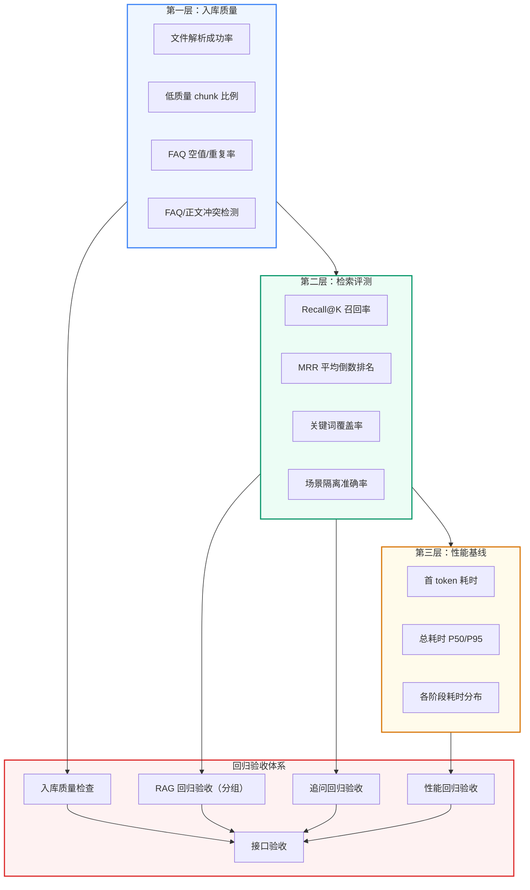
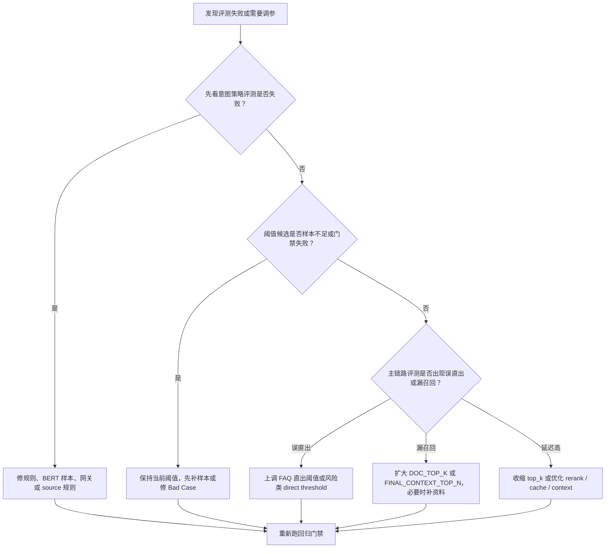
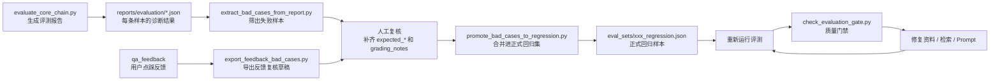

## 第一部分：为什么 RAG 需要系统化评测

### 1.1 RAG 评测的挑战

传统软件测试通常是二元的（通过/失败）。但 RAG 系统的输出是**自然语言文本**，不能简单地用 `assertEqual(expected, actual)` 来判断。

```text
问题："入职流程有哪些步骤"

预期行为：
  ✅ 召回了正确的文档片段（检索质量）
  ✅ 答案包含了流程的完整步骤（完整性）
  ✅ 答案基于提供的资料而非幻觉（忠实性）
  ✅ 来源引用正确（可溯源性）

❌ 这些指标不能用一个简单的 test case 覆盖
```

### 1.2 三层保障体系



---

## 第二部分：入库质量报告

### 2.1 检查项

```bash
python scripts/quality/check_ingestion_quality_gate.py \
    --scenario enterprise_knowledge
```

生成报告覆盖以下维度：

**文件解析检查**：

- 哪些文件解析失败（PDF 损坏、编码错误）
- 哪些文件类型不被支持
- 哪些文件为空（没有任何有效文本）

**Chunk 质量检查**：

- 过短 chunk：去除首尾空白后长度 `<30`，表格行不套用该规则
- 过长 chunk：长度大于 `max(parent_chunk_size × 2, 2000)`
- 低字符唯一率：长度 `>=50` 且 `unique_ratio < 0.08`，表格行不套用该规则
- 重复 chunk：标准化正文的稳定 hash 完全相同，不是语义相似判断

**FAQ 质量检查**：

- question 或 answer 为空的记录
- 完全相同的 FAQ 对（重复录入）
- source 不在 valid_sources 白名单中的 FAQ

### 2.2 FAQ/正文冲突检测

```python
# qa_core/quality/conflicts.py

def _related_threshold(keywords: list[str]) -> int:
    if len(keywords) >= 6:
        return 3
    if len(keywords) >= 3:
        return 2
    return 1


def _numbers(text: str) -> set[str]:
    cleaned_text = VERSION_NUMBER_RE.sub("", text or "")
    return {item.replace(" ", "") for item in NUMERIC_FACT_RE.findall(cleaned_text) if item.strip()}


def _polarity(text: str) -> str:
    has_negative = bool(NEGATIVE_RE.search(text or ""))
    has_positive = bool(POSITIVE_RE.search(text or ""))
    if has_negative and not has_positive:
        return "negative"
    if has_positive and not has_negative:
        return "positive"
    return "mixed_or_unknown"
```

**为什么用 jieba.cut_for_search 而不是简单正则**：

`cut_for_search` 是 jieba 的搜索模式分词，会同时输出原词和更细粒度的子词。例如"管理员密码重置"会被分为 `["管理员", "管理", "密码", "重置"]`，这样"用户密码修改"也能匹配到"密码"这个公共关键词。

真实冲突检测分两步，不使用一个虚构的“冲突相似度”：

1. **先找相关正文**：FAQ 问题和答案一起分词，过滤单字与停用词、按顺序去重，最多保留 12 个关键词；同 source 的正文命中数量达到动态门槛后才进入候选，最多取命中最多的 5 条。
2. **再比对事实口径**：同时检查数字集合是否完全无交集，以及肯定/否定倾向是否相反。

关键词关联门槛为：

```text
关键词数 1~2：至少命中 1 个
关键词数 3~5：至少命中 2 个
关键词数 >=6：至少命中 3 个
```

表格行通常很短，单独采用“命中一个长度至少 3 的具体词，或命中至少两个普通词”的关联条件。版本号如 `2024.01` 会在数字事实比较前剔除，避免把文档版本误报为金额、时长或比例冲突。

检测结果只有三类：

| issue | 判断条件 | 含义 |
| --- | --- | --- |
| `no_related_document` | 找不到达到关联门槛的正文 | FAQ 可能缺少资料依据 |
| `numeric_mismatch` | FAQ 与正文都有数字事实，但集合无交集 | 金额、时间、比例或数量口径可能冲突 |
| `polarity_mismatch` | 一方明确肯定，另一方明确否定 | 支持范围或制度要求可能冲突 |

这些都是“潜在冲突告警”，不是语义真值判定。报告用于阻止候选版本自动激活并交给人工复核，不应自动改写 FAQ 或正文。

### 2.2.1 Chunk 噪声公式

字符唯一率定义为：

```text
unique_ratio = 去空白后不同字符数量 / 去空白后字符总数
```

例如 OCR 失败产生大量重复的 `||||||||`、页眉线或乱码时，分母持续增大而不同字符数量很少，`unique_ratio` 会下降。只有正文长度至少 50 且比例低于 8% 才告警，避免短文本天然字符种类少而误报；表格行同样豁免。重复检测则使用正文 `strip()` 后的稳定 hash，只识别完全重复，不宣称识别语义近似重复。

### 2.3 入库质量检查

```bash
python scripts/quality/check_ingestion_quality_gate.py \
    --report reports/ingestion/enterprise_knowledge_phase1_gate_check.json
```

这里要区分两个概念：

| 概念 | 职责 | 对应代码 |
| --- | --- | --- |
| 入库质量报告 | 记录本次候选版本有哪些质量事实，例如失败文件、空文件、重复 FAQ、低质量 chunk | `build_ingestion_quality_report()` |
| 入库质量门禁 | 根据阈值判断候选版本能不能继续激活 | `evaluate_report_against_gate()` |

真实代码默认采用严格门禁，下面这些问题默认都要求为 0：

| 条件 | 阈值 |
| --- | --- |
| 文件解析失败 | `max_failed_files = 0` |
| 未支持文件或不在 source 白名单的文件 | `max_unsupported_files = 0` |
| 空文件 | `max_empty_files = 0` |
| 低质量 chunk | `max_low_quality_issues = 0` |
| 重复 chunk | `max_duplicate_chunks = 0` |
| FAQ question 为空 | `max_empty_faq_questions = 0` |
| FAQ answer 为空 | `max_empty_faq_answers = 0` |
| FAQ 问题重复 | `max_duplicate_faq_questions = 0` |
| FAQ source 非法 | `max_invalid_faq_sources = 0` |
| FAQ/正文潜在冲突 | `max_faq_document_conflicts = 0` |

验收不通过时，**不激活新版本**。这样可以确保线上知识库始终是经过质量验证的。真实企业系统可以在资料治理早期临时放宽某个阈值，但必须通过命令行显式传入，例如 `--max-duplicate-chunks 3`；不要在代码里悄悄吞掉质量问题。

这部分和知识库多版本管理的关系是：知识库多版本管理负责说明“为什么门禁失败不能切换 active 指针”，RAG 回归验收与入库质量负责说明“门禁根据哪些质量事实做判断”。

---

## 第三部分：检索评测

### 3.1 评测数据集格式

```text
// eval_sets/multi_scenario_smoke.json
[
    {
        "scenario_id": "enterprise_knowledge",
        "query": "入职流程有哪些步骤",
        "expected_source": "hr",
        "expected_hit_type": "rag",
        "expected_keywords": ["入职", "流程", "步骤", "材料", "合同"],
        "min_expected_sources": 2
    },
    {
        "scenario_id": "enterprise_knowledge",
        "query": "忘记密码怎么办",
        "expected_source": "it",
        "expected_hit_type": "faq_direct",
        "expected_keywords": ["密码", "重置", "邮箱", "手机"],
        "min_expected_sources": 1
    }
]
```

### 3.2 评测指标

```python
# 以下 RAGEvaluationMetrics 为简化伪代码，实际评测逻辑分布在
# scripts/evaluate_core_chain.py 和 scripts/eval_common.py 中，不存在该独立类

class RAGEvaluationMetrics:
    def compute(self, test_cases, actual_results):
        metrics = {}

        # Recall@K：期望的关键词在召回的文档中出现了多少
        metrics["recall_at_k"] = sum(
            self._keyword_recall(tc, result)
            for tc, result in zip(test_cases, actual_results)
        ) / len(test_cases)

        # MRR：正确答案在召回列表中的排名的倒数平均值
        metrics["mrr"] = sum(
            1.0 / self._first_relevant_rank(tc, result)
            for tc, result in zip(test_cases, actual_results)
        ) / len(test_cases)

        # 关键词覆盖率
        metrics["avg_keyword_coverage"] = sum(
            self._keyword_coverage(tc, result)
            for tc, result in zip(test_cases, actual_results)
        ) / len(test_cases)

        # hit_type 准确率
        metrics["hit_type_accuracy"] = sum(
            1.0 if tc["expected_hit_type"] == result.get("hit_type")
            else 0.0
            for tc, result in zip(test_cases, actual_results)
        ) / len(test_cases)

        # source 推断准确率
        metrics["source_inference_accuracy"] = sum(
            1.0 if tc["expected_source"] == result.get("source_filter")
            else 0.0
            for tc, result in zip(test_cases, actual_results)
        ) / len(test_cases)

        # 场景隔离准确率
        metrics["scenario_isolation_accuracy"] = ...

        metrics["errors"] = sum(
            1 for r in actual_results if r.get("error")
        )

        return metrics
```

### 3.3 分组验收

**关键设计**：回归验收不只是看全局平均值，而是**按场景、source、hit_type 分组检查**。

```python
# scripts/quality/check_evaluation_gate.py

def check_evaluation_gate(report):
    """按维度分组检查 RAG 回归验收。"""
    failures = []

    # 全局验收
    global_metrics = report["metrics"]
    if global_metrics["recall_at_k"] < 0.85:
        failures.append(f"全局 Recall@K {global_metrics['recall_at_k']} < 0.85")

    # 按场景分组验收 ← 防止某个场景退化被全局均值掩盖
    for scenario_id, scenario_metrics in report["by_scenario"].items():
        if scenario_metrics["recall_at_k"] < 0.80:
            failures.append(
                f"场景 {scenario_id} Recall@K {scenario_metrics['recall_at_k']} < 0.80"
            )

    # 按 source 分组验收
    for source, source_metrics in report["by_source"].items():
        if source_metrics["recall_at_k"] < 0.75:
            failures.append(f"分类 {source} 召回率不达标")

    return len(failures) == 0, failures
```

---

### 3.4 RAGAS 补充评测

示例实现的主评测不是 RAGAS，而是面向企业 RAG 主链路的工程回归门禁。原因是企业系统不能只判断答案文本是否“看起来合理”，还必须验证：

- 是否召回到预期来源：`Recall@K`
- 预期来源排名是否靠前：`MRR`
- 答案是否覆盖关键事实：`keyword_coverage`
- FAQ 直出、RAG 生成、边界提示等路径是否正确：`hit_type_accuracy`
- source 自动推断是否正确：`source_inference_accuracy`
- Prompt Profile 路由是否正确：`prompt_profile_accuracy`
- 多场景隔离是否正确：`scenario_isolation_accuracy`
- 最终答案综合置信度是否偏低：`avg_answer_confidence_score`（观察项，默认不阻断；内部由证据置信度和生成后核验保守合并）
- 是否出现错误和明显超时

#### 为什么不直接把 RAGAS 作为主评测

RAGAS 是很好的 RAG 语义质量评估工具，但它默认关注的是“问题、答案、上下文、参考答案”之间的语义关系。KnowForge 的主评测目标更偏企业工程回归，很多关键指标不是 RAGAS 默认能直接判断的。

| 企业级验收问题 | RAGAS 默认是否能直接判断 | 示例实现主评测如何判断 |
| --- | --- | --- |
| 是否召回到预期业务来源 | 部分能，需要额外改造样本和上下文标注 | `expected_source_contains` + `Recall@K` + `MRR` |
| FAQ 是否应该高置信直出 | 不能直接判断 | `expected_hit_type=faq_direct` + `faq_direct_accuracy` |
| 问题是否应该进入 RAG 生成 | 不能直接判断 | `hit_type_accuracy` |
| 是否识别到 source 选错边界 | 不能直接判断 | `source_boundary` / `source_inference_accuracy` |
| 是否命中正确 Prompt Profile | 不能直接判断 | `expected_prompt_profile` + `prompt_profile_accuracy` |
| 是否遵守多场景隔离 | 不能直接判断 | `scenario_isolation_accuracy` |
| 是否只查当前 active `kb_version` | 不能直接判断 | 工程评测报告记录 `kb_version` 和检索诊断 |
| 是否遵守 DataScope 权限过滤 | 不能直接判断 | 评测样本传入 `tenant_id` / `dataset_id` / `visibility` / `user_role` |
| 最终答案置信度是否异常偏低 | 不能直接判断 | `answer_confidence.score` / `answer_confidence.evidence_confidence` / `answer_confidence.generation_verification` 作为观察项 |
| 是否出现接口错误或依赖异常 | 不能作为主指标 | `errors` / `error_rate` |
| 响应耗时是否可接受 | 不能作为主指标 | `avg_elapsed_ms` / 性能基线门禁 |

因此，如果把 RAGAS 直接作为主评测，会出现三个问题：

1. **会漏掉企业级链路指标**：FAQ 直出、source 边界、Prompt Profile、多场景隔离、DataScope、active 版本等都不是 RAGAS 的默认评价对象。
2. **会把工程问题误看成语义问题**：例如召回 source 错了、版本过滤错了、权限过滤错了，RAGAS 可能只看到“答案和上下文是否一致”，但无法指出是哪条工程链路退化。
3. **不适合做唯一 CI 门禁**：RAGAS 依赖 LLM-as-judge，成本更高、速度更慢、结果有一定波动；示例实现需要一个稳定、可解释、可失败的工程回归门禁。

所以示例实现的定位是：

```text
主评测：自研工程回归门禁
  负责判断主链路有没有退化：
  Recall@K / MRR / hit_type / source 推断 / Prompt Profile / 场景隔离 / DataScope / 错误率 / 耗时 / answer_confidence 观察

补充评测：RAGAS
  负责分析答案语义质量：
  faithfulness / answer_relevancy / context_relevance / groundedness
```

一句话总结：**RAGAS 适合回答“答案语义质量怎么样”，示例实现自研门禁负责回答“企业 RAG 主链路是否稳定正确”。两者互补，不是替代关系。**

RAGAS 适合补充回答语义质量，例如：

- `faithfulness`：答案是否忠实于召回上下文
- `answer_relevancy`：答案是否回应了用户问题
- `context_relevance`：召回上下文是否和问题相关
- `response_groundedness`：答案是否能被上下文支撑

所以示例实现采用两层评测：

| 层级 | 工具 | 作用 | 是否主门禁 |
| --- | --- | --- | --- |
| 工程回归门禁 | `evaluate_core_chain.py` + `check_evaluation_gate.py` | 验证召回、路由、场景隔离、Prompt、错误率、耗时和答案置信度观察项 | 是 |
| 追问专项门禁 | `evaluate_followup_chain.py` + `check_followup_gate.py` | 验证多轮追问、改写和历史上下文 | 是 |
| RAGAS 补充分析 | `evaluate_ragas_quality.py` | 评估忠实度、答案相关性等语义质量 | 否 |

典型执行顺序：

```bash
python scripts/evaluate_core_chain.py --dataset eval_sets/multi_scenario_smoke.json --limit 20 --output reports/evaluation/core_chain_latest.json
python scripts/quality/check_evaluation_gate.py --report reports/evaluation/core_chain_latest.json
python scripts/quality/evaluate_ragas_quality.py --report reports/evaluation/core_chain_latest.json --limit 10 --output reports/evaluation/core_chain_latest_ragas.json
```

`evaluate_ragas_quality.py` 会读取工程评测报告中的完整答案和检索上下文，生成独立的 RAGAS 报告。它不会替代 `check_evaluation_gate.py`，因为 RAGAS 无法直接判断示例实现最关键的企业级指标，例如 active `kb_version` 是否正确、DataScope 是否隔离、source boundary 是否识别、FAQ 是否高置信直出。

`avg_answer_confidence_score` 默认是观察项，不是硬门禁。它读取的是最终 `answer_confidence.score`，该分数由两段公共逻辑得出：生成前 `evidence_confidence` 先判断检索证据是否扎实，生成后 `generation_verification` 再检查 LLM 答案的行内引用、引用编号合法性和上下文词面支撑度，最终取更保守的一侧。需要把它变成阻断条件时，显式传入：

```bash
python scripts/quality/check_evaluation_gate.py --report reports/evaluation/core_chain_latest.json --min-avg-answer-confidence-score 0.65
```

这样设计的原因是：最终答案置信度能帮助定位“为什么这次回答不稳”，但 V1 还没有用大量人工标注做概率校准。默认把它放进报告和 Trace，而不是直接替代 Recall@K、MRR、关键词覆盖和人工复核。

---

## 第四部分：评测指标手算示例

上面的代码展示了指标的计算公式。为了能真正理解 MRR，需要用具体检索排序样例解释它的含义。以下用示例实现的真实评测数据说明。

### 4.1 Recall@K 手算示例

**Recall@K** 衡量的是：在召回的 Top-K 个文档中，有多少期望的关键词被覆盖了。

```text
以测试样本为例：
  查询："入职流程有哪些步骤"
  期望关键词：["入职", "流程", "步骤", "材料", "合同"]

召回结果（Top-5 文档片段）：
  [1] "入职流程包括以下步骤：1. 提交个人材料..." → 命中：入职, 流程, 步骤, 材料 ✅
  [2] "新员工入职当天需要携带身份证、学历证书..." → 命中：入职 ✅
  [3] "劳动合同应在入职后一个月内签订..." → 命中：合同 ✅
  [4] "培训安排将在入职第二周进行..." → 命中：入职 ✅
  [5] "员工福利包括五险一金、带薪年假..." → 命中：无 ❌

已覆盖的关键词：{"入职", "流程", "步骤", "材料", "合同"} → 5/5 = 1.0
```

```python
def recall_at_k(expected_keywords, retrieved_docs, k=5):
    """计算单条测试样本的 Recall@K。"""
    # 取前 K 个文档
    top_k_docs = retrieved_docs[:k]

    # 合并所有召回文档的文本
    combined_text = " ".join(doc.page_content for doc in top_k_docs)

    # 统计被覆盖的关键词
    covered = {kw for kw in expected_keywords if kw in combined_text}

    return len(covered) / len(expected_keywords)

# 手算验证
expected = ["入职", "流程", "步骤", "材料", "合同"]
recalled_docs = [...]  # 上面 5 个文档
print(recall_at_k(expected, recalled_docs, k=5))  # 5/5 = 1.0

# 如果 k=2（只看前 2 个文档）
print(recall_at_k(expected, recalled_docs, k=2))  # 4/5 = 0.8
# 因为"合同"在第 3 个文档才出现
```

**K 值的选择**：

| K 值 | 含义 | 示例实现使用 |
| --- | --- | --- |
| K=1 | 只看第 1 个召回结果 | 太严格 |
| K=3 | 看前 3 个 | 中等 |
| **K=5** | **看前 5 个** | **示例实现使用** |
| K=10 | 看前 10 个 | 较宽松 |

### 4.2 MRR 手算示例

**MRR（Mean Reciprocal Rank）** 衡量的是：第一个真正相关的文档排在召回列表的第几位。

> MRR = (1/排名₁ + 1/排名₂ + ... + 1/排名n) / n

```text
假设有 3 个测试查询：

查询 1："入职流程有哪些步骤"
  召回结果：[doc_A(0.92), doc_B(0.85), doc_C(0.78), ...]
  第一个相关文档是 doc_A，排名第 1 位
  → Reciprocal Rank = 1/1 = 1.0

查询 2："VPN 连不上怎么办"
  召回结果：[doc_X(0.78), doc_Y(0.75), doc_Z(0.71), ...]
  前两个都不相关（虽然分数高，但内容不匹配）
  第一个相关文档是 doc_Z，排名第 3 位
  → Reciprocal Rank = 1/3 ≈ 0.333

查询 3："员工报销需要准备哪些材料"
  召回结果：[doc_M(0.95), doc_N(0.82), ...]
  第一个相关文档是 doc_M，排名第 1 位
  → Reciprocal Rank = 1/1 = 1.0

MRR = (1.0 + 0.333 + 1.0) / 3 ≈ 0.778
```

```python
def mean_reciprocal_rank(test_cases, search_fn):
    """计算 MRR。"""
    reciprocal_ranks = []

    for tc in test_cases:
        results = search_fn(tc["query"])  # 执行检索
        relevant_doc_id = tc["relevant_doc_id"]

        # 找第一个相关文档的排名
        rank = None
        for i, result in enumerate(results, start=1):
            if result.id == relevant_doc_id:
                rank = i
                break

        if rank is not None:
            reciprocal_ranks.append(1.0 / rank)
        else:
            reciprocal_ranks.append(0.0)  # 没找到 = 0

    return sum(reciprocal_ranks) / len(reciprocal_ranks)

# 手算验证
print(f"MRR = {mean_reciprocal_rank(test_cases, search_fn):.3f}")
# MRR = 0.778
```

**MRR 的直观理解**：

```text
MRR = 1.0  → 每个查询的第一个结果是相关的           → 完美
MRR = 0.9  → 第一个相关结果平均排在第 1.1 位          → 示例实现水平
MRR = 0.5  → 第一个相关结果平均排在第 2 位            → 合格
MRR = 0.2  → 第一个相关结果平均排在第 5 位            → 需要改进
MRR = 0.05 → 几乎找不到相关结果                        → 严重问题
```

### 4.3 关键词覆盖率手算示例

**关键词覆盖率** 衡量的是：期望关键词中有多少出现在了召回的文档片段里。

```text
查询："跨境贸易中 HS 编码归类争议怎么处理"
期望关键词：["HS编码", "归类", "海关", "争议", "行政复议", "预裁定"]

召回文档片段（合并后）：
  "HS 编码归类争议可通过以下途径解决：1. 向海关申请预裁定
   2. 如对归类决定有异议可申请行政复议 3. 必要时走行政诉讼流程"

逐个检查关键词是否出现在文本中：
  "HS编码"     → 出现了 "HS 编码"   → ✅ 覆盖
  "归类"       → 出现了 "归类"       → ✅ 覆盖
  "海关"       → 出现了 "海关"       → ✅ 覆盖
  "争议"       → 出现了 "争议"       → ✅ 覆盖
  "行政复议"   → 出现了 "行政复议"   → ✅ 覆盖
  "预裁定"     → 出现了 "预裁定"     → ✅ 覆盖

关键词覆盖率 = 6/6 = 1.0
```

```python
def keyword_coverage(expected_keywords, retrieved_docs):
    """计算关键词覆盖率。"""
    combined_text = " ".join(doc.page_content for doc in retrieved_docs)
    covered = sum(1 for kw in expected_keywords if kw in combined_text)
    return covered / len(expected_keywords)
```

### 4.4 一个完整评测样本长什么样

```json
{
    "scenario_id": "engineering_project_qa",
    "query": "隐蔽工程验收需要哪些资料",
    "expected_source": "quality",
    "expected_hit_type": "rag",
    "expected_keywords": [
        "隐蔽工程",
        "验收",
        "质量验收报告",
        "隐蔽工程验收记录",
        "材料检测报告",
        "功能性试验报告"
    ],
    "expected_prompt_profile": "knowledge_answer",
    "min_expected_sources": 3,
    "relevant_doc_id": "engineering_project_qa/doc_chunk_quality_042",
    "notes": "期望从 quality 分类召回，覆盖至少 3 个关键词，使用 knowledge_answer 模板"
}
```

**一个好的评测样本需要**：

1. `expected_source`：验证 source 推断是否正确
2. `expected_keywords`：至少 4-6 个具体关键词，不是模糊描述
3. `expected_hit_type`：验证 FAQ 直出 vs 文档 RAG 的判断是否正确
4. `min_expected_sources`：验证是否跨 source 串库
5. `relevant_doc_id`（可选）：用于精确计算 MRR
6. `notes`：解释为什么期望这些值，帮助其他人理解评测意图

---

## 第五部分：Bad Case 沉淀

> 本部分结构
>

### 5.1 无人值守质量周期与人工门禁

V1 将评测自动化和模型学习治理分开：评测、策略校准、性能门禁和 Bad Case 草稿可以无人值守运行；Bad Case 真值确认、正式回归集合并、意图模型训练与激活必须保留人工审批。

定时任务统一调用：

```bash
python scripts/quality/run_v1_quality_cycle.py --docker --include-performance
```

该周期会生成主链路评测报告、评测门禁、意图策略报告、FAQ/意图阈值候选报告、性能门禁和两类 Bad Case 草稿。阈值扫描只生成候选策略，不修改 `config/rules.toml` 或生产模型。任一步失败，周期报告的 `ok` 为 `false`，调度器可以据此告警或阻止发布；锁文件会阻止同一环境重叠执行。

这里的“自动学习”不是无人监管的在线自训练，而是：**自动收集、自动评测、人工确认、受控发布**。

完整质量链路如下：

```text
意图策略评测
  -> 先判断 route / intent / source / policy 是否正确
  -> 再决定改规则、改模型、改网关还是改 source

阈值候选校准
  -> 先判断 FAQ 直出和模型接管阈值有没有样本支撑
  -> 再决定是否采纳候选值

主链路评测
  -> 再判断召回、MRR、keyword coverage、hit type、延迟和最终答案是否达标
  -> 再决定改 top_k、context 数量、FAQ 直出阈值或 Prompt

Bad Case 回流
  -> 把失败样本补进 eval_sets/
  -> 下一轮重新评测
```

更实用的总表是：

| 评测结果来源 | 首先回答的问题 | 主要动作 |
| --- | --- | --- |
| `evaluate_intent_policy.py` | 入口意图、source、rewrite 和网关仲裁对不对 | 改规则、补意图样本、调 `model_min_score`、修 source 规则 |
| `demo_intent_model.py --eval-only` | BERT 意图模型本身是否稳定 | 补训练集、重训、调模型采用门槛 |
| `calibrate_thresholds.py` | FAQ 直出阈值和模型采纳阈值有没有证据 | 采纳或拒绝候选阈值 |
| `evaluate_core_chain.py` | 召回、MRR、关键词覆盖、场景隔离和最终答案是否达标 | 改检索策略、top_k、context、Prompt、资料 |
| `check_evaluation_gate.py` | 当前评测是否允许进入发布门禁 | 阻断或放行 |
| `extract_bad_cases_from_report.py` / `export_feedback_bad_cases.py` | 失败样本能不能变成下一轮回归集 | 生成 Bad Case 草稿并复核 |

注意闭环顺序不要倒：**先定入口意图和 source，再定检索策略，再看最终答案。** 如果意图识别本身已经错了，直接调 `DOC_TOP_K` 或 `FINAL_CONTEXT_TOP_N` 只会把错误检索做得更稳定。

#### 5.1.1 诊断流程图



这张图对应的不是“所有问题一把梭”，而是排查顺序：先分清入口判断错了没有，再看阈值候选有没有证据，最后才动检索参数和上下文预算。

#### 5.1.2 完整案例：FAQ 误直出怎么排查

以 `near_expense_tax_risk` 这类样本为例，问题是“报销材料齐全是否代表不存在税务风险”。它看起来像 FAQ，但业务上不该被当成安全直答。

1. 先看 `evaluate_intent_policy.py`。如果这条样本在意图层已经被分成 `KNOWLEDGE_QUERY` 或保守路线，说明入口判断基本没错。
2. 再看 `calibrate_thresholds.py`。如果当前 FAQ 直出候选的 `false_direct_rate` 偏高，说明阈值太松，不该让相似 FAQ 过早直出。
3. 再看 `evaluate_core_chain.py`。如果主链路里这条样本仍然变成 `faq_direct`，而不是进入 RAG，那么问题就不是检索召回，而是 FAQ 直出保护线不够严。
4. 处理动作不是先改 `DOC_TOP_K`，而是先提高 `FAQ_DIRECT_SCORE_THRESHOLD` 或风险类 direct threshold，再重新跑评测和门禁。

同样地，如果样本是“新员工入职第一天要完成什么”，却被拖进了 RAG，多数情况下应该先反向检查是不是阈值过高，而不是先把文档召回池无限放大。

### 5.2 先看一个具体 Bad Case

> 与LangSmith 观测、Trace 与生产化部署的边界
>
> 本部分是 Bad Case 质量闭环的主位置：重点讲“问题如何被复核、沉淀为 `eval_sets/` 回归样本、进入 Evaluation，并最终影响发布 Gate”。LangSmith 观测、Trace 与生产化部署只讲线上 Trace 如何发现问题、定位问题和把问题交接到这里，不再重复完整评测闭环。

Bad Case 不是一句“答案不对”，而是一条能复现、能标注、能再次评测的问题样本。先看一个具体例子。

用户提问：

```text
VPN 客户端版本、账号锁定、公网 IP 这些排查项分别应该怎么处理？
```

系统回答：

```text
可以先重启 VPN 客户端，确认网络正常；如果仍然无法连接，请提交 IT 工单。
```

这个回答看起来不算错，但它没有分别回答三个排查项：

| 用户问到的点 | 期望回答 | 当前回答是否覆盖 |
| --- | --- | --- |
| VPN 客户端版本 | 确认是否为 IT 发布的最新版，旧版本需重新安装 | 否 |
| 账号锁定 | 检查账号是否过期、锁定或权限被回收 | 否 |
| 公网 IP | 判断当前公网 IP 是否在允许范围或是否被安全策略拦截 | 否 |

所以这个问题应该被沉淀为 Bad Case。它的价值不是“记录一次失败”，而是保证后续改 Prompt、改检索策略、重建知识库后，这个问题必须被重新验证。

### 5.3 这条 Bad Case 在诊断信息里怎么看

本地评测报告的 `retrieval` / `debug_retrieval` 字段，或者 LangSmith Trace 中，会看到类似信息：

```json
{
  "scenario_id": "enterprise_knowledge",
  "kb_version": "kb_enterprise_knowledge_20260620_082630_4c1df17a",
  "intent": "KNOWLEDGE_QUERY",
  "question_category": "troubleshooting",
  "prompt_profile": "troubleshooting_steps",
  "hit_type": "rag",
  "sources_count": 2,
  "top_source_score": 0.63,
  "answer_confidence": {
    "score": 0.58,
    "level": "medium",
    "reasons": ["rag_with_context", "low_intent_decision_score", "low_inline_citation_coverage"],
    "evidence_confidence": {"score": 0.74, "level": "medium", "label": "中"},
    "generation_verification": {
      "status": "partial",
      "score": 0.58,
      "reasons": ["low_inline_citation_coverage"],
      "signals": {
        "citation_coverage": 0.33,
        "context_overlap": 0.61,
        "valid_citation_numbers": [1, 2],
        "invalid_citation_numbers": []
      }
    }
  },
  "slowest_stage": "llm_generation",
  "stage_timings_ms": {
    "doc_retrieval": 840,
    "rerank": 390,
    "llm_generation": 5200
  }
}
```

这条 Trace 给出的判断不是简单“模型答错了”，而是：

- `hit_type=rag`：它确实进入了 RAG 生成，不是 FAQ 直出问题。
- `prompt_profile=troubleshooting_steps`：Prompt 档位基本正确。
- `sources_count=2`：召回到了资料，但证据可能不完整。
- `top_source_score=0.63`：最高来源相关性一般，需要检查是否缺少更细的排障资料。
- `answer_confidence.level=medium`：最终答案置信度没有达到高，需要结合 `evidence_confidence` 和 `generation_verification` 判断是检索证据不足、上下文覆盖不足、意图决策不稳，还是 LLM 生成后引用/支撑核验偏弱。
- 回答漏掉三个子问题：更像“上下文覆盖不足或生成未按子问题展开”。

因此它应进入质量闭环，而不是只作为一次线上投诉处理。

### 5.4 本地如何处理 Bad Case

示例实现默认不要求使用 LangSmith。Bad Case 闭环先按本地文件完成：



最小可执行命令如下：

```bash
python scripts/evaluate_core_chain.py --dataset eval_sets/multi_scenario_smoke.json --limit 20 --output reports/evaluation/core_chain_latest.json
python scripts/extract_bad_cases_from_report.py --report reports/evaluation/core_chain_latest.json --output eval_sets/local_bad_cases.json
python scripts/export_feedback_bad_cases.py --scenario enterprise_knowledge --output eval_sets/local_feedback_bad_cases.json
python scripts/promote_bad_cases_to_regression.py --source eval_sets/local_bad_cases.json --target eval_sets/enterprise_it_troubleshooting_cases.json
python scripts/evaluate_core_chain.py --dataset eval_sets/enterprise_it_troubleshooting_cases.json --output reports/evaluation/enterprise_it_troubleshooting_cases_latest.json
python scripts/quality/check_evaluation_gate.py --report reports/evaluation/enterprise_it_troubleshooting_cases_latest.json
```

如果要把这条闭环直接挂到封版入口，可以运行 `python scripts/verify_v1_release.py --include-evaluation --include-docker`。这条命令会一次性产出评测报告、门禁摘要和 Bad Case 候选，作为 V1 发布前的统一验收动作。

这些命令对应五个动作：

| 动作 | 示例实现文件 | 作用 |
| --- | --- | --- |
| 发现问题 | `reports/evaluation/core_chain_latest.json` | 记录每条样本的实际命中路径、召回、关键词覆盖率和错误 |
| 筛出问题 | `scripts/extract_bad_cases_from_report.py` | 根据错误、召回失败、字段不匹配和关键词覆盖不足筛选 Bad Case |
| 导出反馈 | `scripts/export_feedback_bad_cases.py` | 把用户点踩反馈导出为待复核草稿，保留原问题、备注、实际答案和来源快照 |
| 复核问题 | `eval_sets/local_bad_cases.json` | 把失败问题变成可人工编辑、可复跑的中间样本 |
| 合并回归 | `scripts/promote_bad_cases_to_regression.py` | 把复核后的 Bad Case 合并进正式 `eval_sets/*.json` 回归集 |
| 阻断退化 | `scripts/quality/check_evaluation_gate.py` | 指标未达标时返回非 0 退出码，阻止发布或激活 |

### 5.5 自动识别

Bad Case 的入口不是人工逐条翻聊天记录，而是先从评测报告里筛出“疑似异常样本”。脚本会检查下面这些字段：

| 字段 | 进入 Bad Case 的条件 | 重点排查 |
| --- | --- | --- |
| `error` / `debug_error` | 有异常信息 | 代码、依赖、模型服务、检索服务 |
| `source_recall_hit` | `false` | 入库、query variants、source_filter、Milvus 过滤、阈值 |
| `hit_type_matched` | `false` | FAQ 直出、RAG、边界拦截的路由判断 |
| `source_inference_matched` | `false` | source 自动推断规则和场景词表 |
| `prompt_profile_matched` | `false` | 问题类别识别和 Prompt Profile 路由 |
| `keyword_coverage` | 低于 `--min-keyword-coverage` | 上下文覆盖、Prompt 约束或资料内容 |

例如，只想把关键词覆盖率低于 0.8 的样本也纳入 Bad Case，可以这样执行：

```bash
python scripts/extract_bad_cases_from_report.py --report reports/evaluation/core_chain_latest.json --output eval_sets/local_bad_cases.json --min-keyword-coverage 0.8
```

用户点踩反馈的处理方式类似，但它不是评测真值，不能直接进入正式回归集。`export_feedback_bad_cases.py` 只导出复核草稿：

```bash
python scripts/export_feedback_bad_cases.py --scenario enterprise_knowledge --rating not_useful --output eval_sets/local_feedback_bad_cases.json
```

导出的样本会保留：

| 字段 | 作用 |
| --- | --- |
| `query` | 用户当时提出的问题 |
| `bad_case_reasons` | 点踩类型和用户备注 |
| `observed_answer_preview` | 当时系统给出的答案片段 |
| `observed_sources` | 当时召回到的来源快照 |
| `observed_effective_source` | 当时实际召回到的 source |

人工复核后，需要补齐 `expected_hit_type`、`expected_effective_source`、`expected_prompt_profile`、`expected_source_contains`、`expected_keywords` 等字段，再用 `promote_bad_cases_to_regression.py` 合并到正式回归集。

### 5.6 人工复核怎么填

脚本生成的 `eval_sets/local_bad_cases.json` 不是最终答案，而是复核草稿。人工复核要把“哪里不对”补成可评测字段。以 VPN 示例为例，样本可以这样写：

```json
{
  "case_id": "bad_enterprise_it_vpn_sub_questions_001",
  "query": "VPN 客户端版本、账号锁定、公网 IP 这些排查项分别应该怎么处理？",
  "scenario_id": "enterprise_knowledge",
  "source_filter": "it",
  "expected_hit_type": "rag",
  "expected_effective_source": "it",
  "expected_prompt_profile": "troubleshooting_steps",
  "expected_source_contains": [
    "it_support.md",
    "VPN 连接排查"
  ],
  "expected_keywords": [
    "客户端版本",
    "账号锁定",
    "公网 IP",
    "IT 工单",
    "截图"
  ],
  "grading_notes": "答案必须分别说明客户端版本、账号锁定、公网 IP 三个排查项，不能只给泛泛重启建议。"
}
```

这些字段会直接影响后续评测：

| 字段 | 后续如何使用 |
| --- | --- |
| `expected_hit_type` | 判断是否走了正确路径，避免应该 RAG 的问题被误判为信息不足 |
| `expected_effective_source` | 判断最终生效 source 是否正确，避免跨 source 串库 |
| `expected_source_contains` | 判断预期资料是否被召回，用于 Recall@K 和 MRR |
| `expected_prompt_profile` | 判断是否使用排障步骤模板 |
| `expected_keywords` | 判断答案是否覆盖关键事实 |
| `grading_notes` | 说明人工期望，便于后续复核和扩展 LLM-as-judge |

### 5.7 提升为评测样本

复核完成后，先用 `promote_bad_cases_to_regression.py` 把这些样本合并到正式回归集，例如 `eval_sets/enterprise_it_troubleshooting_cases.json`。`local_bad_cases.json` 只是暂存草稿，不是最终长期回归集。

建议按问题类型拆分文件，避免所有 Bad Case 混成一个大池子：

| 文件 | 放什么样本 | 示例 |
| --- | --- | --- |
| `eval_sets/local_bad_cases.json` | 临时复核出的失败样本 | 最近一次评测失败项 |
| `eval_sets/enterprise_it_troubleshooting_cases.json` | IT 排障类正式回归集 | VPN、账号锁定、工单、权限回收 |
| `eval_sets/finance_reimbursement_cases.json` | 财务报销类正式回归集 | 发票、预算、审批、付款材料 |
| `eval_sets/multi_turn_followup_cases.json` | 多轮追问正式回归集 | “那审批呢”“材料呢”“谁负责” |

进入 `eval_sets/` 后，这条样本就不再只是一次线上记录，而是以后每次版本变更都要验证的质量资产。

### 5.8 LangSmith 作为可选扩展

#### 5.8.1 先回答三个初学者常问的问题

**Q1：LangSmith 是什么？**

LangSmith 是 LangChain 公司提供的商业 SaaS 平台（也有自部署版），专门用于“观测 + 评测 LLM 应用”。它把每次 LLM 请求的输入、输出、检索上下文、子步骤耗时都记录成可浏览的 **Trace**，并提供页面化的样本标注、Dataset 管理、批量评测对比能力。可以把它理解成“LLM 应用的 APM + 回归测试平台”——前者负责看到每一次请求发生了什么，后者负责批量跑样本并对比版本。

**Q2：为什么示例实现要同时讲本地脚本和 LangSmith？**

两者解决不同问题，不是替代关系：

- 本地脚本（`evaluate_core_chain.py` + `check_evaluation_gate.py`）负责**工程约束**：可复现、可在 CI 中以退出码阻断发布、不依赖外部服务。这是示例实现的**主门禁**。
- LangSmith 负责**团队协作**：页面化筛选、人工标注分发、长期趋势看板。这是**可选扩展**。

内容保留 LangSmith 内容不是因为它必需，而是因为企业团队一旦规模上去，光靠 Git 里的 JSON 文件做人工标注分发会不够顺畅，这时候 LangSmith 的页面化能力才有价值。

**Q3：不用 LangSmith 会不会缺什么？**

不会。示例实现所有质量判断（Recall@K / MRR / keyword_coverage / hit_type / source 推断 / Prompt Profile / 场景隔离 / 答案置信度）都能通过本地脚本得出明确结论，质量闭环不依赖 LangSmith。没有 LangSmith 也不影响本地质量闭环。

#### 5.8.2 三个核心概念对初学者的解释

| LangSmith 概念 | 直观理解 | 对应示例实现本地 |
| --- | --- | --- |
| **Trace / Run** | 一次完整请求的执行轨迹，像“调试器录的回放”：你能看到意图判断、检索、重排、Prompt、LLM 输出每一步的输入输出和耗时 | `reports/evaluation/*.json` 里的诊断字段 |
| **Feedback / Annotation** | 在 Trace 上做人工标记：点赞 / 点踩、补正答案、加评分，可被结构化复用 | 人工复核时填的 `expected_*` 字段 |
| **Dataset** | 长期保存的评测样本集合，可在不同实验间复用 | `eval_sets/*.json` 回归集 |
| **Evaluation / Experiment** | 把 Dataset 跑一遍，产出指标报告，可与历史实验对比 | `evaluate_core_chain.py` + `check_evaluation_gate.py` |

一句话理解：**Trace 是“看到一次请求发生什么”，Dataset 是“保存一批要测的样本”，Experiment 是“把样本跑一遍得出指标”**。本地脚本能完成全部三件事，LangSmith 让这些事在网页上做、可团队协作、可长期对比。

#### 5.8.3 字段映射

如果企业环境已经使用 LangSmith，可以把同一套字段映射到平台对象中：

| 本地闭环 | LangSmith 中的可选对象 | 作用 |
| --- | --- | --- |
| `reports/evaluation/*.json` | Trace / Run | 查看单次请求的输入、输出、metadata 和耗时 |
| 人工复核 `expected_*` | Feedback / Annotation | 把“感觉不满意”结构化为可评分字段 |
| `eval_sets/*.json` | Dataset | 保存长期回归样本 |
| `evaluate_core_chain.py` | Evaluation / Experiment | 批量运行评测并对比版本 |
| `check_evaluation_gate.py` | 本地 Gate | 给出是否允许发布的确定性结论 |

#### 5.8.4 什么时候才考虑接入 LangSmith？

当出现下面任一信号时再考虑，不必提前引入：

- 多人协作需要页面化标注分发，光靠 Git 里的 JSON 文件不够顺畅；
- 需要长期趋势看板（线上回答质量随时间的变化），本地 `reports/evaluation/` 历史对比不够直观；
- 团队需要把线上 Trace 直接连到评测样本，不想手动 export；
- 跨团队需要给 PM / 业务方展示质量趋势。

#### 5.8.5 总结

LangSmith 不是示例实现质量闭环的前置条件。它的价值在于团队协作、页面化筛选、人工标注分发和长期趋势对比；本地脚本仍然负责提供可复现、可提交、可在 CI 中阻断退化的工程约束。没接触过 LangSmith 的读者，记住一句话即可：**本地脚本能完成全部质量判断，LangSmith 只是把同样的事搬到网页上并支持团队协作和长期趋势**。

参考页面：

- [LangSmith Evaluation](https://docs.langchain.com/langsmith/evaluation)
- [LangSmith Evaluation concepts](https://docs.langchain.com/langsmith/evaluation-concepts)
- [LangSmith Manage datasets](https://docs.langchain.com/langsmith/manage-datasets)
- [LangSmith Annotate traces inline](https://docs.langchain.com/langsmith/annotate-traces-inline)

### 5.9 这条 Bad Case 如何影响 Gate

把 VPN 示例加入 `eval_sets/local_bad_cases.json` 后，下一次运行 Evaluation 时，这条样本会变成一条明确的验收用例。失败结果可以长成这样：

```json
{
  "case_id": "enterprise_it_vpn_sub_questions_001",
  "query": "VPN 客户端版本、账号锁定、公网 IP 这些排查项分别应该怎么处理？",
  "expected_hit_type": "rag",
  "expected_source": "it",
  "expected_prompt_profile": "troubleshooting_steps",
  "expected_keywords": [
    "客户端版本",
    "账号锁定",
    "公网 IP",
    "IT 工单",
    "截图"
  ],
  "actual_hit_type": "rag",
  "actual_source_hit": true,
  "actual_prompt_profile": "troubleshooting_steps",
  "keyword_coverage": 0.4,
  "passed": false,
  "failures": [
    "missing_keywords: 客户端版本, 账号锁定, 公网 IP"
  ]
}
```

这份结果说明：检索路径、业务分类和 Prompt 档位都没错，但答案没有覆盖关键排查项。此时 Gate 不应该放行，因为同一个线上问题仍然会复发。

| 检查点 | 失败含义 | 应该修哪里 |
| --- | --- | --- |
| `actual_hit_type != expected_hit_type` | 命中路径错了 | 查意图分类、直出规则、上下文不足判断 |
| `actual_source_hit = false` | 没召回到正确业务资料 | 查 source 推断、Milvus 过滤、资料入库 |
| `actual_prompt_profile != expected_prompt_profile` | Prompt 档位错了 | 查问题类别识别和 Profile 选择 |
| `keyword_coverage` 低于阈值 | 答案漏掉关键事实 | 查上下文覆盖、Prompt 约束或资料内容 |

修复后，这条样本的结果应该变成：

```json
{
  "case_id": "enterprise_it_vpn_sub_questions_001",
  "actual_hit_type": "rag",
  "actual_source_hit": true,
  "actual_prompt_profile": "troubleshooting_steps",
  "keyword_coverage": 1.0,
  "passed": true
}
```

把这条链路说完整后，Bad Case 沉淀就不再是抽象概念，而是一个可执行的质量机制：

```text
线上问题或评测失败
  -> 本地评测报告定位
  -> 人工复核 expected_* 字段
  -> eval_sets 固化样本
  -> Evaluation 重跑验证
  -> Gate 决定是否允许发布
```

需要抓住三句话：

1. Bad Case 不是聊天记录，而是可复现、可标注、可验收的质量资产。
2. `expected_*` 字段把“感觉不满意”变成结构化期望。
3. Gate 让同类问题不会在下一次版本变更中悄悄复发。

---

### 5.10 附录：阈值候选值如何从经验值产生

> 本附录从无人值守质量周期中的阈值校准内容拆出。它讲的是阈值校准上游闭环，与 Bad Case 沉淀本身关系较弱，因此独立成节，避免冲淡主线。

运行下面的脚本可以对 FAQ 直出阈值和 BERT 模型采纳阈值做离线扫描：

```bash
python scripts/intent/calibrate_thresholds.py `
  --faq-dataset eval_sets/threshold_calibration_cases.json `
  --intent-dataset eval_sets/intent_policy_cases.jsonl `
  --output reports/threshold_calibration/threshold_candidate_latest.json `
  --fail-on-insufficient
```

FAQ 阈值以误直出率、精确率、召回率和风险加权损失选择候选值；意图模型阈值以关键样本错误数和分类准确率选择候选值。样本不足、检索失败或外部依赖失败时，报告为失败且候选值不可应用。脚本只生成 `applied=false` 的版本化报告，不会自动修改 `config/rules.toml`，也不会自动切换线上模型。

因此调整一个参数的完整闭环是：

```text
真实链路信号 + 人工真值
  -> 阈值扫描
  -> 风险约束筛选
  -> 候选策略报告
  -> 人工审批
  -> 配置/模型版本变更
  -> 回归门禁 + 性能门禁
  -> 灰度观察与回滚
```

---

## 第六部分：质量检查执行入口

### 6.1 全部回归验收

```text
# 检查顺序
1. 系统守护检查 (check_project_guardrails.py)
2. 编译检查 (Python 语法)
3. 单元测试 (python -m pytest tests -q)
4. 入库质量检查 (check_ingestion_quality_gate.py)
5. RAG 回归验收 (check_evaluation_gate.py)
6. 追问回归验收 (check_followup_gate.py)
7. 性能回归验收 (check_performance_gate.py)
8. API 合同验收 (api_e2e_smoke.py)
```

### 6.2 接口验收

```bash
python scripts/api_e2e_smoke.py --base-url http://127.0.0.1:8000
python scripts/acceptance_smoke.py --base-url http://127.0.0.1:8000
```

验证管理接口、问答页面和 WebSocket 流式事件是否可用。

### 6.3 评测趋势

状态页保留回归报告入口；历次评测对比优先看本地 `reports/evaluation/` 历史报告。企业环境需要多人协作和趋势看板时，可以把同一批样本同步到 LangSmith Experiments。

```text
                Recall@K    MRR    关键词覆盖  Source 推断  场景隔离
2026-05-01 v1:   1.000     0.900    0.933      1.000       1.000
2026-05-07 v2:   1.000     0.920    0.945      1.000       1.000
2026-05-14 v3:   0.980 ⚠   0.910    0.940      0.980 ⚠     1.000
                                  ↑ 需要排查 v3 的退化原因
```

---

## 第七部分：核心评测结果

示例实现已完成最终验收，核心指标如下：

| 指标 | 值 | 说明 |
| --- | --- | --- |
| errors | 0 | 零错误 |
| recall_at_k | 1.0 | 期望关键词全部被召回 |
| mrr | 0.9 | 正确答案平均排在第 1.1 位 |
| avg_keyword_coverage | 0.933 | 93.3% 的关键词出现在召回文档中 |
| hit_type_accuracy | 1.0 | 命中类型判断全部正确 |
| source_inference_accuracy | 1.0 | 业务分类推断全部正确 |
| prompt_profile_accuracy | 1.0 | Prompt 模板选择全部正确 |
| faq_direct_accuracy | 1.0 | FAQ 直出全部准确 |
| scenario_isolation_accuracy | 1.0 | 无跨场景数据泄露 |
| avg_total_ms | 3444 | 平均总耗时 3.4 秒 |
| p95_total_ms | 12810 | P95 耗时 12.8 秒 |
| avg_first_token_ms | 2479 | 平均首 token 耗时 2.5 秒 |

---
