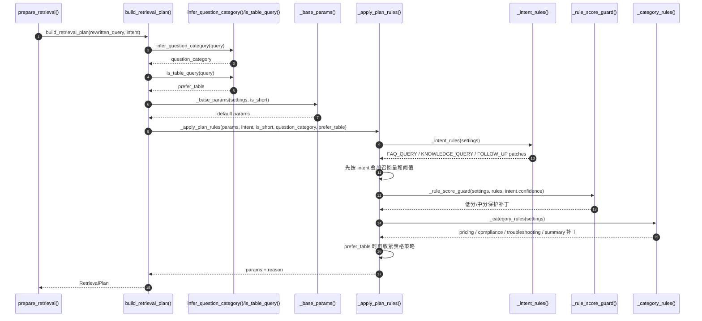

## RetrievalPlan 是什么

`RetrievalPlan` 是后续检索阶段要读取的参数包。后面的代码不需要到处写 `if intent == ...`，而是统一消费这份计划。

它定义在：

```text
qa_core/retrieval/strategy.py
```

核心字段如下：

| 字段 | 含义 |
| --- | --- |
| `run_faq` | 是否检索 FAQ 集合 |
| `run_doc` | 是否检索文档集合 |
| `faq_top_k` | FAQ 初始召回数量 |
| `doc_top_k` | 文档初始召回数量 |
| `rerank` | 后续是否进入重排 |
| `faq_direct_threshold` | FAQ 相似直出的保护阈值 |
| `final_context_top_n` | 最终进入 Prompt 的上下文条数 |
| `min_context_score` | 上下文最低相关性分数 |
| `max_context_chars` | 上下文总字符上限 |
| `max_context_doc_chars` | 单条文档字符上限 |
| `use_query_variants` | 查询改写与变体生成是否生成查询变体 |
| `question_category` | 问题类别 |
| `prefer_table` | 是否偏向表格、清单、字段类资料 |
| `faq_direct_exact_only` | 是否只允许精确 FAQ 直出 |
| `intent_rule_score` | 规则候选分数，来自 `IntentResult.rule_score` |
| `intent_decision_score` | 网关最终决策分数，来自 `IntentResult.confidence`，用于保守检索保护 |
| `reason` | 本次计划的原因标签 |

`source` 不放在 `RetrievalPlan` 中。它属于检索过滤范围，而不是检索策略本身：前端显式选择的 `source_filter` 优先，其次才使用 `IntentResult.suggested_source`。Milvus 混合检索深度解析真正执行 Milvus 检索时，再把最终生效的 source 转成过滤条件。

这里有三个分数必须分清楚：

| 分数字段 | 所在阶段 | 含义 |
| --- | --- | --- |
| `intent.rule_score` | 意图/检索计划阶段 | 入口规则候选强弱，用于诊断和规则候选排序 |
| `intent.confidence` / `plan.intent_decision_score` | 意图/检索计划阶段 | 规则候选和模型候选仲裁后的最终决策分，影响 FAQ 直出阈值和召回策略 |
| `RetrievalHit.score` / `sources[*].score` | FAQ/Doc 检索阶段 | 候选内容的检索相关性排序分 |
| `answer_confidence.evidence_confidence.score` | 生成前证据评估阶段 | 综合 top-1 检索分、上下文数量、来源数量、意图决策分和追问改写后的证据置信度 |
| `answer_confidence.generation_verification.score` | LLM 生成后核验阶段 | 检查最终答案的行内引用覆盖、引用编号合法性和上下文词面支撑度 |
| `answer_confidence.score` | 最终答案收口阶段 | 取证据置信度和生成核验分中更保守的一侧，作为最终展示和 Trace 使用的综合置信度 |

检索策略与动态计划只负责意图/检索计划分数。检索候选 `score` 在Milvus 混合检索深度解析 Milvus Hybrid Search 和 reranker 中产生；`answer_confidence` 在RAG Pipeline 主流程深度解析 RAG Pipeline 收口时生成。

> FAQ/Doc 检索和 Hybrid Search 的边界
>
> `run_faq/run_doc` 控制的是业务上的两路/分层检索：是否查 FAQ collection、是否查 Doc collection。它不是 Milvus Hybrid Search 的定义。
>
> Milvus 混合检索深度解析的 Hybrid Search 指每个被执行的 collection 内部用 Dense 向量召回 + BM25 Sparse 关键词召回做融合排序。真实业务中，企业问答常见默认策略是 FAQ 和 Doc 都查，但最终仍要服从 `RetrievalPlan`：直答类问题不查，FAQ-only 或 Doc-heavy 问题也可以只查一路或偏向一路。

### 代码执行时序图

`build_retrieval_plan()` 先识别问题形态，再按固定层叠加补丁，最后产出不可变的 `RetrievalPlan`。




## 检索计划如何生成

### 1. 从 `route="retrieval"` 开始

`scripts/demo/demo_query_prepare.py --plan-only` 的核心逻辑是：

```text
route = decide_low_cost_route(query, scenario, source_filter)

if route.route == "retrieval":
    intent = classify_intent(query, history, scenario)
    plan = build_retrieval_plan(query, intent)
```

这段代码说明本文的边界非常清楚：

- `direct_answer`：已经有答案或边界提示，不生成计划
- `retrieval`：继续意图分类，并生成检索计划
- `--plan-only`：只看检索策略与动态计划交付物，不执行查询改写与变体生成的追问改写和查询变体

完整在线链路里的 `decide_route()` 还会尝试 FAQ 精确 fast path；那一步会访问 FAQ collection。检索策略与动态计划为了聚焦“计划怎么生成”，验证脚本只保留确定性路由预览，不执行 Milvus 检索。

### 2. 先识别风险和资料形态

`qa_core/intent/question_category.py` 负责识别问题类型：

```text
QuestionCategory = Literal[
    "default",
    "pricing",
    "compliance",
    "troubleshooting",
    "summary",
]
```

这些类别不是新的用户意图，而是检索策略的风险标签。

这里要先把三个维度分清楚，否则很容易觉得参数没有感觉：

| 维度 | 代码字段 | 解决的问题 | 例子 |
| --- | --- | --- | --- |
| 用户意图 | `intent.intent` | 这类问题更像 FAQ、知识查询，还是追问？ | `FAQ_QUERY`、`KNOWLEDGE_QUERY`、`FOLLOW_UP` |
| 规则候选分 | `intent.rule_score` | 入口规则候选强不强？ | `0.60` 兜底、`0.82+` 强规则 |
| 决策分数 | `intent.confidence` | 规则/模型仲裁后是否稳定，是否需要更保守地直出？ | `0.68` 冲突降分、`0.99` 规则模型一致 |
| 风险标签 | `question_category` | 这类问题错答成本高不高，需不需要更谨慎？ | `pricing`、`compliance`、`troubleshooting` |
| 资料形态 | `prefer_table` | 这类问题是不是更依赖表格、清单、字段、行记录？ | `true` / `false` |

它们不是互斥关系，而是可以叠加。比如：

```text
报销费用超过5000需要谁审批
```

这句话可能同时触发：

- 意图：像 FAQ 查询，所以先偏向 FAQ。
- 决策分数：规则和模型一致时可以按意图分支执行；默认兜底或规则/模型冲突时更偏向证据召回。
- 风险：包含“费用、5000、审批”，所以进入 `pricing` 保护。
- 资料形态：如果问到清单、字段、明细表，还会继续触发 `prefer_table=true`。

所以最后的 `reason` 可能不是一个词，而是一串策略叠加结果，例如：

```text
faq_first_short_query_guard_pricing_guard
faq_first_pricing_guard_table_row_preferred
```

读 `reason` 时，要从左到右理解为：先按意图定主方向，再叠加短问题、决策分数、风险类别、表格偏好的保护规则。

| 类别 | 典型问题 | 策略倾向 |
| --- | --- | --- |
| `default` | 普通业务问题 | 使用默认检索计划 |
| `pricing` | 费用、金额、报销、付款 | 提高 FAQ 直出门槛，扩大候选 |
| `compliance` | 合规、隐私、合同、审计 | 使用更高保护阈值 |
| `troubleshooting` | 报错、失败、异常、排查 | 扩大文档候选，保留更多步骤 |
| `summary` | 总结、归纳、对比、大纲 | 扩大文档候选，覆盖更多资料 |

表格类问题由 `is_table_query()` 判断，例如清单、台账、字段、金额、责任人、付款节点等。

这里的“表格类问题”不是指检索策略与动态计划已经去解析 Excel，也不是指用户问题里一定出现了 `.xlsx` 文件。它指的是：用户问法明显依赖某个清单、台账、字段、行记录或明细项，答案很可能藏在结构化资料的一行或一列里。

| 不是表格类问题 | 是表格类问题 |
| --- | --- |
| `报销流程是什么` | `报销材料清单里发票字段怎么填` |
| `VPN 连不上怎么处理` | `故障台账里的责任人字段是谁` |
| `合同审批流程有哪些步骤` | `付款节点明细表里超过 5000 的审批要求是什么` |

检索策略与动态计划只负责识别这种问题形态，并把保护信号写进 `RetrievalPlan`；真正的表格文件加载、切分和入库在文档入库与索引链路，真正按计划执行 Milvus 检索在Milvus 混合检索深度解析。

### 3. 按固定顺序叠加规则

`build_retrieval_plan()` 不是一次性返回固定参数，而是先生成默认参数，再按固定顺序应用规则补丁。当前代码用 `PlanPatch` 描述每条规则要改哪些字段，用 `_apply_plan_rules()` 统一执行规则。

```text
默认参数
  ↓
意图规则 _intent_rules()
  ↓
短问题保护规则
  ↓
决策分数保护 _rule_score_guard()
  ↓
问题类别规则 _category_rules()
  ↓
表格偏好规则
  ↓
RetrievalPlan
```

这样做的好处是：参数规则集中在表里，主函数只负责识别问题形态和组装 `RetrievalPlan`，不会在多个长分支之间来回跳。

#### 规则一：按意图调整

| intent | 调整结果 |
| --- | --- |
| `FAQ_QUERY` | FAQ 优先，文档候选减半，降低基础 FAQ 直出阈值 |
| `KNOWLEDGE_QUERY` | 扩大文档候选，增加最终上下文数量 |
| `FOLLOW_UP` | 扩大 FAQ 和文档候选，提高 FAQ 直出阈值，打开查询变体 |

`build_retrieval_plan()` 只服务 `route="retrieval"` 的检索类问题。问候、转人工、越界和 source 边界会在 `decide_route()` 阶段直接返回，不会生成 `RetrievalPlan`。如果把直答类 `IntentResult` 误传进来，函数会直接报错，让职责错误尽早暴露。

#### 规则二：短问题保护

短问题信息少，更容易误命中。比如：

```text
登录
审批呢
费用
```

如果它不是追问，本文会：

- 收缩文档候选
- 提高 FAQ 直出门槛
- 在 `reason` 中追加 `short_query_guard`

追问不套用这个保护，因为查询改写与变体生成会先结合历史问题做改写。

#### 规则三：决策分数保护

`IntentResult.rule_score` 只表示规则候选强弱；`IntentResult.confidence` 表示规则候选和模型候选经过网关仲裁后的最终决策分。它不是概率，也不是向量相似度。检索计划直接消费的是 `confidence`，并把它记录为 `intent_decision_score`：

下面的保护线来自 `config/rules.toml` 的 `[retrieval_strategy]`，表格中的数字是系统默认配置。调参时优先改配置，再用测试和评测集验证效果。

| 分数区间 | 典型来源 | 检索策略 |
| --- | --- | --- |
| `< 0.70` | `default_knowledge` 兜底，或规则/模型冲突后降分 | 提高 FAQ 直出阈值到至少 `0.86`，扩大文档候选和上下文，只允许精确 FAQ 直出 |
| `0.70 - 0.82` | 追问或中等确定规则 | FAQ 直出阈值至少 `0.82`，保持足够文档候选 |
| `>= 0.82` | 规则/模型一致，或高分稳定判断 | 不额外加决策分数保护，继续按意图、风险和表格规则叠加 |

这一层解决的问题是：入口越不确定，后续越不能轻易因为一个相似 FAQ 分数高就直接返回答案。它在短问题保护之后执行，所以低分兜底会覆盖短句收缩策略，优先保证证据召回。

#### 决策分数的校准评测

`0.70`、`0.82`、`0.86` 这些值不能只靠代码注释解释。它们需要通过业务样本验证：当前分数是否真的让检索计划变得更保守，是否避免了 FAQ 误直出，是否没有把高确定 FAQ 问题过度复杂化。

示例实现新增了轻量校准脚本：

```bash
python scripts\intent\evaluate_intent_policy.py --output reports\intent_policy\intent_policy_latest.json --fail-on-critical
```

它不连接 Milvus，也不调用 LLM，只执行：

```text
normalize_user_query()
classify_direct_intent()
classify_intent()
apply_intent_decision_gateway()
build_retrieval_plan()
build_answer_prompt_profile()
```

每条样本会同时检查意图分类与路由入口和检索策略与动态计划之间的关键契约：

| 检查项 | 说明 |
| --- | --- |
| `route` | 问候、越界、转人工是否在检索前收口 |
| `intent` | 最终采用的 FAQ / KNOWLEDGE / FOLLOW_UP 是否正确 |
| `effective_source` | source 推断是否会进入正确 Milvus 过滤范围 |
| `requires_rewrite` | 追问是否触发后续改写 |
| `decision_policy` | 规则和模型仲裁策略是否符合预期 |
| `rule_score / confidence` | 规则候选分和最终决策分是否落在预期区间 |
| `RetrievalPlan` | `faq_direct_exact_only`、`faq_direct_threshold`、`use_query_variants` 等是否正确 |
| `Prompt Profile` | 费用、合规、追问等是否进入正确回答模板 |

例如低分兜底样本：

```json
{
  "question": "帮我分析一下这个问题",
  "expected_confidence_max": 0.7,
  "expected_plan_contains": {
    "faq_direct_exact_only": true,
    "faq_direct_threshold": 0.86
  }
}
```

这条样本用来证明：低分不是只被记录，而是会真正触发“只允许精确 FAQ 直出 + 提高直出门槛 + 扩大文档证据”的保守策略。

#### 规则四：风险类别保护

费用、合规、排障、总结类问题更需要谨慎。

这些风险保护线同样来自 `config/rules.toml`，目的是让不同业务风险可以独立调参。

| 类别 | 策略变化 |
| --- | --- |
| `pricing` | 扩大 FAQ 和文档候选，FAQ 直出阈值至少 `0.84` |
| `compliance` | 扩大文档候选，FAQ 直出阈值至少 `0.86` |
| `troubleshooting` | 扩大文档候选和上下文数量 |
| `summary` | 扩大文档候选和上下文数量 |

#### 规则五：表格偏好

表格类问题通常要定位具体行列，例如：

```text
材料清单里的付款金额字段是什么
验收表里责任人字段在哪里
付款节点明细有哪些
```

这类问题最怕“看起来差不多”的误命中。比如 FAQ 里有“报销材料需要哪些”，但用户真正问的是“材料清单里的付款金额字段”，两者都和报销材料相关，却不是同一个答案。

所以本层会把检索计划改得更保守：

| 策略变化 | 含义 | 后续影响 |
| --- | --- | --- |
| 扩大文档候选 | 不只看少量 FAQ 候选 | Milvus 混合检索深度解析检索时给文档集合更多召回机会 |
| 增加最终上下文数量 | 给 LLM 更多证据 | 生成答案时更容易引用到正确行或字段 |
| `prefer_table=True` | 标记这是表格、清单、字段类问题 | 后续上下文选择时优先保留表格化资料 |
| `faq_direct_exact_only=True` | 禁止模糊 FAQ 高分直接返回 | 只有精确 FAQ 命中才允许直出 |

换句话说，表格偏好不是“现在查表”，而是告诉后续链路：这一问要谨慎，宁愿多查一点证据，也不要因为一个相似 FAQ 分数高就直接回答。

## 三种检索倾向怎么算

检索策略与动态计划里的“优先”不是给 FAQ 和文档算一个总分，然后二选一。它做的是：先生成默认计划，再根据意图和风险保护去调几个旋钮。

默认计划可以理解成：

```text
run_faq=true
run_doc=true
faq_top_k=20
doc_top_k=20
faq_direct_threshold=0.72
```

也就是说，系统默认不是只查 FAQ，也不是只查文档，而是 FAQ 和文档都查一批，再交给后续检索、重排、上下文构建和答案生成继续判断。

### 1. FAQ 优先

FAQ 优先通常来自 `intent=FAQ_QUERY`。它的意思是：问题像一个标准问答，先相信 FAQ，但仍保留少量文档兜底。

| 字段 | 变化 | 含义 |
| --- | --- | --- |
| `run_faq` | 保持 `true` | 继续查 FAQ |
| `run_doc` | 保持 `true` | 文档不关闭，只做兜底 |
| `doc_top_k` | 从 20 收到 10 | 少拿一些文档，降低噪声和成本 |
| `faq_direct_threshold` | 从 0.72 降到 0.64 | FAQ 更容易标准直出 |
| `use_query_variants` | `false` | 标准问法不需要额外扩写 |

一句话：**FAQ 优先 = 标准 FAQ 更有机会快速回答，文档只是兜底证据。**

### 2. 文档优先

文档优先通常来自 `intent=KNOWLEDGE_QUERY`。它的意思是：问题不像一个单条 FAQ 能回答，需要从制度、流程、规范或多段资料里拼答案。

| 字段 | 变化 | 含义 |
| --- | --- | --- |
| `run_faq` | 保持 `true` | FAQ 仍可提供候选 |
| `run_doc` | 保持 `true` | 文档是主要证据来源 |
| `doc_top_k` | 从 20 提到 24 | 多拿文档候选，避免漏召回 |
| `final_context_top_n` | 提高 | 给 LLM 更多证据 |
| `use_query_variants` | `true` | 查询改写与变体生成生成查询变体扩大召回 |

一句话：**文档优先 = 多召回文档证据，让后续答案生成有足够上下文。**

### 3. FAQ 和文档都多

FAQ 和文档都多通常来自 `intent=FOLLOW_UP`，比如用户在有历史上下文时问“那审批呢？”。

| 字段 | 变化 | 含义 |
| --- | --- | --- |
| `faq_top_k` | 提到 24 | FAQ 多取一些，避免短追问漏掉标准问答 |
| `doc_top_k` | 提到 24 | 文档也多取一些，补足上下文 |
| `faq_direct_threshold` | 至少 0.82 | 不轻易 FAQ 模糊直出 |
| `use_query_variants` | `true` | 追问需要先结合历史改写 |

一句话：**FAQ 和文档都多 = 当前问题信息不足，先多找证据，再谨慎判断。**

### 风险类别怎么参与

风险类别不是新的用户意图，也不会直接决定最终答案分数。它是在已有检索倾向上继续加保险。

例如 `报销费用超过5000需要谁审批` 可能先被识别为 `FAQ_QUERY`，于是得到 FAQ 优先计划；但它又命中 `pricing` 风险类别，所以会继续叠加费用保护：

| 风险类别 | 典型词 | 保护动作 |
| --- | --- | --- |
| `pricing` | 费用、金额、报销、付款 | 提高 FAQ 直出门槛，扩大文档候选 |
| `compliance` | 合规、隐私、审计、合同 | 使用更高直出阈值，避免草率回答 |
| `troubleshooting` | 报错、失败、异常、排查 | 扩大文档候选，保留更多排障步骤 |
| `summary` | 总结、归纳、对比、大纲 | 扩大文档候选，覆盖更多资料 |

所以最后看到的 `reason` 可能是：

```text
faq_first_short_query_guard_pricing_guard
```

它的读法是：先按 FAQ 优先走，再叠加短问题保护，再叠加费用风险保护。

一句话：**意图决定主方向，风险类别决定要不要更谨慎。**

## 五类问题的参数体感

理解检索策略与动态计划时，可以把参数看成五个旋钮：

| 旋钮 | 变大或打开以后意味着什么 | 代价 |
| --- | --- | --- |
| `faq_top_k` | FAQ 候选更多，更不容易漏掉标准问答 | 后续重排和判断成本更高 |
| `doc_top_k` | 文档候选更多，更适合复杂知识问题 | 噪声更多，检索和重排更慢 |
| `faq_direct_threshold` | FAQ 直出更谨慎，分数必须更高 | 可能少一些快速直出 |
| `final_context_top_n` | 给 LLM 的证据更多 | Prompt 更长，答案可能更慢 |
| `use_query_variants` | 查询改写与变体生成会生成查询变体扩大召回 | 多一次改写/变体成本 |
| `intent_rule_score` | 记录入口规则候选强弱 | 用于诊断规则为什么这么判 |
| `intent_decision_score` | 记录网关最终决策分，低分触发更保守计划 | 低分或规则/模型冲突问题会少一些快速直出 |

下面把五类常见问题放到同一张表里对比。

| 问题类型 | 典型问法 | 核心参数变化 | 设计目的 |
| --- | --- | --- | --- |
| FAQ 查询 | `异地入职材料办理时需要准备哪些资料和审批信息` | `doc_top_k` 从 20 收到 10；`use_query_variants=false`；基础 FAQ 直出阈值从 0.72 降到 0.64 | 先相信标准 FAQ，文档只作为兜底证据，避免简单问题走复杂链路 |
| 知识查询 | `公司会议室预约规则在哪里查看以及需要遵守哪些流程要求` | `doc_top_k` 提到 24；`final_context_top_n` 提到 5；`use_query_variants=true` | 问题通常需要多段资料拼接，先扩大文档召回，再由生成模块生成更完整答案 |
| 低决策分兜底 | `帮我分析一下这个问题` | `intent_rule_score=0.6`，`intent_decision_score=0.6`；`faq_direct_exact_only=true`；`faq_direct_threshold` 至少 0.86；`final_context_top_n` 至少 6 | 入口判断不够确定时，禁止模糊 FAQ 快速直出，优先收集更多证据 |
| 追问 | `那审批呢`，历史问题是 `报销流程是什么` | `faq_top_k=24`；`doc_top_k=24`；`faq_direct_threshold` 至少 0.82；`use_query_variants=true` | 当前问题信息不足，必须依赖历史改写，并叠加决策分数保护，不能被短词误命中后直接回答 |
| 费用类问题 | `报销费用超过5000需要谁审批` | `doc_top_k` 至少 24；`final_context_top_n` 至少 6；`faq_direct_threshold` 至少 0.84 | 金额、报销、付款类问题错答成本高，宁愿多找证据，也不轻易 FAQ 模糊直出 |
| 表格类问题 | `材料清单里的付款金额字段是什么` | `prefer_table=true`；`faq_direct_exact_only=true`；`final_context_top_n` 至少 7 | 这类问题常藏在表格行、清单字段或台账明细里，必须抑制“相似 FAQ 直接回答” |

这张表要注意两点。

第一，FAQ 查询不等于只查 FAQ。示例实现默认仍然允许 `run_doc=true`，只是把文档候选收小，让文档作为兜底；真正是否返回 FAQ 标准答案，要等拿到真实 FAQ hit 后判断。

第二，费用类和表格类是叠加保护，不是新的主意图。一个问题可以既是 FAQ 查询，又是费用类问题，还可以同时是表格类问题。最终计划会把这些规则叠加起来。

### 参数叠加示例

假设默认配置是：

```text
faq_top_k=20
doc_top_k=20
final_context_top_n=4
faq_direct_score_threshold=0.72
doc_complex_query_top_k=24
```

普通 FAQ 问题：

```text
异地入职材料办理时需要准备哪些资料和审批信息
```

计划会偏向 FAQ：

```json
{
  "doc_top_k": 10,
  "faq_direct_threshold": 0.64,
  "final_context_top_n": 4,
  "use_query_variants": false,
  "reason": "faq_first"
}
```

这表示：标准 FAQ 很可能能回答，所以文档候选先收小；问题本身已经完整，不需要查询改写与变体生成生成查询变体。

如果问题变成：

```text
报销费用超过5000需要谁审批
```

计划会叠加费用保护：

```json
{
  "doc_top_k": 24,
  "faq_direct_threshold": 0.84,
  "final_context_top_n": 6,
  "reason": "faq_first_short_query_guard_pricing_guard"
}
```

这表示：虽然它看起来仍像 FAQ，但涉及费用和审批，不能轻易模糊直出；要多召回文档证据，给后续答案生成更多上下文。

如果问题再变成：

```text
材料清单里的付款金额字段是什么
```

计划会继续叠加表格保护：

```json
{
  "prefer_table": true,
  "faq_direct_exact_only": true,
  "final_context_top_n": 7,
  "reason": "faq_first_pricing_guard_table_row_preferred"
}
```

这表示：答案更可能来自某个清单字段或表格行。即使 FAQ 相似度高，也不能只靠“相似”直接返回，除非是精确 FAQ 命中。

## 典型运行结果

在系统根目录执行以下命令。检索策略与动态计划统一带上 `--plan-only`，这样输出会停在 `RetrievalPlan`，不会调用查询改写与变体生成的 LLM 改写或查询变体。

```text
cd D:\workspace\knowforge-rag-platform
```

### FAQ 查询

```bash
python scripts\demo\demo_query_prepare.py "异地入职材料办理时需要准备哪些资料和审批信息" --plan-only
```

关键输出：

```json
{
  "intent": {
    "intent": "FAQ_QUERY"
  },
  "retrieval_plan": {
    "run_faq": true,
    "run_doc": true,
    "doc_top_k": 10,
    "use_query_variants": false,
    "reason": "faq_first"
  }
}
```

### 知识查询

```bash
python scripts\demo\demo_query_prepare.py "公司会议室预约规则在哪里查看以及需要遵守哪些流程要求" --plan-only
```

关键输出：

```json
{
  "intent": {
    "intent": "KNOWLEDGE_QUERY"
  },
  "retrieval_plan": {
    "doc_top_k": 24,
    "final_context_top_n": 5,
    "use_query_variants": true,
    "reason": "knowledge_doc_enriched"
  }
}
```

### 追问

```bash
python scripts\demo\demo_query_prepare.py "那审批呢" --history "报销流程是什么" --plan-only
```

关键输出：

```json
{
  "intent": {
    "intent": "FOLLOW_UP",
    "requires_rewrite": true
  },
  "retrieval_plan": {
    "faq_top_k": 24,
    "doc_top_k": 24,
    "use_query_variants": true,
    "reason": "history_aware_follow_up_rule_score_guard"
  }
}
```

### 费用类问题

```bash
python scripts\demo\demo_query_prepare.py "报销费用超过5000需要谁审批" --plan-only
```

关键输出：

```json
{
  "retrieval_plan": {
    "question_category": "pricing",
    "faq_direct_threshold": 0.84,
    "final_context_top_n": 6,
    "reason": "faq_first_short_query_guard_pricing_guard"
  }
}
```

### 表格类问题

```bash
python scripts\demo\demo_query_prepare.py "材料清单里的付款金额字段是什么" --plan-only
```

关键输出：

```json
{
  "retrieval_plan": {
    "prefer_table": true,
    "faq_direct_exact_only": true,
    "final_context_top_n": 7,
    "reason": "faq_first_pricing_guard_table_row_preferred"
  }
}
```

这段输出可以这样读：

| 字段 | 说明 |
| --- | --- |
| `prefer_table=true` | 这个问题像是在问清单、字段或表格行，后续证据选择要偏向表格化资料。 |
| `faq_direct_exact_only=true` | FAQ 不能只因为相似度高就直接返回，必须是精确匹配才允许直出。 |
| `final_context_top_n=7` | 最终给 LLM 的上下文条数增加，避免漏掉正确行或字段。 |
| `reason` 包含 `table_row_preferred` | 诊断标签，说明本轮计划触发了表格/行记录保护。 |

这里要明确一个边界：检索策略与动态计划只输出计划，不负责加载表格文件，也不负责执行检索；它把“这可能是表格类问题”的信号传给Milvus 混合检索深度解析及后续 Pipeline。

## 容易混淆的边界

| 问题 | 正确理解 |
| --- | --- |
| `run_faq/run_doc` 是不是 Hybrid Search？ | 不是。它决定查 FAQ collection 还是 Doc collection；Milvus 混合检索深度解析每个 collection 内部的 Dense + BM25 才是 Milvus Hybrid Search。 |
| 为什么 `source` 不在 `RetrievalPlan` 里？ | `source` 是数据过滤范围，来自前端选择或意图推断；`RetrievalPlan` 是检索策略参数，两者职责不同。 |
| `faq_direct_threshold` 是不是本文会直接返回 FAQ？ | 不是。本文只计算阈值；是否直出要等拿到真实 FAQ hit 后再判断。 |
| `use_query_variants=true` 是不是本文已经生成变体？ | 不是。本文只打开开关；查询改写与变体生成才真正改写追问并生成查询变体。 |
| `prefer_table=true` 是不是本文已经读取 Excel？ | 不是。本文只识别“像表格/清单/字段类问题”；文档入库与索引链路负责多格式文件加载和表格行入库。 |

## 参数数字怎么解释

本文参数对齐主系统默认配置。检索策略保护线集中配置在 `config/rules.toml` 的 `[retrieval_strategy]`，代码通过 `get_rule_config().retrieval_strategy` 读取。它们不是官方标准，也不是固定承诺。

| 参数 | 默认值 | 参数理解 |
| --- | --- | --- |
| `faq_top_k` | 20 | FAQ 先召回一批候选，后续再精筛 |
| `doc_top_k` | 20 | 文档先召回一批候选，避免过早漏召回 |
| `faq_short_query_top_k` | 30 | 短问题信息少，FAQ 多取一些候选 |
| `doc_complex_query_top_k` | 24 | 复杂知识问题需要更多文档候选 |
| `faq_direct_score_threshold` | 0.72 | FAQ 相似直出的基础保护线 |
| `short_query_guard_threshold` | 0.78 | 短问题更容易误命中，所以阈值更高 |
| `medium_rule_score_direct_threshold` | 0.82 | 意图决策不够稳定时，进一步抬高 FAQ 直出门槛 |
| `pricing_direct_threshold` | 0.84 | 金额、报销、付款类问题更谨慎 |
| `compliance_direct_threshold` | 0.86 | 合规、隐私、合同类问题更谨慎 |
| `low_rule_score_direct_threshold` | 0.86 | 默认兜底或规则/模型冲突问题只允许更谨慎的 FAQ 直出 |

这些值来自当前实现样例和默认配置。实际环境上线时，需要结合 `evaluate_intent_policy.py`、主链路评测集、召回率、误直出率、延迟和人工抽检继续校准。

## 怎么从评测结果落到参数

不要看到一个候选阈值就直接改生产配置。示例实现按三步落参：

1. 先运行 `calibrate_thresholds.py`，得到 FAQ 直出阈值和意图模型接管阈值的候选值。
2. 再运行 `recommend_runtime_params.py`，把候选值、主链路评测、意图策略门禁合并成参数建议。
3. 只采纳 `action=apply_candidate_after_review` 的项；如果报告显示 `keep_current`，说明当前证据不足或门禁失败，先补样本/修 Bad Case。

示例命令：

```bash
python scripts/intent/calibrate_thresholds.py --output reports/threshold_calibration/threshold_candidate_latest.json
python scripts/intent/evaluate_intent_policy.py --output reports/intent_policy/intent_policy_latest.json --fail-on-critical
python scripts/evaluate_core_chain.py --dataset eval_sets/multi_scenario_smoke.json --limit 20 --output reports/evaluation/core_chain_latest.json
python scripts/quality/recommend_runtime_params.py --calibration-report reports/threshold_calibration/threshold_candidate_latest.json --evaluation-report reports/evaluation/core_chain_latest.json --intent-policy-report reports/intent_policy/intent_policy_latest.json
```

运行时按下面规则理解：

| 评测现象 | 优先调整 | 调参方向 |
| --- | --- | --- |
| FAQ 误直出 | `FAQ_DIRECT_SCORE_THRESHOLD` / `*_direct_threshold` | 上调，通常先加 0.03-0.05 |
| 应 FAQ 直出却进入 RAG | `FAQ_DIRECT_SCORE_THRESHOLD` | 下调，通常先减 0.02-0.03，但必须确认误直出率仍过门禁 |
| 预期来源没有召回 | `DOC_TOP_K` / `FINAL_CONTEXT_TOP_N` | 先扩大候选池，例如 `DOC_TOP_K` 从 20 到 24，`FINAL_CONTEXT_TOP_N` 从 4 到 5 |
| 意图模型误接管规则 | `model_min_score` | 上调，或补充意图训练/评测样本 |
| 规则和模型频繁冲突 | `conflict_final_score` / 训练集 | 先保持保守分，优先补样本，不直接放宽 |
| 平均耗时或 P95 超门禁 | `top_k` / `final_context_top_n` / cache | 先查慢样本，确认召回无损后再下调 |

这张表只适合在意图分类与路由入口和主链路评测已经通过时使用。顺序不能反过来：如果 `evaluate_intent_policy.py` 已经显示 `route_accuracy`、`policy_accuracy`、`source_accuracy` 有问题，先修意图和 source，再谈检索策略与动态计划的召回参数；否则你会把错误的上游判断“放大”成错误的检索策略。

如果要看完整跨章闭环和一条可落地的排障案例，直接去RAG 回归验收与入库质量；本文只保留检索策略层该怎么看。

更稳妥的排查顺序是：

1. 先看 `evaluate_intent_policy.py`，排除 route、source、rewrite、policy 级别的问题。
2. 再看 `calibrate_thresholds.py`，确认 FAQ 直出阈值和意图模型接管阈值有没有样本支撑。
3. 再看 `evaluate_core_chain.py`，确认召回、MRR、keyword coverage、hit type 和延迟是否达标。
4. 最后才对 `DOC_TOP_K`、`FINAL_CONTEXT_TOP_N`、FAQ 直出阈值和风险类 direct threshold 做小步调整。

如果只想一句话记住检索策略与动态计划的闭环：**意图和 source 先定方向，阈值和 top_k 负责把这个方向执行稳。**

所以在系统说明中可以这样解释：评测报告不是直接告诉我们“所有参数应该是多少”，而是先判断问题属于误直出、漏直出、漏召回、误路由还是性能超标；每类问题只对应少量运行时参数，改完必须重新跑门禁。

## 测试

```bash
cd D:\workspace\knowforge-rag-platform
python -m pytest tests/test_retrieval_and_prompt.py
python -m pytest tests/test_intent_policy_evaluation.py -q
python scripts\intent\evaluate_intent_policy.py --fail-on-critical
```

测试应该覆盖：

- 意图分类与路由入口入口路由仍然正常
- FAQ_QUERY 会生成 FAQ 优先计划，不在本文本地返回标准答案
- FAQ 查询生成 FAQ 优先计划
- 知识查询扩大文档候选并打开查询变体
- 追问扩大候选并要求查询改写与变体生成改写
- 短问题提高 FAQ 直出门槛
- 费用/合规类问题提高保护阈值
- 表格类问题偏向表格行资料
- 意图策略校准报告无 critical failure，证明当前分数和阈值能驱动正确检索计划

## 本文小结

检索策略与动态计划只处理 `route="retrieval"` 的问题。它把 `IntentResult` 翻译成 `RetrievalPlan`，再把意图、决策分、风险类别和表格偏好变成后续检索能直接消费的参数。该计划随后用于追问改写和查询变体。
