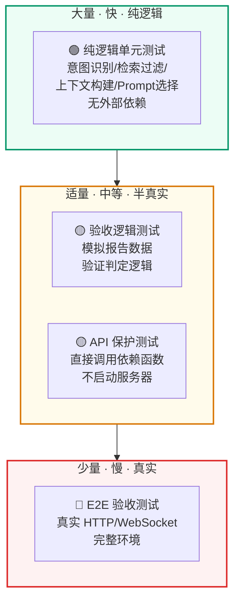

## 第一部分：RAG 测试的特殊挑战

### 1.1 为什么不能只用 E2E 测试

传统 Web 应用的端到端测试：

```text
启动服务 → 发 HTTP 请求 → 检查 HTTP 响应 → 断言 JSON 字段
```

RAG 系统的 E2E 测试面临几个问题：

1. **外部依赖重**：需要 Milvus、MySQL、LLM API、本地模型全部在线
2. **答案不确定性**：同一个问题 LLM 可能每次都生成不同的措辞
3. **慢**：一次 RAG 问答需要 2-5 秒，跑 100 条需要很长时间
4. **成本**：每次测试都消耗 LLM API token

**解决方案**：纯逻辑测试 + 分层测试。

### 1.2 测试金字塔



示例实现的测试主要集中在底部和中部：纯逻辑测试 + 验收逻辑测试。E2E 验收测试通过 `scripts/acceptance_smoke.py` 和 `scripts/api_e2e_smoke.py` 在完整环境中手动运行。

---

## 第二部分：纯逻辑单元测试

### 2.1 测试文件组织

```text
tests/
├── test_intent_and_scenarios.py    # 意图识别、问题类别、场景注册
├── test_retrieval_and_prompt.py    # 检索过滤、上下文构建、Prompt 选择
├── test_api_protection.py          # 管理令牌、限流
└── test_quality_gates.py           # 入库质量、RAG 回归验收、Bad Case
```

### 2.2 意图识别测试（纯逻辑）

```python
# tests/test_intent_and_scenarios.py

class IntentClassifierTests(unittest.TestCase):
    """验证规则候选路径的意图输出，不需要远程 LLM。"""

    def test_business_knowledge_question_uses_knowledge_intent(self):
        scenario = get_scenario_registry().resolve("enterprise_knowledge")
        result = classify_intent("新人入职流程怎么走", [], scenario)
        self.assertEqual(result.intent, "KNOWLEDGE_QUERY")
        self.assertEqual(result.suggested_source, "hr")

    def test_short_direct_faq_shape_prefers_faq_intent(self):
        scenario = get_scenario_registry().resolve("enterprise_knowledge")
        result = classify_intent("员工报销需要准备哪些材料？", [], scenario)
        self.assertEqual(result.intent, "FAQ_QUERY")
        self.assertEqual(result.reason, "source_question_shape_rule")
        # 规则命中 → 不调用 LLM → reason 是确定性字符串
```

**关键模式**：这些纯逻辑测试验证的是**规则候选路径**，不经过远程 LLM，也不替代 BERT 模型评测。测试空历史（`[]`）触发规则判定，可以单独验证规则层；模型加载、评测和网关仲裁由意图分类与路由入口的专门测试覆盖。

### 2.3 source 推断测试（跨场景）

```python
class ScenarioRegistryTests(unittest.TestCase):

    def test_enterprise_source_patterns_are_used_for_source_inference(self):
        scenario = get_scenario_registry().resolve("enterprise_knowledge")
        self.assertEqual(infer_source("新人入职流程怎么走", scenario), "hr")
        self.assertEqual(infer_source("VPN 连不上怎么处理", scenario), "it")

    def test_cross_border_source_patterns_are_used(self):
        scenario = get_scenario_registry().resolve("cross_border_risk")
        self.assertEqual(infer_source("交易对手命中制裁名单怎么办", scenario), "sanction")
        self.assertEqual(infer_source("信用证不符点如何处理", scenario), "payment")

    def test_engineering_project_patterns_are_used(self):
        scenario = get_scenario_registry().resolve("engineering_project_qa")
        self.assertEqual(infer_source("图纸变更后旧版本还能作为施工依据吗", scenario), "drawing")
        self.assertEqual(infer_source("隐蔽工程验收需要哪些资料", scenario), "quality")
```

**关键模式**：使用 `resolve(scenario_id)` 加载真实场景 TOML 配置，验证 source_patterns 的匹配逻辑。这是对"配置即代码"的测试。

### 2.4 场景边界检测测试

```python
def test_scenario_boundary_detects_question_from_other_business_scene(self):
    scenario = get_scenario_registry().resolve("enterprise_knowledge")
    # 问一个工程安全问题，但当前场景是企业知识
    decision = detect_scenario_boundary(
        "安全技术交底只有口头说明可以吗？", scenario
    )
    self.assertTrue(decision.crossed)
    self.assertEqual(decision.matched_scenario_id, "engineering_project_qa")
    self.assertEqual(decision.matched_source, "safety")
```

### 2.5 检索过滤测试（纯逻辑）

```python
# tests/test_retrieval_and_prompt.py

class RetrievalFilterTests(unittest.TestCase):
    """验证 source、版本、数据域会进入 Milvus 表达式。"""

    def test_build_source_expr_with_scope_and_version(self):
        scope = resolve_data_scope(
            tenant_id="tenant_a", dataset_id="dataset_1",
            visibility="internal", user_role="admin"
        )
        expr = build_source_expr(
            "billing",
            kb_version="kb_v1",
            data_scope=scope,
        )
        self.assertIn('source == "billing"', expr)
        self.assertIn('kb_version == "kb_v1"', expr)
        self.assertIn('tenant_id == "tenant_a"', expr)
        self.assertIn('array_contains(allowed_roles, "admin")', expr)

    def test_validate_source_filter_rejects_invalid_source(self):
        with self.assertRaises(ValueError):
            validate_source_filter("unknown", valid_sources=["billing"])
```

**关键模式**：表达式构造测试只验证字符串拼接；非法 source 的测试放在入口校验函数上。两类职责分开，读代码时不会把边界校验和底层表达式构造混在一起。

### 2.6 上下文构建测试

```python
class ContextBuilderTests(unittest.TestCase):

    def test_direct_faq_answer_requires_exact_match_or_threshold(self):
        doc = Document(
            page_content="是否支持开发票",
            metadata={"standard_question": "是否支持开发票",
                       "answer": "支持，具体以系统规则为准。"},
        )
        # 精确匹配 → 分数不重要，直接返回
        self.assertEqual(
            direct_faq_answer("是否支持开发票", doc, score=0.1, threshold=0.9),
            "支持，具体以系统规则为准。"
        )
        # 相似但不精确 → 分数必须超过阈值
        self.assertEqual(
            direct_faq_answer("可以开票吗", doc, score=0.95, threshold=0.9),
            "支持，具体以系统规则为准。"
        )
        self.assertIsNone(
            direct_faq_answer("可以开票吗", doc, score=0.3, threshold=0.9)
        )

    def test_select_context_docs_deduplicates_parent_and_applies_budget(self):
        """验证父子块去重和字符预算。"""
        # ... 见源码 tests/test_retrieval_and_prompt.py
```

### 2.7 Prompt Profile 选择测试

```python
class PromptProfileTests(unittest.TestCase):

    def test_pricing_question_uses_pricing_guard_before_intent_profile(self):
        """费用类问题必须使用 pricing_guard, 即使意图是 FAQ_QUERY。"""
        profile = build_answer_prompt_profile("FAQ_QUERY", query="发票和退款规则是什么")
        self.assertEqual(profile.name, "pricing_guard")
        self.assertIn("已确认", profile.system_template)

    def test_business_compliance_questions_use_compliance_guard(self):
        """合规类问题使用 compliance_guard, 不按普通知识问答处理。"""
        queries = [
            "受限空间作业前需要哪些安全确认？",
            "检验批资料和现场实物不一致怎么办？",
            "安全技术交底只有口头说明可以吗？",
        ]
        for query in queries:
            with self.subTest(query=query):
                self.assertEqual(infer_question_category(query), "compliance")
                profile = build_answer_prompt_profile("KNOWLEDGE_QUERY", query=query)
                self.assertEqual(profile.name, "compliance_guard")
```

---

## 第三部分：API 保护测试

### 3.1 管理令牌验证

```python
# tests/test_api_protection.py

class ApiProtectionTests(unittest.TestCase):

    def test_admin_token_requires_configured_token(self):
        """令牌为空时直接返回 500。"""
        original = api_deps.settings.admin_api_token
        api_deps.settings.admin_api_token = ""  # 临时修改配置
        try:
            with self.assertRaises(HTTPException) as ctx:
                api_deps.require_admin_token(None)
            self.assertEqual(ctx.exception.status_code, 500)
        finally:
            api_deps.settings.admin_api_token = original  # 恢复配置

    def test_admin_token_rejects_wrong_token_when_enabled(self):
        """错误令牌返回 401。"""
        original = api_deps.settings.admin_api_token
        api_deps.settings.admin_api_token = "secret"
        try:
            with self.assertRaises(HTTPException) as ctx:
                api_deps.require_admin_token("bad")
            self.assertEqual(ctx.exception.status_code, 401)
            # 正确令牌不抛异常
            self.assertIsNone(api_deps.require_admin_token("secret"))
        finally:
            api_deps.settings.admin_api_token = original
```

**关键模式**：

- 不启动 FastAPI 服务器，直接调用依赖函数
- 临时修改 `settings` 对象来模拟不同配置
- `try/finally` 确保测试后恢复原始配置

### 3.2 限流测试

```python
def test_rate_limit_can_block_after_limit(self):
    original_limit = api_deps.settings.api_rate_limit_per_minute
    api_deps.settings.api_rate_limit_per_minute = 2  # 每分钟只允许 2 次
    api_deps.RATE_BUCKETS.clear()
    try:
        self.assertTrue(api_deps.check_rate_limit("unit-test"))   # 第 1 次：允许
        self.assertTrue(api_deps.check_rate_limit("unit-test"))   # 第 2 次：允许
        self.assertFalse(api_deps.check_rate_limit("unit-test"))  # 第 3 次：拒绝
    finally:
        api_deps.settings.api_rate_limit_per_minute = original_limit
        api_deps.RATE_BUCKETS.clear()
```

---

## 第四部分：验收逻辑测试

### 4.1 入库质量检查测试

```python
class QualityGateTests(unittest.TestCase):

    def test_ingestion_gate_rejects_faq_document_conflicts(self):
        """FAQ/正文冲突时验收必须拒绝。"""
        report = _clean_ingestion_report()
        report["faq_document_conflicts"] = {"conflict_count": 1}
        result = evaluate_ingestion_gate(report, IngestionQualityThresholds())
        self.assertFalse(result["ok"])
        self.assertEqual(result["failures"][0]["metric"], "faq_document_conflicts")

    def test_ingestion_gate_passes_clean_report(self):
        """干净的报告必须通过。"""
        result = evaluate_ingestion_gate(
            _clean_ingestion_report(), IngestionQualityThresholds()
        )
        self.assertTrue(result["ok"])
```

### 4.2 RAG 回归验收 — 分组回归检测

```python
def test_evaluation_gate_rejects_scenario_group_regression(self):
    """全局 Recall 正常但某个场景退化 → 验收必须拒绝。"""
    report = {
        "recall_at_k": 1.0,  # 全局正常
        "rows": [
            {"scenario_id": "enterprise_knowledge", "recall_hit": True},
            {"scenario_id": "insurance_claims", "recall_hit": False},  # 这个场景退化
        ],
    }
    result = evaluate_eval_gate(report, EvaluationGateThresholds())
    self.assertFalse(result["ok"])
    # 失败指标中包含按场景分组的退化信息
    self.assertIn("scenario.insurance_claims.recall_at_k",
                  {item["metric"] for item in result["failures"]})
```

### 4.3 Bad Case 分类测试

```python
def test_bad_case_classifier_marks_environment_noise(self):
    """Milvus 连接失败 → 环境噪声，不进入业务复核。"""
    result = classify_bad_case(
        ["error", "low_source_count"],
        error="MilvusException: Fail connecting to server on localhost:19530",
    )
    self.assertEqual(result["bad_case_category"], "environment_error")
    self.assertTrue(result["is_environment_noise"])

def test_bad_case_classifier_marks_retrieval_quality(self):
    """低分低来源 → 检索质量问题。"""
    result = classify_bad_case(["low_source_count", "low_top_score"])
    self.assertEqual(result["bad_case_category"], "retrieval_quality")
    self.assertFalse(result["is_environment_noise"])
```

---

## 第五部分：运行测试

### 5.1 运行全部单元测试

```bash
python -m pytest tests -q
```

全量测试需要当前 Python 环境已经安装 `requirements.txt` 中的完整依赖，包括 `langchain-community`、`langchain-milvus`、`langchain-text-splitters` 和匹配版本的 `pymilvus`。完整测试会覆盖检索、Prompt、API、质量门禁和运行时集成边界，耗时以本机环境为准。

如果只是快速确认不依赖外部服务的核心逻辑，可以先运行轻量测试子集：

```bash
python -m pytest tests/test_intent_and_scenarios.py tests/test_api_protection.py tests/test_mysql_metadata_stores.py tests/test_preflight.py tests/test_ocr_script_paths.py tests/test_v1_maintenance_bindings.py -q
```

### 5.2 运行特定测试文件

```bash
# 只测试意图识别和场景
python -m pytest tests/test_intent_and_scenarios.py -q

# 只测试检索和 Prompt
python -m pytest tests/test_retrieval_and_prompt.py -q
```

### 5.3 在 CI/回归检查中使用

```bash
# 系统守护检查（包含测试）
python scripts/check_project_guardrails.py

# 章节代码、内容和系统边界检查
python scripts/course/check_codealong_alignment.py
python scripts/course/check_docs_consistency.py
python scripts/verify_v1_release.py
python scripts/verify_v1_release.py --include-evaluation --include-docker
python scripts/verify_v1_release.py --include-performance --include-docker

# 接口和页面验收
python scripts/api_e2e_smoke.py --base-url http://127.0.0.1:8000
python scripts/acceptance_smoke.py --base-url http://127.0.0.1:8000

# 新环境 Docker 一键部署验收
python scripts/deploy/verify_fresh_docker_deploy.py --evaluation-limit 3 --performance-limit 3
```

### 5.4 数据库 Schema 边界检查

MySQL 表结构定义集中在 `qa_core/storage/runtime_schema.sql`，启动期由 `qa_core/storage/bootstrap.py` 显式执行。多数纯逻辑测试不连接 MySQL，但控制面 Store 需要有一组专项测试确认 bootstrap 后关键表能正确读写：

```bash
python -m pytest tests/test_mysql_metadata_stores.py -q
```

| 测试对象 | 验证内容 |
| --- | --- |
| `bootstrap_mysql_schema()` | `runtime_schema.sql` 能初始化控制面表结构 |
| `KnowledgeBaseVersionStore` | `kb_versions` / `kb_active_versions` 能写入、激活、恢复 active 指针 |
| `IndexManifest` | `kb_document_manifests` 能写入、查询、删除 manifest 记录 |

当前实现暂不把 Alembic 接入一期主线。当前实现先明确 MySQL 控制面和 Milvus 数据面的关系；生产化系统可以把 `runtime_schema.sql` 提升为 Alembic migration，但测试验收仍应覆盖 Store 层能否正确读写。

---
